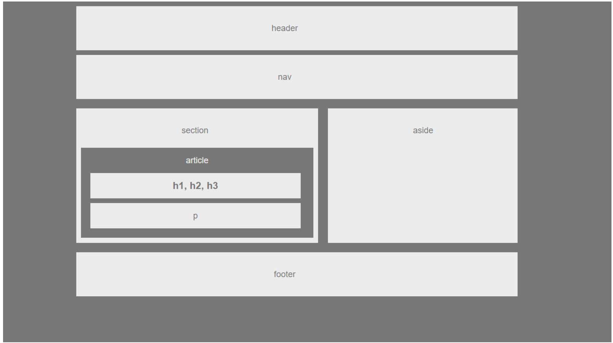
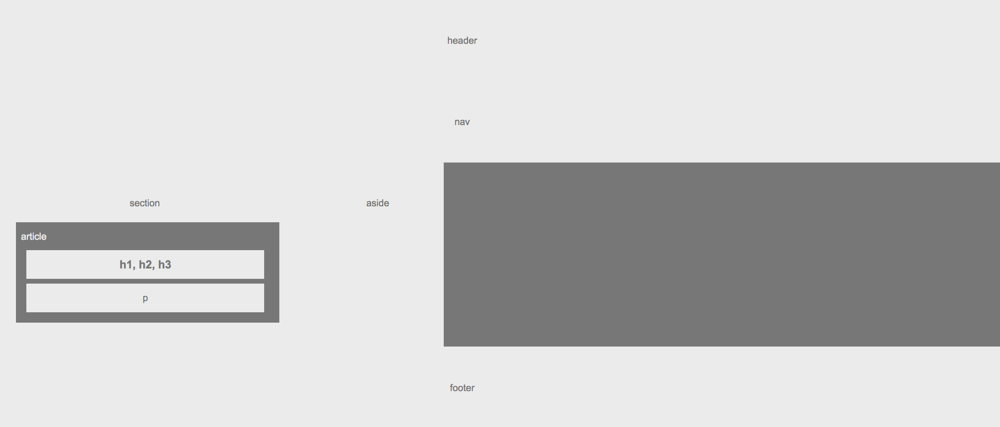

## Week 1 (Easier) Assignment - Wireframe

### Overview

If the student completed both the easier assignment and the recommended assignment, please provide the letter grade for the recommended assignment and leave short commentary for each, including a note of encouragement for attempting or completing both. 

You'll use the following screenshots to subjectively grade student assignments.

Grading & feedback should not take more than 5 minutes per assignment.

**What does an A or B look like?**

* The student used covered concepts to complete the assignment. Don't worry about the exact color scheme - it's okay to get creative.

* An A is very polished, a B is almost there.

* If the student received an A, add a comment of encouragement. ("Great job!",  "You're on the right track, keep working hard!", etc.)

* If the student received a B, give 2 or 3 pieces of specific feedback for improvement.

**What does a C look like?**

* The student made a solid attempt, but has a long way to go.

* Give 2 or 3 pieces of specific feedback for improvement, and invite the student to office hours to cover topics not mastered.

**What does a D or F look like?**

* If a student does not appear to have made a solid attempt, then that would result in a D. Invite the student to office hours to cover topics not mastered.

* A letter grade of F should be assigned when a homework is submitted, but nothing works or functions. Tell the student "When you don't understand is when I need to see your code most. Come to office hours, and I can help! Let's get back on track together."

**What does an I look like?**

* A student should receive this grade **only** if they submit an empty repository. If the student attempted the homework assignment and was simply unable to get it fully functioning, they should still receive a normal letter grade, not an 'Incomplete'.
