## 1.1 Lesson Plan - The Zen of Coding (10:00 AM) <!--links--> &nbsp;  &nbsp; [➡️](../02-Day/02-Day-LessonPlan.md)

### Overview

Welcome to your first day of class! In this class, we will be introducing ourselves and the overall structure of the course. We will also be working with the very basics of Terminal/Console and HTML. Towards the end of class, we will be introducing students to Git Version Control.

`Summary: Complete Activities 1-3 in Unit 01`

##### Instructor Priorities

* Students will feel completely welcome and start to open up.
* Students will have each of the following installed and ready to use: Git, Heroku, Node, Visual Studio Code, and Slack.
* Students will be exposed to the basic bash/terminal commands: `cd`, `ls`, and `mkdir`.
* Students will complete the "My First HTML Page" activity.
* Students will understand the utility of version control (handling conflicts + reverting bad code).
* Students will complete the Git exercise.

##### Instructor Notes

* First off, welcome and thank you so much for being a part of our program! Thanks to instructors/TAs like yourself, we're helping hundreds of students across the world achieve their career goals and their creative dreams. You have plenty of time to work with these students, and their progress will astound you. Buckle in! You're in for a fun ride!

* Today's class is all about making students feel comfortable. Today is just the first of many days where some of your students will seem "lost". Make sure they know that you are there for them from Day 1 and that they can succeed if they persist through the challenges.

* Use the [ZenOfCoding PowerPoint](SlideShow/) provided as an initial guide for today's class. During the first few weeks of class, we'll be using PowerPoint more extensively to give students a sense of structure. As we move further into the course, PowerPoint will become less frequently used as we dive into a more code-centric approach. Feel free to modify the slides to your own style, but be sure to cover the same activities.

* Don't forget to modify the PowerPoint prior to class to add in your own slides for the "Instructor Bio" and "Stuff You Made" sections.

* Introductions often take a long time. Feel free to adjust today's lesson plan by pushing the HTML/CSS demonstration to Day 2 if necessary. This allows students to ease into our activity-based approach via the Terminal exercises and allows them to then focus on HTML/CSS on Day 2.

* If you choose not to cover HTML/CSS on Day 1, use `03-MyFirstHTML.html` to demonstrate the basics of HTML in an **Everyone Do** exercise, and then assign the Student Bio HTML activity as normal.

    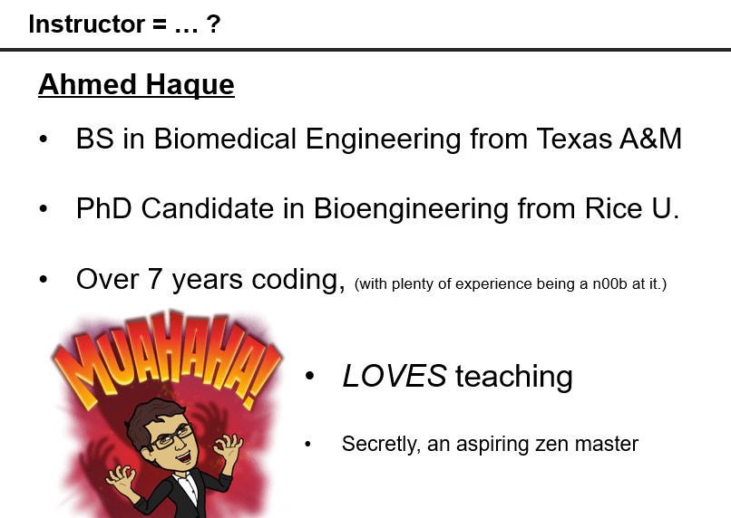

* In addition to introductions, today's main focus is in making sure all students have all their pre-work (software / tools prerequisites) installed and ready to go. Many of your students will be coming to class with "partially" installed tools but will have gotten lost along the installation process. By the end of class, make sure EVERY one of your students has Git (with SSH Authentication), Heroku, Node, Visual Studio Code, and Slack installed. NOTE: You may need to run through this lesson plan to confirm you have all the necessary tools installed yourself!

* When you get to the section on Git in the PowerPoint, the slides include an extended "Group Project" analogy to explain the utility of Git. Familiarize yourself with the example in advance of the class.

    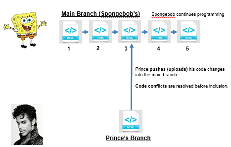

* Much of your class's struggle today will be in getting Git to work. When cued via the slideshow, send out the supplemental GitHub Help Guide (`Steps to Upload to GitHub`). Encourage students to go home and practice using this guide at home. (This guide alone will dramatically reduce the number of Git issues students experience. Make sure they use it!)

* There's a ton of material to cover here, but adjust it as necessary. Just make sure you leave enough time for the critical activities as this is essential for keeping classes in sync across sections.

* Have your TAs reference [01-Day-TimeTracker](01-Day-TimeTracker.xlsx) to help keep track of time during class.

### Sample Class Video (Highly Recommended)

* To view an example class lecture visit (Note video may not reflect latest lesson plan): [Class Video](https://codingbootcamp.hosted.panopto.com/Panopto/Pages/Viewer.aspx?id=de3c75c1-3446-47a5-9546-8e05cbdee2a7)

- - -

### Class Objectives

* To allow students time to introduce themselves to one another and the instructional team
* To confirm that students have completed all required pre-work (software + tools installation)
* To introduce basic terminal/bash commands
* To create a basic HTML page
* To understand the value of Git version control
* To gain initial exposure to the concept of "adding, committing, and pushing" code to GitHub

- - -

### 1. University Do: Introductions (39 mins)

* The first 39 minutes of class will consist of introductions by the university, program director, student services director, and/or career director.

* Instructor/TAs just hang tight and calm your nerves!

### 2. Instructor Do: Begin Powerpoint + Introductions (15 mins)

* Open the Slide-Show [Zen_of_Coding](SlideShow/Zen_of_Coding.pptx) for your campus. Use it as a guide for the remaining sections, but keeping a close eye on your TAs to make sure you are keeping track of time. Be concise when you can!

* Have every student in the class introduce themselves (name, background, reason they joined). Try to keep things lighthearted as they share their ideas, but remember to try and keep things brief. We have a lot to go over in class today, and we'll need all the time we can get.

* Have TAs introduce themselves and provide their own backgrounds.

* Then introduce yourself and showcase one thing you've built (added into the slide).

### 3. Instructor Do: The Path of Learning (15 mins)

* The next series of slides is really meant to give students the "right" perspective coming in. This means letting them know that this program will not be a traditional college class. We're here to support them 100% of the way to really help them achieve their goals.

* To begin, take a few moments to assuage student fears of being a "beginner." Instead, let them know that having a humble attitude is the first requirement of being successful in this program. In a way, students should channel their inner toddler and recognize that "knowing nothing" and admitting such will allow them to dig their heels in and invest the time necessary to succeed. In a way, coding is like nothing else these students have attempted to do. Their mastery of other subjects, their educational backgrounds, and their professional successes do not guarantee that they will do well here. The only thing that will guarantee success is hard work, humility, and a relentless desire to be better. Recognizing how little you know is a first step towards creating that urgency.

* From here, give students perspective on the "Path of Learning"—specifically warning them about three major obstacles:

  * First, learning to code is tough, intimidating, and frustrating at times. They should immediately forget about their uncle/brother-in-law/friend/step-sister who told them about so-and-so learning to build apps in 1 week. Coding is hard. It will take time. There is no way around that.

      

  * Second, because of how hard this can be, there will be many moments where students will doubt themselves. Take this chance to help them overcome this obstacle ahead of time by building up their confidence. Tell them that you started just like they did, that it takes time but that they have what it takes, that they were selected for this program because we know they have what it takes.

      

  * Lastly, because of the length of the program, personal issues WILL come up during the course of the program. The idealism and "can-do" attitude students enter with on day 1 will be challenged by the length of the course. Let students know that they should see each other as a family embarking on a long journey. They will become far closer to their peers than they realize. Intensity is no substitute for endurance.

* Then proceed to tell them that learning is supposed to be frustrating. It's a process, but they should stick with it.

* Then walk them through the advice on succeeding in the program.

### 4. Instructor Do: Course Structure (5 mins)

* Spend a few moments to walk students through the course structure.

* Point out that learning to code requires coding (not just sitting through lectures) so this program will very quickly become "code-centric." Let them know that there will be a mix of individual and group activities / projects.

* Then walk students through today's objectives.

### 5. Instructor Do: Pre-Work (5 mins)

* Then walk through the slides on "Pre-work." Let students know that they should have all of the tools, the software applications, and the accounts shown on their machines but that if they ran into any snags, we will work with them to confirm everything is set up over the next 35 minutes.

### 6. Instructor Do: Confirm Pre-Work Installed (30 mins)

* TAs get ready to make your rounds!

* Instructor: Walk through each of the following "test" processes to confirm whether students have successfully installed the right software. Have them follow along with you in class, and have them raise their hands for a TA if they are missing something.

  * **Slack:**

    * Easy to show. Just open Slack. But make sure students have it installed locally and are not using the web client.

  * **Visual Studio Code:**

    * Easy to show. Just open VS Code. Make sure they can do so as well.

  * **Terminal / Bash:**

    * For Mac users. Have them open their Launcher and search for `Terminal`.

    * For Windows users. Have them open the program called `Git Bash`.

  * **Node:**

    * While in terminal or bash, simply write the word `node`, and then hit enter. Your cursor should change

    * Then type `1+1`, and hit enter. If node is installed it should translate the answer to 2.

    * Then type `ctrl+c` to exit node.

        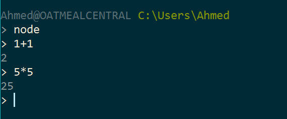

  * **GitHub:**

    * Confirm that students all have an account on GitHub through a show of hands.

    * Those that do not have an account should immediately create one.

  * **Git:**

    * Now we're getting to the harder stuff.

    * While still in terminal or bash, type `git`, and hit enter. If Git is installed it should trigger a series of lines about Git.

        

    * Now, to confirm that students have their GitHub accounts tied to their local Git using SSH authentication, have them type the following: `ssh -T git@github.com`. It should then ask for a passphrase (tied to your local account). Provide it (letters will not appear), and hit enter. If you are authenticated, it should provide a welcome message.

        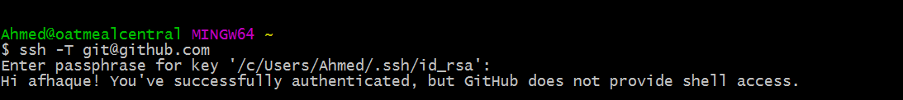

    * Ask, via a show of hands, how many students did / did not get the welcome message (be expecting a lot of students who did not). If it seems that many students are missing this step, point them to the following link: [Generating an SSH Key - GitHub](https://help.github.com/articles/generating-an-ssh-key/).

        

    * Walk around and help students as necessary, but keep track of time!

  * **Heroku:**

    * Once Git is covered ask how many students were able to create an account on Heroku. Show them your own Heroku account online as an example.

    * Then have them once again go into Bash / Terminal and type the word `heroku`. If they are properly setup, it should provide a set of information about Heroku.

        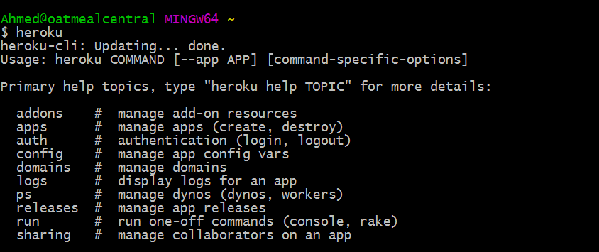

  * **All others:**

    * There are a few other items on the pre-work like MySQL, Stack Overflow, and Twitter that are less critical at this juncture. You may want to show that you have Heidi SQL or Sequel Pro installed, but it's not critical just yet.

- - -

### 7. Instructor Do: On the Modern Web (10 mins)

* Stay concise in this section! Don't overwhelm students. We're just giving them a taste.

* Ask students what they think "Full-Stack Development" is. Simply stated, Full-Stack development pertains to working with both the front and back ends of an application.

* Proceed to walk them through a basic Youtube search. Point out how the process of retrieving a video from Youtube requires two things, the Graphical User Interface (GUI) responding to what I type and also code on the server side that is able to search through its databases and find the right video.

* Point out how websites today are all about creating code for both this "frontend" and "backend".

* In this course, we'll be teaching them everything they need to be able to do this, meaning they will be able to build complex web applications as a single developer.

### 8. Instructor Do: Let's Get Crackin'—Intro to Console / Bash (10 mins)

* Open terminal / console. Then walk and explain to students what each of the following commands does.

  * `cd` (changes directory)

  * `cd ~` (changes to home directory)

  * `cd ..` (moves up one directory)

  * `ls` (lists files in folder)

  * `pwd` (shows current directory)

  * `mkdir <FOLDERNAME>` (creates new directory)

  * `touch <FILENAME>` (creates a file)

  * `rm <FILENAME>` (deletes file)

  * `rm -r <FOLDERNAME>` (deletes a folder, note the -r)

  * `open .` (opens the current folder. MAC SPECIFIC)

  * `open <FILENAME>` (opens a specific file. MAC SPECIFIC)

  * `explorer <FILENAME>` (opens the specific file. BASH SPECIFIC)

  * `explorer .` (opens the current folder. BASH SPECIFIC)

* Tabbing

  * Pressing the `tab` key after typing "cd fol" will autocomplete to "cd foldername", assuming foldername is unique. (Folder/Filename Autocomplete - Show students what happens when there are unique and multiple options based on what they typed.)

### 9. Students Do: Intro to Console / Bash (12 mins)

* [Intro To Console Bash](../../../../01-Class-Content/01-html-git-css/01-Activities/02-IntroToConsoleBash)

* Then slack out the following instructions to students (or show them the instructions via the slide):

* **Instructions:**

1. Create a new folder with the name of `self-destructing-folder`

2. Create a new txt file with the name `secret-message.txt`

3. Copy `secret-message.txt` to the inside of `self-destructing-folder`.

4. Delete the original `secret-message.txt` file.

5. Delete the `self-destructing-folder`.

### 10. Students Do: Discuss with Neighbors (5 mins)

* Have students discuss with their neighbors the process of creating files, removing files, etc.

* Also have students explain to one another a high-level definition of Full-Stack development.

* Briefly have students explain the answers back to you.

### 11. Instructor Do: Hello, HTML (5 mins)

* Create a new HTML file in your editor. Have students follow along if they can, but tell them not to get bogged down if they are having trouble keeping up. They will have a chance to work on an example of their own later.

* Use the code in [03-my-first-html](../../../../01-Class-Content/01-html-git-css/01-Activities/03-MyFirstHTML/Solved/my-first-html.html) as a guide. Be careful not to open the bonus file yet, that's for the next activity.

  * **Don't just display this file or copy and paste the code onto your screen.** Type it out, and let your students follow along.

* As you code, be sure to point out the prominent elements like `<!DOCTYPE html>`, `<html>`, `<head>`, `<body>`, `<h1>`, the links, etc.  

* Then run the page and point out to students how the elements in the program compare to those on the web page.

    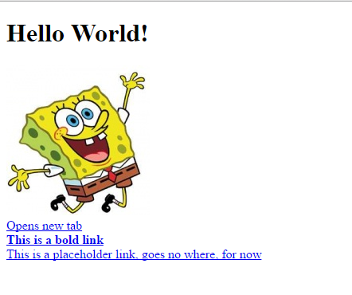

* Ask if there are any questions before proceeding to the student exercise.

### 12. Students Do: Intro to HTML (5 mins)

* [03-MyFirstHTML](../../../../01-Class-Content/01-html-git-css/01-Activities/03-MyFirstHTML)

* Keep your HTML code from the previous exercise available for them to see while they work, but don't send them the code just yet.

* Then slack out the instructions to the second student exercise.

* **Instructions:**

* In a new HTML file, create the basic structure of an HTML document and include the following in it:

  * DOCTYPE declaration

  * Head tag with a title tag

  * H1 tag with a title of your choice

  * Embed an image

  * Create the following three links on your page:

    * One link that is `target="_blank"` so that it opens a new tab when clicked on.

    * Make the second link bold.

    * Make the third link a placeholder so it goes nowhere.

  * HINT: You should be looking up at the screen pretty often...

* Bonus:

  * Create an ordered list of steps to make a sandwich.

  * Create an unordered list of 5 bands/musicians you like.

  * Create a table with 2 columns (animal class and animal name) and 4 rows of animals.

  * Use an alternate way of separating links without line breaks.

  * Embed a Youtube video of your favorite band/musician.

### 13. Instructor Do: Review HTML Solution (10 mins)

* Open the file [my-first-html-with-bonus.html](../../../../01-Class-Content/01-html-git-css/01-Activities/03-MyFirstHTML/Solved/my-first-html-with-bonus.html) and walk students through the solution. As you discuss the solution, be sure to point out the following:

  * Key elements like `<!DOCTYPE html>`, `<html>`, `<head>`, `<h1>`, the links.

  * Good indentation practices. In fact, if you have time, unindent everything by highlighting everything and hitting `ctrl-j` and then re-running the code. Explain that the code will still work but that it's awful to read and maintain. Build good practices now!

* Give students a few moments to ask questions.

- - -

### 14. LUNCH BREAK (30 mins)

- - -

### 15. Instructor Do: Welcome Students Back (1 min)

* Take the first minute of class to welcome students back from lunch.

* Reassure students that it's okay if things start to feel like they're moving quickly. Throughout their experience as developers they will constantly need to refer back to old materials. The rush and looking back is part of the programming trade.

### 16. Instructor Do: What/Why Git - "The Group Project" (Slides) (15 mins)

* Walk students through the use-cases of Git.

* The basic premise of these slides is that in group collaboration, situations arise where code conflicts occur or where damaging code is pushed up. With version control you have a way of preventing both from becoming issues.

### 17. Students Do: Quick Activity - Explain Git (3 mins)

* Give students a few minutes to explain to one another what Git version control is for.

### 18. Instructor Do: Recap Answers (3 mins)

* Have students explain their answers back to you. Correct any mistaken answers you hear. Encourage students when they get the right answer.

### 19. Instructor Do: Explain GitHub (Slides) (5 mins)

* Spend just a few brief minutes explaining the relationship between Git and GitHub. Keep it concise. You may just want to say the following:

  > GitHub offers a centralized location where all developers can push and pull (upload and download) their code. This means that GitHub always holds the most up-to-date code, handling everyone's updates appropriately.

### 20. Instructor Do: Get Started with Git - Demo Git add, commit, push (15 mins)

* As an Instructor, create your own GitHub repo. Then walk students through the process of adding a file to GitHub.

* Have students try to follow along on their own accounts if they can.

* Important Note: We teach the process of cloning existing repos for consistency with students. So use the below steps as a guide.

  * Navigate to GitHub in your browser, and click to create a new repository.

      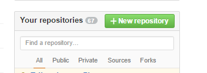

  * Call your repository whatever you like, but make sure to set it as public. Initialize it with a README.

      

  * Then copy the `ssh` or `https` link associated with this GitHub repo. (The difference has to do with whether you need to authenticate each time. SSH is preferred, but if it's not working for you, switch to `https`.)

      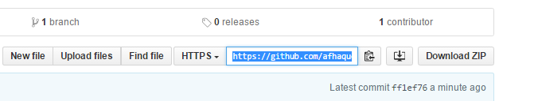

  * Then open up Terminal or Bash and navigate to a folder where you would like to clone the repo. Then type the command `git clone <PASTE THE REPO>`.

    * Git Bash uses `SHIFT+INSERT` as the shortcut to paste.

    * Terminal uses `COMMAND+OPTION+SHIFT+V` as the shortcut to paste.

        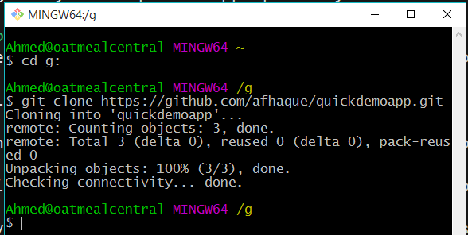

  * Point out to the students using Explorer or Finder that this action created a new folder on your machine with the same name as the repository on GitHub. Also point out that this file is directly attached to GitHub and that it includes the README found in GitHub.

      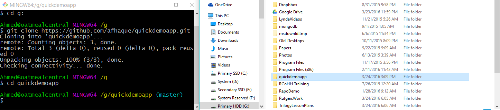

  * Next, if you haven't already, navigate into this folder in Terminal or Bash.

  * Now add a new file into the folder in Finder or Explorer. This can be any file you want, but in my case, I will add an HTML file.

      

      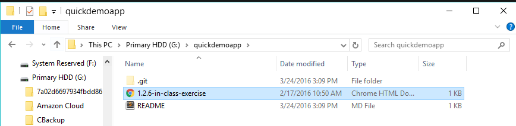

  * Now go back to Terminal / Bash, and type each of the following commands:

    * `git add -A` (This will tell Git to track any changes in the folder.)

    * `git commit -m "Added a new file"` (This will tell Git to commit the changes and to include the commit message "Added a new file.")

    * `git push origin master` (This will tell Git to upload the code to GitHub.)

      

  * Navigate back to GitHub in the browser, and show students that the file you uploaded now exists in GitHub.

      

* At this point, students will be completely confused. Take a moment to calm their nerves and to let them know that this will become second nature to them with a little time.

### 21. Instructor Do: Slack GitHub Guide (2 mins)

* At this point, slack the GitHub guide (found in `Supplemental > GitHub Help > "Steps to Upload GitHub"`). Let them know that this guide will be their best resource on completing their own GitHub pushes.

### 22. Students Do: Git Add, Commit, Push (20 mins)

* Then slack out the following activity (or show them the instructions on the slide):

  * **Instructions:**

    * Using GitHub and the Command Line, do the following:

      * Create a new public GitHub repository, and name it whatever you like. Be sure to check the box for “initialize this repository with a README.”

      * Next, clone the repo to your local directory.

      * Then create an HTML file inside the local directory.

      * Add, Commit, and Push the code to GitHub.

    * Bonus:

      * Find a partner in class and fork their repository to your own GitHub account. Clone this forked repository to your local directory.

      * Add, Commit, and Push the code back to your forked copy.

      * Finally, submit a pull request to send your changes to your partner’s repo.

* **Instructor:**

  * Once the time is complete, recap the activity with everyone. Have them explain it back to you. Some students will be confused or will struggle with this activity (especially the bonus) so once again reassure the class that this process will become second nature over time.

### 23. Instructor Do: Introduce Supplemental Videos (5 mins)

* Introduce your class to the `Supplemental Video Guides` which we have crafted for them to use in order to review important coding activities (like the one they have just completed) and future homework assignments.

* Let them know that these videos will be slacked out to everyone after the class has reviewed the activity but that they should save watching the videos for when they get back home and have some free time.

* Homework videos will be slacked out after the deadline for the assignment has passed.

* Each video also has a form within the description for feedback which we would appreciate that they fill out if they think anything in the video needs improvement.

* Slack out [My First HTML](https://www.youtube.com/watch?v=ieb6Svbc10E).

### 24. Instructor Do: Demo Homework 1 (5 mins)

* Open recommended/easy homework `index.html` in Unit 01. 
[Homework](../../../../01-Class-Content/01-html-git-css/02-Homework/Solutions/easier-homework-solution/index.html)

* Let students know that this will be their first homework assignment. It will be due this week. They will get some in class time to begin homework during class on occasion.

### Lesson Plan Feedback

How did today's class go?

[Went Well](http://www.surveygizmo.com/s3/4325914/FS-Curriculum-Feedback?format=ft&sentiment=positive&lesson=01.01)

[Went Poorly](http://www.surveygizmo.com/s3/4325914/FS-Curriculum-Feedback?format=ft&sentiment=negative&lesson=01.01)
