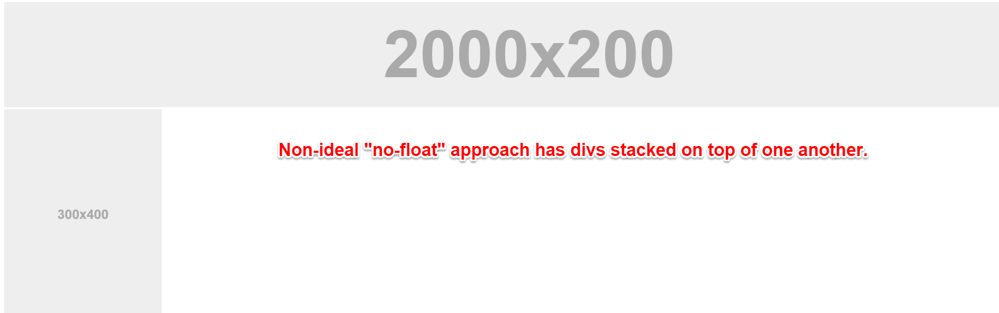
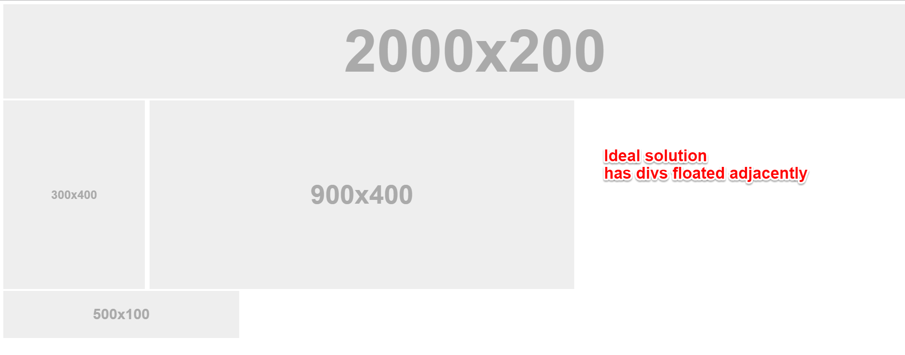
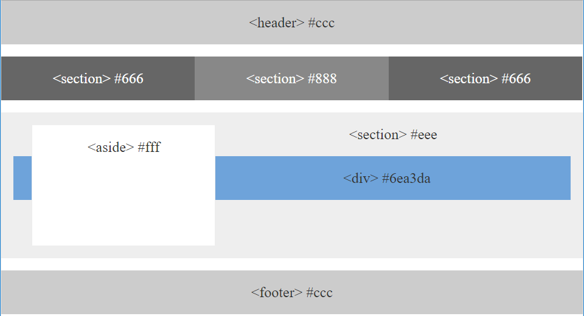
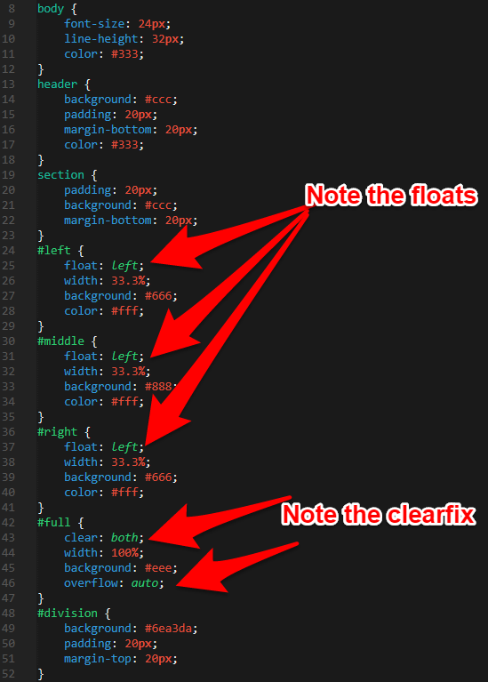

## 1.2 Lesson Plan - Going Pro with HTML/CSS (10:00 AM) <!--links--> &nbsp; [⬅️](../01-Day/01-Day-LessonPlan.md) &nbsp; [➡️](../03-Day/03-Day-LessonPlan.md)

### Overview

In this class we will be introducing students to the basics of HTML/CSS and then some more advanced CSS.

`Summary: Complete Activities 4-9 in Unit 01`

#### Instructor Priorities

* Students will complete both the HTML and CSS examples.
* Students will become fairly comfortable linking CSS files to HTML files using relative file paths in various directories.
* Students will have a working knowledge of the terms "float", "box model", and "CSS positioning."
* Students will gain initial exposure to working with CSS to build wireframe layouts.
* Instructor will attempt to complete all slides within time allotment.

##### Instructor Notes

* Be sure to change the lines of the PowerPoint where relevant to your class (Example: links to in-class repo (Slide 4), links to homework repo (Slide 5)).

* There's a ton of material to cover here, but adjust it as necessary. Just make sure you leave enough time for the critical activities as this is essential for keeping classes in sync across sections.

* Have your TAs reference [02-Day-TimeTracker](02-Day-TimeTracker.xlsx) to help keep track of time during class.

### Sample Class Video (Highly Recommended)

* To view an example class lecture visit (Note video may not reflect latest lesson plan): [Class Video](https://codingbootcamp.hosted.panopto.com/Panopto/Pages/Viewer.aspx?id=f2d65f7f-799e-4d4d-a712-15ffcef6e2a1)

- - -

### Class Objectives

* To gain initial exposure to HTML/CSS and how the two are linked using element selectors
* To become comfortable working with HTML relative paths

- - -

### 1. Instructor Do: Open Powerpoint + Welcome Students (1 min)

* Take the first minute of class to welcome students back and to open up your Powerpoint, `Going_Pro_with_HTML_CSS.pptx`.

### 2. Instructor Do: Admin Items (Slides) (1 min)

* Reassure students that it's okay if things start to feel like they're moving quickly. Throughout their experience as developers they will constantly need to refer back to old materials. The rush and looking back is part of the programming trade.

* Flip through the slides on "Where to get Help." Specifically when it comes to In-Class Material, point students (in browser) to where they can access help resources. Emphasize the importance of practicing code vs. simply reading or watching videos.

### 3. Instructor Do: Today's Class - Objectives + Focus Items (Slides) (2 mins)

* Have students read the objectives of the day.

* Then offer end-of-day targets for students depending on where they fall. If a student is completely new they should feel like the main target is to simply understand HTML/CSS at a conceptual level + understand Git. For students who have a bit of HTML/CSS they should aim to know how to apply the HTML/CSS a bit more comfortably after today.


### 4. Instructor Do: HTML Round 2 (Slides) (15 mins)

* Walk students through the HTML Round 2 slides.

* Be concise, when you can, to save time. You don't need to explain every single thing that is on the slides—they will be made available to students after class to go back to. Just hit the high points!

### 5. Students Do: Basic Student Bio Activity (20 mins)

* Open the file `basic-html-bio.html` inside [04-HTML_Git/Basic-HTML-Bio](../../../../01-Class-Content/01-html-git-css/01-Activities/04-HTML_Git/Solved/Basic-HTML-Bio.html) in your browser.

* Then slack out the following instructions and show students the slide:

  * **Instructions:**

    * Create a basic HTML page with your own information that looks similar to the design shown on screen.

### 6. Instructor Do: Recap Basic Student Bio Activity (5 mins)

* Either live-code or open the solution [Basic-HTML-Bio.html](../../../../01-Class-Content/01-html-git-css/01-Activities/04-HTML_Git/Solved/Basic-HTML-Bio.html) to the previous activity in Visual Studio Code. Then, walk students through the solution line-by-line.

* Explain the `div` and `section` tags that appear in the solution.

  * Explain that `div` tags are used to group elements into _visually_ related segments and that they are primarily used as "hooks" for CSS styling.

  * Explain that `section` tags are used to group elements into _thematically_ related segments.

  * Explain that `div` and `section` tags behave identically, in that both are block-level tags used to demarcate _sections_ of a site.

  * Explain that the difference between `div` and `section` tags is dependent on what we want our source code to communicate to other developers.

  * Encourage students to use a `div` when they're not sure which tag to choose. You can also direct them to the [HTML5 Doctor Flowchart](http://html5doctor.com/downloads/h5d-sectioning-flowchart.pdf).

* Once you are done reviewing, slack out the code to them to see for themselves. (When slacking out the code, use the solution provided in the Lesson-Plan repo as it is extensively commented.)

* After you have slacked out the code, once again remind your students that we also have online videos for them with which to review key activities.

* These videos are a great way to catch up on material if you ever need to review them or if you feel like you are falling behind.

* Slack out [Student Bio Layout](https://www.youtube.com/watch?v=kMBinXTCrXI).

- - -

### 7. Instructor Do: CSS Stylin' - Basics of CSS (Slides) (15 mins)

* Using the CSS Stylin' slides as a guide, provide students with perspective on what CSS is and how it works.

* Explain to them how CSS can be used by tying itself to HTML elements, classes, or IDs. Don't get too bogged down trying to explain things. You will be demonstrating this through examples shortly.

### 8. Instructor Do: CSS Show! Demo (15 mins)

* Take about 15 minutes to quickly demonstrate a few examples of CSS styling. As a starting point you can use the files inside `05-BasicCSS` to showcase the pieces necessary to link an HTML page to CSS.

* Point out the following:

  * That CSS can be linked to tags like `h1`, `h2`, `p`, `img`, and also specific classes (specified by .syntax) and id's (specified by #syntax).

  * Just show enough to give them an idea of what's possible.

* Slack out the `quick-example-internal-css.html` file to them.

### 9. Students Do: CSS Styled Bio Page (20 mins)

* Open the file [06-HTML_CSS_Layout/html-bio-with-css](../../../../01-Class-Content/01-html-git-css/01-Activities/06-HTML_CSS_Layout/Unsolved/html-bio-with-css.html)in your browser. Warn students that this might be a tough activity for some of them.

    

* Slack out `06-HTML_CSS_Layout/html-bio-with-css.html` as a starter file.

  * This is important as the **Instructions** given below assume a particular markup structure.

* Then, slack out the following instructions to students:

  * **Instructions**:

    * Put all of this code inside a folder named `week1-day2-html-css`, and put the folder in a place where you normally code.
    * Use the command line to make a folder called `css`.
    * Use the command line to make a file called `style.css` inside of thee `css` folder.
    * Reference the `style.css` in your `student-bio.html` file. You do this by placing `<link rel="stylesheet" type="text/css" href="css/style.css">` inside the `<head>` tag.
    * Style the example on the projector.
      * Add a `class` called "container" on the `div` tag.
      * Add an `id` called "main-bio" for the first `section` tag.
      * Add an `id` called "contact-info" for the second `section` tag.
      * Add an `id` called "bio-image" for the bio image.
    * Style specs:

      * `body`
        * The background color is `#efeee7`.
        * The font used `"Georgia",Times New Roman,Times,serif;`.
        * The font color is `#333333`.
        * Be sure to zero out the body margins and padding so the page is flush to the top of the page:
          ```css
          body {
            margin: 0;
            padding: 0;
          }
          ```
      * `header`
        * The background color is `#333333`.
      * `h1`
        * The font color is `#eee`.
        * The font size is `28px`.
        * Look at the example on the screen, and eyeball the padding and/or margins and positioning of the text.
      * `h2`
        * The font size is `24px`
      * Make the container have a width of 1024 pixels, and center it. You do this using `margin: 0 auto;`.
      * Make `#main-bio`, `#contact-info`, `#bio-image` all `float: left`.
      * Make the `#bio-image` have a width of 200 pixels.
      * Be sure to include `alt` text in all images
      * `#main-bio` should have a width of `70%`.
        * Add margins to the image so there is distance between it and the bio text.
      * `#content-info` should have a width of `30%`.
      * Adjust the line height so it is 1.5 times the size of the font.
      * Make the link color `#d21034`.

    * If you forgot how to write the CSS properties, you can reference all CSS properties here <https://developer.mozilla.org/en-US/docs/Web/CSS/Reference>

    * Bonus:

      * Stage, commit, and push this new file to Github.

### 10. Everyone Do: Recap Activity (5 mins)

* Have students recap the solution back to you.

    

* Fill in concepts where students are unable to provide a clear answer.

* Emphasize the use of `div` and `section` in the solution.


### 11. Instructor Do: Relative File Paths (Slides + Demo) (10 mins)

* Flip to the slide on Relative File Paths and point out to students how we've been referencing external CSS stylesheets.

* Have students remind you what an external CSS stylesheet is before proceeding.

* First open the HTML file `html-bio-with-css.html` that is inside of the folder [07-RelativePath](../../../../01-Class-Content/01-html-git-css/01-Activities/07-RelativePaths-Activity/Demo/html-bio-with-css.html) in your browser. Show students what the styled site looks like.

* Then open the same file in your editor.

* Point out to students again that the href needs to be able to "see" the CSS file and that href is like our "map" to where the file is.

    

* Then move the CSS file into a folder called `assets`. Refresh the page in the browser and point out that the HTML page no longer knows where the CSS file is.

* Fix the href link in the HTML to include the new assets directory. Refresh the page again and show students that this time it worked.

* Also explain that there are other instances in which we'll need to use relative paths to direct ourselves to resources—it may be images, PDFs, javascript files, etc. So it's important to get a handle on how relative paths work.

* Then flip to the next slide that talks about absolute file paths and explain that they are BAD because no other viewer of your HTML/CSS will be able to access those files. (The paths won't make any sense on the web.)

### 12. Students Do: Relative File Paths Activity (12 mins)

Answer any questions students have.

* Zip and Slack out the following folder to students:

* **Folder:**

  * [07-RelativePaths-Activity/RelativePaths_UNSOLVED](../../../../01-Class-Content/01-html-git-css/01-Activities/07-RelativePaths-Activity/Unsolved)

* **Instructions:**

  * Unzip the folder provided to you (or copy and paste the contents outside).

  * Then modify each of the four `html-bio.html` pages such that they can access the CSS inside their folder. Don't move the CSS file, and don't move the HTML file.

  * Use relative linking to make it work!

  * Hint: If you need some reading material on relative linking you can use <https://css-tricks.com/quick-reminder-about-file-paths/>.

  * If you finish early, help out those around you, or begin reading through the Learn CSS Layout Guide found here: <http://learnlayout.com/no-layout.html>

### 13. Instructor Do: Review Relative File Paths Activity (10 mins)

* Review each of the Relative File Path examples. You can use the [RelativePaths_SOLVED](../../../../01-Class-Content/01-html-git-css/01-Activities/07-RelativePaths-Activity/Solved) folder to quickly show solutions if you prefer.

- - -

### 14. LUNCH BREAK (30 mins)

- - -

### 15. Instructor Do: Box Model (Slides) (10 mins)

* Using the slides shown as a guide, introduce students to the concept of the box model. In explaining the box model you can just read the text on the slide.

  > In CSS, every element can be considered to fit within a series of boxes. Each box can be individually adjusted to provide spacing between elements or to fill in elements with colors.

* Point out that the box model applies to all elements whether they are text, images, div sections, etc.

* Let them know that this concept is important.

### 16. Partners Do: Box Model Activity (10 mins)

* Then show them the Activity slide, and have them work in groups to tally up the total height and width of the boxes as described on the screen.

* Let them know to calculate it both ways, including margins and not including margins.

* After a few minutes show the slide with the answers.

### 17. Instructor Do: We Be Floatin (Slides + Demo) (20 mins)

* Next, return to the slides and proceed to walk through the slides on floats. Warn them that floats are the stuff of demons.

* Begin by describing to students the concept of "flow." If you need help articulating the concept you can use the below:

  > Flow is the idea that every single element—text, images, links, sections, etc.—all take up a set amount of space on the screen. These elements, by default, won't stack on top of one another so instead they have to find ways to "flow" around one another. A big part of CSS is in managing how elements will fit into this flow.
  >
  > Unfortunately there is no "drag-and-drop" in web development just yet, and the tools that exist to do so often produce terrible code. So, as developers, we do NEED to learn this stuff at least at a basic level.

* You can analogize flow to Microsoft Word's word-wrap.

* Flip through the slides on Block Elements vs. Inline Elements, Floating, and the ClearFix Hack. In your explanations, do the following:

  * Mention that **block level** elements take up entire lines, whereas inline can fit adjacently.

  * **Float** "forces" elements to the side you specify.

  * **Clearfix hack** creates alignment between two sections (a bit more advanced).

* Then when you see the slide that says Quick Demo, talk about how all web layouts effectively begin as wireframes like this one.

    

* Point out how, in the next slide, we have a very simple version of the layout using image blocks.

* Then proceed to open up the HTML file `layout-no-float.html` in your editor. Point out how the site is just simply a series of images inside of `divs`.

* Then open the file in your browser to showcase that, by default, each of the `divs` stacks on top of the other.

    

* Talk about how we need to use `floats` to force our images next to one another.

* Next, open the file `style.css`. Make sure to have this file side by side with the HTML file you just showed. Point out how the elements are applying specific css styling to the `divs` (i.e. the sections) of the page. See if there are any questions about `divs`. Let students know that we will talk more about them next class but that they are very important when dividing up a page into "sections."

    

* Then either edit `layout-no-float.html` so it uses the new `style.css` file or just open `layout-with-float.html` in your browser. Point out how the site now displays the layout correctly.

    

* Slack out all of these files when done.

* Then point students to the reference for learning more about floats in layouts.

### 18. Partners Do: Float Activity (30 mins)

* Next, present the layout students will be building in the next activity (on slide).

  

* Then Slack out the below files and instructions:

* **Files:**

  * `floats.html` inside [09-FloatLayout-Activity/Unsolved](../../../../01-Class-Content/01-html-git-css/01-Activities/09-FloatLayout-Activity/Unsolved/floats.html)

  * `floats.css`  inside [09-FloatLayout-Activity/Unsolved](../../../../01-Class-Content/01-html-git-css/01-Activities/09-FloatLayout-Activity/Unsolved/floats.css)
  
  * Screenshot of the desired layout (from slide)

* **Instructions:**

  * Introduce yourself to 1–2 people next to you.

  * Then using `floats.html` and `floats.css` as a starting point, work together to create the missing CSS necessary to form the layout shown to you on screen.

  * This will not be easy so work at it as best you can. This is a challenging activity. At the very least, try to increase your understanding of CSS properties.

  * Hint: Concentrate on first figuring out how to create the boxes. Think about using background colors (CSS property: `background`).

  * Hint: We've provided the styling you need for the header element. Use this as a starting point to style the others.

  * Hint: You will need to apply each of the following CSS properties at least once:

    * padding

    * margin

    * background

    * float

    * width (read up on width by percents)

    * color

    * clear

    * overflow

    * height

    * font-size

    * line-height

  * If you finish early Slack the TAs or raise your hand to call their attention. TAs will reassign you to help others in the class.

* **Instructors/TAs:**

* This activity is purposefully challenging. Make sure students are working in groups.

* Pay attention to groups that are further behind and have groups that finish early attempt to help them. Folks should feel comfortable getting out of their seats to help one another.

### 19. Instructor Do: Review Float Activity (15 mins)

* Review the activity. In reviewing the activity, you can use the image below as a guide.

  

* Key things to point out:

  * The use of `background` color with `padding` creates "filled boxes."

  * The use of `margin-top` creates spaces between elements.

  * The use of `float` specifies which side the element should move towards.

  * The use of `width` specifies how much of the screen an element should take up.

### 20. Instructor Do: Slack out the Video (2 min)

* Today we are going to really be pounding in the existence of the video walkthroughs as there are three key assignments and thus three videos for those assignments.

* Once again emphasize to your class just how important/helpful these videos can be for reviewing old material and catching up with new material. They will be a HUGE tool in their arsenal for understanding the course's content.

* Slack out [Lesson 1.3 - Floats in CSS](https://www.youtube.com/watch?v=0lpxKw6E90Y).

### 21. Instructor Do: Recap + Questions (Slides) (5 mins)

* Complete the last slide of the slide show.

* Make sure all students feel encouraged and that they're motivated to keep going.


### 22. Group Do: Homework (20 min, or remaining time)

* The remaining time can be used to finish up the first homework assignment.

* If students seemed to struggle today, you can use this time to review difficult topics or spend more time on one of the class activities rather than on homework. 

### Lesson Plan Feedback

How did today's class go?

[Went Well](http://www.surveygizmo.com/s3/4325914/FS-Curriculum-Feedback?format=ft&sentiment=positive&lesson=01.02)

[Went Poorly](http://www.surveygizmo.com/s3/4325914/FS-Curriculum-Feedback?format=ft&sentiment=negative&lesson=01.02)
