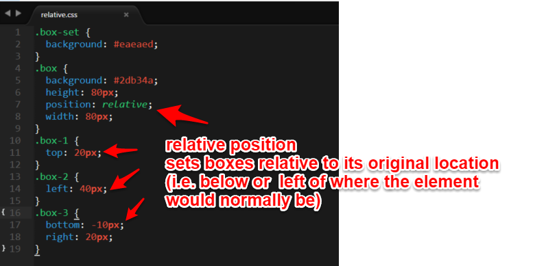
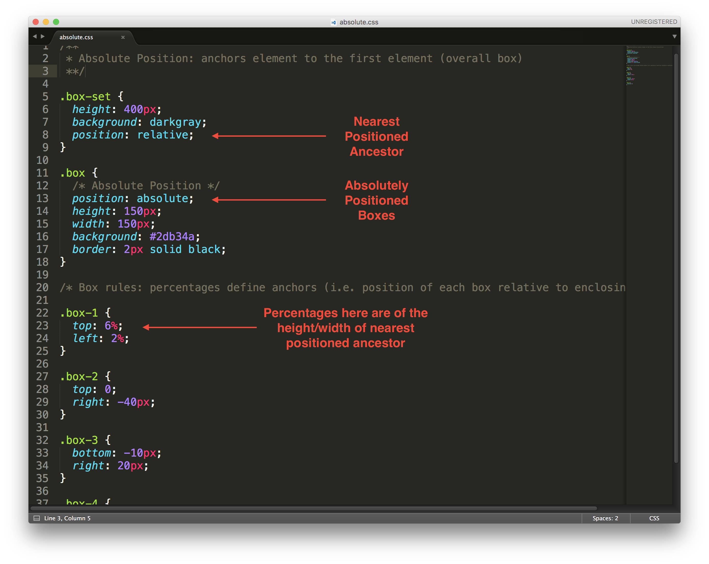
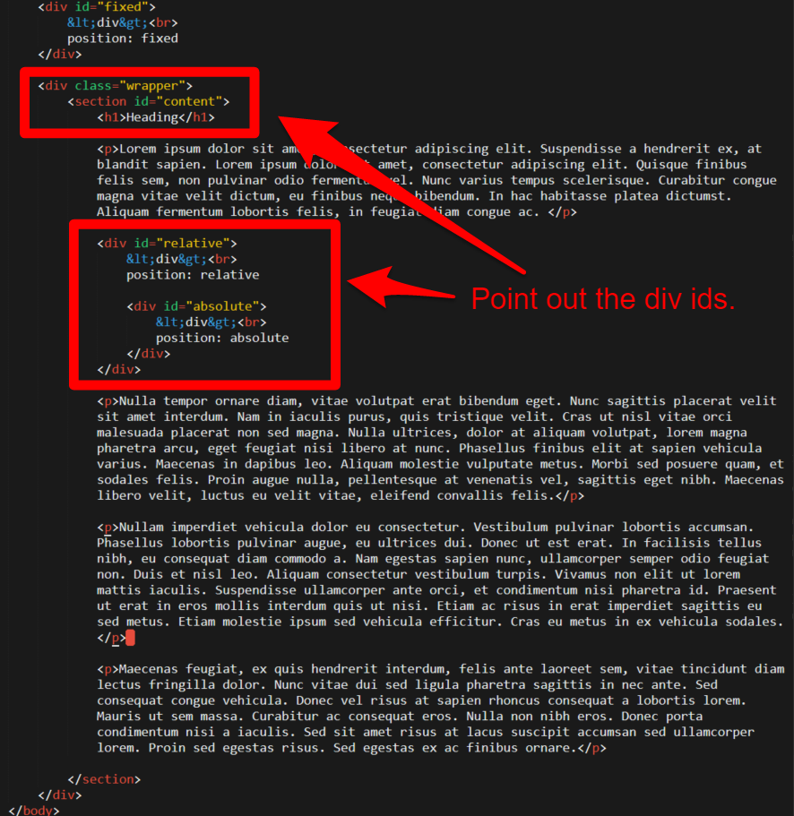
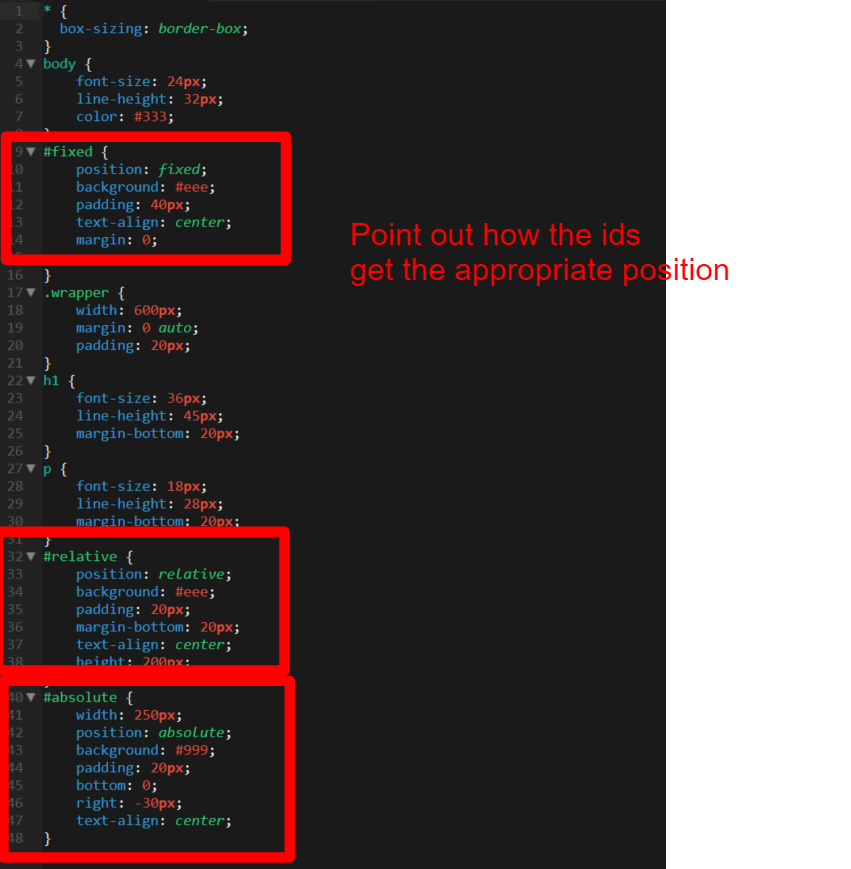
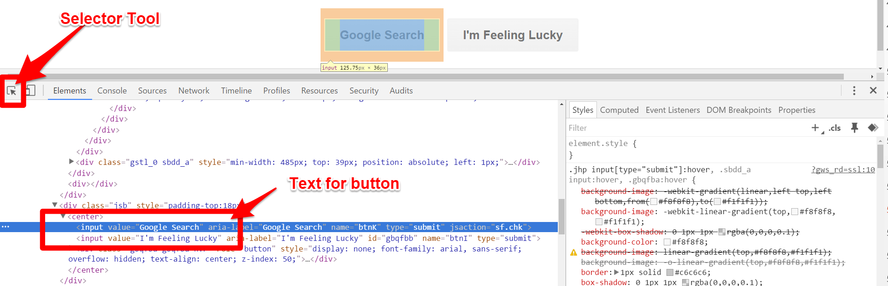
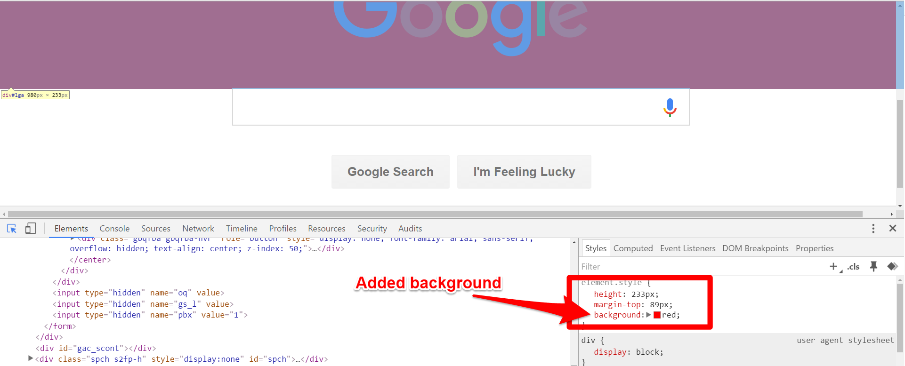
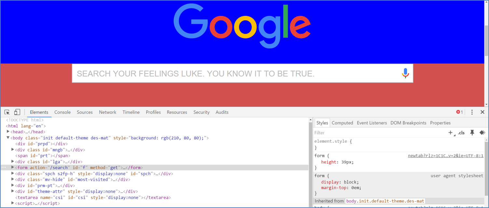
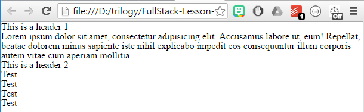

## 1.3 Lesson Plan - Heroes of CSS (10:00 AM) <!--links--> &nbsp; [⬅️](../02-Day/02-Day-LessonPlan.md) &nbsp; [➡️](../04-Day/04-Day-LessonPlan.md)

### Overview

In today's class, we'll be covering the bulk of CSS layout and positioning techniques. We'll also be touching on relative file paths.

We're also focused on empowering students with GitHub Pages for live deployments.

`Summary: Complete Activities 10 & 11 in Unit 01 and Activities 1-6 in Unit 02`

##### Instructor Priorities

* Students will learn how to incorporate CSS resets
* Students will learn to deploy their websites using Github Pages
* Students will be exposed to the concept of pull requests in GitHub
* Students will complete the Bash Checkpoint

##### Instructor Notes

* Way to go, you made it -- Hump day! Not to unnerve you, but today is one of the most challenging class sessions you'll have in the entire program. There's a lot to cover, it's easy to get side-tracked, and students' nerves are running high.

* In this class session we'll be providing students with a deep dive into CSS positioning and layouts. Many of the concepts and exercises will be frustrating to students, and it will be your responsibility to continually remind them that these concepts will start sticking over time.

* In order to keep motivation high, we're suggesting you use the following approach for the more challenging exercises. As students complete the exercises, they should message the TA. The TA will then call on the class and ask, "Who needs help?" The TA will then send the student who is done to the student in need. As an instructor, let all students know that being able to help fix others' bugs is a big part of being a good developer.

* If there is time and you see a need, you may even want your TAs to share their own experiences learning HTML/CSS for the first time. Have them offer context on how long it's taken to feel competent.

* **Important to note**: At this point in the program, students can still drop at no cost to themselves, making this period an ultra-critical one. Make sure students feel motivated. If you or a TA see any student getting visibly frustrated, walk over and try to offer extra support.

* **Also Important**: Remember to update the admin slides with the correct due dates for your class.

* Also later in this class, your focus as instructors/TAs is to ensure students are able to utilize Github Pages to deploy their websites. Going forward from today, students will be expected to submit Homework with links to both their GitHub repository and a live deployed website. Be ready to have your troubleshooting hat on for helping them debug deploys, as the surface area for problems is somewhat large.

* Have your TAs reference [03-Day-TimeTracker](03-Day-TimeTracker.xlsx) to help keep track of time during class.

### Sample Class Video (Highly Recommended)
* To view an example class lecture visit (Note video may not reflect latest lesson plan): [Class Video](https://codingbootcamp.hosted.panopto.com/Panopto/Pages/Viewer.aspx?id=a2e0037f-9a39-4942-83bb-3b555d224a64)

- - -

### Class Objectives

* To recap the basic topics covered to date
* To engage in a deep dive of HTML/CSS for layout design and element positioning
* To offer a conceptual introduction to CSS reset and downloadable style sheets
* To work with Google Developer tools for site inspection
* To utilize Github Pages for website deployment
* To complete the Bash Checkpoint

- - -

### 1. Instructor Do: Welcome + Admin Tasks (Slides) (5 mins)

* Open the Powerpoint [Heroes_of_CSS](SlideShow/Heroes_of_CSS.pptx).

* Welcome students back to class and flip through the Admin slides.

* Remember to update these slides with the correct repo links and due dates for your class.

* Be sure to encourage students to submit something for the homework assignment, even if it's not great. The point is to get in the habit of submitting. Also... it's mandatory to receive career services that they miss no more than two.

### 2. Instructor Do: Warning Monologue + Reassurance (Slides) (5 mins)

* Start today's class by first warning them in advance that today's class is going to be **hard**. Let them know that what makes today's class hard isn't anything deeply confusing conceptually but that it will be hard because it's so unfamiliar.

* Offer something like the below monologue (or your own variant):

  > Remember, learning is "FRUSTRATING." You're not behind if you don't get all of this today. The point is to take in as much as you can now. Get immersed, and then push yourself on the homework assignment. It won't click for many weeks. But trust us. Looking back, it WILL CLICK far more quickly than you'll believe.

### 3. Instructor Do: CSS Recap (Slides) (10 mins)

* Quickly recap the concepts behind CSS.

* Have students answer any questions on screen to those closest to them. (Get them comfortable with helping one another.)

* The point here is to just give students a refresher. Let them know we will be building our CSS skills for the next few weeks so there is plenty of time to get good at it.


### 4. Instructor Do: CSS Positioning (Slides + Demo) (15 mins)

* Go through the slides on CSS Positioning one by one.

* Point out the differences between the various position types:

  * `relative`: Positions elements relative to their static location in the document. These elements behave with and interact with other elements the same way they would as if they were positioned statically, except that you can use the `top`/`right`/`bottom`/`left` properties to move the elements _after_ they have been placed into the document flow.

  * `absolute`: Positions elements relative to the nearest positioned ancestor (non-`static`). They are taken out of the flow of the document, taking up no space when placing other elements. These elements will move in the viewport as you scroll (unlike fixed).

  * `fixed`: Positions elements relative to the top left of the browser window. Similar to `absolute`, except the containing block is the whole viewport. These elements will remain in the same place in the viewport as you scroll.

  * `z-index`: Allows us to position elements on top of one another.

  * `display: none`: Allows us to hide specific elements from the view. Useful because it can activate and deactivate elements. (Compare with `visibility: hidden;`, which also hides elements but not the space they take up.)

* When prompted for the `Demo Time`, open [10-CSS_PositionedLayout/main.html](../../../../01-Class-Content/01-html-git-css/01-Activities/10-CSS_PositionedLayout/main.html) in both the browser and in your editor.

* Point out that this currently uses static (default) positioning.

    

* Then go through the process of changing the active stylesheet so that each of the other forms of positioning are used.

* If asked about the `reset.css`, feel free to say something along the lines of

  > We'll talk about the reset more in the next class, but for now just know it makes it so that the default browser `padding`s and `margin`s don't exist (that way we can more easily see the effects of positioning).

* Show students both the CSS used and the impact on the HTML.

  

  * Demo that `top`, `left`, `bottom`, and `right` only work on positioned elements, not static ones. You can demonstrate this by using chrome dev tools to set `position: static;` on one of the boxes.
  * Point out also that the elements following the relatively positioned elements (boxes 2-4) behave as if box 1 were in its static position. Explain that this is because `top`/`right`/`bottom`/`left` properties are applied only _after_ the element has been placed in the document flow.

  

  * When discussing absolute positioning, demo removing the `position: relative;` in-browser with the developer tools. Show them that it will absolutely position based on the nearest positioned ancestor, using the viewport as the basis if none of the ancestors are positioned (demo this by removing the positioning on `.box-set`).
  * Depending on time, You may also want to show how the elements pile on top of each other if you remove the `top`/`left`/`bottom`/`right` properties - this demonstrates that the elements are removed from the flow of the document.
  * `absolute` is worth spending a little bit more time on, as it arguably the most complex (and sets the tone for `fixed` positioning)

  

* Slack students the entire folder (zipped) when done with this activity.

### 5. Partners Do: CSS Positioning Activity (30 mins) (Critical)

* Introduce the next activity. Either by using the slide or by opening the file 
[11-CSS_Positioned_Activity/positioning.html](../../../../01-Class-Content/01-html-git-css/01-Activities/11-CSS_Positioned_Activity/Solved/positioning.html) 
in the browser, show students what they will be building in the next activity.


* Then Slack out the following instructions.

  * **Instructions:**

    * Work with the same or different partners on this activity, but make sure each member of the group is typing out their own code!

    * Create a file called `positioning.html` and a file called `positioning.css`.

    * Using HTML/CSS, create the layout shown on the screen.

    * For reference, the colors used on the screen are `#eee` and `#999`.

    * For further reference, you can generate paragraphs of lorem ipsum text using <http://www.lipsum.com/feed/html>. You need to make this page scroll to see how the fixed position element behaves.

    * HINT: Use the code from the last few activities to help get you started.

### 6. Instructor Do: Review CSS Positioning (10 mins)

* Discuss the solution from the previous activity. When appropriate, have students help explain code back to you. (Example: You may ask students to help you comment various pieces of the code.)

* Key points in describing the HTML:

  * How we created a `div` to hold our content.

  * How we created `divs` to hold the `fixed`, `relative`, and `absolute` content.

  * How we used specific `id` tags to attach the CSS to.

     

* Key points to explain in describing the CSS Solution:

  * How we once again used **border-box** (this just means that the width and height won't include the margin. Not a big deal).

  * `#fixed` element has a position of `fixed`.

  * Wrapper has a set `width`.

  * `#relative` and `#absolute` have the relative position values.

     

* See if there are any lingering questions. Then Slack out this solution. Let students know to try and re-practice this activity at home. It's a good one.

### 7. Instructor Do: Video Guide Emphasis (1 min)

* Re-emphasize all of the reasons why the video guides could be of use for the students, and also let them know that you will be Slacking out a complete "Video Guide" after today's lessons. That way they have an easy way to access the videos.

* Slack out videos [Positioning in CSS](https://www.youtube.com/watch?v=sHfJn0jqBro) and [CSS Positioning Layout](https://www.youtube.com/watch?v=yWXgnQaWSW0).

### 8. Instructor Do: Intro to Chrome Inspector (10 mins)

* Finally go through the process of explaining to students how to use the Chrome Inspector. Encourage them to follow along.

* Visit www.google.com. Then right click on the screen and hit "Inspect."

* Then click the Element Selector and begin clicking on elements on the page. Show students how this then highlights the relevant HTML/CSS.

* Then show them that you can change any element on the page. As an example, try to change the HTML text inside of the `Google Search` button to something else.

    

* Then show them that you can also change the CSS as well using the style pane.

    

* Let them know that this is a powerful tool for developing your own websites and for understanding how other websites work.

* Let them know that we will be using Chrome Inspector much more in the classes to come.

* Ask if there any questions.

- - -

### 9. LUNCH BREAK (30 mins)

- - -

### 10. Instructor Demo: Google Developer Tool (10 mins) (High)

* Talk about Google Developer Tools again. Mention that it is incredibly important for developers. Then walk students through a demo of its use when prompted. Be sure to point out how Google Developer Tools can be used to change both:

* HTML Elements

* CSS Elements (show them how to change the box model in particular)

  

### 11. Students Do: Modify Websites (10 min) (Critical)

* Then Slack out the following activity:

* **Instructions:**

  * For the next 15 minutes, take a website that you commonly use (Amazon, Google, Huff Po, etc.) and heavily modify it using the Chrome Developer Tools.

  * Be sure to at least modify:

    * Content (Change words)
    * Colors
    * Spacing
    * Etc.

  * Slack out a screenshot to the class when you’re done.

* **Instructor/TAs:**

  * Walk around during this time and ensure that students are making progress.

  * Remember students can still drop-out! Help them to enjoy fun activities like this.

  * Once the activity is complete showcase a few of the students' creations on the screen for everyone to see.

### 12. Students Do: Modify Own Websites (10 mins) (High)

** Then Slack out the following activity:

* **Instructions:**

  * For the next 10 minutes, take a website that you yourself worked on (ex: In-Class activities, homework assignments, etc.), and utilize the Chrome Developer Tools to help you test changes in real-time.

  * Note: Focus on getting more comfortable using the Developer Tools. Trust us. You will WANT to use these Developer Tools as you proceed in this course.

### 13. Instructor Do: Multiple CSS/CSS Resets (10 min)

* Take a few moments to explain that CSS can be loaded in multiple files, each of which is additive on the last. To assist you in this regard, see the examples in [03-MultipleCSS](../../../../01-Class-Content/02-css-bootstrap/01-Activities/03-MultipleCSS)In each example, the CSS file is split between 1, 2, or 3 files. In each instance the end result is the same.

```html
<!-- This critical line points your HTML to the CSS file. Notice the "relative" pathway -->
<link  rel="stylesheet" type="text/css" href="style.css">
<link  rel="stylesheet" type="text/css" href="style2.css">
<link  rel="stylesheet" type="text/css" href="style3.css">
```

* Point out to students that the order matters, and that later CSS files will "overwrite" previous ones if there is a repeat. Feel encouraged to demonstrate this by modifying the examples in `03-MultipleCSS`.

* Have students first show by hands the browsers they use.

* Then proceed to the series of slides on reset.css and browser differences. Point out that as of now, each browser determines for itself how things like headers, paragraphs, and tables should look. The font and thickness is all pre-set by the browser. This can create situations where your website will look one way in one browser and another way in another browser.

* After pointing out that browsers work differently in how they render pages, emphasize that cross-browser compatibility is critical in web development. This is particularly important when you are creating an app with millions of users.

* Point out that you can incorporate a `reset.css` file, made available online, that ensures your site will look the very same in different browsers. (It resets any default styling that the browser adds.)

* Then demonstrate the use of a CSS reset. To do this:

  * Open the file `example.html`

  * Then Google Search "CSS reset". The first link will be one found on the meyerweb website. <http://meyerweb.com/eric/tools/css/reset/>.

  * Copy the CSS made available on that site and paste it into your editor. Save that file somewhere locally on your computer.

  * Then link the CSS file into the HTML.

  * Run the HTML file again in browser and point out how it has been stripped of any pre-built browser styling, thereby allowing you to style everything from scratch.

    

  * Then point out that `reset.css` is important because of:

    * Cross Browser Compatibility

    * Ability to use pre-made CSS from someone else (an idea we will exploit repeatedly)

    * It's a common front-end question

### 14. Students Do: CSS Resets (10 min)

* Slack out the following instructions to students.

  * Slack out the files inside [04-ResetCSS](../../../../01-Class-Content/02-css-bootstrap/01-Activities/04-ResetCSS)

* **Instructions:**

  * Follow the instructions in the HTML document to incorporate a reset.css file into a basic HTML file.

  * Note the impact the reset file makes after its inclusion.

  * Hint: You should be using the CSS made available on this link: <http://meyerweb.com/eric/tools/css/reset/>

  * Bonus: Incorporate a CSS reset into any page you've worked on to date.

### 15. Instructor Do: Deploying to GitHub Pages - Personal (10 mins)

* Now that our class has created a few basic webpages locally, it's about time we started putting these pages online for the world to see. In order to do this, we are going to be hosting our websites on GitHub Pages.

* Spend a few moments explaining the concept of "deployment", namely the idea that as of yet, students' websites have only been accessible on their own computers. In order for their websites to be accessible by the public, it needs to be deployed on a server.
  * Explain to the class what the concept of a "host" is.
  * A web host is the activity or business of providing storage space and access for websites. You cannot put a website online without it being hosted on a server somewhere.

* Open up the [GitHub Pages website](https://pages.github.com/) and explain how it essentially allows us to turn GitHub repositories into live webpages without having to worry about pushing our code to another web host provider.

* GitHub Pages allows you to create two different types of sites (we will be going over both methods):
  1. Personal/organization sites for your account
  2. Sites that are specific to a project/repository

* Start out with a walk through of the first method: creating a personal website using GitHub Pages.
  1. Create a new repository on GitHub called `_username_.github.io` where `_username_` is your account name on GitHub.
  2. Next, open up Git Bash or Terminal on your computer. Navigate into the folder that you would like to store your project in and then clone the repository you just created.
  3. Within this new folder, add an HTML file called `index.html` which contains the code for the website you would like to publish.
  4. Add, commit, and push your changes to the repository and... That's it! Whenever anyone navigates to `_username_.github.io` they will now land on your webpage!
  5. Navigate to the website on your browser to show your class that the webpage is now fully online.

* Recap the steps for deploying to GitHub Pages one more time before continuing onto the next activity.
  1. Create a new repo that is named `_username_.github.io`
  2. Navigate into a folder and clone the repo into it
  3. Add an HTML file named `index.html` and code out your webpage
  4. Add, commit, and push your changes into the repository

### 16. Students Do: Deploying Personal Bios to GitHub Pages (15 mins) (Critical)

* For this activity, students will be deploying the bio pages they made in the last activity to Github Pages.

* **Instructions:** [05-GithubPagesPersonal/README.md](../../../../01-Class-Content/02-css-bootstrap/01-Activities/05-GithubPagesPersonal/README.md)

### 17. Instructor Do: Deploying to GitHub Pages - Projects (15 mins)

Not every website can be a personal website, however, as there are many times in which we will want to create websites that are customized for specific projects. Luckily for us, GitHub Pages includes a VERY simple way to deploy webpages for individual projects as well!

* Walk through the steps required to create a website for a specific repository...

  1. Create a new repository on your GitHub account. You can name this repository whatever you would like.
  2. Once inside of the repository, create a new file and name it `index.html`
  3. Add some very basic HTML into this file, save it, and then navigate into your repository's Settings tab.
  4. Scroll down to the GitHub Pages section and then, in the section labeled "Source", select that you would like to use the master branch as your source.
  5. Navigate to `_username_.github.io/_repositoryname_` and you will find that your new web page has gone live!

* It is very likely that your students will be wondering how to get a custom domain for their projects as opposed to a site that is clearly linked to their GitHub account...

  * Mention that custom domains are more heavily coveted since they are more easily searchable online. This means that custom domains have to be purchased from companies known as "DNS Providers". These companies allow users to buy and register unique domain names and connect that name to an IP address. **GitHub Pages does not sell domain names.**

  * Tell your students not to worry about custom domains at this time since it is not necessary for the web work that we will be doing. If they really wish to link a webpage of theirs to a custom domain, however, GitHub Pages has great documentation on how to go about doing this.

### 18. Students Do: Creating a Project Site (15 mins) (Critical)

* For this activity students will be creating a web page to display and explain a data science project they've already completed. Students will deploy the HTML to a github pages project page.
* **Instructions:** [06-GithubPagesProject/README.md](../../../../01-Class-Content/02-css-bootstrap/01-Activities/06-GithubPagesProject/README.md)

### 19. Group Do: Homework 1 (30 mins) (High)

* Allow the next 50 minutes to be used for the first homework assignment.

* Students may want to partner up to work through things together.

* If students seemed to struggle today, you can use this time to review difficult topics or spend more time on one of the class activities rather than on homework. 

### 20. Instructor Do: Recap (5 mins)

* Instructor should offer an overarching perspective on what was covered. As a bullet list you could use the following:

  * Today we covered the basic gist of how to use CSS to create position + layouts.

  * If you're feeling lost, don't worry. It's normal. At the very least, you should feel more comfortable attaching CSS to specific elements. Don't worry if you can't create CSS layouts off the top of your head just yet. It comes with time.

  * But if you know how to attach CSS to a class, id, or header, you should feel pretty proud of yourself.

  * Trust us in saying that you will surprise yourself by how much you know.

### 21. Instructor Do: Introduce Checkpoint - Bash (5 min) (Critical) 

* Let your class know that they will now be taking a short multiple choice assessment to check their understanding of Bash.

* DO NOT SKIP THIS INTRODUCTION. DO NOT JUST SEND OUT THE LINK WITHOUT CONTEXT

* Reassure the students that they need not be nervous about the Checkpoint:

  * "This will not affect your grade or graduation requirements."

  * "This is not like the tests and quizzes you might be used to from school or college. The purpose of these tests is not to motivate you to study or punish you for struggling."

  * "This is as much a test of me as an instructor and of the course content as it is of you. We are here to ensure your success, and this is one of the tools we use to make sure we are doing that effectively. This class moves _fast_, so if some or all of you misunderstand something important we as an instructional team need to find out as fast as possible so we can help."

  * "Long story short, this quiz can not hurt you. Only help you."

* Let students know that they should read carefully and focus on thinking about the right answer rather than using any test-taking skills they may have learned:

  * "There are no silly answers or obvious throwaway responses on this quiz, because those kinds of answers reduce the likelihood that we'll be able to figure out whether we've taught something effectively."

  * "Test taking strategies you may have learned for standardized tests _will not work_, so instead of focusing on eliminating wrong answers or looking for sneaky context cues, read the question and each of the possible choices carefully."

* Reassure students once again that the purpose of this is to help them, and remind them that the outcome does not impact their grade or graduation requirements. You should do this _every single time_ you give an Checkpoint.

* You or your TAs should now get the link specific to your class:

  * Navigate in your browser to: `https://www.switchboard.tech`.

  * Select your class code (if it doesn't show up on its own).

    * If the class is a parallel class, a class that has two classes combined on a Saturday, and doing a checkpoint with two classes at once you will **need** to slack out two links.

    * One for your class and one for the other.

  * Select the Checkpoint and copy the resulting link.

### 22. Students Do: Take Checkpoint - Bash (10 min) (Critical)

* Slack out the link to the Checkpoint.

* Let your students know that once they select their name, it will take them to the Checkpoint.

* Checkpoints must be completed in class, **not at home**, to ensure you will be able to effectively find and help struggling students.

* TAs should walk around the class to ensure students aren't looking up answers.

* Keep in mind we do not use grades from assessments toward graduation requirements. However, students will be tempted to avoid feeling like they don't understand something.

* It's important for instructional teams to create an environment where it is safe to fail, but also where such failure is visible. You should not be worried about "cheating" on checkpoints, only making sure that students who need help aren't remaining invisible.

* Your SSM will have the results of the Checkpoint within an hour of its completion.

### 23. End (0 mins)

### 24. TAs Do: Structured Office Hours - Review Bash (30 min)

* Navigate in your browser to: `https://github.com/coding-boot-camp/checkpoint-bank/blob/master/checkpoints/multiple-choice/01-Intro-to-Console-Bash-MC/01-Intro-to-Console-Bash-MC.md`

* There you will find the questions and answers to the Checkpoint given.

* Please take the entire office hours time to review the questions with the students.

* Suggestion Format:

  * TAs ask a question at a time to the class.

  * Let the students try to answer it.

    * If you see that a majority of the class has a misunderstanding with a question:

      * Take your time on this question!

    * If you see that a small number of students has a misunderstanding with a question:

      * Do your best to reinforce the misunderstanding but be cautious of your time.

      * Make note of the students that are still struggling with the question and schedule a 1:1 with the students.

  * If applicable, demo the answer.

* Take your time on these questions!

* This is a great time to reinforce concepts and misunderstandings!

### Troubleshooting Guide

* Below is a list of the most common issues that students present when trying to do Github Pages deployments.

* **Forgetting to git "add -A, git commit -m":** Often students will completely skip the step where they save and commit their changes prior to pushing to GitHub. This will mean their web page is essentially blank. As a starting point, ensure their code is present in GitHub.

* **Didn't name the repo correctly:** Students will likely not name the repository for their custom site correctly - ensure it follows the pattern `_username_.github.io`.

* **Images and/or CSS not appearing:** All filenames and paths are case sensitive. Ensure that all links in HTML are using case-sensitive paths that match the folder directories casing.

* **Not using relative paths:** Many students are still using absolute paths to reference their CSS or image files. Help them to convert these to relative paths.

* **Not knowing where their site deployed:** Show students that they need to login to the site and they will see the new app deployed on their menu. Give them guidance as to what the URL for their repo will be.

* Beyond that... Good luck!

### Lesson Plan Feedback

How did today's class go?

[Went Well](http://www.surveygizmo.com/s3/4325914/FS-Curriculum-Feedback?format=ft&sentiment=positive&lesson=01.03)

[Went Poorly](http://www.surveygizmo.com/s3/4325914/FS-Curriculum-Feedback?format=ft&sentiment=negative&lesson=01.03)
