## 04-Day Lesson Plan - Down and Dirty CSS <!--links--> &nbsp; [⬅️](../03-Day/03-Day-LessonPlan.md) &nbsp; [➡️](../05-Day/05-Day-LessonPlan.md)

### Overview

Today's class is focused on introducing students to additional CSS styling techniques with typography, pseudo-classes, and external CSS frameworks. Towards the end of the course, students will be given their first glimpse of the Twitter Bootstrap Framework.

`Summary: Complete Activities 7-11 in Unit 02`

##### Instructor Priorities

* Students will be given a clear perspective on how to approach the class
* Students will understand both the concept of an external pre-made CSS stylesheet and how to incorporate one
* Students will understand how to incorporate a custom Google Font
* Students will be able to loosely explain why the Twitter Bootstrap Framework is useful and how to incorporate the Bootstrap CSS stylesheet

##### Instructor Notes

* The first series of slides in the class are intended to preempt sentiments your students may be experiencing. It's important to let students know that it's completely okay if they feel like things are moving quickly, and that the best way to succeed in the course is to expect some level of confusion as an unavoidable part of the learning experience, but to continue practicing at home.

* Today's class is a bit of a hodge-podge of CSS building. The first part of the class involves a light intro to typography-handling in CSS and the use of pseudo-classes to deal with button states. The second part of the class is an introductory prelude to Twitter Bootstrap.

* There is a lot to cover today, so don't get too bogged down in flipping through the slides. Most slides should merit a 15 second discussion at most. In many cases, the slides are more intended for students to look back at.

* The biggest priority for today is to make sure students understand how to include a CDN-based CSS stylesheet into their web applications. Make an effort to make sure students can articulate why such stylesheets are powerful (e.g. Pre-made CSS means we don't have to write everything from scratch.) Make certain that students are prepared and able to incorporate a CSS CDN into their projects. Some will struggle with this goal, but make an effort to get them closer. They'll have plenty more practice with this in the next class as well.

* **Important Note:** If you find yourself pressed for time after the break, feel free to remove the discussion of pseudo-styles entirely (or come back to it). The Bootstrap material is far more important and more relevant to their homework assignment, so definitely prioritize this section.

* If you finish early, there is an extra "Layout" exercise hidden in the slideshow. Unhide it and have students work on it.

* Have your TAs reference [04-Day-TimeTracker](04-Day-TimeTracker.xlsx) to help keep track of time during class. (Note: If this class falls on a Saturday, click the "Saturday" tab on the spreadsheet to see the appropriate schedule.)

### Sample Class Video (Highly Recommended)

* To view an example class lecture visit (Note video may not reflect latest lesson plan): [Class Video](https://codingbootcamp.hosted.panopto.com/Panopto/Pages/Viewer.aspx?id=b4127cc6-5025-4c0b-95c0-9f348b6b9f6d)

- - -

### Class Objectives

* To work with CSS properties used for adjusting a website's typography
* To utilize custom fonts provided from Google Fonts
* To work with CSS pseudo classes to style elements based on special states
* To utilize the Bootstrap CSS framework for website development

- - -

### 1. Instructor Do:  Welcome + Check-In Session (5 min)

* Welcome students back to class.

### 2. Instructor Do: Admin Items (10 min)

* Spend a few moments talking students through the Admin slides.

* At this point, students should be submitting their homework online. Make sure students know that submitting homework is required to complete the program and that, even if they couldn't complete it, they should definitely submit something rather than nothing. Try to be encouraging about it. (Perhaps ask students how the homework went, about what they learned, etc.)

* Then flip through the slides on "Feedback". These slides are based on sentiments expressed by students in the past and are likely being felt by your own students.

  * **"Pace is Fast"** - Pretty self-explanatory, but often, students are feeling like they "wish" the program would slow down so they could "really understand" certain concepts.

    * It's important to let them know that web development is all about learning many different technologies "well-enough" to put it together and re-learn when you need. They need to become comfortable with the idea of "learning enough."

    * Let them know that there will be plenty of reinforcement throughout the course. Just because they missed Git in the first week, doesn't mean they are screwed. We'll be using Git over and over again.

    * Also let them know that the point of the program is to be a rapid immersion. Once the program completes, they can revisit any of the topics covered and dive into more in-depth.

  * **"Books Please"** - Often students express a desire to have a "comprehensive reference book". What they really mean is they want a "Bible of Web Development".

    * Let them know that in this program we cover a LOT more than any single book will offer. And that to be flipping through books in class may often prove counter-productive. Instead of spending their time coding they would be flipping through pages. Learning to code requires coding. The best way to spend time is to re-practice exercises in class.

    * That said... Students have had successes complementing class with Code School (a low-cost subscription based program with videos + tutorials); Jon Duckett's series on HTML, CSS, an JS/jQuery, and Eloquent JavaScript by Martin Haverbeke. Let them know that these are good resources if they ever want to firm up their understanding of concepts.

    * But again, remind them, and emphasize, that they should be spending the majority of their time outside of class on actual coding.

    * As a suggestion, offer the idea of spending their 30+ hours per week in the following way:

      * 45% doing homework,

      * 35% re-reading + re-practicing code activities

      * 20% reading + looking over slides + watching videos

  * **"Homework is Hard"** - Yes indeed it is.

    * Let them know that they should expect the homework to be semi-challenging. Sometimes it will be easier, other times harder. (Their first homework assignment was one of the most challenging.)

    * But let them know that so long as they are putting in the time, and working smart -- they will see gains in the long run.

    * As a major point, let them know that if they ever find themselves staring at a blank screen for 2 hours they should absolutely reach out. That's what we're here for!

  * Spend the next 10 minutes flipping through the "recap" slides. The purpose of these slides is to remind students of all that we have covered so far. Don't get sucked into the details too much. Stay at a high level.

  * At various points in the slides, there will be obvious opportunities to ask students questions. For instance:

    * Before again defining "Full Stack Development" have them define it for you.

    * When talking about console, have them answer questions about which console command is used to `make new files` or `switch directories`.

    * When talking about GitHub, have them explain back to you the two big reasons why Git Collaboration is so important (Code Conflicts + Version History).

  * When you arrive at the slide titled "How to Learn", emphasize the fact that in their fumblings they've already learned one of the most important lessons of all: how to find things out on their own.

  * Then give them a few moments to ask questions or present issues should they have any lingering questions, issues, confusions, uncertainties.

### 3. Instructor Do: Recapping (10 min)

* Using slides to guide through a review of everything covers up to this point.

### 4. Instructor Do: Double Take (20 min)

* The purpose of this section is to dive more deeply into subjects that students may be confused about.

* The biggest question students often ask at this point is "What's the difference between a 'div' and a 'section'?" Use the slides offered to give students context about these elements. Namely:

  * `div`s and `section`s are both effectively "containers". In creating HTML, you create `div`s and sections to "wrap" around content like paragraphs, headers, images, etc.

  * `div`s are the more basic container. With HTML5 there came the opportunity for "semantic layouts", meaning `div`s could be given more specific names. This supposedly offers more readable code, better organization, and search engine optimized sites.

  * That said, many many sites still use `div`s -- including the W3 website itself as there are other ways to "identify" different containers. (Interestingly enough, W3 uses plain `div`s even on the page about semantic elements itself.)

  * Mention that there is no hard-and-fast rule here.

* Then point out the difference between classes and IDs. Namely:

  * Classes are reusable elements. Essentially blocks of CSS that you plan on using to style many different elements on the page.

  * IDs are single use styles. They offer specificity and uniqueness.

### 5. Instructor Do: CSS Typography (10 min)

* Flip through the slides on typography. Don't spend too much time on any one slide here.

* Point out that good typography can make a huge difference in the aesthetic effect of a web page.

* Then talk about typical typographic properties.

  * Point to note: line length isn't a CSS property. It's more of a visual standard. You don't want your text lines to extend across the entire width of a person's monitor (hard to read). Instead, you want to minimize it to about 50-75 characters per line.

  * All other properties listed can be controlled by CSS

### 6. Students Do: CSS Typography Activity (10 min)

* Tell the students that it's time to have a go at typography themselves!
* Tell them that this is Activity 1, and optionally link them to the README on gitlab via slack (for their convenience)
* Push or display GitHub for the following page

[07-CSSTypography/README.md](../../../../01-Class-Content/02-css-bootstrap/01-Activities/07-CSSTypography/README.md)

### 7. Instructor Do: Review CSS Typography Activity (5 min)

* The last CSS activity should have been easy for your students. But go over it with them anyway.

* Open the files [html-template.html](../../../../01-Class-Content/02-css-bootstrap/01-Activities/07-CSSTypography/Solved/html-template.html) and [style.css](../../../../01-Class-Content/02-css-bootstrap/01-Activities/07-CSSTypography/Solved/style.css) in your editor. Then walk students through the following points:

* That you incorporated a reference to the CSS page you created at the top.

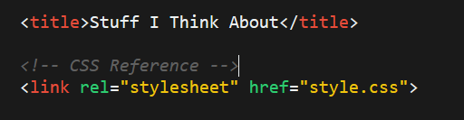

* That you added in distinct class names to each of the body paragraphs

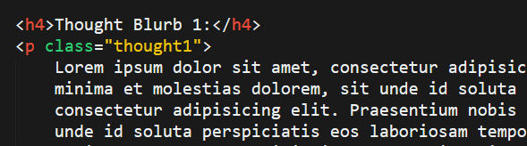

* That you then latched onto those HTML classes in the CSS page and modified various typographic properties.

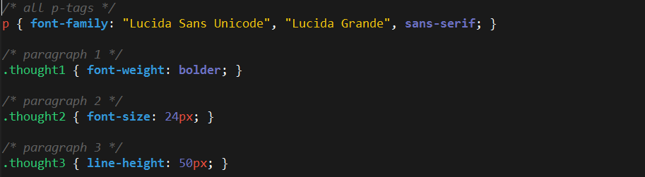

* Point out that this is an example of what not to do (i.e. choosing random CSS typography.) Point out that choosing good typography often requires adhering to consistent principles across your site -- and it takes time to master.

### 8. Instructor Do: Custom Fonts (5 min)

* Talk about how with you can not only modify basic CSS properties, but also incorporate totally custom font-faces.

* Let students know that many sources (like Google) offer font-faces online for free that can be incorporated into their HTML/CSS.

### 9. Instructor Demo: Custom Fonts (5 min)

* Walk students through the process of incorporating a Google Font. You can use the below steps as a guide.

  * Then navigate to the [Google Fonts](https://www.google.com/fonts) web page and find a font-face students like.

  * Then hit the "Quick Use" button.

    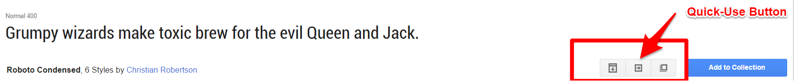

  * Select a few font-weights

    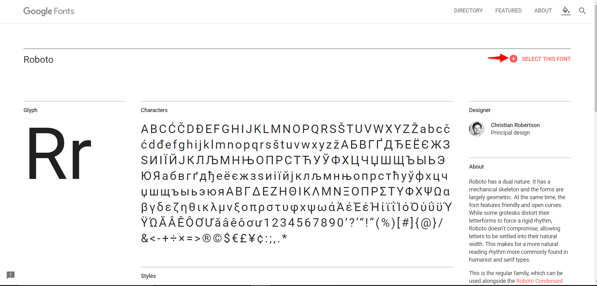

  * Scroll down the page and point out the next steps. Show students how Google offers two links they will need: one for the HTML page and one for the CSS file. Grab both of these links.

    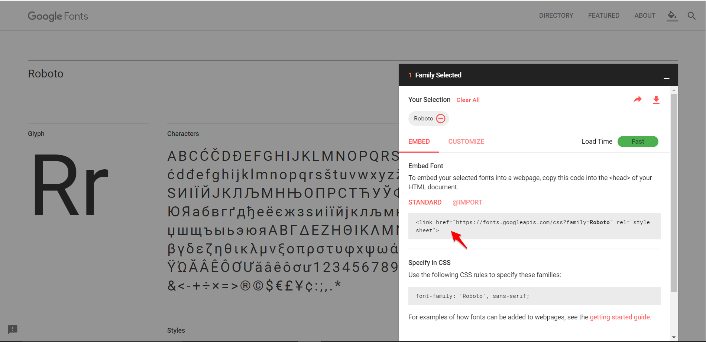

  * Then open the file `html-template.html` (2-GoogleFontDemo > Unsolved) first in the browser and then in your editor. Point out that its the same file they worked with just now.

  * Then add in the HTML reference link provided by Google

    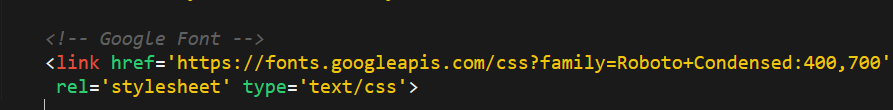

  * Then add in the CSS style provided by Google. Apply the font-face to `h1, h2, h3, h4`.

    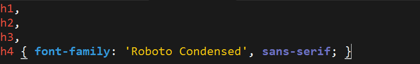

  * Refresh the page in the browser and point out the custom fonts.

    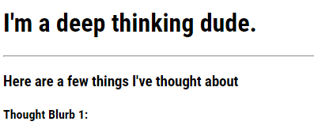

### 10. Students Do: Custom Fonts Activity (10 min)

* Now it's your turn to incorporate Google Fonts!
* Tell them that this is Activity 2, and optionally link them to the README on gitlab via slack (for their convenience)
* Push or display GitHub for the following page

`08-GoogleFontDemo/README.md`

### 11. Instructor Do: Review Custom Google Fonts Activity (5 min)

* See if students ran into any global issues. Address them for the class.

- - -

### 12. LUNCH BREAK (30 min)

* Regroup with TAs to ensure you're keeping on schedule. If not, cut out unnecessary pseudo-style activities until end of class (skip straight to Beyond CSS Hacking).

- - -

### 13. Instructor Do: Pseudo Styles (5 min)

* Flip through the slides on pseudo-classes. Talk about how CSS allows you to not only affect "static" properties, but also of ones that are more dynamic in nature.

* Point out the `:class` syntax.

* Present the case of the button with various states, in which a button may change color depending on its state.

* If time permits, feel free to click the link on pseudo-classes and show students a few of the other options that exist.

### 14. Instructor Demo: Pseudo Classes (10 min)

* Run through a quick demo of pseudo-class use, using a button as an example.

* Feel free to live code this example, otherwise, you can use the files in 3-Pseudoclass and simply explain the code.

  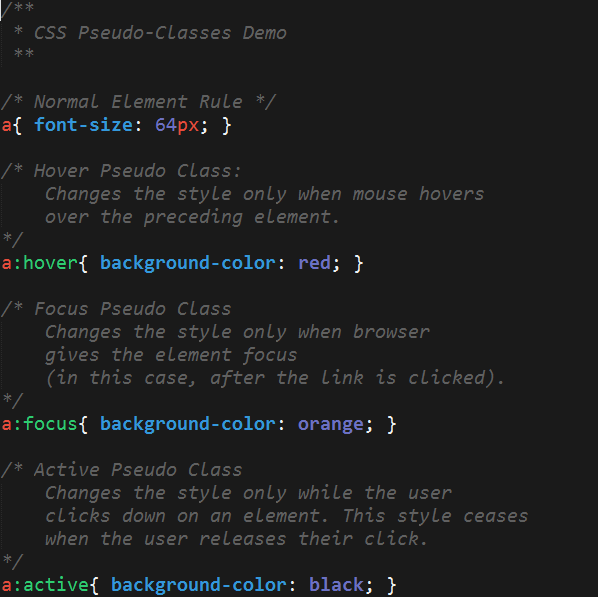

* Once done explaining, show how the states correlate with what's happening on the browser as a user clicks a button.

* Point out that this is a simple example, but many others build powerful UI based off this principle. Point them to this link if they are interested in learning more. <http://ianlunn.github.io/Hover/>.

### 15. Students Do: Pseudo Styles Activity (15 min)

* In this activity you'll do some styling based on the state the links (if it is hovered, active, etc.)
* Tell them that this is Activity 3, and optionally link them to the README on gitlab via slack (for their convenience)
* Push or display GitHub for the following page

[09-Pseudoclass/README.md](../../../../01-Class-Content/02-css-bootstrap/01-Activities/09-Pseudoclass/README.md)

### 16. Instructor Do: Review Pseudo Styles Activity (5 min)

* Review the activity with students. See if there were any issues.

* If any students completed the bonus have a few of them share what they were able to do. Load up a few of their pseudo-classes and pseudo-elements and show their code and result on screen. Have these students explain what they did to the class.

* Point out that "learning to learn" via documentation is a big part of being a developer

### 17. Instructor Do: Beyond CSS Hacking (15 min)

* Spend a few moments refreshing students on HTML and CSS. Point out that getting layouts and aesthetics built using raw CSS alone can be incredibly aggravating.

* Then convey that there is a better way.

* When prompted by the slide, open the file `bootstrap-powered.html` (4-WheresCSS) in the browser. Show students the overall appearance of the site.

  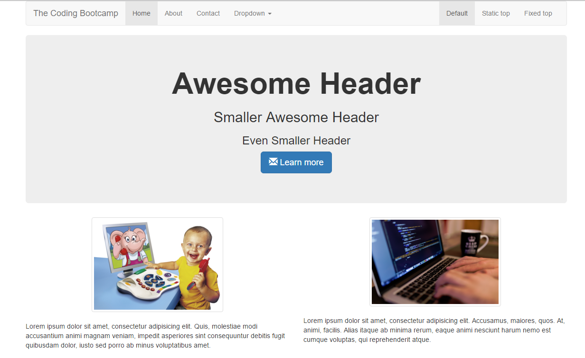

* Then open the same site in the browser and let students know that this site was created without the developer needing to write a single line of CSS.

* Then proceed with the quick activity.

### 18. Partners Do: Where's the CSS Activity (5 min)

* Tell them that this is Activity 4, optionally slack them the link to the [10-WheresCSS/bootstrap-powered.html](../../../../01-Class-Content/02-css-bootstrap/01-Activities/10-WheresCSS/bootstrap-powered.html) file or the file itself (for convenience)
* Ask students to answer these questions (with their partners):
  * Where's the CSS?
  * Where is the HTML document drawing its styles from?
  * How does our browser know which element to style in which way? (ex: button face or background banner) 	
* As a hint, mention that we've used something similar with Google Fonts.
* Then have students share their answers with the class.

### 19. Instructor Do: Continue the CSS Hacking Slides (5 min)

* After a few moments continue with the slideshow.

* Point out that the previous HTML uses a web-based CSS file from Bootstrap.

  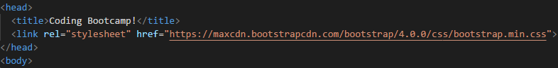

  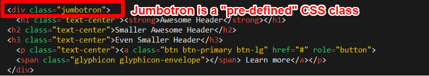

* Also point out that this CSS file has pre-styled "classes" which are styled whenever you call an element that class. Go through and point out how this is the case with the Jumbotron for instance.

  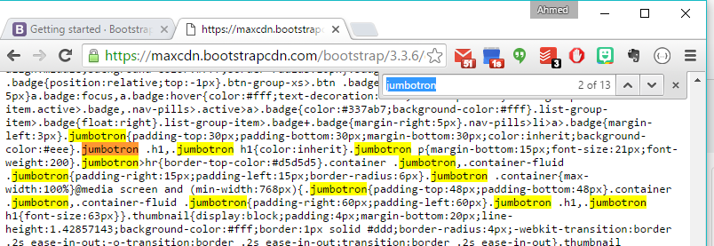

* Visit the link for the stylesheet via the browser. Then do a `ctrl+f` search for the term jumbotron. Point out that the word appears in the stylesheet, meaning that, whenever I create a block called `jumbotron`, I am utilizing CSS I didn't have to write for this block.

* Talk a bit about how this is a big deal because we are now using pre-defined CSS styles that someone else made.

### 20. Partners Do: Pre-Defined CSS Activity (5 min)

* Have students discuss with their partners why predefined CSS is a big deal. Then have students share their answers with the class.

* The answer should be something along the lines of:

  > Predefined CSS styles mean that a front-end developer has a "starting place" for creating web layouts. Instead of having to create the styles for every element, they can quickly borrow from commonly used elements and build layouts with best practices.

### 21. Instructor Do: What's Bootstrap (10 min)

* Continue with the slideshow through the section on What is Bootstrap.

* The most important element to convey is that Bootstrap comes with a set of pre-built UI elements that can be easily deployed. It may make sense to have students visit the Bootstrap web page at this point.

* Also convey that Bootstrap makes it easy to build mobile-responsive websites. Have students explain what that means before showing the slide. Choose any mobile responsive website and demonstrate how shrinking the screen width also shifts the elements.

### 22. Instructor Do: Key Bootstrap Features (10 min)

* Spend a few moments describing the variety of UI components that Bootstrap offers. Don't get lost in over-describing any of the elements, and don't try to explain the code for each component. Simply describe the types of components Bootstrap offers.

### 23. Instructor Demo: Bootstrap Components (15 min)

* Spend a few moments showing students how to utilize the simplest of Bootstrap CSS or components.

* We'll talk about layouts on Saturday, so for now the focus is on making sure students know how to reference the Bootstrap CDN and that they begin to copy and paste code from the Bootstrap documentation.

* As a suggestion, use the files in [11-BootstrapDemo](../../../../01-Class-Content/02-css-bootstrap/01-Activities/11-BootstrapDemo) and the steps below as an example. This would definitely be one instance in which students will need to be walked through the process "live".

  * Head to downloads for Bootstrap

    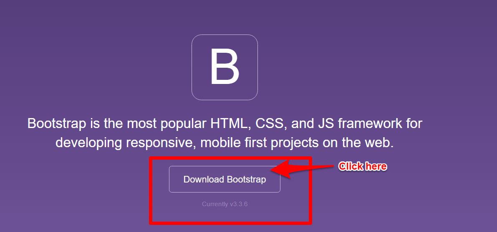

  * Grab just the CSS CDN content (we don't want javascript since we won't have jQuery just yet)

    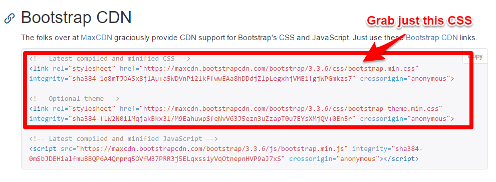

  * Head to the CSS section

    

  * Scroll down to buttons and point out the basic options for creating buttons.

    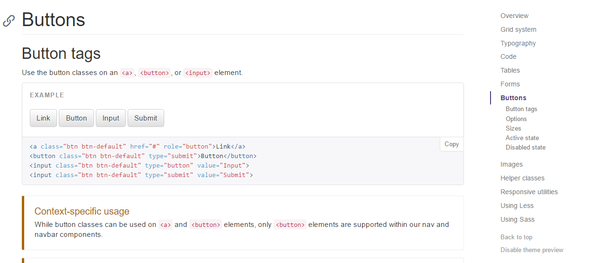

  * Scroll a bit further to the options section and point out the differences between primary, success, danger, etc. buttons

    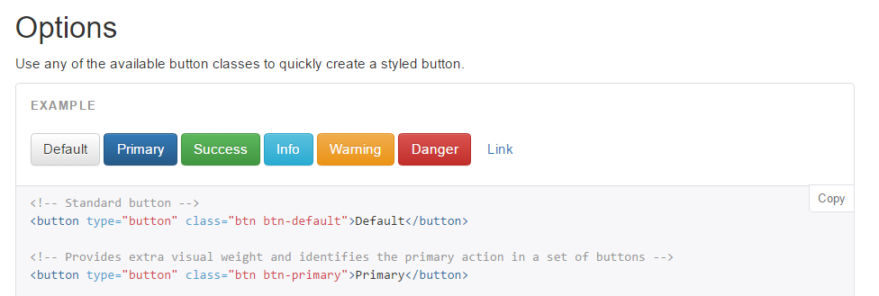

  * Scroll a bit further to show the options for sizing

    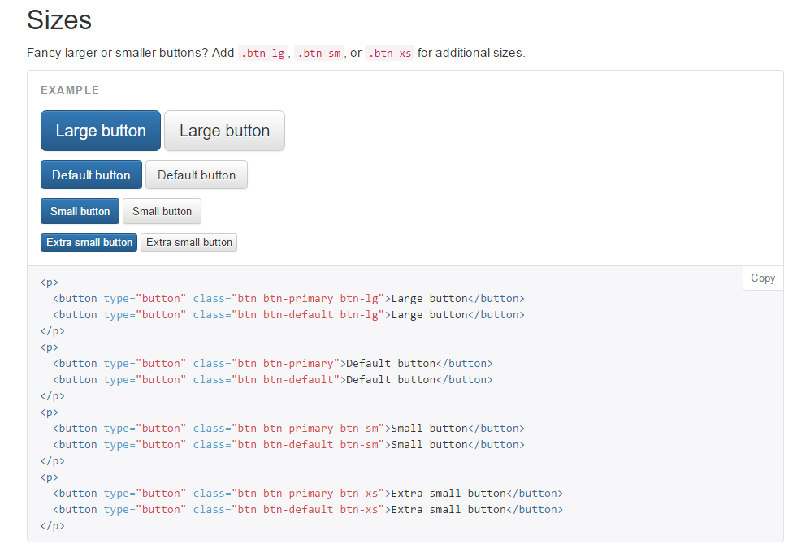

  * Use the button class names as a model for creating a fancier button.

    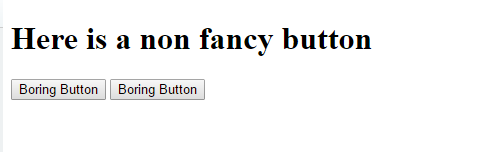

  * Then run the html in the browser and showcase the fancier buttons.

    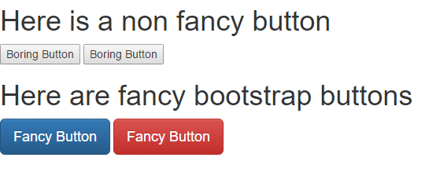

### 24. Partners Do: Bootstrap Components (15 min)

* Now you get to work with partners and choose a few components! And of course share your work with the class.
* Tell them that this is Activity 5, and optionally link them to the README on gitlab via slack (for their convenience)
* Push or display GitHub for the following page

[11-BootstrapDemo/README.md](../../../../01-Class-Content/02-css-bootstrap/01-Activities/11-BootstrapDemo/README.md)

### 25. Instructor Do: Review Bootstrap Component Activity (5 min)

* Ask if there are any specific questions.

* If not, re-do the process you used to incorporate a Bootstrap component. You may want to choose a different Bootstrap component this time.

* For instance, if you followed the guide above for adding a Bootstrap button, you may want to copy the code for a Navbar (> Components > Scroll to Navbar).

  * To do so, just copy and paste the entire code from the Navbar section into the HTML page.

  * Let students know it's okay if it's hard to make sense of it. The key point is to start breaking it apart and filling it up with your own content.

    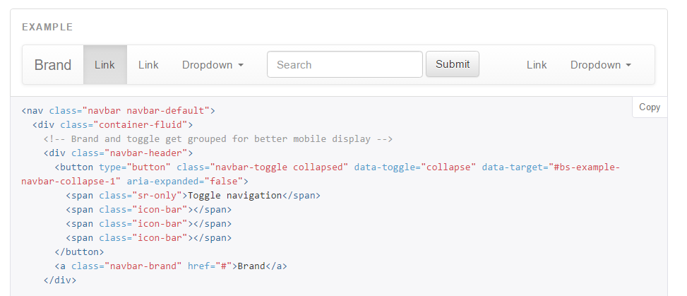.

* Also let students know that the key takeaway is that we grabbed the Bootstrap CDN, copied the code from their website, and immediately got working components.

### 26. Instructor Do: Takeaways (3 min)

* Go over the Takeaways slide.

### 27. TA Do: Homework 2: Demo (5 min)

* TA should come to the front of the class and explain what Homework #2 will look like. Essentially it is a recreation of the earlier portfolio, but this time using media queries (a concept covered next class) and Twitter Bootstrap to build the layout instead. Let them know that they should find this version of the previous assignment much easier to accomplish.

[02-Homework/Solutions](../../../../01-Class-Content/02-css-bootstrap/02-Homework/Solutions)

### 28. Instructor Do: Questions (12 mins, or remaining time)

* Any remaining time should be left for open question and answer session.

### Lesson Plan Feedback

How did today's class go?

[Went Well](http://www.surveygizmo.com/s3/4325914/FS-Curriculum-Feedback?format=ft&sentiment=positive&lesson=01.04)

[Went Poorly](http://www.surveygizmo.com/s3/4325914/FS-Curriculum-Feedback?format=ft&sentiment=negative&lesson=01.04)
