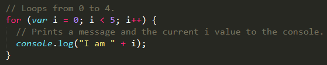
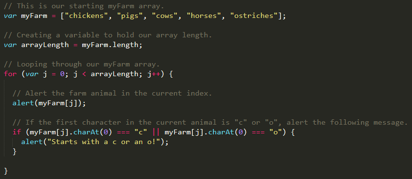
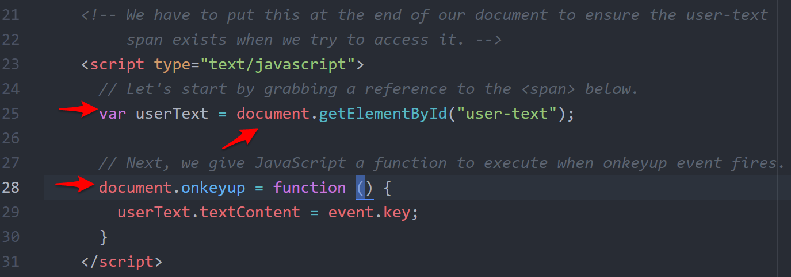
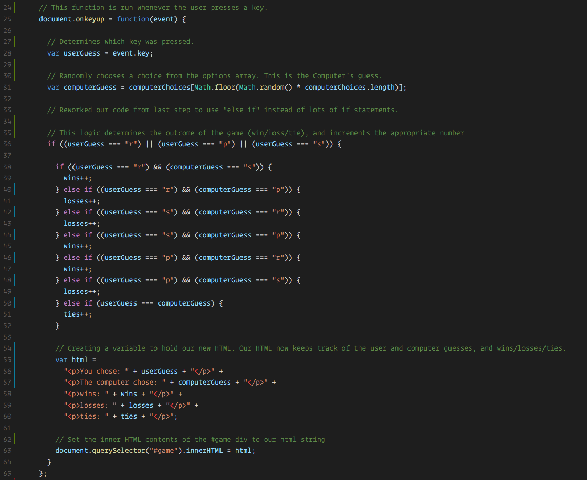
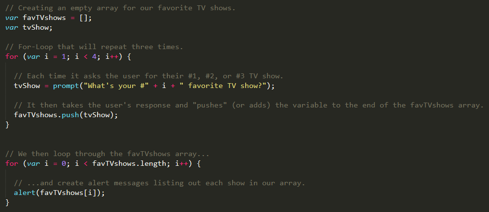
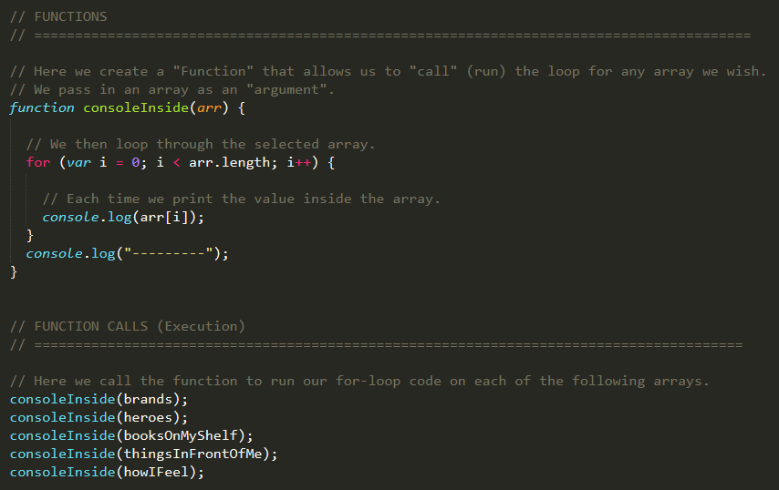
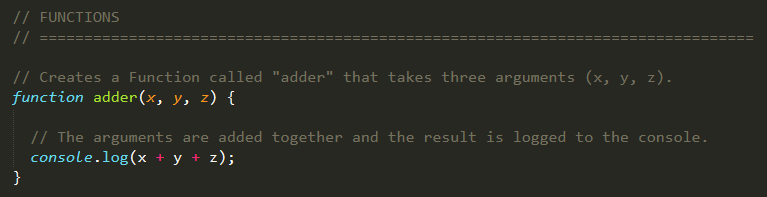
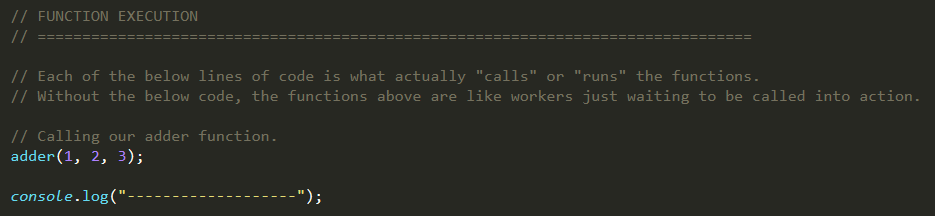

## 2.2 Lesson Plan - Jumping for JavaScript (10:00 AM) <!--links--> &nbsp; [⬅️](../01-Day/01-Day-LessonPlan.md) &nbsp; [➡️](../03-Day/03-Day-LessonPlan.md)

### Overview

Today's class is focused on re-introducing students to the concept of `for` loops and of how they can be used in combination with arrays, if/else statements, and other common programming tools to create a Rock-Paper-Scissors game. We will be introducing students to the concept of JavaScript Functions.

`Summary: Complete Activities 19-27 in Unit 03`

##### Instructor Priorities

* Students should complete the `23-RPS-Coded` activity.
* Students should understand what a function is and why it is useful (to DRY up code).
* Students should complete the HTML/CSS/Git Checkpoint.

##### Instructor Notes

* In today's class, you will be recapping the concept of `for` loops, the concept of combining arrays, conditionals, and user inputs to create more sophisticated JavaScript applications. Much of what students have learned to date will culminate in the last activity of the day where they will work together to build a rock-paper-scissors game.

* Today's lesson plan is packed to the brim with activities. Realistically assess your usual pace; if you are an instructor who tends to fall behind, skip activities which say "TIME PERMITTING" on the slides. If you tend to speak and present at a fast pace, take the time to complete as many of these exercises as you like. Alternatively, you can always just show students the solutions to these activities in live demos, and then Slack them the answers. Just BE SURE to leave around 1 hour of class time for students to work on the rock-paper-scissors activity. This activity is extremely important, and it's a close match to their homework assignment.

* Students should be given a substantial amount of time to complete the rock-paper-scissors activity. They will not have been given everything they need to complete the activity. The idea is for students to become more comfortable with the idea of working without knowing _everything_. Reveal bits of the solution using the code in the `23-RPS-Coded` directory while students are working. Throughout class, show these bits of the solution on the projector, and try to help guide students through the problem.

* Have your TAs reference [02-Day-TimeTracker](02-Day-TimeTracker.xlsx) to help keep track of time during class. Your instructor NEEDS to leave enough time for students to complete the rock-paper-scissors game.

* **Note**: Even if you don't cover an activity in class, still include it in the list of activities you share into your local repo. Students will be able to look back at these activities on their own time.

### Sample Class Video (Highly Recommended)
* To view an example class lecture visit (Note video may not reflect latest lesson plan): [Class Video](https://codingbootcamp.hosted.panopto.com/Panopto/Pages/Viewer.aspx?id=0441f776-86a3-4379-8733-84c357e64172)

- - -

### Class Objectives

* To use `for` loops, arrays, and conditional logic to create a rock-paper-scissors game.
* To complete the HTML/CSS/Git Checkpoint

- - -

### 1. Instructor Do: Welcome Students (1 mins)

* Welcome students. Then open the PowerPoint [JumpingForJS](SlideShow).

### 2. Instructor Do: Today's Class (1 mins)

* Introduce students to the overall objectives of today's class.

### 3. Everyone Do: Basics Recap (10 mins)

* Spend a few moments helping students to remember what was covered during the last class. Try to move swiftly through these slides. Ideally, this should take you less than 10 minutes.

* Always call on individual students as you go through the slides.

* **Important: Once you reach the "PAUSE" slide, close out PowerPoint and go through the next few activities and demonstrations without it.**

  * We'll re-open and continue going through slides after lunch.

### 4. Students Do: Another Loop (5 mins)

* Slack out the following instructions.

  * **Instructions**

    * Starting from scratch, create a `for` loop that console logs the following lines:
      ```
      I am 0
      I am 1
      I am 2
      I am 3
      I am 4
      ```
    * Don't use an array!

### 5. Instructor Do: Review Activity (5 mins)

* Review [another-loop-solved.html](../../../../01-Class-Content/03-javascript/01-Activities/19-AnotherLoop/Solved/another-loop-solved.html) in `19-AnotherLoop/Solution`.

  * Point out that in this case, the iterator is not an array length but an integer.

  * Point out that the length is **one less than** the final number desired.

      

* Then Slack out `another-loop-solved.html`

### 6. Partners Do: Loop with Conditions (Optional) (10 mins)

* **Instructions**

  * Starting from scratch, write code that loops through the following array and that logs the name of each animal on the farm to the console:

    ```
    var myFarm = ["chickens", "pigs", "cows", "horses", "ostriches"];
    ```

  * Then check if the first letter in the animal's name begins with a "c" or "o." If it does, create an alert saying, "Starts with 'c' or 'o'!"

  * **Hint**: You can access the first character of a string as if it were the first element of an array.

### 7. Instructor Do: Review Activity (5 mins)

* Review [hard-loop.html](../../../../01-Class-Content/03-javascript/01-Activities/20-HardLoop/Solved/hard-loop.html) in `20-HardLoop/Solution`.

    

### 8. Everyone Do: Browser Events (10 mins) (Critical)

* Explain that the next activity requires students to be familiar with the notion of browser events.

* Explain that when a user interacts with a web page, the page "keeps track" of many of the user's actions.

  * For example, explain that the browser keeps track of what users click on and of where they click.

  * As another example, explain that the browser also keeps track of which keys a user presses.

* Open [events-examples.html](../../../../01-Class-Content/03-javascript/01-Activities/21-Events/events-examples.html) in `21-Events`.

* Briefly demonstrate the code in Chrome.

* Then open the code in your text editor, and explain the following points:

  * We can "hook onto" the event of a user pressing and releasing a key by referring to `document.onkeyup`.

  * Setting `document.onkeyup` equal to a function tells JavaScript to execute that function _whenever the event occurs_.

    * Point out that the `event` is available within the function.

  * We can get the _key_ that the user pressed by writing `event.key`.

  * We can get our hands on an element on the page that has an ID by using `document.getElementById`.

    * Explain that this always returns a _single_ element.

    * Explain that this gives us access to what is called a DOM node.

      * Explain that a DOM node is a browser's way of representing an HTML element on the page.

      * Explain that unlike the code in an HTML document, this DOM node can be modified "live" by our JavaScript.

  * Finally, explain that this DOM node has a property called `textContent`, which represents the _text_ displayed _inside_ of the element.

    * We've avoided `innerHTML` in this demonstration as a best practice.

* Let students know that they don't have to remember all of this right now.

  * Instead, Slack out the file, and encourage them to refer to it during their next activity whenever necessary.


_This short snippet demonstrates most of the concepts students will need for the RPS activity._

### 9. Instructor Do: Demo RPS (2 mins)

* Take a couple of minutes to demonstrate the final application `23-RPS-Coded`.

* Be brief. Show students what they'll be building, but don't fiddle with the app for more than a minute.

* Explain that the core logic of the application is the decision as to which player wins, based on whether they've played rock, paper, or scissors.

  * Remind students that they'll need to use conditional statements and the `&&`/`||` operators to make things work.

  * Remind students that it's okay if they have to write a long chain of `if`/`else if`/`else` statements. If they find themselves doing this, they're on the right track.

* Take an extra few minutes here if necessary to make sure everyone understands the rules of Rock, Paper, Scissors (it's not uncommon for a few students to have never played as it's not universally popular around the world.)

### 10. Students Do: Pseudocode RPS (3 mins)

* Once they've played a few rounds, have them pseudocode a solution that lays out the steps involved in playing rock-paper-scissors against a computer.

* Slack out the following instructions.

  * **Instructions**

    * With a partner, spend a few moments outlining all the steps and conditions that go into a single game of rock paper scissors.

    * Try to break it down into steps that you could code out.

    * Think of basic elements like loops, if-else statements, arrays, alerts, etc.

    * Be prepared to share your outlined approach.

* **Instructor Note:** When time is up, show [pseudocode-rps.md](../../../../01-Class-Content/03-javascript/01-Activities/22-PseudoCode/Solved/pseudocode-rps.md) in `22-PseudoCode/Solution`.

* Encourage students to use this pseudocode as a starting point or as a guide with which to finish their own sketch of the application.

### 11. Partners Do: Coding out RPS (60 mins) (Critical)

* Slack out the following files and instructions to students.

  * **File**:

    * `rps-2.html` in `23-RPS-Coded/Unsolved`

  * **Instructions**:

    * In groups of 4, begin the process of coding out the rock-paper-scissors game.

    * Do as much as you can on your own, but don't be afraid to ask for help if you feel your team is struggling.

    * **Note**: Don't use `document.write` as it will delete the contents of the body, including your JavaScript. Instead, use `document.getElementById` in conjunction with the `textContent` property, as you were shown earlier.

    * **Note**: Don’t worry. We know this is a very challenging assignment. We also know that you won’t know where to start. In fact, we haven’t shown you EVERYTHING you need yet, but that’s okay. Part of being a developer is figuring things out on your own through trial and error.

### 12. Instructor Do: Review RPS (10 mins) (Critical)

* Open [rps-7.html](../../../../01-Class-Content/03-javascript/01-Activities/23-RPS-Coded/Solved/rps-7.html) in `23-RPS-Coded/Solved`, and walk students through the solution. Use the comments in the solution to help guide the conversation.

    

* Slack out the [video review](https://www.youtube.com/watch?v=Tio88WjwFO0) for this activity and emphasize how helpful videos for challenging activities like this can be.

- - -

### 13. LUNCH BREAK (30 mins)

- - -

### 14.    Partners Do: Array Building    (10 mins)

* In this activity, students just fill in the empty comments for each line of code. This is intended to passively show them how to use `for` loops to populate arrays.

* Slack out the following files and instructions:

  * **File**

    * `loop-tv-unsolved.html` in `25-LoopTV/Unsolved`

  * **Instructions**

    * Run the program sent to you via Slack.

    * Then with a partner, fill in the missing comments for each line of code.

    * Make sure both of you can fully explain what each line means.

    * Be prepared to share with the class!

### 15. Instructor Do: Review Activity (10 mins)

* Go over the solution. First, have them try to explain each line of code to you as a class.

* Open [loop-tv-solved.html](../../../../01-Class-Content/03-javascript/01-Activities/25-LoopTV/Solved/loop-tv-solved.html) in `25-LoopTV/Solved`, and walk them through the solution.

* Slack out the file when done.

    

### 16. Instructor Do: Logging - No Functions (5 mins)

* Open [superhero-logging-solved-no-functions.html](../../../../01-Class-Content/03-javascript/01-Activities/26-SuperheroLogging/superhero-logging-solved-no-functions.html) in `26-SuperheroLogging` in Chrome and in your editor.

* Walk students through the basics of how this application works. In essence, the application has a series of repeated `for` loops which print out the contents of each of the 6 arrays.

* The key point to emphasize to students is that this code is _extremely_ repetitive and is kind of bulky because of it. This code is intended to offer them perspective on why functions are useful.

* Slack out the file when done with your explanation.

### 17. Instructor Do: Logging - With Functions (10 mins)

* Open [superhero-logging-solved-with-functions.html](../../../../01-Class-Content/03-javascript/01-Activities/26-SuperheroLogging/superhero-logging-solved-with-functions.html) in `26-SuperheroLogging` in Chrome and in your editor.

* Walk students through this solution as well. Point out how this application greatly simplifies the previous activity by reducing the number of `for` loops to just one.

    

* Be sure to point out how the function is composed of two parts.

  * The function **definition**.

    * Pay special attention to the notion of **arguments**.

    * Explain how arguments bind on function calls and demonstrate that argument names are only visible inside of the function body.

  * The function **call** (or execution).

* Ask if there are any questions, and then proceed to Slack out the file so students can use it as an example for the next activity.

### 18. Partners Do: My First Functions (20 mins) (Critical)

* This next exercise requires students to build simple functions for performing mathematical and string operations.

* Slack out the following file and instructions.

  * **File**

    * `my-first-functions-unsolved.html` in `27-MyFirstFunctions/Unsolved`

  * **Instructions**

    * Working in pairs and using the starter file sent to you via Slack, fill in the missing functions and function calls.

    * Note: Try to finish all four functions if you can, but don’t be distressed if you only get one or two. The important thing is that you get at least one function fully done.

    * Hint: Look back to the previous example if you need help.

### 19. Instructor Do: Review Activity (15 mins)

* Review [my-first-functions-solved.html](../../../../01-Class-Content/03-javascript/01-Activities/27-MyFirstFunctions/Solved/my-first-functions-solved.html) in `27-MyFirstFunctions/Solved`, pointing out that each of the functions takes on a similar structure.

  * Emphasize that each function requires the **definition** and **call** (execution).

    * Explain that the _things_ we _give_ the function to work on are called **arguments**.

  * Finally, point out that functions can _hand back_ values with `return` statements.

    * Change the implementations of `adder` and `multiplier` to `return` their results rather than log them.

    * Demonstrate that we can store these `return` values in a `var`, just as we can store the `return` values of functions like `prompt` and `confirm`.


* Oftentimes you will find that students forget to call functions after defining them or that they mistakenly assume the execution has the definition logic. Encourage them to cement these two parts as they will be using functions repeatedly as developers.

    

    

### 20. Group Do: Recap Activity (40 mins)

* Use the remaining time up to the Checkpoint complete this weeks homework assignment.

### 21. Instructor Do: Introduce Checkpoint - HTML/CSS/Git (5 mins) (Critical) 

* Let your class know that they will now be taking a short multiple choice assessment to check their understanding of HTML/CSS/Git

* DO NOT SKIP THIS INTRODUCTION. DO NOT JUST SEND OUT THE LINK WITHOUT CONTEXT

* Reassure the students that they need not be nervous about the Checkpoint:

  * "This will not affect your grade or graduation requirements."

  * "This is not like the tests and quizzes you might be used to from school or college. The purpose of these tests is not to motivate you to study or punish you for struggling."

  * "This is as much a test of me as an instructor and of the course content as it is of you. We are here to ensure your success, and this is one of the tools we use to make sure we are doing that effectively. This class moves _fast_, so if some or all of you misunderstand something important we as an instructional team need to find out as fast as possible so we can help."

  * "Long story short, this quiz cannot hurt you. Only help you."

* Let students know that they should read carefully and focus on thinking about the right answer rather than using any test-taking skills they may have learned:

  * "There are no silly answers or obvious throwaway responses on this quiz because those kinds of answers reduce the likelihood that we'll be able to figure out whether we've taught something effectively."

  * "Test-taking strategies you may have learned for standardized tests _will not work_, so instead of focusing on eliminating wrong answers or looking for sneaky context cues, read the question and each of the possible choices carefully."

* Reassure students once again that the purpose of this is to help them, and remind them that the outcome does not impact their grade or graduation requirements. You should do this _every single time_ you give a Checkpoint.

* You or your TAs should now get the link specific to your class:

  * Navigate in your browser to: `https://www.switchboard.tech`

  * Select your class code (if it doesn't show up on its own)

    * If the class is a parallel class, a class that has two classes combined on a Saturday, and doing a checkpoint with two classes at once you will **need** to slack out two links.

    * One for your class and one for the other. 

  * Select the Checkpoint and copy the resulting link

### 22. Students Do: Take Checkpoint - HTML/CSS/Git (10 mins) (Critical)

* Slack out the link to the Checkpoint

* Let your students know that once they select their name, it will take them to the Checkpoint

* Checkpoints must be completed in class, **not at home**, to ensure you will be able to effectively find and help struggling students 

* TAs should walk around the class to ensure students aren't looking up answers

* Keep in mind we do not use grades from assessments toward graduation requirements. However, students will be tempted to avoid feeling like they don't understand something.

* It's important for instructional teams to create an environment where it is safe to fail, but also where such failure is visible. You should not be worried about "cheating" on checkpoints, only making sure that students who need help aren't remaining invisible.

* Your SSM will have the results of the Checkpoint within an hour of its completion

### 23. End (0 mins)

### 24. TAs Do: Structured Office Hours - Review HTML/CSS/Git (30 mins)

* Navigate in your browser to: `https://github.com/coding-boot-camp/checkpoint-bank/blob/master/checkpoints/multiple-choice/02-HTML-CSS-Git-MC/02-HTML-CSS-Git-MC.md`

* There you will find the questions and answers to the Checkpoint given.

* Please take the entire office hours time to review the questions with the students.

* Suggestion Format:

  * TAs ask a question at a time to the class.

  * Let the students try to answer it.

    * If you see that a majority of the class has a misunderstanding with a question:

      * Take your time on this question!

    * If you see that a small number of students has a misunderstanding with a question:

      * Do your best to reinforce the misunderstanding but be cautious of your time.

      * Make note of the students that are still struggling with the question and schedule a 1:1 with the students.

  * If applicable, demo the answer.

* Take your time on these questions!

* This is a great time to reinforce concepts and misunderstandings!

### Lesson Plan Feedback

How did today's class go?

[Went Well](http://www.surveygizmo.com/s3/4325914/FS-Curriculum-Feedback?format=ft&sentiment=positive&lesson=02.02)

[Went Poorly](http://www.surveygizmo.com/s3/4325914/FS-Curriculum-Feedback?format=ft&sentiment=negative&lesson=02.02)
