## 04-Day Lesson Plan - jQuery Begins <!--links--> &nbsp; [⬅️](../03-Day/03-Day-LessonPlan.md) &nbsp; [➡️](../05-Day/05-Day-LessonPlan.md)

### Overview

In this class, we will be introducing students to the concept of DOM Manipulation using both JavaScript and jQuery.

`Summary: Complete activities 01-12 in Unit 04`

##### Instructor Priorities

* Students should understand how to incorporate the jQuery library into their applications
* Students should complete the `06-SandwichClick` activity.
* Students should complete the `07-TriggerRandom` activity.
* Students should complete the `08-LotteryGenerator` activity.
* Students should understand how the `10-CaptainPlanetGame` works and be able to add new on-click events to it.
* Students should complete the `11-FridgeGame` Activity.

##### Instructor Notes

* Today's class is focused on JavaScript and jQuery DOM manipulations. As you discuss each of the activities, also try to offer your students some perspective on code organization strategies. While the activities may be too complex to live-code, consider at least outlining how you would approach them if you had to "start from scratch". Often, students are most confused by how to start activities when it comes to the separation of variables, events, and functions.

* In today's class, expect students to have many issues with jQuery syntax. Be encouraging and let them know that the syntax will seem more intuitive over time. For now, they should just try to utilize the syntax as is.

* Starting with today's class, slides will play a less prominent role. Warn students of this and let them know that their time spent coding is where real learning will happen.

* Today's class is also focused on providing students with additional exposure to jQuery for DOM manipulation. As an instructor, ensure students understand the [10-CaptainPlanetGame](../../../../01-Class-Content/04-jquery/01-Activities/10-CaptainPlanetGame) and the [11-FridgeGame](../../../../01-Class-Content/04-jquery/01-Activities/11-FridgeGame).

* Also, as a heads-up, next week there will be an entire class allotted for reviewing JavaScript. So if you're students seem winded -- give them a heads-up as well.

* Have your TAs reference [04-Day-TimeTracker](04-Day-TimeTracker.xlsx) to help keep track of time during class.

### Sample Class Video (Highly Recommended)
* To view an example class lecture visit (Note video may not reflect latest lesson plan): [Class Video](https://codingbootcamp.hosted.panopto.com/Panopto/Pages/Viewer.aspx?id=a48b6376-8fd3-4475-a020-b67dfcf6fed2)

- - -

### Class Objectives

* To gain a cursory understanding of the jQuery library.
* To understand the steps needed to utilize the jQuery library to manipulate the DOM.
* To use jQuery DOM manipulation to create simple games.

- - -

### 1.  Instructor Do: Welcome Students (1 min)

* Welcome students to class then open the PowerPoint [jQuery Begins](SlideShow/jQueryBegins.pptx).

### 2.  Instructor Do: Admin Items (5 mins)

* Spend a few moments going through the administrative slides. Specifically, let students know that going forward there will be less utilization of slides. Remind them that the best way to learn to code is to actually code.

### 3.  Instructor Do: Today's Class (1 min)

* Go through the day's objectives.

### 4.  Instructor Do: DOM Manipulation (5 mins)

* Spend a few moments explaining the concept of DOM manipulation. If you are hazy about the concept of the DOM, you may want to read this article <https://css-tricks.com/dom/>.

* Effectively the DOM is the version of HTML / CSS interpreted by the browser.

* With regards to the slide, we can use JavaScript and jQuery to modify the DOM to dynamically change the HTML that gets displayed.

* Visit the to-do list site on the slide [http://todomvc.com/examples/jquery/#/all
  ](http://todomvc.com/examples/jquery/#/all) to provide a simple example that the addition of to-dos is effectively adding HTML in real-time.

* You can even go into the Chrome Developer tools to show this more clearly.

### 5.  Instructor Demo: DOM Manipulation with Plain JS (10 mins)

* Proceed with the first demonstration of class: [01-DOM_Manipulation](../../../../01-Class-Content/04-jquery/01-Activities/01-DOM_Manipulation). In this first demo, you will show students how to modify the DOM using vanilla JavaScript. In later portions of the class, you will re-do this activity using jQuery.

* This example is broken down into parts. Reveal each file one by one.

  * `1.html` is intended to simply show the empty div `empty-div` that we've created. This div will be used to hold our dynamic content.

  * `2.html` is intended to show that we can "select" this div using `document.getElementById`. We can then populate the div using the `innerHTML` property. At this point, opening the file in the browser will showcase the text being displayed.

      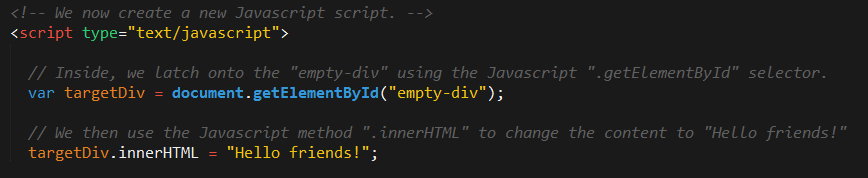
      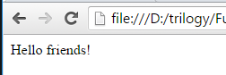

  * `3.html` is intended to show that adding another line of `innerHTML` will replace the earlier text.

      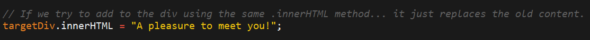
      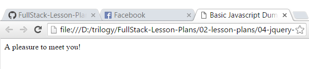

  * `4.html` shows that this replacement can be corrected if we create a new div dynamically and use the `appendChild` method to display it as well.

      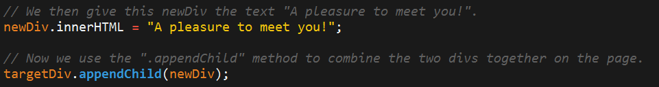

  * `5.html` shows that we can use the `setAttribute` method to change the CSS style

      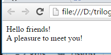
      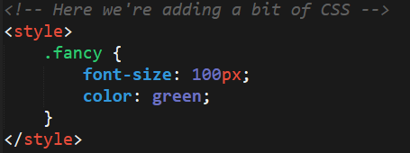
      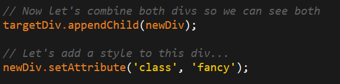
      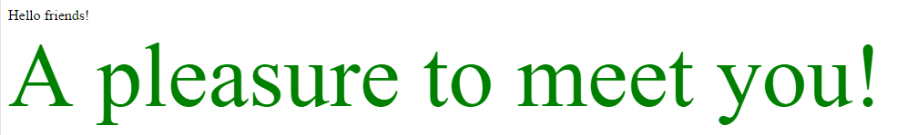

* Go over any questions from the previous example, then slack out the file `5.html`.

### 6.Students Do: Generating HTML with Plain JS (10 mins)

* Slack out the following file and instructions:

* **File:**

  * `drinklist-unsolved.html` in `02-JSDrinkList/Unsolved`

* **Instructions:**

  * Using the file sent to you as a starting point, add the missing code such that your JavaScript generates HTML content that displays all of the drink options.

  * HINT:  You will need a for-loop. Inside your for-loop you will need to use each of the following methods: `createElement`, `.innerHTML`, and `.appendChild`.

  * BONUS: Instead of using a `for` loop, try searching about the use of the jQuery `.each` method.

### 7.  Instructor Do: Review Activity (5 mins)

* Review the activity. In discussing the solution, point out how:

  * We utilized the `getElementByID` method to grab the div we'll be placing content into. We then store this element into a variable.

  * We then use a for-loop to loop through the drink list.

  * Inside the for-loop we continually create divs and change the `innerHTML` of each div to match the contents of each drink in the array.

  * Finally, we used the `appendChild` method to add the new divs we created to the original one.

    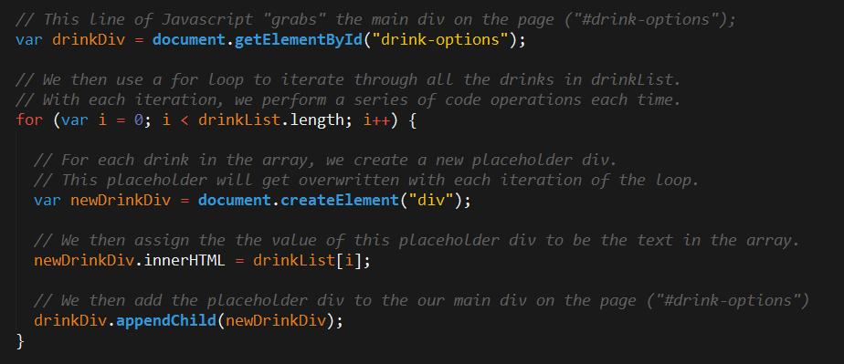
    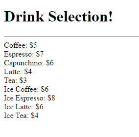

* Slack out the solution and the [video review](https://www.youtube.com/watch?v=9_9-NeU2L_U) when complete

### 8. Instructor Do: Introduce jQuery (10 mins)

* Spend a few moments to introduce the concept of jQuery.

* In your discussion, explain that:

  * JavaScript alone is not ideal for performing these kinds of HTML modifications. Instead, jQuery provides a simplified syntax for doing the same tasks.

  * Explain the concept of a "library" (i.e. a pre-built set of JavaScript methods that allow you to more easily perform functions.) Try to have students see how this concept of a library is similar to the concept of a CSS Framework like Bootstrap.

  * Go through the slides on use cases.

### 9.  Instructor Do: DOM Manipulation with jQuery (10 mins)

* Now return to the example completed before. But this time, use [03-jQueryGenerators](../../../../01-Class-Content/04-jquery/01-Activities/03-jQueryGenerators).

* As with the last case, this one is divided into separate files to make it easier to explain in pieces.

  * `1.html` shows how we add in the jQuery library script at the top and that we use the $ selector to grab the div of interest. It also shows that we can change the HTML and append in just two lines. Be sure to point out how much simpler this is then the plain javascript version.

    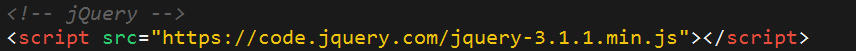

  * `2.html` points out that we could also create separate divs on the fly.

  * `3.html` points out that we can change the HTML class as well.

    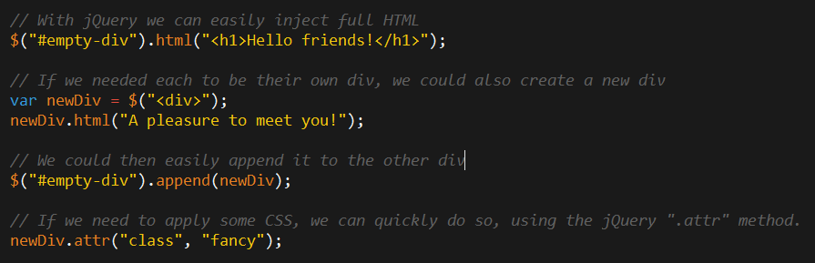
    

* Slack out the file `3.html` when complete.

### 10. Students Do: Generating HTML with jQuery (10 mins)

* Proceed with the drinkList exercise. This time students will re-complete it using jQuery.

* Slack out the following file and instructions.

* **File:**

  * `jquery-drink-list-unsolved.html` in `04-jQueryDrinkList/Unsolved`

* **Instructions:**

  * Re-factor (re-write) your previous drinkList code from earlier, but this time use jQuery to complete all of the same tasks.

  * Your final code should NOT have any of the following methods: `createElement`, `innerHTML`, or `appendChild`.

  * HINT: Don’t forget to “incorporate” jQuery before you begin.

### 11. Instructor Do: Review Activity (5 mins)

* Review the previous exercise. In your review point out each of the following

  * We used jQuery to grab the `drink-options` div.

  * We then created a new div and added content about the drinks (in a single line)

  * We then looped through and used the `append` to add the content to the page.

      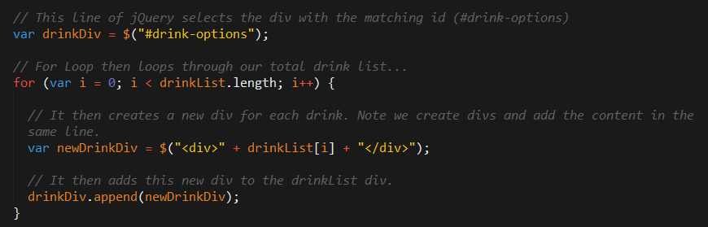

### 12. Instructor Do: On Click Basic (5 mins)

* Open the file `onclick.html` in `05-OnClickBasic`. Then walk students through the syntax for `on-click` events. Specifically, point out how:

  * The code has a jQuery selector to select the HTML element (button, header, anything)

  * It then has a `.on('click', function(){})` syntax for capturing the event.

  * Inside that event's function is the code that results from the click.

      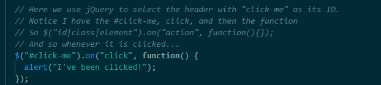

* Students will likely be confused by the syntax. Let them know to use it for now -- and that it will make more sense over time as we learn other concepts.

### 13. Partners Do: Sandwich Clicking (20 mins)

* Slack out the following file and instructions. If you are attempting the bonus, find some fun images online.

* **File:**

  * `sandwich-click-unsolved.html` in `06-SandwichClick/Unsolved`

* **Instructions:**

  * Add in the missing code such that clicking any of the sandwiches causes…

    1. An alert message to pop-up saying something snarky about the sandwich type.

    2. A second alert message that displays to the user the number of that specific sandwich they’ve eaten.

    3. HINT: You will need counter variables.

  * BONUS: Add an image to the `image-div` on the click event.

### 14. Instructor Do: Review Activity (5 mins)

* Review the activity. Be sure to talk about:

* The use of counter variables at the top.
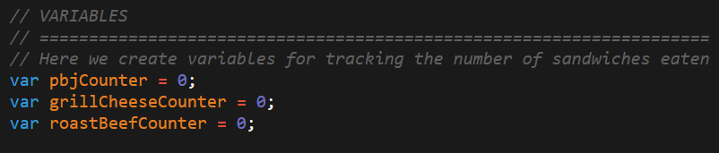

* The on-click events tied to each of the sandwich headers. The on-click events trigger the counter to go up and creates the alerts.
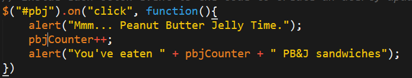
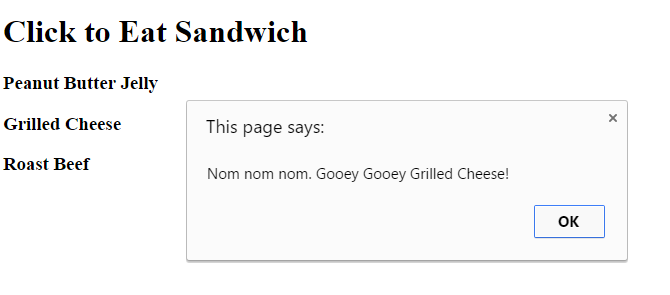

* In discussing the bonus, point out how images can be added. Note that we are injecting HTML with the src pointing to the jpg.
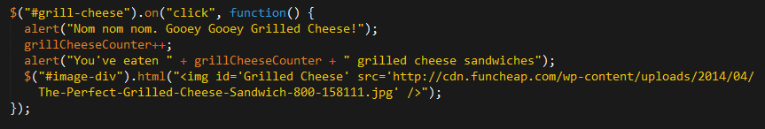

* Slack out the solution and the [video review](https://www.youtube.com/watch?v=6BLReDBUZRk) when done.

- - -

### 15. LUNCH BREAK (30 mins)

- - -

### 16. Partners Do: Trigger Random (12 mins)

* Slack out the following file and instructions.

* **File:**

  * `trigger-random-unsolved.html` in `07-TriggerRandom/Unsolved`

* **Instructions:**

  * Add in the missing code such that clicking the big blue button triggers a random number (between 1 and 1000) to be selected and prominently displayed in the random-number div.

    * Hint: None. You got this.

### 17. Instructor Do: Review Activity (5 mins)

* Review the activity. Be sure to point out that:

  * We latched onto the `random-button` using its ID. Let them know where to focus their attention: Not the classes, and not the spans. The ID is what mattered in this case.

    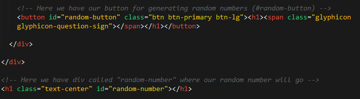

  * We then created a click event tied to this `random-button`. This event triggers a random number between 1 and 1000 to be generated and printed to the HTML.

    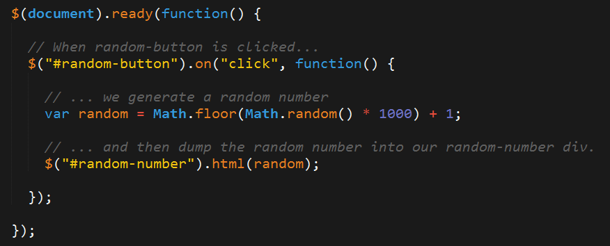

* Slack out the solution when done.

### 18. Partners Do: Lottery Generator (15 mins)

* Open the file `lottery-generator-solved.html` in the browser. Show students how the final result of their work will look.

* Then slack out the following file and instructions.

* **File:**

  * `trigger-random-unsolved.html` in `07-TriggerRandom`

* **Instructions:**

  * Using the code from the previous random number generator as a starting point, create a lottery generator.

    * In our case, the lottery number should pick 9 random numbers (and always 9 numbers). As an example: 886563264.

    * Display this number in the random-number div.

    * Then when a user clicks again, have the code create a new row with the latest number at the top.

### 19. Instructor Do: Review Activity (5 mins)

* Review the activity. Be sure to discuss that:

  * We needed to create a for loop that created 9 different numbers. Without this for loop, we couldn't guarantee that we'd have 9 numbers. Also, point out that we are using `prepend` as opposed to `append` so that the newest number shows up at the top.
    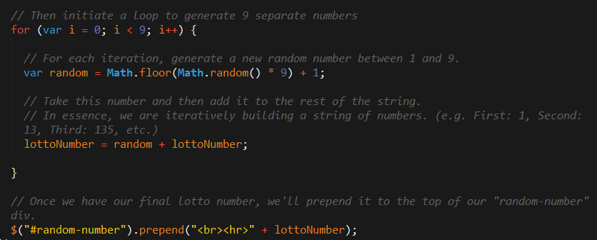

  * The end result of the lottery looks like the below.
    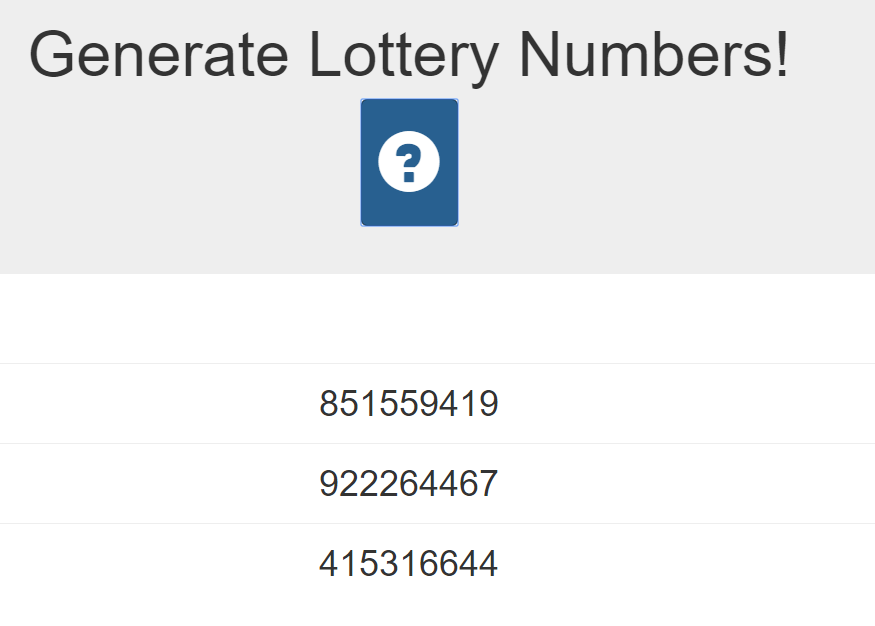

* Slack out the solution and [video review](https://www.youtube.com/watch?v=Nh4wxhzePIs) when done.

### 20. NumberChecker (15 mins)

* If any additional time remains, slack out the following activity. This activity is useful for students in completing the homework, but it is not necessary for them to complete it in class.

* **File:**

  * `Unsolved/number-checker.html` in `09-NumberChecker`

* **Instructions:**

* Using the file slacked out as an example, create code in which:

  * A computer picks a random number between 1 and 4

  * Users then “click” the buttons numbered 1 – 4.

  * If the user’s number matches the computer’s number, display text informing them that they won in the Result card. Otherwise, display text informing them that they lost.

  * If you finish early, try to improve the aesthetics.

### 21.  Instructor Do: Captain Planet Game  (5 mins)

* Open the file [captain-planet-game.html](../../../../01-Class-Content/04-jquery/01-Activities/10-CaptainPlanetGame/Solved/captain-planet-game.html) in `10-CaptainPlanetGame/Solved` in the Browser. Click on various buttons and show students how Captain Planet is being modified in response to the clicks.

* **Important:** Be sure to play the theme song while doing so. Very, **very** important.

  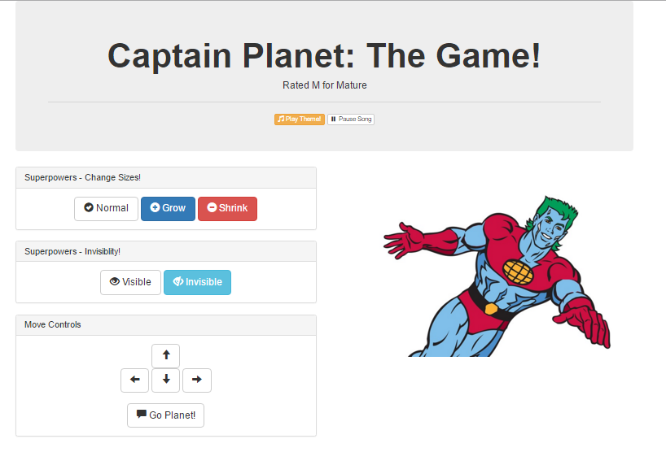

### 22.  Students Do: Pseudocode Captain Planet  (5 mins)

* Proceed with the first activity, in which you ask students to pseudocode the game's logic and structure.

### 23.  Instructor Do: Review Pseudocode (5 mins)

* Allow students to share their pseudocode breakdowns.

* Then show your own pseudocode outline (shown on slide).

### 24.  Students Do: Create a Superpower Captain Planet (12 mins)

* Slack out the code for the game.

* Then task students with dissecting it, and adding additional code to create a new power for Captain Planet. At base, this requires them to create a new button, create a new on-click event, and then create code that changes the CSS for Captain Planet in response to button clicks.

* **Folder:**

  * `10-CaptainPlanetGame` in `10-CaptainPlanetGame/Unsolved`

* **Instructions:**

  * Look at the jQuery API Docs [(https://api.jquery.com/)](https://api.jquery.com/) and add a button of your own that gives Captain Planet a new power.

  * Examples:

    * Click to… Stretch Captain Planet!
    * Click to… Trigger a maniacal laugh!
    * Click to… Create clones of Captain Planet!
    * Click to… Create fire or water (hint: images)!

  * Slack out a screenshot of the working example.

* **Instructor:**
  * Feel free to give students additional time here if necessary. Make sure the majority of your students have at least a basic example that works.

### 25.  Instructor Do: Review Captain Planet    (5 mins)

* Have a student with a working solution share their code with you. Then ask them to present at the front of the class.

* If no one has a working example, quickly create code of your own that "stretches" Captain Planet. You can use the version found in [10-CaptainPlanetGame/Solved/captain-planet-game.html](../../../../01-Class-Content/04-jquery/01-Activities/10-CaptainPlanetGame/Solved/captain-planet-game.html) as an example.

### 26.  Instructor Do: jQuery Recap   (5 mins)

* Next, spend a few moments going through the jQuery recap slides. The most important thing to explain in discussing these slides is the fact that jQuery is "capturing" HTML elements using the `$()`, and that we are then applying various methods to that element (or a different one in response).

* Finally, point out that students shouldn't expect to memorize all of the jQuery library. Point out that coding is all about understanding a general concept, and then "looking up" the exact code when needed.

* Field any questions that remain before proceeding to the next activity.

### 27. Students Do: Fridge Game  (30 mins)

* Open the solution file [11-FridgeGame](../../../../01-Class-Content/04-jquery/01-Activities/11-FridgeGame/Solved/fridge.html) in `11-FridgeGame/Solved`, and show students how the application works. In short, the application allows users to click on letters from a menu and have those letters appear on the fridge.

* Then, slack out the below folder and instructions.

* **Folder:**

  * `Unsolved` in `11-FridgeGame/Unsolved`

* **Instructions:**

  * Working in groups of 3, complete the code for the fridge activity such that:

    1. JavaScript dynamically generates buttons for each of the letters on the screen.

    2. Clicking any of the buttons leads the SAME letter to be displayed on the screen.

    3. Hitting the clear button erases all of the letters from the fridge.

  * Note: This is a challenging exercise. You may want one person to type, while the other two watch over to catch bugs and/or research necessary snippets.

### 28. Instructor Do: Review Fridge Game   (10 mins)

* Spend the time necessary to ensure that the majority of students have a conceptual understanding of how the Fridge Game's code works. In explaining the solution, point out the following:

  * The creation of an array that holds all of the letters;

  * The for loop used to take letters from the array, associate each with a data-attribute and text, and then append them onto the page. Students will be confused about the concepts of `.addClass`, `.attr`, and `.text`. Spend the time necessary to explain each.

    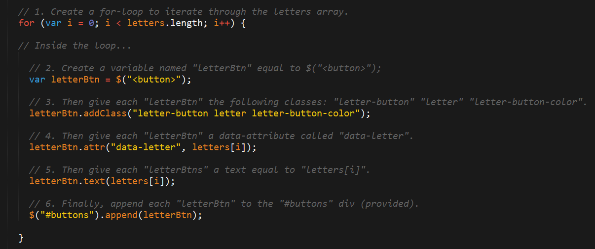

  * The on-click event needed to capture button clicks. Be sure to point out how we use the data-attribute (via the `.data` method) to know which letter was clicked. This is a **KEY POINT**.

    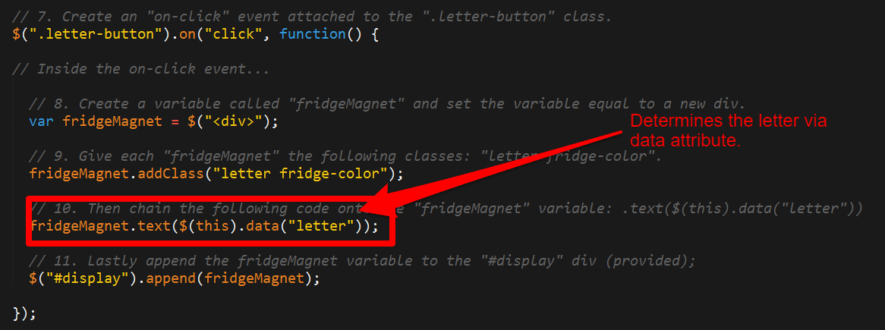

* Slack out the solution and the [video review](https://www.youtube.com/watch?v=gC529k3KzmE) for the activity.

### 29. Instructor Do: Crystal Example (9 mins)

* Next, open the files found in the folder [12-CrystalExample](../../../../01-Class-Content/04-jquery/01-Activities/12-CrystalExample). These files closely match the students' homework assignment.

* They are included in the day's lesson primarily so students can refer back to them while working on their homework assignment. Use your discretion as to how much extra help your students need to complete their homework. If students need a lot of extra help and you have some extra time available, go through the examples one by one as a class. Otherwise just demo the final example and highlight the key pieces of code, suggesting students go through the rest on their own.

### 30. TAs Do: Intro HW    (2 mins)

* Have TAs introduce the next homework assignment. This may just involve showing the homework videos and talking over them.

### Lesson Plan Feedback

How did today's class go?

[Went Well](http://www.surveygizmo.com/s3/4325914/FS-Curriculum-Feedback?format=ft&sentiment=positive&lesson=02.04)

[Went Poorly](http://www.surveygizmo.com/s3/4325914/FS-Curriculum-Feedback?format=ft&sentiment=negative&lesson=02.04)
