## 05-Day Lesson Plan - jQuery Calculator <!--links--> &nbsp; [⬅️](../04-Day/04-Day-LessonPlan.md) &nbsp; [➡️](../../03-Week/01-Day/01-Day-LessonPlan.md)

### Overview

Today we will also introduce them to the concept of lexical scope.
We will also be furthering students' understanding of jQuery by building a basic calculator. Students who are struggling with basic concepts should be assisted using a 1:1 format outside of class.

`Summary: Complete activities 13-21 in Unit 4`

##### Instructor Priorities

* Students should be given a cursory overview of the concept of lexical scope
* Students should be guided through the creation of the jQuery calculator (`20-jQueryCalculator`) OR be given time to work 1:1 with TAs.

##### Instructor Notes

* The main focus for today is to provide students an opportunity to create a semi-complex jQuery application in class. Students will work in teams of four using a paired-programming approach—i.e. one person types, the other two "bug check". This will force students to actively "bug-check" as their partners type out code. Every so often, you will ask teams to rotate the typist.

* Because today is all about creating a large-scale application in class, use this opportunity to help small groups improve their JavaScript. Often in large classes, it's hard to offer students the individual support they need to become fearless developers. Use this class day to help get them there.

* Because the calculator build is more of a "challenge" activity, consider using the time to also help struggling students "catch-up" in class. As has been tested in other sites, a good way to accomplish this is to ask students at the start of the activity to message TAs if they are in need of 1:1 crash courses. These crash courses are each 20-minute sessions, in which 1 or 2 TAs work closely with the student _outside_ of the classroom on basic code tasks. It is up to the TAs + Instructors to create an outline of topics. These sessions might cover:

  * Basic Variable assignment
  * Creation of an Array
  * Creation of a For Loop
  * Creation of a For Loop that loops through an array
  * Creation of a Function that prints a statement
  * Creation of an Object
  * Creation of an Object with a function associated
  * jQuery on-click events associated with buttons
  * Overall skeleton of an application (i.e. Variables, Functions, Function Calls)

* Use the file in [21-CrashCourse](../../../../01-Class-Content/04-jquery/01-Activities/21-CrashCourse) as a starting point for 1:1s. Then use the conversation with students to move the conversation forward. Be sure to keep the 1:1 under 25 minutes, so more students can benefit.

* Additionally, the start of today's class also includes a series of exercises on scope and the concept of "this". Instructors should use their discretion as to how much time is spent on these exercises. However, **be sure to leave at least 90 minutes** for the calculator activity.

* Finally, as a heads-up, next week's a class is wholly devoted to JavaScript review of old activities. Just giving you a heads-up!

* Have your TAs reference [05-Day-TimeTracker](05-Day-TimeTracker.xlsx) to help keep track of time during class.

### Sample Class Video (Highly Recommended)
* To view an example class lecture visit (Note video may not reflect latest lesson plan): [Class Video](https://codingbootcamp.hosted.panopto.com/Panopto/Pages/Viewer.aspx?id=055d5911-bf48-4fe6-9ddb-30616250f002)

- - -

### Class Objectives

* To gain an initial understanding of lexical scope in JavaScript.
* To build a semi-complex jQuery calculator application in teams.

- - -

### 1. Instructor Do: Welcome Students (1 min)

* Take a moment to welcome students, and open the PowerPoint: [`jQueryJubilee`](SlideShow/jQueryJubilee.pptx).

### 2.  Instructor Do: Motivation + Pulse Check (15 mins)

* Take the first few moments to offer students a few encouraging words. Word Guess was hard. HTML/CSS was hard. jQuery seems hard. Let them know that they've just completed the most challenging aspect of the course (Weeks 1 truly was).

* Let them know that the first weeks are challenging because everything is so new. Also, let them know that they've reached a point where they've learned far more than they may be giving themselves credit for.

* Then, take an extended moment of time, to do a pulse-check of your class. Consider creating an anonymous Poll using Poll Everywhere (<https://www.polleverywhere.com/>), in advance of the class. You can ask them how they're feeling, what concepts have been the most challenging, or something more fun. The point is to give students an opportunity to chime in. Through Poll Everywhere you can also create polls where students post anonymous feedback -- viewable live. This can be a ballsy move, but if you are open to hearing and responding to feedback live, it can be a powerful tool for showing students that you are listening.

* Then, take a few moments to either respond to the pulse-check -- or simply giving your students a pep talk. It may be a good time to offer students perspective on how quickly they are progressing or the fact that as first-time developers -- they don't need to know "everything". Be creative here. But don't skip this pep talk. Many of your students are likely still feeling pretty defeated because of JavaScript.

* **Important Note:** This would also be a good time to let students know that an entire class day next week will be devoted to reviewing old JavaScript activities thoroughly.

* Let students know that the first half of the class will be a series of activities that build on their working knowledge of JavaScript scope. The second half (the more important one) will be focused on building a calculator using jQuery.

### 3. Instructor Do: Intro Lexical Scope (10 mins)

* Proceed to the Lexical Scope slides. Warn students that this section is pretty heavy on theory.

* Proceed with basic definitions of scope, using analogies to boxes or other simple concepts when possible. Mention the concept of nested functions -- before moving to the first code dissection. (Students will be dissecting the code example shown in the slides).

### 4. Students Do: Lexical Scope  1 (05 mins)

* Slack out the following files and instructions:

* **Files:**

  * `13-ScopeOne/Unsolved/lexical-scope-1-unsolved.html`

* **Instructions:**

* Take a few moments dissecting what I just said.

* Look at the file sent to you, and explain to the person next to you what is meant by:

  * The terms parent function and child function

  * The concept that child functions can access parent variables, but not vice versa.

* Be prepared to share!

### 5. Instructor Do: Review Lexical Scope 1 (5 mins)

* First, ask students to try and explain the solution.

* Then, review the solution provided in [13-ScopeOne](../../../../01-Class-Content/04-jquery/01-Activities/13-ScopeOne/Solved).

* The key concept to explain is that the variable `z` is not accessible outside of the `nestedFunction`.

* If you'd like, you can show students that this can be corrected by making `var z` a global variable -- but then you should also point out that the second instance of `z` should NOT have the `var` keyword in front.

  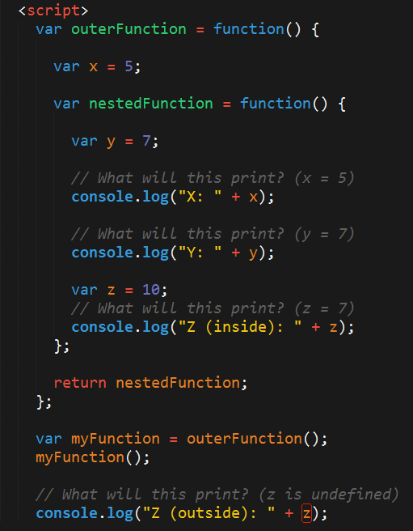

### 6. Students Do: Lexical Scope 2 (5 mins)

* Proceed with the next activity.

* **File:**

  * `lexical-scope-2-unsolved.html` in `14-ScopeTwo`

* **Instructions:**

* Take a few moments to dissect the code just sent to you.

* Try to predict what will be printed in each of the examples.

* Be prepared to share!

* Note: Pay attention to the unusual use of the keyword: ‘this”

### 7. Instructor Do: Review Lexical Scope 2 (5 mins)

* Open [14-ScopeTwo/Solved](../../../../01-Class-Content/04-jquery/01-Activities/14-ScopeTwo/Solved) and proceed with the review. This example may have been more challenging to students, as we introduced the concept of `this` without explanation.

* The key takeaway here is that using the keyword `this` will only print content related to the object directly above it, **not** from the grandparent.

  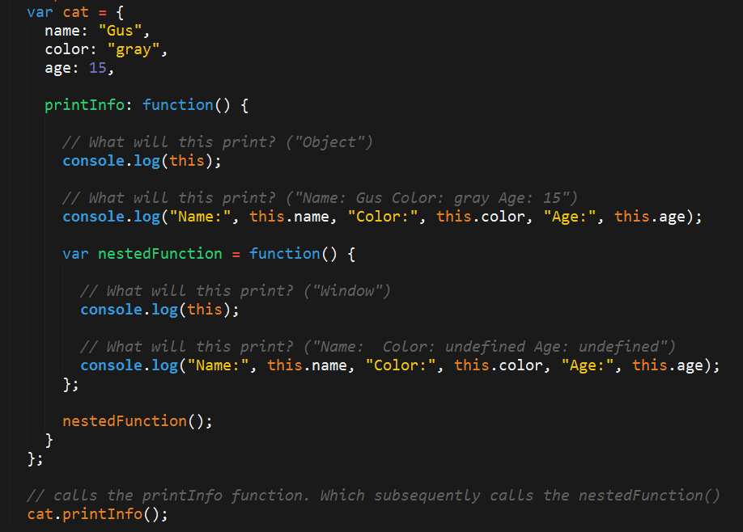

### 8. Students Do: Lexical Scope 3 (7 mins)

* Proceed with the next activity.

* **Files:**

  * `lexical-scope-3-unsolved.html` in `15-ScopeThree/Unsolved`

* **Instructions:**

* Take a few moments to dissect the code just sent to you.

* Try to predict what will be printed in each of the examples.

* Be prepared to share!

* Note: Pay attention to the unusual use of the keyword: ‘this”

### 9. Instructor Do: Review Lexical Scope 3 (5 mins)

* Try to have students explain the solutions to the last activity back to you.

* If no student can, try to explain it yourself using the solution provided. It's okay if you stumble as you explain -- that shows students that this stuff isn't obvious and that you can be a great developer, even if these nested functions confuse you.

* Remind students that these are not easy activities. The key is simply for them to become familiar with the fact that JavaScript's handling of parent and nested functions isn't always intuitive, and that errors can arise if you aren't careful.

* Make sure they realize that studying these examples **is not** overly necessary.

### 10.  Partners Do: Scope Quiz (7 mins)

* The first activity is intended to point out a common error students make in working with variables. Often, during the first few weeks of class, students instantiate multiple instances of the same variable. This creates unexpected behaviors as JavaScript handles each variable declaration as its own "local instance".

* Slack out the following file and instructions:

* **File:**

  * `17-ScopeQuiz` in `17-ScopeQuiz/Unsolved`

* **Instructions:**

  * Spend a few moments studying the code file with the person sitting next to you.

  * Then run the program in the browser.

  * Once you run the program, you'll find that Code Block 1 leads to different alerts than Code Block 2.

  * Ask your partner which Code Block is behaving the way you would expect.

  * Then work with your partner to try and identify the specific difference that is causing the issue with the faulty block.

  * Once you spot the issue, try to explain to your partner why JavaScript is handling these Code Blocks differently.

### 11.  Instructor Do: Review Scope Quiz (5 mins)

* After giving students a few moments to dissect the code in [17-ScopeQuiz/Solved](../../../../01-Class-Content/04-jquery/01-Activities/17-ScopeQuiz/Solved/scope-quiz-solved.html), point out the issue at hand. Specifically, Code Block 2 re-declares the `myVar2` variable inside of the function `a2`.

* This creates an issue where JavaScript creates a "local instance" of the variable `myVar2`. This local instance is only observable by the function `a2`. This means the function `b2` does not see the changes being made to the variable. Instead, `b2` refers back to the first declaration of `myVar2` and still thinks the value is equal to 1.

  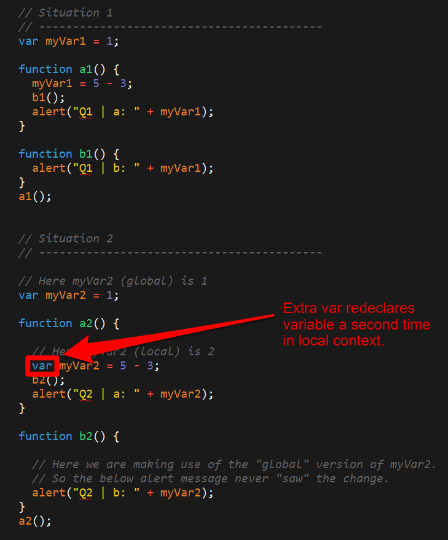

* Let students know that these scope issues are common sources of bugs for new developers.

### 12.  Partners Do: This Example (10 mins)

* Then proceed to the next example. Slack out the following file and example

* **File:**

  * `18-ThisExample` in `18-ThisExample`

* **Instructions:**

  * Using the comments in the guide answer each of the questions asked in the file.

  * Focus your attention on trying to wrap your mind around the concept of "this" and the unique role it can play in code.

  * Then try to explain to your partner how "this" works, focus on the first three examples.

### 13. Instructor Do: Review This Example (10 mins)

* Go over the solution to this example by explaining the answers to each of the questions [this-solved.html](../../../../01-Class-Content/04-jquery/01-Activities/18-ThisExample/Solved/this-solved.html).

* Don't worry about the bonuses. These may confuse the bulk of your students. The key thing to explain is that the keyword `this` refers to the object it falls inside of. Most of the time, `this` is a good way to be self-referencing. (You can leave it at that. Your more advanced students will dig deeper, but don't overwhelm your average student).

  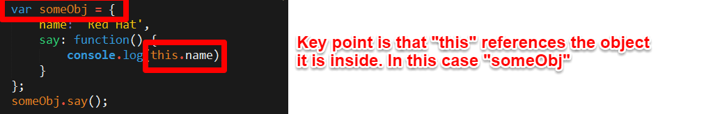

### 14. Students Do: Cobwebs (10 mins)

* Proceed with the next example.

* This example, simply asks students to become more familiar with deeply nested JavaScript Objects, which they will be immersed in during Week 6.

* For some of your students, this will be an enlightening exercise. For others, this will be very basic.

* For the students in need of an extra challenge, a very difficult bonus is included. The solution is included; students will likely need to continue working on this bonus for days after class.

* Slack out the following file and instructions.

* **File:**

  * `cobweb-starter.html` in `19-Cobweb`

* **Instructions:**

* Create the missing the code such that you can retrieve the requested item from the `theCobWeb` object.

* Note: This exercise is actually very relevant to work as a web developer, as data is often relayed across websites in the form of deeply nested JavaScript objects like this one.

* Bonus: If you finish early, begin pondering the bonus item. This is a **very** challenging exercise. It's impossible to complete in the allotted time. If you're feeling valiant - complete it outside of class and come back to instructors/TAs to go over it. This will arm you for difficult interview questions in the future.

### 15. Instructor Do: Review Cobwebs    (10 mins)

* Go over the solution. In this case, feel encouraged to have students come up to the front and type out the code themselves.

* The solution involves referencing each parent object.

  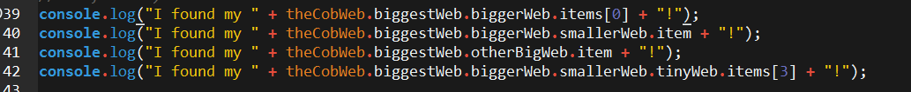

* Don't go over the bonus! It's too much. Do it after class during office hours.

### 16. Instructor Do: Intro Calculator + Group Formation (10 mins)

* At this point, proceed to form groups for the calculator activity.

* In this case, have students form groups of 3-4 of their own choosing, but ensure that each group includes at least one member from the other section.

* Once students are in their groups, open the file: [20-jQueryCalculator/Solved/jQueryCalculator.html](../../../../01-Class-Content/04-jquery/01-Activities/20-jQueryCalculator/Solved/jquery-calculator.html) in the browser. Show students how the application works by pressing various buttons and computing the results.

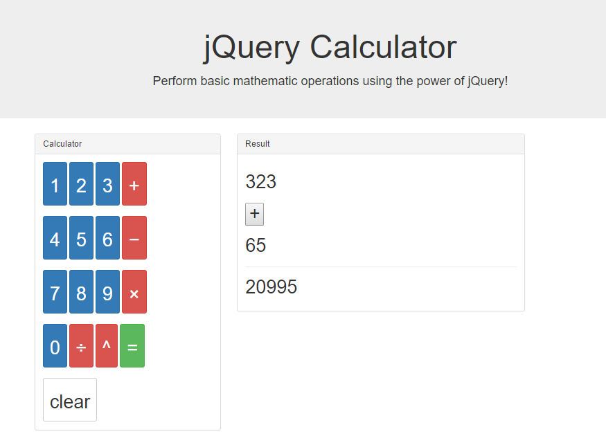

* Point out that this is a challenging exercise that will require the entire group to work together.

* Encourage students to work in pairs

* Once all students are situated, slack out the following file and instructions.

* **File:**
  * `jquery-calculator.html` in `20-jQueryCalculator/Unsolved`

* **Instructions:**
  * Create the JavaScript logic necessary to add functionality to the jQuery Calculator.

  * Your calculator should be able to handle basic mathematical operations like addition, subtraction, multiplication, etc.

  * You should be making use of the existing buttons.

  * You should be making use of the existing placeholders for entering content (i.e. "firstNumber", "operator", "secondNumber", "result").

  * You should have fun and push yourselves! This is a challenge activity—which means, if you get it done, you are a King of jQuery. If you don't, no sweat. The important thing is that you learned at least a FEW things along the way.

* **Instructor/TAs:** At this time, you may want to let students know about the 1:1 option available during the exercise. Describe these "catch-up" sessions as being "crash-courses" intended to help students go over the basics. Alternatively, if you already have a good idea of which students need the catch-up sessions, avoid making the announcement completely, and simply invite those students to take advantage of the time.

### 17. Everyone Do: Phase 1: Getting Situated + Pseudocoding Stage (20 mins)

* Throughout the activity, you will be offering minimal suggestions about how students should be proceeding and focusing their time.

* Slack the below objectives:

* **Phase I Objectives**

  * For this first 20 minutes, your goals should be to:

    * Become familiar with the various elements of the HTML page as it is written now. (Identify the classes and IDs that matter!)

    * Create a general strategy for how you will accomplish the task:

      * How will you capture button clicks?
      * What will you do with the numbers clicked?
      * What will you do when the operator is clicked?
      * How will you differentiate numbers from operators?
      * How will you know the "value" of a number clicked?
      * How will you know when a user is done entering the first number?
      * Etc.

    * Create a few test "on-click" events. These could just trigger Alert messages for now. If you get further along, then have these buttons alert their "value".

### 18. Everyone Do: Phase 2: Begin Logic   (30 mins)

* Slack the below objectives:

* **Phase II Objectives**

  * For the next 30 minutes, your goals should be to:

    * Begin creating sets of variables that you think you will need. As a few suggestions:

      * firstNumber, secondNumber, operator, result

    * Create code that captures the numbers from button clicks, and then displays them on the HTML.

    * Create code that captures an operator click, then immediately tells your code to begin recording the second number. (Example: If a user clicks the "plus" button, you know they are done typing the first number).

    * Create code that checks which operator the user has clicked, then saves this operator for later use in a conditional statement. (Example: If a user clicks the "plus" button, you know you will need to be adding two numbers. If a user clicks the "minus" button, you will need to be subtracting two numbers. Think: if-else statements!)

- - -

### 19. LUNCH BREAK  (30 mins)

- - -

### 20. Everyone Do: Continue Logic Building    (40 mins)

* Slack out the below objectives:

* **Phase III Objectives**

  * For the next 40 minutes, your goals should be to:

    * Complete the functionality you are missing in your code.

    * Spend a few moments really assessing what you still have to do.

    * Get a TA/Instructor to help you set priorities if you are unsure as to how to proceed.

### 21. Everyone Do: Refinement (20 mins)

* Slack out the below objectives:

* **Phase IV Objectives**

  * For the last 25 minutes, your goals should be to:

    * Complete any remaining functionality in your calculator

    * Handle bugs and edge cases (Example: What if a user tries to type in more numbers after getting the result? Will that mess up the screen?)

    * Create code to "restart" the calculator after a user clicks "clear".

### 22. Instructor Do: Review Calculator (10 mins)

* Because this application is pretty massive, the main focus during review is to help students understand **how** they should be re-examining the code on their own. Starting with the code blocks collapsed may help with clarity (as in the below image with the `.on` methods).

* Give students the high points. Emphasize the following:

  * We set a number of variables in the `initializeCalculator` function.

    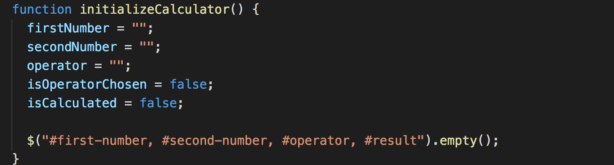

  * We used JQuery to create separate on click listeners for numbers, operators, and equals.

    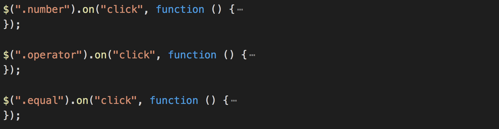

  * We used `this.value` in the callback function to determine what the value was for a given number or operator.

    

  * We created code that would change the HTML content using `.html`

    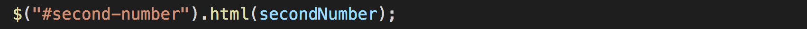

  * We took numeric inputs for `firstNumber` **until** a user clicks an operator. Once a user clicks an operator, we changed the value of a boolean, called `isOperatorChosen`, and immediately began recording the `secondNumber`.

    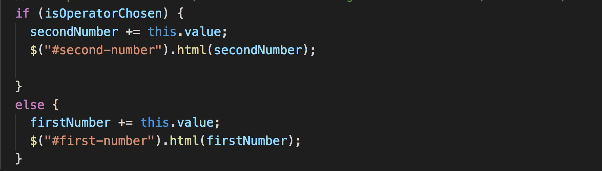

  * Once a user clicks the "equal" button, we used conditionals to check which operation they had clicked, then ran that operation on the two numbers.

    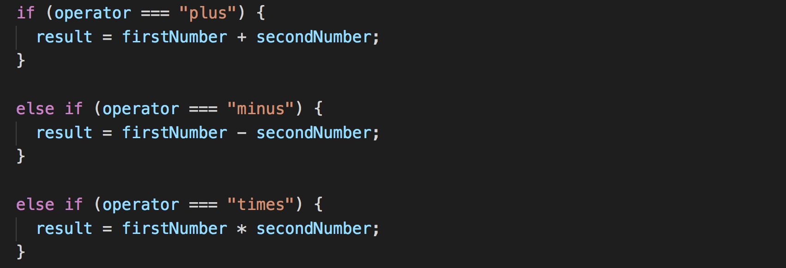

* Encourage students to spend some time re-examining this code. Even if they don't yet feel comfortable creating it from scratch, let them know that it has a number of key code snippets that they may find useful at various points in the class.

### 24. Slack out the Video Guide (3 mins)

* Slack out the video guide for this week's key activities and the last homework! Emphasize how helpful a tool these videos can be if a student feels as if they are falling behind or simply wants to review the material once again.

* [Video Guide](../VideoGuide.md)

# Instructor Do: Private Self-Reflection (0 min)

Take some time on your own after class to think about the following questions. If there's anything that you're not sure how to answer, feel free to reach out to the curriculum team!

1. How did today's class go?
2. How did you teach it?
3. How well do you feel you did teaching it?
4. Why are you teaching it?
5. Why did you teach it that way?
6. What evidence can I collect to show my students are understanding?
7. How will my students know they are getting it?

### Lesson Plan Feedback

How did today's class go?

[Went Well](http://www.surveygizmo.com/s3/4325914/FS-Curriculum-Feedback?format=ft&sentiment=positive&lesson=02.05)

[Went Poorly](http://www.surveygizmo.com/s3/4325914/FS-Curriculum-Feedback?format=ft&sentiment=negative&lesson=02.05)
