## 3.3 Lesson Plan - Intro to APIs and AJAX (10:00 AM) <!--links--> &nbsp; [⬅️](../02-Day/02-Day-LessonPlan.md) &nbsp; [➡️](../04-Day/04-Day-LessonPlan.md)

### Overview
In this class, we will be introducing students to the concept of APIs and the use of AJAX calls to retrieve data from external data sources.

`Summary: Complete activity 13 in Unit 05 & 01-03 in Unit 06`

##### Instructor Priorities

* Students should be able to articulate a loose definition of API and JSON, along with a few examples of popular APIs
* Students should become more comfortable parsing JavaScript objects (both locally and as JSON)
* Students should complete the OMDb AJAX-to-HTML Activity
* Students should complete the More JavaScript and jQuery Checkpoint

##### Instructor Notes

* Today's class is a fun one! Students will begin using AJAX to pull data from popular data sources. However, expect students to still only have a weak handle on JavaScript objects. Use the beginning of class to fill in any conceptual holes they may have. Spend the time necessary to get them feeling more confident breaking into a JavaScript object and retrieving specific fields.
* Before class, create an account at [Mashape](https://market.mashape.com/explore).
* Be sure to slack out this [tutorial on the OpenWeatherMap API](http://osp123.github.io/tutorials/html/weatherAPI.html) as pre-reading for this week's content.
* Keep in mind that since Heroku serves its content using HTTPS, all external resources need to use HTTPS as well, else they may be blocked by the browser. Most examples in the Giphy documentation use HTTP, but HTTPS is available as well. This isn't likely to pose an issue today, but students may run into it when they deploy their homework assignments. Some additional information:
  * [Mixed active content](https://developer.mozilla.org/en-US/docs/Web/Security/Mixed_content#Mixed_active_content)
  * [How to fix a website with mixed active content](https://developer.mozilla.org/en-US/docs/Web/Security/Mixed_content/How_to_fix_website_with_mixed_content)

* TAs should reference [03-Day-TimeTracker](03-Day-TimeTracker.xlsx) to help keep track of time during class.

### Sample Class Video (Highly Recommended)
* To view an example class lecture visit (Note video may not reflect latest lesson plan): [Class Video](https://codingbootcamp.hosted.panopto.com/Panopto/Pages/Viewer.aspx?id=6910b18d-c819-4403-817b-0fc9543c317c)

- - -

### Class Objectives

* To introduce the concept and utility of APIs and JSON in web applications
* To be exposed to a variety of APIs and the process for building endpoint URLs to utilize them
* To work with the OMDb to build data-rich applications.
* To complete the More JavaScript and jQuery Checkpoint

- - -

### 1. Instructor Do: Welcome Class (3 mins)

* Say your hellos and inform the class that we'll be finishing up our work with interview concepts before diving into APIs and AJAX requests.

### 2. Instructor Do: Very Brief Introduction to Algorithms (5 mins) (High)

* Introduce the final activity to the class: Bubble Sort. Explain that this is an algorithm commonly taught in Computer Science courses.

* "But first, we need to briefly go over Computer Algorithms." Slack out [this link](https://www.quora.com/What-is-the-difference-between-algorithm-and-programming) and ask the class to find the answers to the following questions.

  * What is a computer algorithm?
    * Answer: A set of steps that a computer can take to solve a particular problem.
  * How does an algorithm differ from a program?
    * Answer: While some programs comprise a series of steps, a developer must code them out in a particular language. Algorithms are more high level--developers can apply the steps of an algorithm to different programs in order to solve various problems, like sorting and searching through data.

* Tell the class that Computer Scientists consider the Bubble Sort an inefficient, slow algorithm for sorting data. That description is especially true for programs that sort through hundreds of thousands of data entries.
  * Regardless, it's still important to know how this sorting algorithm works -- otherwise, how would you avoid it? "That's why you'll be making a program that uses this algorithm in your last interview activity."

### 3. Students Do: Bubble Sort (40 mins) (Critical)

* Slack out the Bubble Sort activity to your students: [13-BubbleSort/Unsolved](../../../../01-Class-Content/05-timers/01-Activities/13-BubbleSort/Unsolved).

* Make sure students spend at least ten minutes visualizing their solution before they code anything. An algorithm is intrinsically high level; if they don't know how it works, they will not be able to solve the problem.

  * Tell your class that they should not look at any coded-out solution online--they're only cheating themselves if they do.

* **Instructions**:

**Bubble Sort**

* Write a function that sorts an array of numbers in order. You can do this with the Bubble Sort algorithm. If you are unfamiliar with Bubble Sort, use Google to read up on the concept. Spend about 10 minutes pseudocoding your solution before writing any JavaScript.

* Use the array provided below. Display the unsorted array in the `#start` div of `index.html`.

* When the user clicks the `button` in `index.html`, the sorted result should be displayed in the `#result` div.

* DO NOT USE JQUERY TO SELECT ELEMENTS. ONLY USE VANILLA JS.

**End Instructions**

* Note: Ten minutes into the activity, ask a student to explain to their classmates how the Bubble Sort algorithm works. This will ensure that everyone has a clear idea of the concept.

### 4. Instructor Do: Go Over Bubble Sort and Wrap Up (10 mins) (Critical)

* Tell students that time is up, and remind them that this exercise was meant to be a challenge--they shouldn't doubt their place as budding web developers if they couldn't solve it.

  * "Remember the key to showing your thought process to the interviewer--visualizing and the problem and pseudocoding the solution."

* Ask a student in the class to explain their pseudocoded sort function.

* Also ask if any students were able to solve the activity. Have them tell you their code line by line--make sure they say what each line does as well. Finally, run the function and test if it works.

  * If no students could answer the question, reassure them that this activity was meant to be a challenge for them. Regardless, type out the solution provided [13-BubbleSort/Solved](../../../../01-Class-Content/05-timers/01-Activities/13-BubbleSort/Solved) so that they know what a working Bubble Sort looks like.

* Ask the class if they have any questions about today's lectures and the concepts you went over this week.

* Slack out the solution and [video review](https://www.youtube.com/watch?v=t-qAWbYMiUs) for the activity.

### 5. Students Do: CustomerObject Parsing (5 mins) (High)

* Welcome Students to class and let students know that we will begin with a warm-up activity.

* Slack out the following files and instructions.

* **Folder**

  * [01-CustomerObject/Unsolved](../../../../01-Class-Content/06-ajax/01-Activities/01-CustomerObject/Unsolved)

* **Instructions**

  * Using the instructions shown in the comments, create `console.log` statements that parse out the requested information.

  * Help those around you if you finish early.

### 6. Instructor Do: Review CustomerObject Parsing (5 mins) (High)

* Either live-code the solution yourself or open and demonstrate[01-CustomerObject/Solved](../../../../01-Class-Content/06-ajax/01-Activities/01-CustomerObject/Solved/customer-object-solution.html).

* While going over the solution, ask students why phoneNumber required an index parameter but first and last name did not.

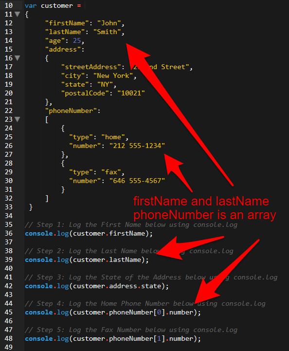

* Continue to ask questions to students to confirm their comfort with the material.   

* Then let students know that working with JavaScript Objects like this is incredibly important in web development as we will use them to transmit data repeatedly.

### 7. Students Do: Install JSON Formatter (5 mins)

* Next point students to the following link: [JSON Formatter](https://chrome.google.com/webstore/detail/json-formatter/bcjindcccaagfpapjjmafapmmgkkhgoa/related?hl=en) and have them install the Chrome extension.

* Let them know that this will format JSON in the browser.

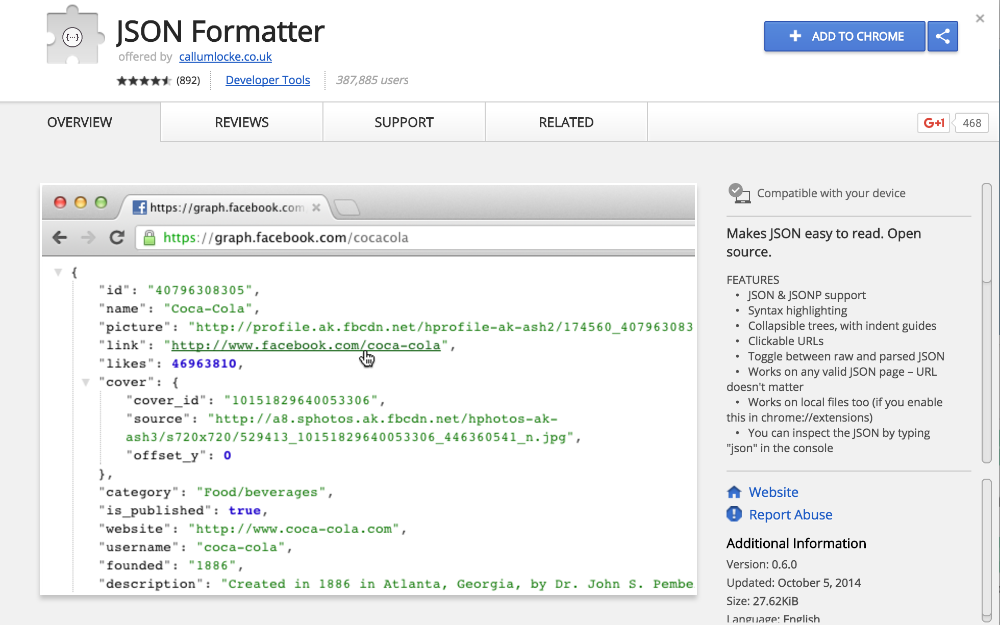

### 8. Instructor Do: New York Times Scraper Demo (10 mins)

* Next, go to the following link: [NYT Scraper](http://nyt-mongo-scraper.herokuapp.com/).

* Briefly explain that the application's `Scrape New Articles!` button retrieves new articles from the New York Times and loads them onto the page. Every article loaded onto the page has a "Save" button. 

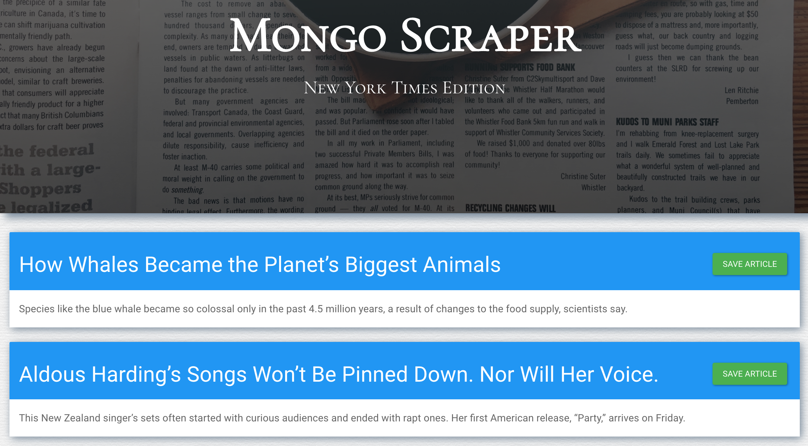

* Next, visit the following link: [NYT Scraper API](http://nyt-mongo-scraper.herokuapp.com/api/headlines) to show students that "beneath the hood" the application is storing each headline as an entry in a JavaScript Object. Just like with the CustomerObject example, this JavaScript is holding a mix of various data types to store information such as the article's id, headline, summary, date, and whether it is saved or not.

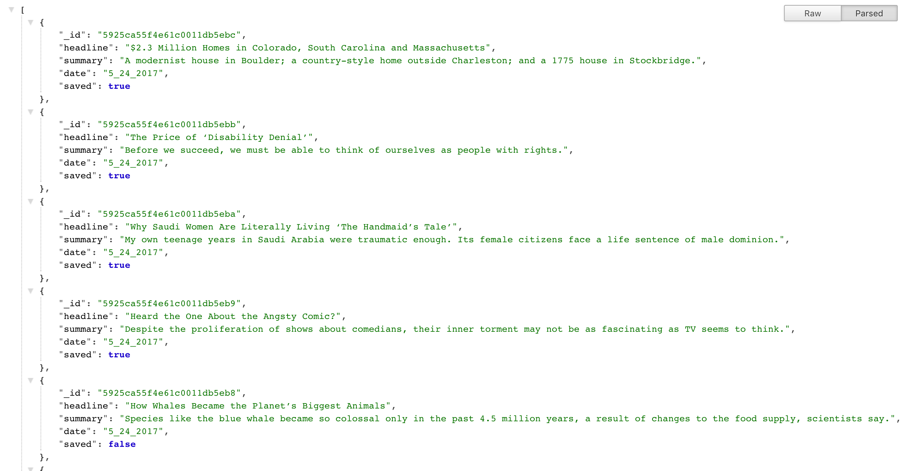

* Let them know that this approach of using JavaScript Objects as a data transmission method is a very common one.

* Then share both links to students.

### 9. Everyone Do: NYT Scraper Review (5 mins)

* Give students a few moments to look at the NYT Scraper Application and the headlines API endpoint.

* Encourage them to ask questions about this. If none are offered, have one or two students explain conceptually how the application works.

### 10. Students Do: API Research Questions (7 mins)

* Next slack out the following instructions to students:

* **Instructions:**

  * For the next few moments, research amongst yourselves the answers to the following questions:

    1. What is an API?
    2. What does API stand for?
    3. What are some examples of APIs? (Find links to specific APIs)
    4. What do these specific APIs allow you as a developer to do?

### 11. Everyone Do: Review API Research Questions (5 mins)

* Have students share their answers to these questions.

### 12. Instructor Do: API Definitions (6 mins)

* Then offer your definition of an API. You can use the following if you like:

  > APIs stand for Application Programming Interfaces. They provide a way for creating user code that utilizes other pre-built code to do various tasks. It can be used to quickly retrieve data from another person's database, to utilize someone elses more complex functionality (like maps), or to control other hardware and software.

* Briefly talk about why APIs are created. Talk about how you save time not having to create your code. Give a few examples of websites that use other companies' APIs.

  * AirBNB uses Google's API for maps [AirBNB](https://www.airbnb.com/s?s_tag=_s84SXqA)
  * Google Searches for Weather uses the Weather API [Weather Search](https://www.google.com/?gws_rd=ssl#q=weather+new+brunswick)
  * Even jQuery is an API [jQuery](https://jquery.com/)

* Point out that there are millions of APIs in existence.

* Point out that JSON (JavaScript Object Notation) is a common format for sending data between APIs. Use the word JSON, so students hear/understand it.

* Encourage questions at this point!

* Don't worry if your explanations are pretty high-level at this point, in the next class you will re-explain the concepts in more detail.

### 13. Instructor Do: API Experimenting (10 mins)

* Navigate to this URL: [Yoda Speak](https://market.mashape.com/ismaelc/yoda-speak). Explain to students that the Yoda API will take a string sentence and then output a revised sentence.

* Then navigate to this URL: [Face Face++](http://www.faceplusplus.com/demo-detect/). Grab a photo of a student in your class who wears glasses via LinkedIn or something and paste the image URL into the application. Explain that the response JSON is intended to analyze "sentiment" based on the image. Values closer to 100 indicate greater likelihood. Have fun with this!

### 14. Students Do: API Experimenting (10 mins)

* Next, have students experiment on their own with new APIs. Slack out the following instructions:

* **Instructions:**

  * Using the [Mashape API library](https://market.mashape.com/explore) as a starting point experiment with a few APIs of your own.

  * Note: You will need to create an account on Mashape first.

  * Note: Not all of the APIs are easy to use, just keep experimenting!

- - -

### 15 LUNCH BREAK (30 mins)

- - -

### 16. Instructor Do: Welcome Back From Lunch (2 mins)

* Welcome your students back to class. Ask them how they feel the activities have gone so far. Remind your class that this particular class is meant to be challenging and that you don't expect everyone to finish them--most students probably won’t.

  * The point is to emphasize the idea of thinking about each problem at a high level -- to visualize the solution. Even if a student lacks the know how to code out an interview question, they should at least know how their program would work at a conceptual level.

* You might have one or two students who feel distressed regardless of what you just said. You should tell your class that they can speak 1:1 with either you or a TA if they want to talk about any issues they've encountered today or over the length of the course.
* You might even want to have a one-to-one with students during the time allotted for the next activity.

### 17. Instructor Do: OMDb API Demo (5 mins) (High)

* Present the following question. So if all this data exists in the world and we have JSON being created, how do we access the data?

* Navigate to the [OMDb API](http://www.omdbapi.com/) and explain that this API provides a database of information on nearly every movie in existence.

* Scroll through the basic documentation and point out that in this API, we "build" URLs that point to JSONs associated with various movies. Point out that the parameters allow us to filter results. Inform students that the OMDb API is no longer a free API and requires an API key which we will provide for them to use.

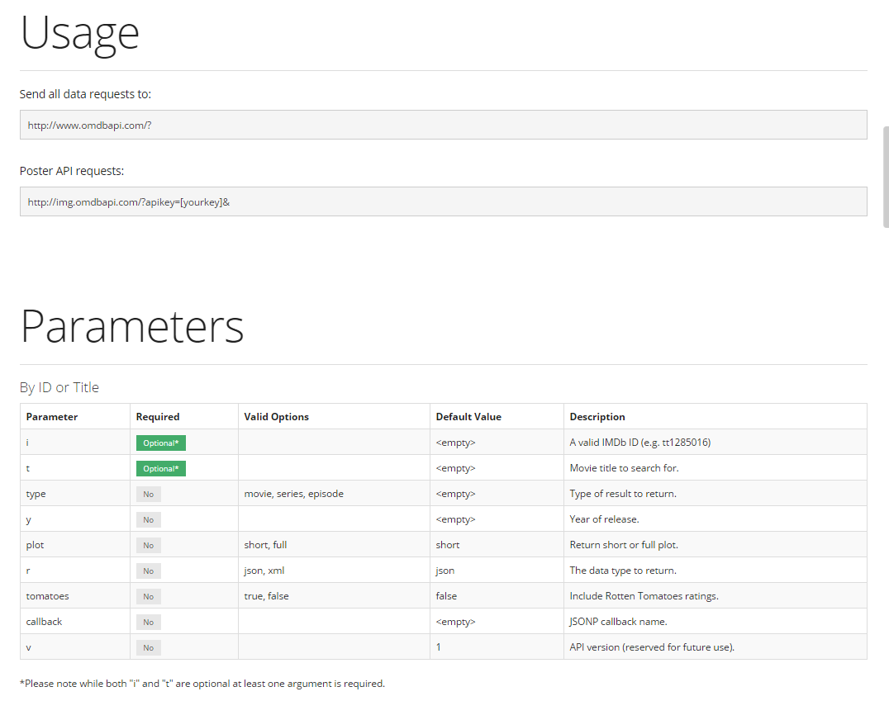

* Then use Example GUI to generate a URL for a movie of your choice.

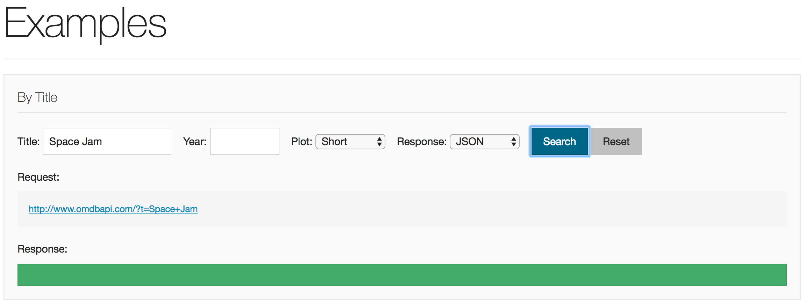

* Then visit the link that gets generated, and show students the JSON that was generated. Be sure to add the following `apikey` parameter to the generated URL: `trilogy`. Example: <http://www.omdbapi.com/?t=Space+Jam&apikey=trilogy>

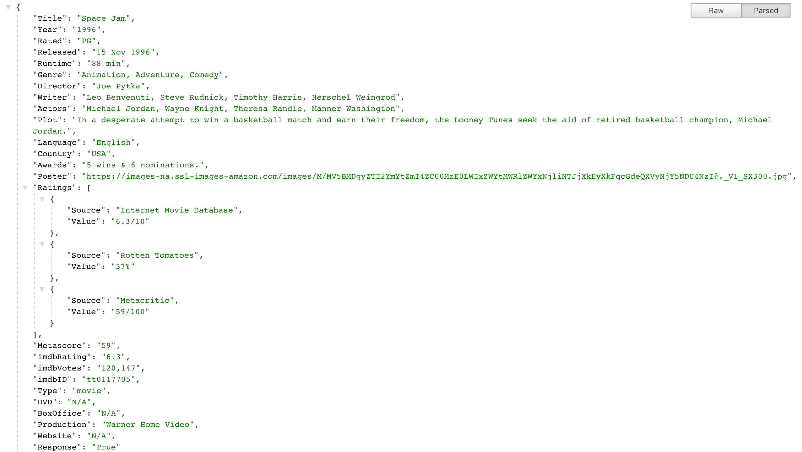

* Ask students if they have any questions.

### 18. Partners Do: OMDb API Exploration (10 mins) (High)

* Have students explore the OMDb API themselves.

* Slack out the following instructions to students:

* **Instructions:**

  * Go to the [OMDb API](http://www.omdbapi.com/) then use the documentation to try to answer the following:

    * Without using the user interface, how would I query the OMDB API to get all of the information related to the movie: Frozen?

    * Hint: you will have to build a URL of your own with the search parameters listed.

    * Note: The OMDb API now requires an API key. Here is your key: `trilogy`

### 19. Everyone Do: OMDb API URLs (10 mins) (Critical)

* Using this <http://www.omdbapi.com/?t=Forrest+Gump&y=&plot=short&apikey=trilogy> as an example, have students break down the URL.

* Be sure to have them explain each parameter listed (i.e. the `?t`, the `+`, the `&`, `apikey`, etc).

* Then ask students how they would show multiple movies that meet a condition? (i.e. how would you get all movies with the word `Matrix` in it). SOLUTION: Use the `/s` format: <http://www.omdbapi.com/?s=Matrix&y=&plot=short&apikey=trilogy>

### 20. Instructor Do: AJAX Query Demo (10 mins) (High)

* Now open up your editor and create an AJAX call to OMDb using the below code as an example. (Alternatively, you can use [02-Ajax_OMDB/single-ajax.html](../../../../01-Class-Content/06-ajax/01-Activities/02-Ajax_OMDB/single-ajax.html). If making your own AJAX call, however, be sure to include a few console logs after the AJAX call to demonstrate asynchronicity. See `single-ajax.html` for details.

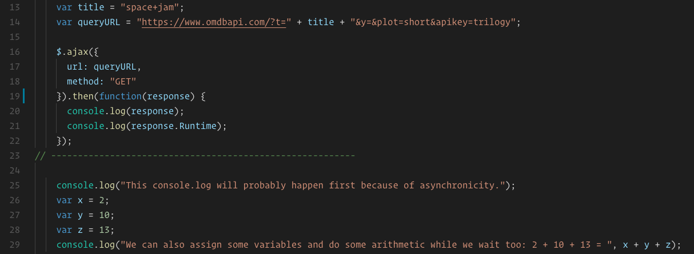

* Be sure to point out the various parts of the AJAX call:
  * The `queryURL` which points to the JSON
  * The `GET` method which tells JavaScript to download the JSON
  * The `then` function which tells JavaScript to run the code inside ONLY when done with the download
  * Most importantly that all of the data is being stored in the `response` object-2.9
  * Lastly, in your Chrome inspector, point out how all the code past line 26 happens before the results of our API call are logged. Even though that happens first lexically.

* Ask students why they think the `.then` function is necessary? Why does the code after the AJAX request happen before the API results are logged?

* After a minute or two of discussion, explain to students that JavaScript is synchronous in nature. The code is executed one line at a time.
  * This makes the language easier to pick up initially, as code executes in the order one might expect.

  * But what if our API call takes a few seconds to come back? What if it takes a minute? Ten minutes? An hour?
    * While we won't be waiting on a request for TOO long, it does pose a problem when we have other code that needs to run no matter what the API response is. Just waiting for the API call to complete to execute other unrelated code isn't very efficient and doesn't provide a good user experience. So JavaScript can BEHAVE asynchronously through the use of callback functions and promises.

  * We have already seen asynchronous behavior through callbacks with setTimeout and setInterval. We pass setTimeout and setInterval callback functions to execute whenever they're ready, WHENEVER that may be.

  * Promises are similar. The .then function is an example of a promise. This is essentially a function that "promises" to be executed at some point. In this case, whenever our data comes back from the API. We describe what we want to happen by passing a callback function as a parameter into our promise.

  * In short, because the AJAX request takes a certain amount of time, our code after AJAX call executes in the meantime. Remember, AJAX stands for ASYNCHRONOUS JavaScript and XML.

* Run the code and show the results in the console.

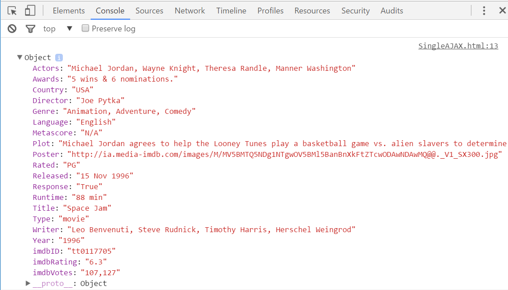

* Add a second AJAX call to another movie. (Alternatively you can use [02-Ajax_OMDB/multiple-ajax.html](../../../../01-Class-Content/06-ajax/01-Activities/02-Ajax_OMDB/multiple-ajax.html).

* Open the floor to questions.

* Slack out the code you just created.

### 21. Everyone Do: Logging JSON (5 mins) (Critical)

* Ask students how they might parse out and retrieve the movie's runtime or actors list in response? (Show the JSON on the side).

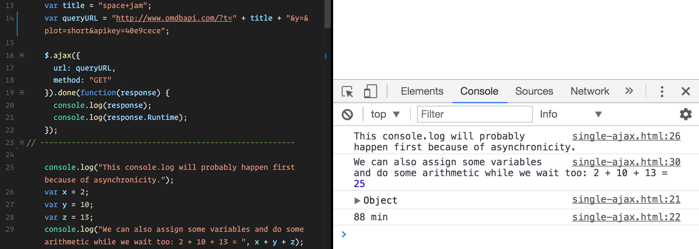

### 22. Students Do: AJAX Query Activity (15 mins) (Critical)

* Slack out the following instructions to students:

  * **Instructions:**

  * Now it's your turn! Using the example AJAX code given to you, create an AJAX call to the OMDb API of your own.

  * Then try logging any property about the movie to your console.

### 23. Students Do: AJAX to HTML Activity (15 mins) (Critical)

* Confirm that students were able to successfully log the JSON.

* Then open the file [03-AJAX_to_HTML/Solved/ajax-to-html.html](../../../../01-Class-Content/06-ajax/01-Activities/03-AJAX_to_HTML/Solved/ajax-to-html.html) in your browser. Show students that, in this application, the web page has rendered the contents of the API into the HTML.

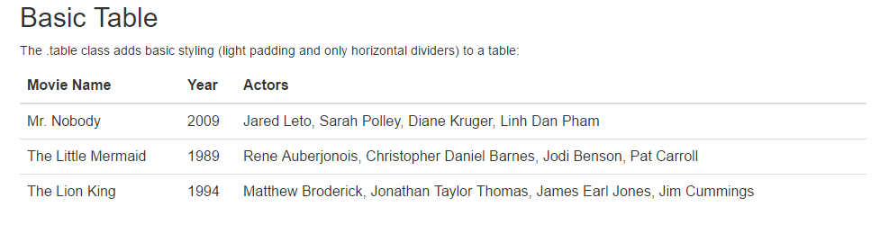

* Then slack out the following files and instructions to students.

* **Folder:**

  * [03-AJAX_to_HTML/Unsolved](../../../../01-Class-Content/06-ajax/01-Activities/03-AJAX_to_HTML/Unsolved)

* **Instructions:**

  * Using `3-ajax-to-html.html` as a starting point, fill up the HTML table with information about your own favorite movies.

  * HINT: You will need multiple AJAX Calls

  * BONUS: Once you've completed the basic activity, refactor your solution to be more DRY by placing repetitive logic inside of functions to be called when needed.

### 24. Instructor Do: Review AJAX to HTML Activity (7 mins) (Med)

* Review the solution to the previous activity [03-AJAX_to_HTML/Solved/ajax-to-html.html](../../../../01-Class-Content/06-ajax/01-Activities/03-AJAX_to_HTML/Solved/ajax-to-html.html).

* Point out that we can use jQuery to paste the specific properties retrieved in the JSON directly into our HTML.

* Ask students why we put the code we want to execute after the AJAX call is complete inside the .then promise function?   

* Be sure to mention that because AJAX is asynchronous, this guarantees response is ready when we try and use it.

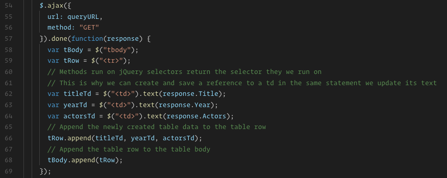

* Take a moment to go over the bonus solution and demonstrate how we can place repetitive logic inside of functions. This helps make our code easier to understand and reduces the number of lines of code we need to maintain and debug.

* Take any questions that may still exist on this activity.

### 25. Group Do: Homework Time (35 mins)

* Inform the class that we will pick up on APIs and AJAX in our next class.

* Students should be given the remaining time to complete most of the homework due tomorrow.

* Make sure to keep an eye out for questions regarding the assignment and guide anyone who may have de-railed back on track.

* If students seemed to struggle today, you can use this time to review difficult topics or spend more time on one of the class activities rather than on homework. 

### 26. Instructor Do: Introduce Checkpoint - More JavaScript and jQuery (5 mins) (Critical) 

* Let your class know that they will now be taking a short multiple choice assessment to check their understanding of More JavaScript and jQuery

* DO NOT SKIP THIS INTRODUCTION. DO NOT JUST SEND OUT THE LINK WITHOUT CONTEXT

* Reassure the students that they need not be nervous about the Checkpoint:

  * "This will not affect your grade or graduation requirements."

  * "This is not like the tests and quizzes you might be used to from school or college. The purpose of these tests is not to motivate you to study or punish you for struggling."

  * "This is as much a test of me as an instructor and of the course content as it is of you. We are here to ensure your success, and this is one of the tools we use to make sure we are doing that effectively. This class moves _fast_, so if some or all of you misunderstand something important we as an instructional team need to find out as fast as possible so we can help."

  * "Long story short, this quiz can not hurt you. Only help you."

* Let students know that they should read carefully and focus on thinking about the right answer rather than using any test-taking skills they may have learned:

  * "There are no silly answers or obvious throwaway responses on this quiz, because those kinds of answers reduce the likelihood that we'll be able to figure out whether we've taught something effectively."

  * "Test taking strategies you may have learned for standardized tests _will not work_, so instead of focusing on eliminating wrong answers or looking for sneaky context cues, read the question and each of the possible choices carefully."

* Reassure students once again that the purpose of this is to help them, and remind them that the outcome does not impact their grade or graduation requirements. You should do this _every single time_ you give an Checkpoint.

* You or your TAs should now get the link specific to your class:

  * Navigate in your browser to: `https://www.switchboard.tech`

  * Select your class code (if it doesn't show up on its own)

    * If the class is a parallel class, a class that has two classes combined on a Saturday, and doing a checkpoint with two classes at once you will **need** to slack out two links.

    * One for your class and one for the other. 

  * Select the Checkpoint and copy the resulting link

### 27. Students Do: Take Checkpoint - More JavaScript and jQuery (10 mins) (Critical)

* Slack out the link to the Checkpoint

* Let your students know that once they select their name, it will take them to the Checkpoint

* Checkpoints must be completed in class, **not at home**, to ensure you will be able to effectively find and help struggling students 

* TAs should walk around the class to ensure students aren't looking up answers

* Keep in mind we do not use grades from assessments toward graduation requirements. However, students will be tempted to avoid feeling like they don't understand something.

* It's important for instructional teams to create an environment where it is safe to fail, but also where such failure is visible. You should not be worried about "cheating" on checkpoints, only making sure that students who need help aren't remaining invisible.

* Your SSM will have the results of the Checkpoint within an hour of its completion

### 28. End (0 mins)

### 29. TAs Do: Structured Office Hours - Review More JavaScript and jQuery (30 min)

* Navigate in your browser to: `https://github.com/coding-boot-camp/checkpoint-bank/blob/master/checkpoints/multiple-choice/04-More-JavaScript-and-jQuery-MC/04-More-JavaScript-and-jQuery-MC.md`

* There you will find the questions and answers to the Checkpoint given.

* Please take the entire office hours time to review the questions with the students.

* Suggestion Format:

  * TAs ask a question at a time to the class.

  * Let the students try to answer it.

    * If you see that a majority of the class has a misunderstanding with a question:

      * Take your time on this question!

    * If you see that a small number of students has a misunderstanding with a question:

      * Do your best to reinforce the misunderstanding but be cautious of your time.

      * Make note of the students that are still struggling with the question and schedule a 1:1 with the students.

  * If applicable, demo the answer.

* Take your time on these questions!

* This is a great time to reinforce concepts and misunderstandings!

### Lesson Plan Feedback

How did today's class go?

[Went Well](http://www.surveygizmo.com/s3/4325914/FS-Curriculum-Feedback?format=ft&sentiment=positive&lesson=03.03)

[Went Poorly](http://www.surveygizmo.com/s3/4325914/FS-Curriculum-Feedback?format=ft&sentiment=negative&lesson=03.03)
