## 4.2 - Firebase Application Building (10:00 AM) <!--links--> &nbsp; [⬅️](../01-Day/01-Day-LessonPlan.md) &nbsp; [➡️](../03-Day/03-Day-LessonPlan.md)

### Overview

In this class, we will be continuing our exploration of Firebase, an easy-to-use server-side database that makes it easy to power our front-end applications with expansive datasets.

`Summary: Complete Activities 14-20 in Unit 07`

##### Instructor Priorities

* Students should complete + understand the CoderBay Application.
* Students should be pushed to strengthen their fundamental JavaScript skills (e.g. Variables, Functions, Events).
* Students should understand the following Firebase methods `.push({})` and `.on("child_added")`.
* Students should understand the utility of the MomentJS library.
* Students should complete and understand the TimeSheet Application.
* Students should complete and understand the Train Prediction Activity.
* Students should be broken up into groups of 3-4 (by section) for next week's project week.
* Students should complete the Timers and APIs Checkpoint.

##### Instructor Notes

* All databases can be accessed by logging into Firebase with:

  * Username: CodingBootcampExamples@Gmail.com
  * Password: rutgers0451

* Prior to class, you will need to create three Firebase databases for use in today's lecture. Place the config from the first database you create into the `17-TimeSheet` example, the second into the `18-Push` examples, and the third into the `19-Add_Child` examples.

  * **Your 1st new Firebase DB Goes Here**

    * `timesheetLogic.js` inside `17-TimeSheet`
      

  * **Your 2nd new Firebase DB Goes Here**

    * `01-recent-user-with-set.html` & `02-recent-user-with-push.html` inside `02-Push`
      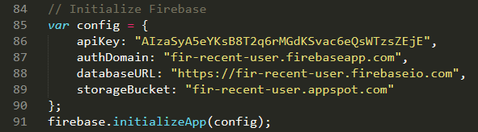

  * **Your 3rd new Firebase DB Goes Here**
    * `recent-user-with-all-users.html` & `recent-user-with-all-users-solved.html` inside `19-Add_Child`
      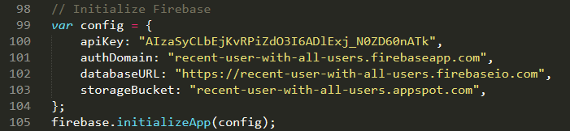

* Tomorrow we start projects! As such, you will need to divide students into groups of 3-4 (by section) at the end of class. When choosing groups, be sure to consider aspects like personality, coding proficiency, leadership, etc. Try to form groups in which no one will be left idle, de-motivated, or alienated. We want project week to be a positive experience for everyone.

* Have your TAs reference [Day-3-Time-Tracker](02-Day-TimeTracker.xlsx) to help keep track of time during class.

### Sample Class Video (Highly Recommended)
* To view an example class lecture visit (Note video may not reflect latest lesson plan): [Class Video](https://codingbootcamp.hosted.panopto.com/Panopto/Pages/Viewer.aspx?id=4c1837ed-6d4e-4e6d-b7ce-f1df5e9c3055)

- - -

### Class Objectives

* To introduce the concept of user "presence" in Firebase
* To provide a "real-world" application development scenario that utilizes HTML, CSS, Databases, and Data Manipulation
* To introduce the concept of creating lists and children using Firebase
* To introduce the MomentJS library for date-time manipulation
* To complete the Timers and APIs Checkpoint

- - -

### 1. Instructor Do: Welcome Class and Review (10 mins)

* Take a minute to welcome the class before going into a review of the previous day's lesson.

* Ask the class: "What client-side storage options did we learn about? How are they different?"

  * Cookies: Name Value pairs stored as text in the browser. Works with older browsers. Limited to 20 cookies.

  * Local Storage: Key-value pairs stored in a structure similar to JSON. Can store up to 5mb of data.

  * Session Storage: Similar to local storage, but expires after browsing session ends (when window/tab is closed)

* Ask the class: "How is Firebase different from these local solutions for persistent storage?"

  * Firebase uses server-side storage. This means that the data not only persists on one machine but is available on every device which visits the web page the data is loaded on.

* Ask the class: "What method have we learned to update our firebase database with new data?"

  * We can use the `set` method to set or replace data currently in the firebase database.

* Ask the class: "How can we perform an action when data is updated in our firebase database?"

  * We can listen for database updates using `on("value")`. This is similar to event listeners in jQuery (e.g. `on("click")`). We can pass in a callback function to run whenever the data changes.

* Ask the class: "What method do we use to get a reference to our data in firebase before working with it?"

  * We use the `ref` method.

* Take a moment to answer any questions but assure the class that we'll see all of this in action during the day's activities.

### 2. Students Do: CoderBay Example (35 mins) (High)

* Demonstrate the following file in your web browser: [14-codersbay/Solved/index.html](../../../../01-Class-Content/07-firebase/01-Activities/14-codersbay/Solved/index.html). Walk students through the general gist of the application -- essentially it's a simplified version of eBay in which you can bid for a product. If you bid higher than someone else it alerts the screen to say: "You won!" and changes the highest bidder. If you weren't higher it tells you to bid higher.

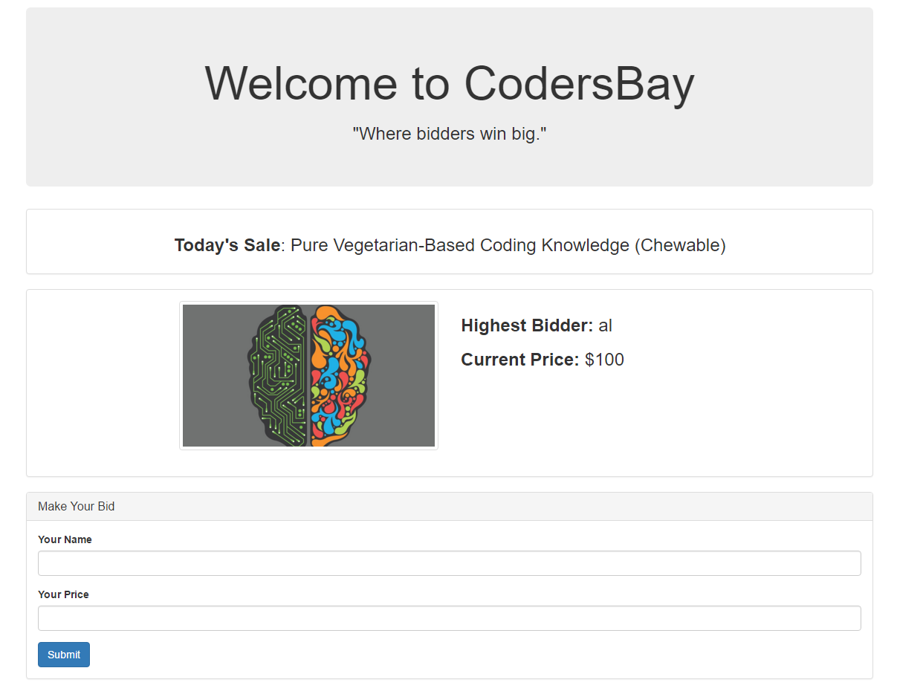

* Then slack out the following files and instructions.

* **Files**:

  * `14-codersbay/Unsolved/codersbay.html`
  * `14-codersbay/Unsolved/logic.js`
  * `14-codersbay/Unsolved/logicOption2.js`

* **Instructions**:

  * Using either [`logic.js`] (easier) or [`logicOption2.js`] (harder) as a starting point, create the CodersBay app using a Firebase database to store data on the backend.

  * Your application should be able to run on multiple browser windows simultaneously and register click events on each screen correctly.

### 3. Instructor Do: Review CoderBay Example (7 mins)

* Slack out the solution to the assignment above.

* Then review the `CoderBay` activity, focusing once more on the key aspects of today's lesson: the `on.("value")` to track changes, the `.set({})` to add data, etc.

* Give people encouragement at the end of this. Let them know it was a very challenging activity and that this is all new material for them which may take a few hours of hard work to sink in fully.

* Encourage them to go home and study the code more deeply when they have time since understanding how this program worked will help them better tackle the homework.

### 4. Instructor Do: Intro to Presence (5 mins) (High)

* Open the file [countdown-presence.html](../../../../01-Class-Content/07-firebase/01-Activities/15-intropresence/countdown-presence.html) inside `15-intropresence` in your browser. Create multiple instances of the page and point out how its keeping track of all the viewers visiting the page.

* Open up the code and walk students through it "lightly" (we'll be going over how Firebase handles arrays in more depth next class). For today, just point out that you've used `.ref()` to create references to different locations/folders in the database - and that you are using a specific Firebase url: `.info/connected` to keep track of connected and disconnected users.

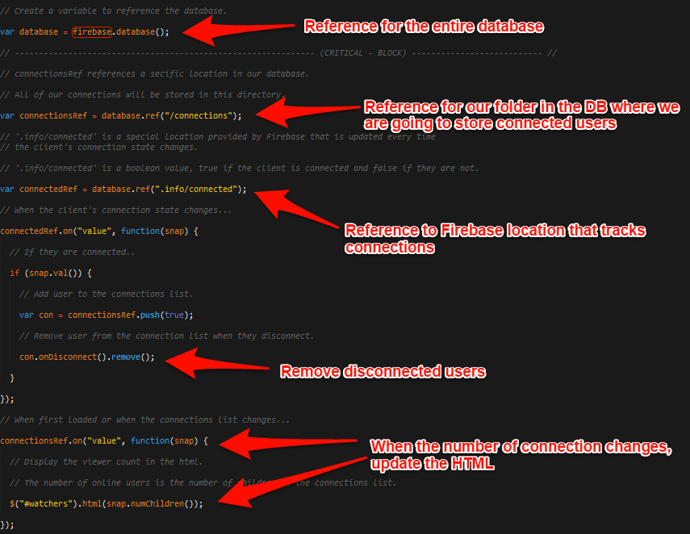

* Illustrate how we used `database.ref('/clicks')` and `database.ref('/connections')` to save data to different folders in our database.

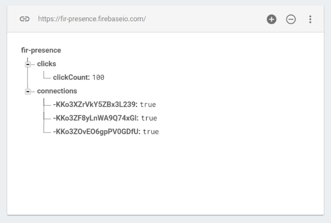

* Try to walk through the code as much as you can but don't let them get too bogged down. This is fairly standard cut-and-paste code and is not critical for their homework.

### 5. Student Do: CoderBay with Presence Example (10 mins)

* Slack out the following files and instructions:

* **Files**:

  * `codersbay-view.html` (unsolved)
  * `logic.js` (unsolved)

* **Instructions**:

  * Using `logic.js` as a starting point, incorporate view tracking using Firebase on the backend.

  * HINT: `.set()` overwrites everything in the specified directory, so we will need to use `.ref()` to store bidder data and connections in different folders.

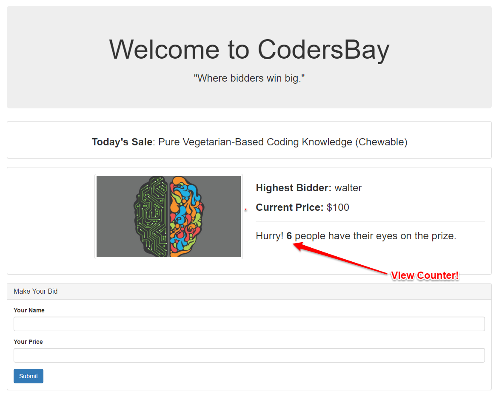

### 6. Student Do: Review CoderBay Presence Example (5 mins)

* As a class, review [16-codersbay-viewtracker/Solved](../../../../01-Class-Content/07-firebase/01-Activities/16-codersbay-viewtracker/Solved). If it seems as if there are a lot of students struggling, once again point out that it's okay if its fuzzy. The point of class today is just to show you the capability here.

### 7. Instructor Do: Scenario Introduction + Today's Group Formation (15 mins)

* Open the solved version of the [17-TimeSheet/Solved/index.html](../../../../01-Class-Content/07-firebase/01-Activities/17-TimeSheet/Solved/index.html) application in a browser and demonstrate it for the class.

* Inform students that today's class will be to re-create this application.

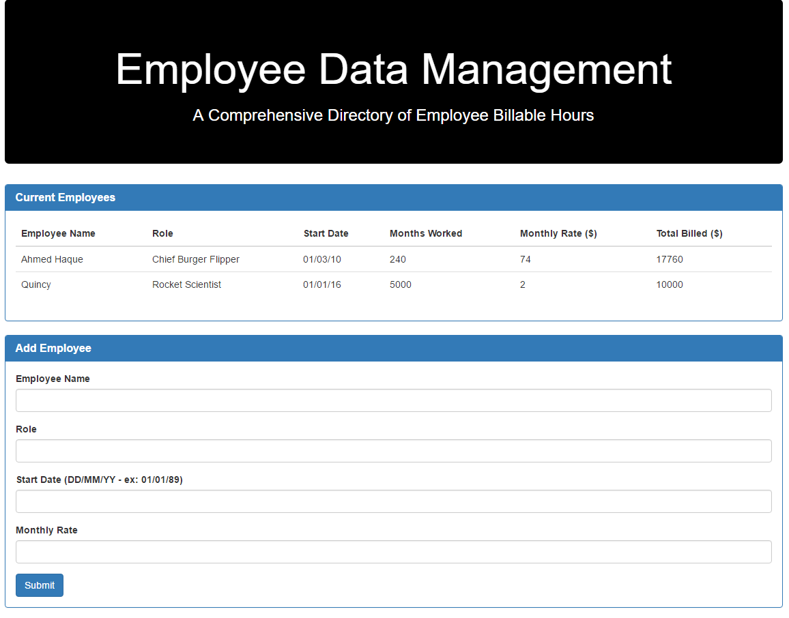

* In discussing the app, point out that this application is intended to serve as a way for employers to monitor their employee names, roles, start dates, lengths of employment, monthly rates, and total amounts billed.

* Create an example employee using the Add Employee Card. When doing so, be sure to point out that we are only inputting "some" fields and that the application is calculating the remaining fields using the initial inputs.

* Finally, break students into groups of three. Each group must have at least one student from each section. (Groups can be pre-determined or self-selected).

### 8. Everyone Do: Where's the Data? (5 mins)

* Pose the questions to students:

  * "Which fields MUST BE in the database?"

  * "Which fields can we avoid sending to the database in favor of calculating locally?

### 9. Instructor Do: App Backend Demo (5 mins)

* Open your local version of the `01-TimeSheet` application as well as your Firebase database so that they are side-by-side.

* Then create a new employee and demonstrate that the only fields being saved in the database are:

  * Employee Name
  * Role
  * Start Date
  * Monthly Rate

    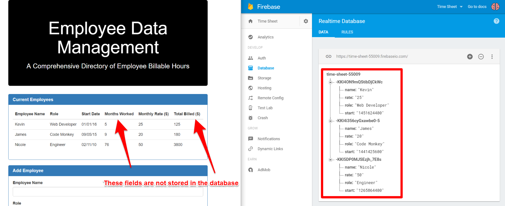

* Ask students why this approach might have advantages over uploading every calculated field into the DB.

* Explain to students that this approach of storing limited data on the backend has its advantage because it allows us to avoid "constantly" sending updates to the database every month (or in other situations, every second) as employees' tenures grow.

### 10. Students Do: Main Application Design Phase (20 mins)

* Instruct students that for the first phase of today's class, they will be focused on re-creating (or improving) the front-end design of the Employee Data Management page you showed earlier.

* Then slack out the following instructions:

* **Instructions:**

  * For the next 20 minutes, focus all your efforts on creating the application layout for your site.

  * This phase involves both:

    * Creating the overall HTML/CSS/Bootstrap Layout

    * Creating the initial `.on("click")` event that will dynamically trigger new HTML rows to be generated.

  * This phase DOES NOT involve sending or receiving data to Firebase.

  * If you finish early:

    * Continue refining the design! Take things to the next level. Make this application portfolio-grade!

    * Begin reading about `push({})` and `.on("child_added")` in the Firebase documentation.

- - -

### 11. Lunch (30 mins)

- - -

### 12. Instructor Do: Intro to Push (15 mins)

* Confirm that all students were able to create an initial design. If any students are significantly behind and were unable to create an initial layout, instruct a TA to work with that group to help them catch-up during the next phase. (In today's class, we won't be offering "catch-up" code as we would normally. This is all about giving them their first taste of project week).

* Then open up the file [01-recent-user-with-set.html](../../../../01-Class-Content/07-firebase/01-Activities/18-Push/01-recent-user-with-set.html) inside `18-Push`. Remind students that this is the same application we've worked on before. Create a new user to remind students how it replaces the most recent member on the screen and how, when you close the browser and re-open it, the same member is still displayed.

* Now open the database attached to your `01-recent-user-with-set` example. Point out that whenever you create a new member it isn't actually _saving_ the new member, it's just replacing it with the latest one.

  * 1st submission...

    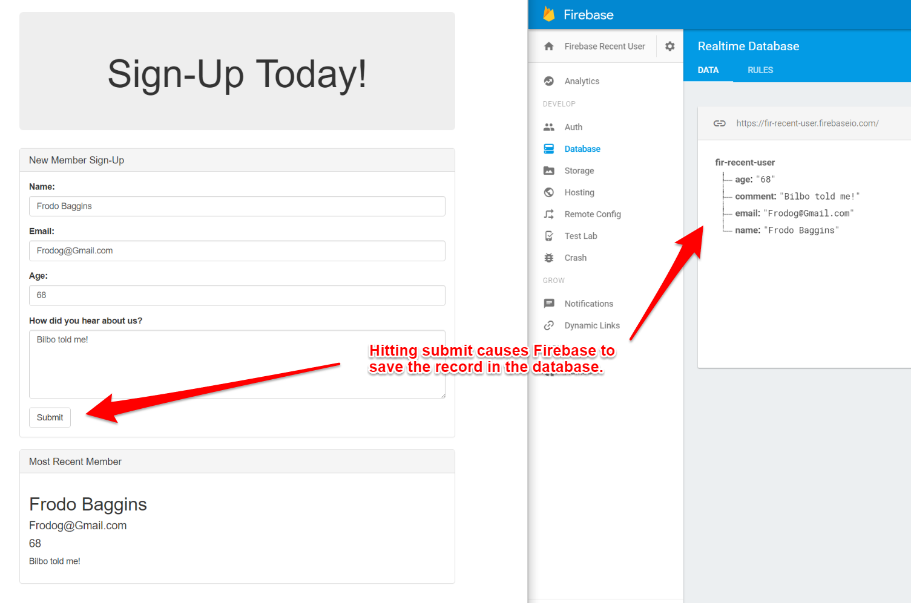

  * 2nd submission ("Where's Frodo??)...

    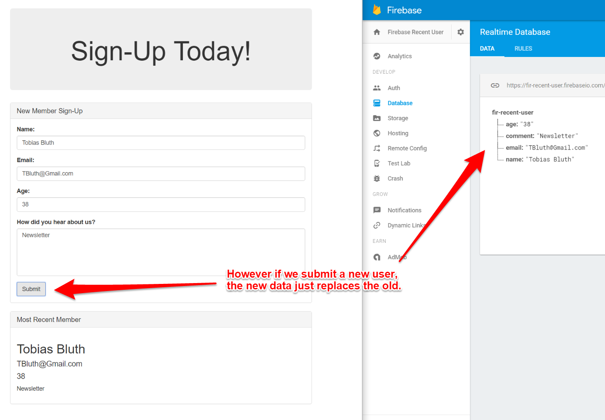

* Explain that this is the limitation of the `.set({})` method we've been using since it will override all data in the directory.

    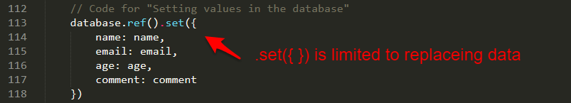

* Now go back to the code and then replace the `.set({})` method the `.push({})` method.

    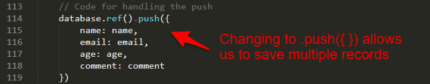

* Refresh the page in your browser and once again add a new user. Point out how this time, instead of replacing the old member, Firebase created a new separate entry. Create a few more users and allow students to see how the database responds.

    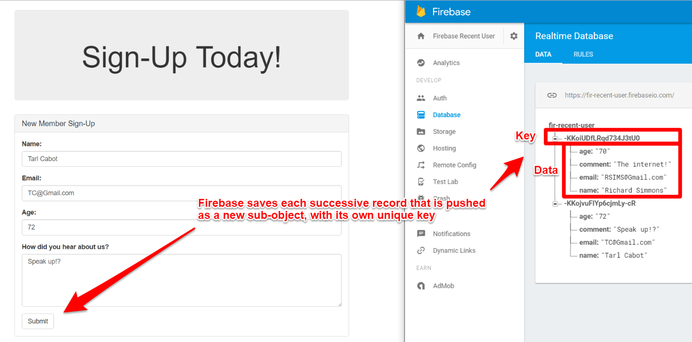

* Explain that each of these entries that Firebase is creating are called "children".

* Answer any questions students may have about this and then slack out the file [02-recent-user-with-push.html](../../../../01-Class-Content/07-firebase/01-Activities/18-Push/02-recent-user-with-push.html) inside `18-Push` for them to see.

### 13. Students Do: Main Application - Push Phase (25 mins) (High)

* Now, instruct students to return to their main Employee Tracker application and slack out the following instructions.

* **Instructions**

  * Using your newfound knowledge of the `.push({})` method, create the code necessary to push employee data into the database upon clicking the `submit` button on your webpage.

  * NOTE: Don't worry about getting the data to display in the HTML just yet. Just focus on getting data pushed to the database.

  * If you finish early, begin reading about `.on("child_added")` in the Firebase documentation and/or the MomentJS library.

### 14. Instructor Do: Intro to Child_Added (15 mins)

* Open the file [recent-user-with-all-users-solved.html](../../../../01-Class-Content/07-firebase/01-Activities/19-Add_Child/recent-user-with-all-users-solved.html) inside `19-Add_Child` in the browser. Demonstrate to students how the previous Recent-User example has been expanded to not only showcase the most recent users but also to create a running list of users.

* Show students that the Firebase Database is keeping a running list of all the users as "children" and that we are using a new Firebase method to retrieve and display the children data in our HTML.

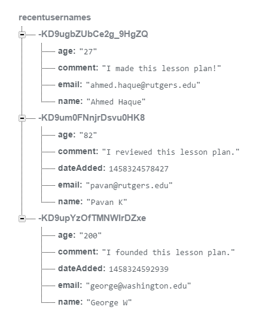

* Now, open either `recent-user-with-all-users.html` or [recent-user-with-all-users-solved.html](../../../../01-Class-Content/07-firebase/01-Activities/19-Add_Child/recent-user-with-all-users-solved.html) inside `19-Add_Child` in your editor. (If you'd like to attempt live-coding choose the unsolved version. If you're short on time or feel more comfortable just explaining open the solved version.)

* Walk students through the process of creating this new functionality using the below details as a guide.

  * First, point out that we've kept the same `.push({})` method to send data into our database.

  * Be sure to point out that we've added a special property called `Firebase.ServerValue.TIMESTAMP`. This will add a timestamp in Unix format in our database.

    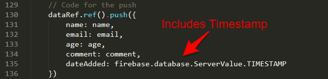

  * Next, show them that instead of using the `.on("value")` function, we have replaced it with `.on("child_added")`. Explain that this event gets run both at the start of our application run AND whenever a new child (i.e. user) is added to the DB. Point out that all data is stored in the `childSnapshot` variable.

    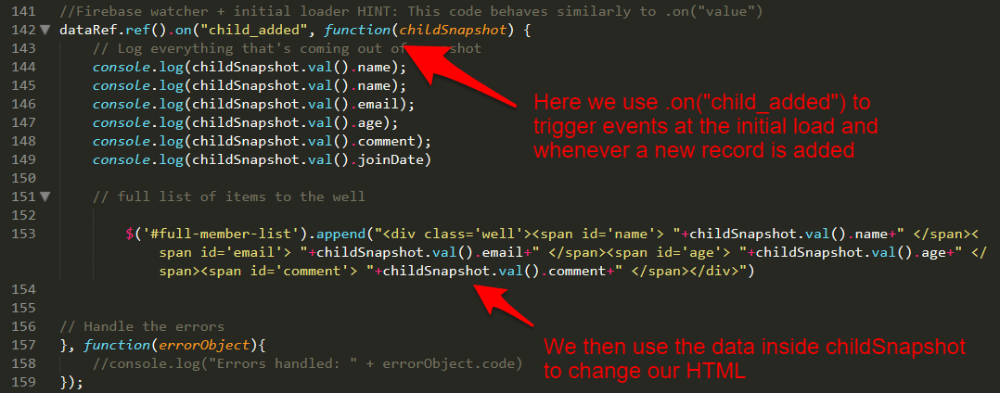

  * Finally, show them that we have this `.orderByChild` method which sorts all or the records in our database by date and then shows us only the most recent record (for the "Recent Member" Card). Again that record is stored in `snapshot` variable.

    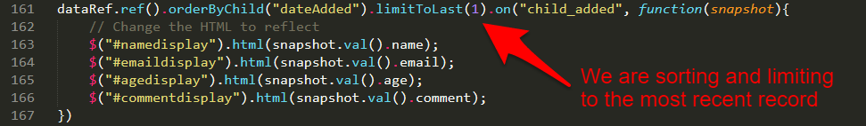

* Give students a few moments to ask questions before slacking out the code to them.

* Let them know that they will be using this code as an example for their Employee Tracking application.

### 15. Students Do: Main Application - Child_Added Phase (25 mins) (High)

* Now instruct students to return to their main Employee Tracker application and slack out the following instructions.

* **Instructions**

  * Using your newfound knowledge of the `.on("child_added")` method, begin to retrieve your employee data from the database and populating the records into your table.

  * Note: Don't worry about calculating Months Worked or the Total Billed just yet. Just focus on retrieving the data that is already in the database.

  * If you finish easily, continue refining the aesthetics of your website, consider incorporating "update" or "delete" employee buttons, or begin reading up on the MomentJS library.

### 16. Instructor Do: Intro to MomentJS (5 mins)

* Go to the [MomentJS Library](http://momentjs.com/) website.

* Begin to explain that, in web development, there are often numerous instances where one needs to work with or manipulate dates and times. Using native JavaScript this can be difficult because parsing out a date like "3/3/2016 03:25 AM" is not straightforward.

* Explain that MomentJS provides a standardized set of tools for parsing, adding, subtracting, and comparing datetimes.

* Show students a very simple example of using the momentjs library. As a suggestion, you can use the code in [`momentjs-instructor.html`](../../../../01-Class-Content/07-firebase/01-Activities/20-MomentJS/Unsolved/momentjs-instructor.html) as an example of formatting the current datetime into a readable format.

  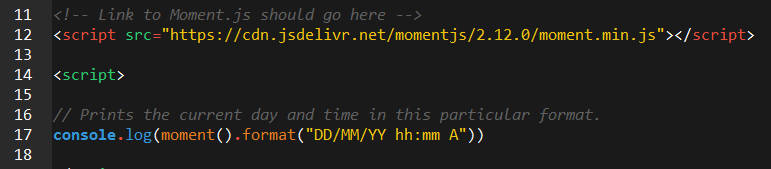

### 17. Students Do: MomentJS Activity (15 mins) (High)

* Now let students know that as web developers one challenge that's a big part of the job is reading documentation and quickly becoming familiar with how to use it on your own. So for the next few moments, they will be working on an activity in which they will use more advanced features of the MomentJS library.

* Slack out the following file and instructions to students.

* **File:**

  * `momentjs-activity.html`

* **Instructions:**

  * Complete each of the activities listed in the comments.

  * Note: You don't need to go in order.

  * Note: Don't let the simple example fool you. Working with a new library can be tough. Be prepared to get frustrated. Stick with it!

### 18. Instructor Do: MomentJS Activity Review (5 mins) (Med)

* Offer to let students come to the front and solve whichever questions they were able to solve.

* Open [momentjs-activity-solved.html](../../../../01-Class-Content/07-firebase/01-Activities/20-MomentJS/Solved/momentjs-activity-solved.html) inside `20-MomentJS` file and walk students through the solution. Remind them that this was a hard activity!

  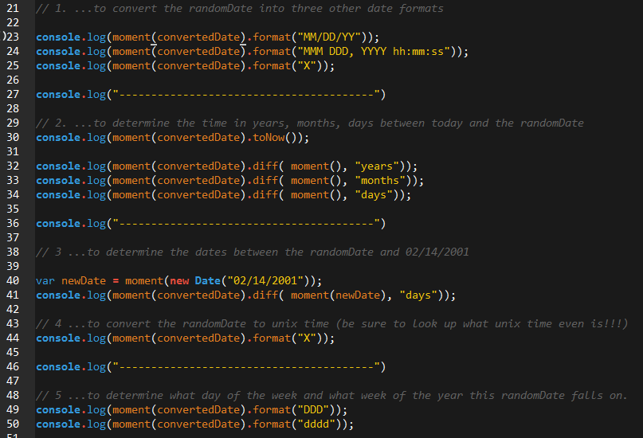
  
* Slack out the solution when done.

### 19. Instructor Do: Introduce Checkpoint - Timers and APIs (5 mins) (Critical) 

* Let your class know that they will now be taking a short multiple choice assessment to check their understanding of Timers and APIs

* DO NOT SKIP THIS INTRODUCTION. DO NOT JUST SEND OUT THE LINK WITHOUT CONTEXT

* Reassure the students that they need not be nervous about the checkpoint:

  * "This will not affect your grade or graduation requirements."

  * "This is not like the tests and quizzes you might be used to from school or college. The purpose of these tests is not to motivate you to study or punish you for struggling."

  * "This is as much a test of me as an instructor and of the course content as it is of you. We are here to ensure your success, and this is one of the tools we use to make sure we are doing that effectively. This class moves _fast_, so if some or all of you misunderstand something important we as an instructional team need to find out as fast as possible so we can help."

  * "Long story short, this quiz cannot hurt you. Only help you."

* Let students know that they should read carefully and focus on thinking about the right answer rather than using any test-taking skills they may have learned:

  * "There are no silly answers or obvious throwaway responses on this quiz because those kinds of answers reduce the likelihood that we'll be able to figure out whether we've taught something effectively."

  * "Test-taking strategies you may have learned for standardized tests _will not work_, so instead of focusing on eliminating wrong answers or looking for sneaky context cues, read the question and each of the possible choices carefully."

* Reassure students once again that the purpose of this is to help them, and remind them that the outcome does not impact their grade or graduation requirements. You should do this _every single time_ you give a Checkpoint.

* You or your TAs should now get the link specific to your class:

  * Navigate in your browser to: `https://www.switchboard.tech`

  * Select your class code (if it doesn't show up on its own)

    * If the class is a parallel class, a class that has two classes combined on a Saturday, and doing a checkpoint with two classes at once you will **need** to slack out two links.

    * One for your class and one for the other. 

  * Select the Checkpoint and copy the resulting link

### 20. Students Do: Take Checkpoint - Timers and APIs (10 mins) (Critical)

* Slack out the link to the Checkpoint

* Let your students know that once they select their name, it will take them to the Checkpoint

* Checkpoints must be completed in class, **not at home**, to ensure you will be able to effectively find and help struggling students 

* TAs should walk around the class to ensure students aren't looking up answers

* Keep in mind we do not use grades from assessments toward graduation requirements. However, students will be tempted to avoid feeling like they don't understand something.

* It's important for instructional teams to create an environment where it is safe to fail, but also where such failure is visible. You should not be worried about "cheating" on checkpoints, only making sure that students who need help aren't remaining invisible.

* Your SSM will have the results of the Checkpoint within an hour of its completion

### 21. End (0 mins)

### 22. TAs Do: Structured Office Hours - Review Timers and APIs (20 mins)

* Navigate in your browser to: `https://github.com/coding-boot-camp/checkpoint-bank/blob/master/checkpoints/multiple-choice/05-Timers-and-APIs-MC/05-Timers-and-APIs-MC.md`

* There you will find the questions and answers to the Checkpoint given.

* Please take the entire office hours time to review the questions with the students.

* Suggestion Format:

  * TAs ask a question at a time to the class.

  * Let the students try to answer it.

    * If you see that a majority of the class has a misunderstanding with a question:

      * Take your time on this question!

    * If you see that a small number of students has a misunderstanding with a question:

      * Do your best to reinforce the misunderstanding but be cautious of your time.

      * Make note of the students that are still struggling with the question and schedule a 1:1 with the students.

  * If applicable, demo the answer.

* Take your time on these questions!

* This is a great time to reinforce concepts and misunderstandings!

### Lesson Plan Feedback

How did today's class go?

[Went Well](http://www.surveygizmo.com/s3/4325914/FS-Curriculum-Feedback?format=ft&sentiment=positive&lesson=04.02)

[Went Poorly](http://www.surveygizmo.com/s3/4325914/FS-Curriculum-Feedback?format=ft&sentiment=negative&lesson=04.02)
