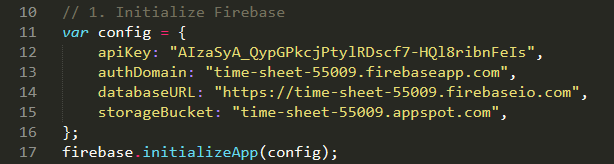
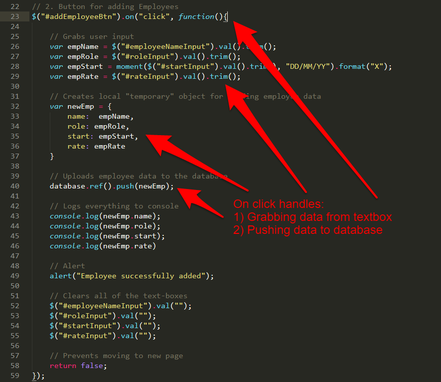
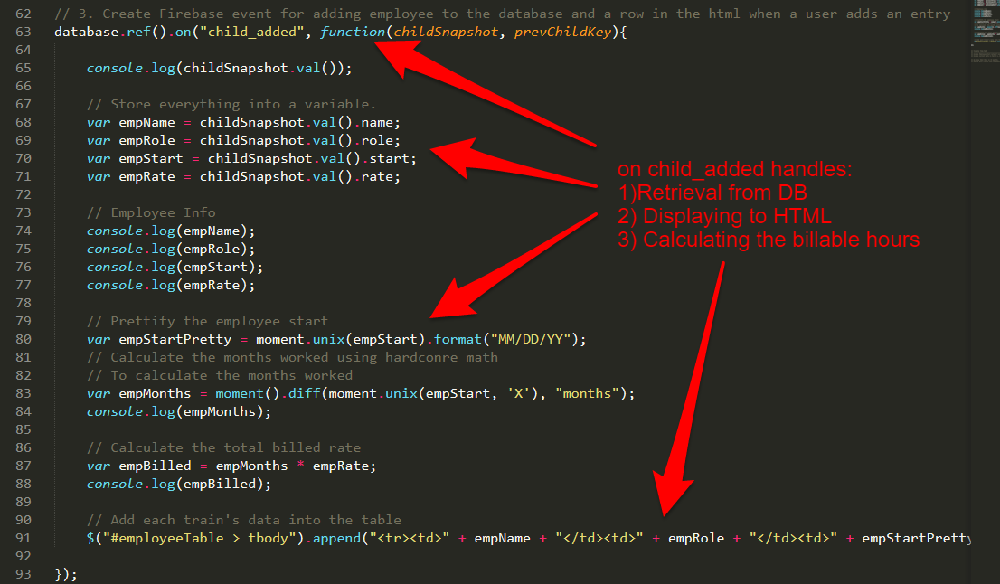

## 4.3 - Firebase application building & Group Projects (10:00 AM) <!--links--> &nbsp; [⬅️](../02-Day/02-Day-LessonPlan.md) &nbsp; [➡️](../04-Day/04-Day-LessonPlan.md)

### Overview

In this class, we will be using Firebase and MomentJS to create a real-world application for calculating billable hours.

Next, students will have time to work together on their homework.

Last but not least, students will begin work on their first Project of the Boot Camp, an API-powered web application that pulls data from multiple sources in a creative way.

`Summary: Complete Activity 21 in Unit 07 & Start Project`

##### Instructor Priorities

* Prior to class, you will need to create a Firebase database for use in today's lecture. Place the config from the database you create into the `17-TimeSheet` example.

  * **Your Firebase DB Goes Here**

    * [timesheetLogic.js](../../../../01-Class-Content/07-firebase/01-Activities/17-TimeSheet/Solved/timesheetLogic.js) inside `17-TimeSheet`
      

* Students should complete and understand the Train Prediction Activity

* Students should build their confidence at building applications from scratch

* Students will be given requirements for Project 1.

* Students will brainstorm project ideas, research APIs, and begin initial planning of their projects.

* Students will submit a project proposal (ideas, outlines, APIs) by end of class for feedback.

* Students will be able to create a repository on GitHub and add collaborators.

* Students will be able to protect their `master` branch.

* Students will have an understanding of feature branches.

* Students will be able to submit pull requests and perform code review.

##### Instructor Notes

* Today's in-class activity is _highly_ related to the Train Time homework assignment, and as such, merits significant effort from students.

* As Instructors / TAs, keep in mind that the success of your students post-boot camp is largely dictated by the quality of their projects. Encourage and help steer them in every way you can towards high-quality final projects!

* Instructors / TAs, take a few moments before class to review the presentations posted on this link: <https://www.youtube.com/playlist?list=PLe80S_8KApqOTw-2-b-sgzTwwWImepoii>. Do not share these with students, but it will help you understand what's possible! 

* You and the TAs may want to implement a "workshop" series (10-20 mins) with individual groups. In these workshops, student groups will rotate between the Instructor and TAs to get help on specific topics like "Refining Ideas", "Finding the Right API", "Creating a Layout", etc.

`Note: This approach works best if you can find secluded spaces to work with individual groups.`

* If time permits and you would like to show students a free mockup tool before they begin their brainstorming session,[pencil project](http://pencil.evolus.vn/Default.html) is a free open-source desktop GUI prototyping tool. 

* Some popular API choices do not support CORS. Have students use <https://cors-anywhere.herokuapp.com/> as a workaround.

* Have your TAs reference [03-Day-Time-Tracker](03-Day-TimeTracker.xlsx) to help keep track of time during class.

### Sample Class Video (Highly Recommended)
* To view an example class lecture visit (Note video may not reflect latest lesson plan): [Class Video](https://codingbootcamp.hosted.panopto.com/Panopto/Pages/Viewer.aspx?id=5290095e-3a2d-4071-a850-832516d59722)

- - -

### Class Objectives

* To provide a "real-world" application development scenario that utilizes HTML, CSS, Databases, and Data Manipulation

* To introduce students to Project Week, its timeline, and the deliverable requirements

* To provide students an opportunity to brainstorm project ideas and obtain instructor approval for project direction.

- - -
### 1. Welcome back! (2 min)

* Let students know how exciting today will be! They'll get to build an application with _data persistence_, and brainstorm ideas for their first project!

* Students are probably feeling very confused, assure them that they're doing awesome and their knowledge will be reinforced in this next activity!

### 2. Students Do: Main Application - Datetime Manipulation (10 min)

* Open the [timesheetLogic.js](../../../../01-Class-Content/07-firebase/01-Activities/17-TimeSheet/Solved/timesheetLogic.js) file in `17-TimeSheet`, remind the students what this application did.

* Students will now attempt to complete the Employee Tracker application, utilizing their newfound datetime knowledge to calculate the number of months worked and subsequently the total amount billed.

* Instructors and TAs should be walking around to see how students are doing.

### 3. Instructor Do: Recap the Employee Tracker application (5 min)

* Open the [timesheetLogic.js](../../../../01-Class-Content/07-firebase/01-Activities/17-TimeSheet/Solved/timesheetLogic.js) file in `17-TimeSheet`.

* Spend a little time reviewing the Employee Tracking Application. Don't expect to walk students through everything. Keep things at a high-level, and encourage students to look back at this working code. It is nearly identical in structure to the TrainTime Homework.

* Key points to emphasize:

  * There are two major `.on` events.

  * The first is the `.on("click")`. This event takes data from the textboxes and relays it to the database.

    

  * The second is the `.on("child_added")`. This event retrieves data from the database and displays it in the HTML. This event gets run both at the beginning of the application's launch and each time a new entry is added to the database.

    

  * Finally, point out that we use moment.js to calculate the difference between the current time and the time of the employee's start date. Let students know that they will have one more example of using MomentJS that will help if they struggled with this part (the next activity).

* Don't get so buried in the explanation of this app that you don't get to the next set of activities. The next few activities are critical to the homework's completion!

### 4. Everyone Do: Traintime Prediction (Math) (10 min)

* Demo the firebase trains HW solution from <https://train-time-fsf.herokuapp.com/>.

* Remind students how this application works. Point out that, in this application, administrators input the time for the first train of the day and the frequency with which a train arrives at a station. With this information, the application AUTOMATICALLY calculates the next arrival time.

* This is trickier than it seems and requires a bit of math.

* Let them know that you won't be giving them the answer to this question.

* Then slack out the following instructions to students:

* **Instructions:**

  * With your group write out the steps you would use "mathematically" to determine the answer to the following situation:

  * Assuming:

    1. The first train of the day comes in at 3:00 AM.
    2. The train runs every 17 minutes
    3. The current time is 7:12 PM.
    4. There have been no delays and will be no delays.

  * Question:
    1. How many minutes away is the next train?

### 5. Everyone Do: Traintime Prediction (Code) (15 min)

* Again, let students know that you won't be giving them the answer.

* Instead, slack out the following:

* **File:**

  * `train-example.html`

* **Instructions:**

  * Using the comments in the code as a guide, determine the mathematical formula for calculating train times.

  * Then explain to one another how the code works (line by line) and how it could be used in relation to the homework assignment.

### 6. Instructor Do: Project Group Formation (5 min)

* As a final activity for the day, let students know the rest of the week is for projects!

* Then, slack out the Team lists along with the below information.

* **Instructions:**

  * Project Goal:

    * Build Something Awesome

  * Requirements:

    * Must use at least two APIs

    * Must use AJAX to pull data

    * Must utilize at least one new library or technology that we haven’t discussed

    * Must have a polished frontend / UI

    * Must meet good quality coding standards (indentation, scoping, naming)

    * Must NOT use alerts, confirms, or prompts (look into modals!)

    * Must have some sort of repeating element (table, columns, etc)

    * Must use Bootstrap or Alternative CSS Framework

    * Must be Deployed (GitHub Pages or Firebase)

    * Must have User Input Validation
    
  * Presentation Date:

    * One Week from Today

* Be pumped!

### 7. Slack out the Video Guide (0 mins)

* Slack out the video guide for this week's key activities and last week's homework! Emphasize how helpful a tool these videos can be if a student feels as if they are falling behind or simply wants to review the material once again.

### 8. Instructor Do: Present the Project Week Slideshow (25 mins)

* Open up the [API_Project.pptx](SlideShow/API_Project.pptx) file and present each of the slides. Use the `Teams` slide as a cue for breaking students up into teams. 

* Slack out the [API_Project.pptx](SlideShow/API_Project.pptx) file and the [API_Resources.docx](Supplemental/API_Resources.docx) file. 

* Remind students that they will need to complete a half page proposal to instructors by EOD. Let them know that they can just slack you the file. (This doesn't need to be kept for official purposes. It is merely so you have a way to review their final plans for feasibility sake).

- - -

### 10. Lunch (30 min)

- - -

### 9. Groups Do: Create a Repository (10 mins)

* In this activity, each group will create a project repo and invite all group member as collaborators.

* Refer to [01-Stu_Create-Repository](../../../../01-Class-Content/08-project-1/01-Activities/01-Stu_Create-Repository/README.md), which contains the following instructions:

* **Instructions**: 

```
* Once group member should create a new Github repository. Don't worry about the project name now, this can be changed later.

* From the repo's main page, click the "Settings" tab.

* Once in the repo's settings, select the "Collaborators" menu item on the left.

* From the "Collaborators" page invite your group members to be project collaborators by entering their Github usernames one at a time.

* Each invited group member should receive an email they must open to accept the invitation.

* **Hints**:

* Ask an instructor or TA if you get stuck!
```


### 10. Instructor Do: Pull Requests and Code Review (5 mins)

* Explain that when working with others on the same repo, it's important to make sure that all of the new code gets reviewed by at least one other team member before getting merged into the master branch.

* Assure the class that we'll go into further detail about how this is done, but ask the class: "Why would we want to get code reviewed before merging it into master?"

  * Reviewing new code decreases the chances that a breaking change will accidentally be introduced into the master branch.

  * Code review helps group members who didn't write the code understand how it works.

* Explain that the next step of setting up our project repos for group collaboration is to protect the master branch.

  * Protecting the master branch means we will configure the repo to prohibit any team members from pushing code up into master directly or merging it in without another team member's review.

### 11. Groups Do: Protect Master Branch (5 mins)

* In this activity groups will protect their master branches.

* Refer to [02-Stu_Protect-Master](../../../../01-Class-Content/08-project-1/01-Activities/02-Stu_Protect-Master/README.md), which contains the following instructions:

* **Instructions**: 

```
* Only one member per project group needs to complete this activity. 

* Navigate back to the repo's "Settings" page and then select "Branches" from the left sidebar.

* Under "Branch Protection Rules" select "master" from the drop-down.

* You should be presented with some options, check off the following:

  * "Protect this branch"

  * "Require pull request reviews before merging"

  * "Include administrators"

* If completed successfully, no one should be able to push directly to the master branch. Instead, all changes must be made in the form of pull requests that are to be reviewed by another group member.

* **Hints**:

* Ask an instructor or TA for assistance if you get stuck!
```

### 12. Instructor Do: Branching (10 mins)

* For now, we just want to give students a high-level conceptual understanding of branching.

* Explain that every Git repo starts off with a master branch. This is there to hold the production version of the repo's code. But when we want to work on the code, we start by creating a new feature branch off of master.

  * If we create a new branch from master, it essentially creates a self-contained copy of all of the master branch's code for us to work in.

* When we're satisfied with our work in the new feature branch, we submit a pull request from the feature branch to the master branch.

  * A pull request is a request to merge the diffs or changes from the source branch (the feature branch) to the target branch (master).

  * With the way our repos are set up now, another group member must look at and approve the pull request before its changes can be merged into master.

* Once a feature branch has been merged into master, we delete it and then check back out to the master branch. From there, we'd check back out to a new feature branch and repeat the process for each feature we add.

* Slack out the following image for students to have as a visual aid:

  

* Take a moment to answer any questions, but avoid going too in depth. Students will utilize branches in the next activity.

### 13. Everyone Do: Git Branching/Pushing (15 mins)

* In this activity students will create branches, submit pull requests, and perform code reviews before merging. 

* Refer to [03-Stu_Branching-Pushing](../../../../01-Class-Content/08-project-1/01-Activities/03-Stu_Branching-Pushing/README.md), which contains the following instructions:

* **Instructions**:

```

* **Part I**: Branching and Submitting a Pull Request

* In this section we will create a branch, add a feature, and submit a pull request. **Only one group member should complete this section, everyone else should observe.**

* Clone the project repo onto your computer and cd into it.

* Run the following command in your terminal to create and checkout to a new branch:

  `git checkout -b create-html-skeleton`

* You should now be on a new branch named "create-html-skeleton". In order to verify this worked, run the following command in your terminal:

  `git branch`

* You should see two branches listed: `master` and `create-html-skeleton`. The `create-html-skeleton` branch should have an asterisk to the left of it. This indicates that this is the branch you're currently on.

* At the root of the repo, create a new file named `index.html`. Inside this file, add code for a basic HTML skeleton and save.

* In your terminal, add and commit the changes. Then push up your code by running following in your terminal:

  `git push origin create-html-skeleton`

* This should push up your code to GitHub on a branch with the same name (`create-html-skeleton`).

* Go to the main repo page at github.com and you should see a button that says "Compare & pull request" -- click this.

* On the next screen, add a description of the work that was done in the textarea and click the "Pull Request" button.

* If completed successfully, you should see the pull request listed under the repo's "Pull request" tab.

* **Part II**: Reviewing a Pull Request

* In this section we will review the pull request from Part I and merge it into master. **A different project member should complete this section while others observe**.

* Clone the repo to your computer if you haven't already done so and cd into it.

* First you will want to test the changes introduced by the `add-html-skeleton` branch locally. In order to examine the new branch on your local machine, run the following commands in your terminal:

  `git fetch`

  `git checkout -b add-html-skeleton origin/add-html-skeleton`

* This code should bring the copy of the `add-html-skeleton` branch that's on GitHub onto your computer. 

  * Make sure this worked by verifying that there's an `index.html` file in your local repo.

  * Normally you'd run the code here to make sure everything works properly.

* Check back out to your local `master` branch by running the following in your terminal:

  `git checkout master`

* Now go to your GitHub repo's main page and go to the "Pull request" section. Select the `add-html-skeleton` pull request from the list.

* At the next page select the option to see the "Files changed".

* You should be presented with all of the files that were changed in this PR along with line numbers for any code added/removed.

* If there are any changes you would like made, you can click the line number to leave a comment the PR author will see and should address before approval. Otherwise, click "Review changes" and approve the PR. You should be taken to a screen with an option to "Merge pull request" -- click this button.

* Once complete you can delete the feature branch from your machine by running the following in your terminal:

  `git branch -D add-html-skeleton`

* **Hints**:

* Ask an instructor or TA if you get stuck or have any questions!
```

### 14. Students Brainstorm (120 mins)

* Students begin work with groups to identify ideas, research APIs, and create project designs. 

* At our discretion, Instructor/TA should begin hosting "workshops" to help steer groups in the right direction.

### 15. Instructor Do: Review questions & offer closing thoughts (3 mins)

* Review any overarching questions and offer closing thoughts. 

* Remind them they have all week and encourage them to meet outside of class to work with one another.

### Lesson Plan Feedback

How did today's class go?

[Went Well](http://www.surveygizmo.com/s3/4325914/FS-Curriculum-Feedback?format=ft&sentiment=positive&lesson=04.03)

[Went Poorly](http://www.surveygizmo.com/s3/4325914/FS-Curriculum-Feedback?format=ft&sentiment=negative&lesson=04.03)
