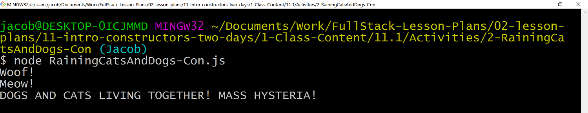
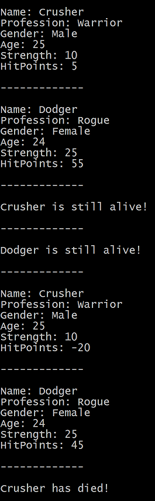
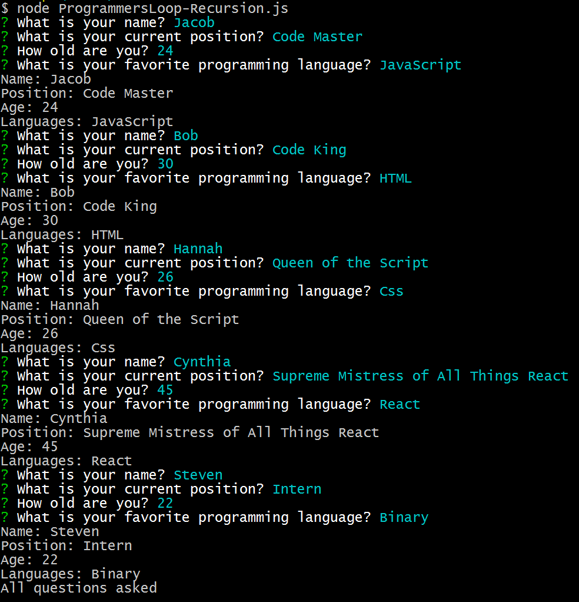

## Day 1 - Constructors <!--links--> &nbsp; [⬅️](../../05-Week/05-Day/05-Day-LessonPlan.md) &nbsp; [➡️](../02-Day/02-Day-LessonPlan.md)

### Instructors and TAs: Please take the Mid-Course Instructional Staff Survey if You Haven't Yet

Trilogy as a company values transparency and data-driven change quite highly. As we grow, we know there will be areas that need improvement. It’s hard for us to know what these areas are unless we’re asking questions. Your candid input truly matters to us, as you are vital members of the Trilogy team. In addition to the individual feedback at the end of lesson plans
we would appreciate your feedback at the following link if you have not already taken the mid-course survey:
[Instructional Staff Survey](https://docs.google.com/forms/d/e/1FAIpQLSdWXdBydy047_Ys1wm6D5iJY_J-0Mo0BqCjfGc4Er2Bz9jo5g/viewform)

### Overview

In this class we will be introducing students to the usage of JavaScript constructors and how they can be used to dynamically create objects with similar schemas.

Today we will be diving into constructors some more by introducing user input into the mix.

`Summary: Complete Activities 1 - 7 & Begin Activity 8 in Unit 11`

##### Instructor Priorities

* Reintroduce students to the basics of JavaScript objects (properties and methods)
* Students should understand how to create a basic JavaScript constructor
* Students should be able to use constructors and user input to dynamically create objects
* Build upon students' knowledge of constructors by linking it to user input
* Introduce and help students overcome the complex relationship between loops, user input, and constructors

##### Instructor Notes

* Constructors are extremely useful in creating objects of similar types and allow for the development of very interesting applications. So long as your students have a firm understanding of how objects function, they should find today's lesson and activities very enjoyable.

* At the beginning of this class, make sure to go over the basics of objects once again so as to help your students recall how they are created and used. This will ultimately help them in understanding constructors better.

* Your students should feel quite comfortable in their ability to use javascript constructors.

* The one stumbling block that your class may encounter today will likely come in the form of utilizing loops, user input, and constructors all together to create multiple objects. Be sure to go over some of the workarounds to these challenges before having your class tackle any of the later activities.

### Sample Class Video (Highly Recommended)
* To view an example class lecture visit (Note video may not reflect latest lesson plan): [Class Video](https://codingbootcamp.hosted.panopto.com/Panopto/Pages/Viewer.aspx?id=a860f003-e8ae-4340-975c-d1bc46888751).

- - -

### Class Objectives

* To master the basics of JavaScript objects.
* To create basic JavaScript constructors for usage in Node applications.
* To create a simple Node application which uses methods contained within a constructed object.
* To feel 100% comfortable using javascript constructors.
* To create simple applications that take in user input and utilize a constructor so as to create objects.

- - -

### 1. Instructor Do: Welcome Class (5 mins)

* Welcome your students to class and tell them that today we will be revisiting objects and building upon our past knowledge of them to create more dynamic object-oriented applications.

* Before diving into the new material, however, we have a small activity for them to work through beforehand to reintroduce them to objects.

### 2. Students Do: Raining Cats and Dogs (15 mins)

* Slack out the following instructions.

* **Instructions**

  * Make a dogs object with three keys...

    * First key called "raining" with a value of true.

    * Second key called "noise" with a value of "Woof!"

    * Third key called "makeNoise" which contains a function which console.logs the noise to the screen if it is raining dogs.

  * Make a cats object with three keys...

    * First key called "raining" with a value of false.

    * Second key called "noise" with a value of "Meow!"

    * Third key called "makeNoise" which contains a function which console.logs the noise to the screen if it is raining cats.

  * Make the dog bark.

  * Make the cat meow.

  * BONUS: Create a function called "massHysteria" which takes in both the cats and the dogs object and prints "DOGS AND CATS LIVING TOGETHER! MASS HYSTERIA!" if both of the `raining` keys are equal to true.

  * BONUS: Look to see if you can find any means to simplify your code further and further.

### 3. Everyone Do: Raining Cats and Dogs Demo (10 mins)

* Open up your editor and call upon a couple students at random to come up and code out specific parts of the assignment whilst explaining their logic to the class.

* Run the completed code in Git Bash and then go over the code line-by-line with the class.

  * The code should look similar to the code we have provided you in [rainingCatsAndDogs-noCon.js](../../../../01-Class-Content/11-js-constructors/01-Activities/01-RainingCatsAndDogs-NoCon/Solved/rainingCatsAndDogs-noCon.js)

    * This is what will print out on screen...
      

  * Make certain to point out how we created keys and methods within the dogs and cats objects.

  * Also make certain to point out how we were able to call the values/methods of our cats and dogs objects later on in the code.

* Ask the class if they see anything in this code which seems redundant upon further examination.

  * The cats and dogs objects have the same keys and the same overall layout. The only thing that differs between the two is the data contained within their keys.

* Ask your students if any of them came up with a foolproof way to get rid of this redundancy.

  * Answer... JavaScript Constructors!

  * Another potential answer could be JavaScript prototypes, but if this solution comes up then tell the class that we may go over prototypes later on if we have time.

### 4. Instructor Do: Cats and Dogs, Constructed Together! (15 mins)

* Open [rainingCatsAndDogs-con.js](../../../../01-Class-Content/11-js-constructors/01-Activities/02-RainingCatsAndDogs-Con/rainingCatsAndDogs-con.js) within your editor and ask your students to point out the differences between this code and the one we created for the last activity. Go over the code as they discover differences.

* This code uses what's known as a constructor and it is essentially a function which can be called upon to create an object with a particular layout.

  * Be sure to point out how the first letter of the constructor is capitalized. This syntax is to make it easier for coders to distinguish constructors from their other functions.

* In order to create an object using a constructor, you would initialize a specified variable to hold the value `new Constructor()` where `Constructor()` is the function created earlier.

  * This tells the computer to create a new object using the predefined constructor schema.

* Objects created using this method can then be called as per usual.

  * Warn your students that they should never call a constructor function by itself. If this is done, it will create global variables for those keys within it, potentially overwriting any variables that share the same name.

### 5. Students Do: Character Creation (30 mins)

* See if there are any questions and then Slack out the following activity.

* **Instructions**

  * Over the course of this activity you are going to be using constructors to create simplistic characters for use within a very basic Roleplaying Game (RPG).

  * Each character created using your constructor should have the following properties...

    * Name: The character's name --> String

    * Profession: What the character does for a living --> String

    * Gender: The character's gender --> String

    * Age: The character's age --> Integer

    * Strength: Abstraction for how strong the character is --> Integer

    * HitPoints (HP): Abstraction for how much health the character has --> Integer.

    * PrintStats: Function which prints all of a character's properties to the screen.

  * Once you have created your constructor, create two new characters and print their properties to the screen.

    * Fool around and get comfortable with your constructor before moving onto the next parts of the activity.

  * Now that you feel comfortable with your constructor, it is time to start making this character creation system a little more reactive by adding in some more methods...

    * IsAlive: Function which prints whether or not this character is alive by looking into their hitpoints and determining whether they are above or below zero.

    * Attack: Function which takes in a second character's hitpoints and subtracts this character's strength from it.

    * LevelUp: Function which increases this character's Age by 1, their Strength by 5, and their HitPoints by 25.

  * BONUS: After completing the previous sections and making sure they work, you now have everything you need to create a very basic RPG where two characters fight one another. Don't worry if you cannot finish this part of the activity as, by completing the above sections you are well on your way to mastering constructors!

### 6. Everyone Do: Character Creation Summary (15 mins)

* Open up [characterCreate.js](../../../../01-Class-Content/11-js-constructors/01-Activities/03-CharacterCreate/Solved/characterCreate.js)  in your editor and start to go over the code line-by-line, making certain to point out how this constructor would allow for programmers to create any number of "Character" objects by changing up the values passed into the constructor.

* Also make certain to point out how the `Character.attack()` and `Character.levelUp()` methods can be called to alter the values contained within either object. This allows us to run these methods instead of having to create external functions to do the same thing.

* See if anyone in the class was able to tackle the bonus - no worries if no one did - and then start working alongside the class to construct a very basic RPG where two characters attack each other until one is defeated.

  * The solution to this can be found within [characterCreate-withRPG.js](../../../../01-Class-Content/11-js-constructors/01-Activities/03-CharacterCreate/Solved/characterCreate-withRPG.js)  in case you are low on time or no one in the class was able to come up with a solution to the problem.

  * Output of the code should look something like this...

    

### 7. Everyone Do: Building On Constructors (10 mins)

* Ask them how we might want to go about adding new and unique properties/methods to constructed objects.

  * They may not wholly understand why you would want to do this, so explain to your students how there may be some cases in which you may want constructed objects to differ in some way.

  * For example, a teacher and student object could both be constructed from a basic Programmer object, but we may want the teacher property to include a unique property called `programsToGrade` which would not be included in the student object.

* There is a very simple solution to this problem as it is EXACTLY like adding new properties and methods to regular JavaScript objects. All you have to do is assign a new property by calling the object (`student`), attach the new property to it after a period (`student.HW`), and then assign it a value (`student.HW="completed"`).

  * The same would go for adding a new method except it would be declared to `function(){}`.

### 8. Students Do: Tamagotchi Time (40 mins)

* See if there are any questions and then Slack out the following activity.

* **Instructions**

  * Remember Tamagotchis? They were those little toys that contained "digital pets" which you could feed, pet, play with, and care for. Kind of like Furbies but a whole lot less terrifying. Over the next thirty minutes or so, you are going to create your own basic Tamagotchi clone using constructors.

  * Create a constructor called "DigitalPal" which will create four properties and four methods...

    * The first property is "hungry" and it initially starts out as false.

    * The second property is "sleepy" and it initially starts out as false.

    * The third property is "bored" and it initially starts out as true.

    * The fourth property is "age" and it initially starts out at 0.

    * The first method is "feed()" - If hungry is true, print "That was yummy!", set hungry to false, and then set sleepy to true. If hungry is false, print "No thanks! I'm full."

    * The second method is "sleep()" - If sleepy is true, print `Zzzzzzz`, set sleepy to false, then set bored to true, and then run increaseAge(). If sleepy is false, print "No way! I'm not tired."

    * The third method is "play()" - If bored is true, print "Yay! Let's play!", set bored to false, and then set hungry to true. If bored is false, print "Not right now. Later?"

    * The fourth method is "increaseAge()" - This method runs within the sleepy() method when the DigitalPal goes to sleep and increases the DigitalPal's age by one while also printing "Happy Birthday to me! I am "+age+" old!"

  * Create a variable named "Dog" that is set to a new DigitalPal before adding the following unique properties/methods to it...

    * Outside - Initially set to false.

    * Bark() - Prints out "Woof! Woof!" when run.

    * goOutside() - If outside is false, prints "Yay! I love the outdoors!", sets outside to true, and runs Bark(). If outside is true, prints "We're already outside though..."

    * goInside() - If outside is true, prints "Do we have to? Fine..." and sets outside to false. If outside is false, prints "I'm already inside..."

  * Make a second variable named "Cat" that is set to a new DigitalPal and add the following methods to it:

    * HouseCondition - Initially set to 100... But not for long...

    * meow() - prints out "Meow! Meow!" when run.

    * destroyFurniture() - Lowers HouseCondition by 10 and prints `MUAHAHAHAHA! TAKE THAT FURNITURE!` to the screen. Also sets bored to false and sleepy to true. If HouseCondition is equal to 0, then this should not run anymore.

    * buyNewFurniture() - Raises HouseCondition by 50 and prints "Are you sure about that?" to the screen.

  * Play around with your newly created digital pets for a bit and see what else you could add in order to make them even more exciting!

  * BONUS: Make it so your Tamagotchis run off of user-input. It may sound easy at first, but this can actually be quite challenging. We will be going over this in more detail during the next class.

### 9. Everyone Do: Tamagotchi Summary (15 mins)

* Ask your class to raise their hands if they managed to get their "Digital Pets" to function properly and then call upon some of the more confident students to come up to the front of the class to code out the many different parts of the activity.

  * This activity has a lot of parts to it, so you should be able to get everyone to come up to code out sections of it. We would recommend having each student who comes up tackle at least one method.

* Once the code is complete, add in the code to make it so the program will run a few lines in the console and then go over it once more.

- - -

### 10. Lunch (30 min)

- - -

### 11. Students Do: Constructing Programmers (5 mins)

* Slack out the following instructions...

* **Instructions**

  * In this activity, we are going to create a constructor function called "Programmer" which can be used to create objects containing information on various programmers.

  * Your "Programmer" constructor should be able to take in the following information...

    * The programmer's name
    * Their position/job title
    * How old they are
    * Favorite programming language

  * Now create a method for the constructor that would print all of the information contained within an object to the console.

  * Finally, create a "Programmer" object and call the method to print its contents.

### 12. Everyone Do: Constructing Programmers Summary (5 mins)

* Once everyone has completed the activity, open up [programmers.js](../../../../01-Class-Content/11-js-constructors/01-Activities/05-Programmers/Solved/programmers.js) inside of your editor and discuss it with the class whilst answering any questions which they might have.

* Point out how the process of creating new Programmer in this example could get rather tiresome since we are constantly having to modify our code each and every time. This is where user input comes in to save the day.

### 13. Instructor Do: Input + Constructors = Less Work Overall (5 mins)

* Open up [programmersWithPrompt.js](../../../../01-Class-Content/11-js-constructors/01-Activities/06-ProgrammersWithPrompt/programmersWithPrompt.js) within your editor and start to go over the code with your students.

* Be certain to run `npm install inquirer` within your terminal before executing the code.

* Make sure to point out how the creation of our new Programmer object and the calling of its `printInfo()` are located within the `.then` statement.

  * This is done so as to ensure that the constructor can appropriately grab the answers while also making certain that the `printInfo()` method is only run when there is a populated object. Doing otherwise would return an error.

### 14. Everyone Do: Making Multiples With Recursion (15 mins)

* Slack out the above code to your students and let them play around with if for a little bit \[3-5 minutes or so] with the intention of creating multiple objects.

  * The majority of your students will attempt to use a loop of some kind in order to accomplish this task. That will not work. If you wish, you can tell them this beforehand or you could let them stumble across the error for themselves.

* After a short amount of time, call your class' attention back to the front and open up [programmersLoop-noRecursion.js](../../../../01-Class-Content/11-js-constructors/01-Activities/07-ProgrammersLoop/programmersLoop-noRecursion.js) within your editor and go over the code written with your class. Ask them all what they think this code will print to the console.

  * After you have gotten a couple answers, open up terminal and execute the code.

  * Be certain to run `npm install inquirer` beforehand or else the code will not run at all.

* Something similar to the following should print to your terminal... Which seems odd...

  

* It appears that inquirer is asking the same question five times at once and is only accepting a single response. This creates five Programmer objects that are all exactly the same as each other which is not useful at all. What gives!?

  * Well, it turns out that our for loop is the culprit here. It is not waiting for the previous instance of inquirer to complete before moving onto the next one. As such, inquirer is being run multiple times at the same time.

* The way in which we solve this is by utilizing a coding technique called "recursion" to call upon inquirer only after the last instance has been completed. Seems complex, but it is actually quite a simple/helpful tool once you get the hang of it.

* Open up [programmersLoop-recursion.js](../../../../01-Class-Content/11-js-constructors/01-Activities/07-ProgrammersLoop/programmersLoop-recursion.js)  within your editor and go over the code with your class.

  * Once you have gone over the code, run it within your terminal to show how it works.

  

* While this code works, it is still not 100% effective since our objects are still only obtainable within our function and we are not able to access them afterwards. In order to counteract this, we will want to push all of our objects into an array so that we can call upon them individually at a later time.

* Open up [programmersLoop-recursionArray.js](../../../../01-Class-Content/11-js-constructors/01-Activities/07-ProgrammersLoop/programmersLoop-recursionArray.js) , run the code, and then go through the new additions.

  * Run the code in terminal and answer whatever questions your class may have before slacking out this final bit of code and moving onto the next activity.

### 15. Students Do: Team Manager (55 Mins)

* This is a 2 part assignment. Part 2 will be completed at the start of class tomorrow.

* Slack out the following instructions for part 1...

* **Instructions**

  * Over the course of this assignment you are going to put together a function which uses constructors and user input to create and manage a team of players.

  * Start out by creating a constructor function called "Player" with the following properties and methods...

    * `name`: Property which contains the player's name.
    * `position`: Property which holds the player's position.
    * `offense`: Property which is a value between 1 and 10 to show how good this player is on offense.
    * `defense`: Property which is a value between 1 and 10 to show how good this player is on defense.
    * `goodGame`: Method which increases either the player's offense or defense property based upon a coinflip.
    * `badGame`: Method which decreases either the player's offense or defense property based upon a coinflip.
    * `printStats`: Method which prints all of the player's properties to the screen.

  * Now create a program which allows the user to create 3 unique players; 2 starters and a sub. It should take as user input the name, position, offense, and defense of each player.

  * Once all of the players have been created, print their stats.

  * HINT: Remember to use recursion when looping with inquirer! Otherwise your program might not return the prompts as you expect.

### 16. Dismiss class (1 min)

* Encourage the class to continue working on this, and tell them we'll go over part 1 and begin part 2 tomorrow!

### Lesson Plan Feedback

How did today's class go?

[Went Well](http://www.surveygizmo.com/s3/4325914/FS-Curriculum-Feedback?format=ft&sentiment=positive&lesson=06.01)

[Went Poorly](http://www.surveygizmo.com/s3/4325914/FS-Curriculum-Feedback?format=ft&sentiment=negative&lesson=06.01)
