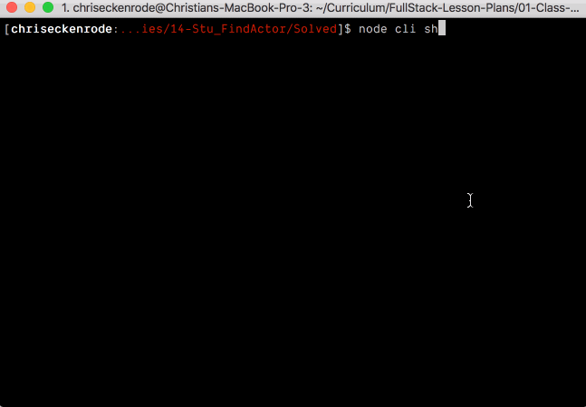

## 6.2 - Constructors Continued (10:00 AM) <!--links--> &nbsp; [⬅️](../01-Day/01-Day-LessonPlan.md) &nbsp; [➡️](../03-Day/03-Day-LessonPlan.md)

### Overview

We will be going over how to use connector functions to link two objects together.

`Summary: Complete Activities 8-15 in Unit 11`

##### Instructor Priorities

After today's class, students should be able to:

* Students should be able to make constructor functions to link two different objects together.

* Students should be able to sketch the architecture of small applications at a high level prior to writing code.

  * Implement applications with "clean" architecture.

* Students should be able to use objects to consolidate related information;
  * Use constructors to create those objects.

* Students should complete the Node Checkpoint.

##### Instructor Notes

* Demonstrate the use of constructors in a multi-part application in preparation for the homework assignment.

* Have your TAs refer to the [Time Tracker](02-Day-TimeTracker.xlsx) to stay on track.

### Sample Class Video (Highly Recommended)

* To view an example class lecture visit (Note video may not reflect latest lesson plan): [Class Video](https://codingbootcamp.hosted.panopto.com/Panopto/Pages/Viewer.aspx?id=d4404449-a36d-4dc9-aaa4-44cf64ff824b)

---

### Class Objectives

* To feel 100% comfortable using JavaScript constructors.
* To create simple applications that take in user input and utilize a constructor so as to create objects.
* To understand the basics of recursion and to learn how this process can be used to loop through a series of prompts multiple times.
* Sketch the design of their applications _before_ they start to code.
* Use constructors to create objects.
* To complete the Node Checkpoint.

---

### 1. Welcome Class (5 mins)

* Welcome the class back and have them open up the team manager application from last time, and ask them how they did.

### 2. Everyone Do: Team Manager Summary: Part 1 (10 mins) (High)

* Open up [teamManager-basic.js](../../../../01-Class-Content/11-js-constructors/01-Activities/08-TeamManager/Solved/teamManager-basic.js) within your editor and start to go over the code with your students. This file contains only the first part of the assignment which prints players' stats to the screen, but should help them to understand how to better create and use constructor functions with inquirer.

* Once you have finished, have them return to their code in an attempt to complete the second part of the Team Manager activity.

### 3. Students Do: Team Manager Cont. (20 mins) (Critical)

* Have your students work on the second part of the activity. If some students seem to be struggling, have them work alongside students who are moving along at a good pace or help them out yourself.

* Slack out the following instructions...

* **Instructions**

  * Once your code is functioning properly, move on to create a function called "playGame" which will be run after all of the players have been created and will do the following:

    * Run 5 times. Each time the function runs:
      * Two random numbers between 1 and 20 are rolled and compared against the starters' offensive and defensive stats.
        * If the first number is lower than the sum of the team's offensive stat, add one point to the team's score.
        * If the second number is higher than the sum of the team's defensive stat, remove one point from the team's score.
      * After the score has been changed, prompt the user to allow them to substitute a player from within the starters array with the player from within the subs array.
    * After the game has finished (been run 5 times):
      * If the score is positive, run `goodGame` for all of the players currently within the starters array.
      * If the score is negative, run `badGame` for all of the players currently within the starters array.
      * If the score is equal to zero, do nothing with the starters.
      * Give the user a message about if they won, and the status of their starters.
      * After printing the results, ask the user if they would like to play again.
        * Run `playGame` from the start once more if they do.
        * End the program if they don't.
  
  * HINT: It has been a while since we have worked with random numbers explicitly. If you are having troubles, look up Math.random on Google and you should find some resources to help.

### 4. Everyone Do: Team Manager Summary: Part 2 (15 mins)

* Open up [teamManager-advanced.js](../../../../01-Class-Content/11-js-constructors/01-Activities/08-TeamManager/Solved/teamManager-advanced.js) within your editor and work through the code with your students. Let them know that they should not worry if they managed to complete the first part of the activity but then struggled to complete the second half. So long as they understand the first part of the activity and can follow along with the second part, they are in good shape.

### 5. Instructor Do: Constructors Within Constructors (10 mins) (High)

* So far we have held our constructed objects within arrays to great affect, but what if we wanted to call upon those constructed objects within another object? What would we do then?

* Well, as it turns out, we can actually nest a constructor within another constructor fairly easily. In fact, it operates very similarly to creating a method within a constructor.

* Open up the folder [09-MovieManager](../../../../01-Class-Content/11-js-constructors/01-Activities/09-MovieManager) within your editor and show your students how we are exporting a constructor function from one file - [castMember.js](../../../../01-Class-Content/11-js-constructors/01-Activities/09-MovieManager/castMember.js) for example - and calling upon it within another; in this case [movie.js](../../../../01-Class-Content/11-js-constructors/01-Activities/09-MovieManager/movie.js)

* What's more, we are then able to add objects created from the `CastMember` constructor into the `cast` array inside of the object created by the `Movie` constructor.

  * Open up [main.js](../../../../01-Class-Content/11-js-constructors/01-Activities/09-MovieManager/main.js) walk the class through the code and show them the terminal output.

* Answer any questions about this demonstration before moving on to the next activity.

### 6. Students Do: Filling Up Classrooms (15 mins)

* Answer any questions your students might have before slacking out the following instructions...

* **Instructions**

  * In this activity we are going to make two constructors in two different files in which one constructor calls upon the other within it.

  * The first constructor function is called "Student" and has the following properties within it...

    * Name of the student
    * Favorite subject
    * Current GPA

  * The second constructor function is called "Class" and has the following properties within it...

    * An array of students within the class
    * Number of students in the class
    * Name of the professor
    * Room number
    * The Student constructor function from above which adds a new student to the class

  * BONUS: Make it so that that your application can take in user input to add new classes and new students to those classes.

### 7. Instructor Do: Demonstrate Application (5 mins)

* Take a moment to demonstrate the solved version of the [14-Stu_FinalTVApp](../../../../01-Class-Content/11-js-constructors/01-Activities/14-Stu_FinalTVApp/Solved) application that students will be building.

  * This application makes use of the [TV Maze API](https://www.tvmaze.com/api) to as a data source.

  * Be sure to demonstrate how we can search for TV shows using command line arguments, e.g. `node cli show Westworld`.

  * Demonstrate how we can also search for actors/actresses as well using command line arguments, e.g. `node cli actor Talulah Riley`.

  * Finally point out how each search logs the same information to a `log.txt` file.

    

* Explain that we'll proceed step-by-step. Students will:

  * Write out a high-level application architecture;

  * Implement logic for parsing command-line arguments and running the appropriate functionality in a `cli.js` file.

  * Implement the logic for searching for actors or shows using an object generated by a constructor function in a `tv.js` file.

### 8. Partners Do: Sketch Architecture (15 mins)

---

**Objectives Met**

* Sketch the architecture of small applications at a high level prior to writing code;

---

* Remind students that the application:

  * Accepts command-line arguments indicating whether the user intends to search for tv shows or tv actors;

  * Makes an API request to one of two different API endpoints; and

  * Saves the results of the requests to a `log.txt` file and prints the data to the console.

* Slack out the following instructions to students.

  * **Instructions**:

    * As a best practice, sketch out the architecture of your application _before_ you start writing code.

    * For this exercise, start by describing what your application does. Do this in a bullet list.

    * Next, decide how you might divvy up these responsibilities. Would you write a single module that handles all of them? Would you write one module for each bullet list? Something else? Be sure to justify your decision.

    * Finally, draw a diagram describing the flow of your application. Don't worry about being _too_ precise here, but include enough detail where you can use it as a guide to explain it to someone else. You can do this either by using pencil and paper or flowchart generation software like [draw.io](https://www.draw.io/).

    * Take a moment to study the GIF below if stuck. Remember that this application also prints the logged data to a file named `log.txt`.

      

### 9. Instructor Do: Review Activity (5 mins)

* Ask a group to:

  * Share their bullet list;

  * Describe the components they would define; and

  * Explain why they would define their modules this way.

* Briefly discuss the pros and cons of their solution.

* Open [11-Stu_Architecture/README.md](../../../../01-Class-Content/11-js-constructors/01-Activities/11-Stu_Architecture/README.md) and explain that while there are many ways to write the same application, we've chosen this way to be consistent as we work through the activities as a class.


_A high-level, diagram view of our TV application._

### 10. Partners Do: Implement CLI (15 mins) (Critical)

---

**Objectives Met**

* Parse command line arguments to determine whether the user is searching for a show or actor, along with which one.

---

* Inform the class that we're going to start with the `CLI` module, since it's the starting point for our application.

* Slack out the following instructions.

  * **Instructions**:

    * When the completed [cli.js](../../../../01-Class-Content/11-js-constructors/01-Activities/12-Stu_Cli/Solved/cli.js) file is run with node, it should be able to handle command line arguments similar to those below:

      ```
      // Search for The Andy Griffith Show

      node cli show The Andy Griffith Show
      ```

      and

      ```
      // Search for the actor Andy Griffith

      node cli actor Andy Griffith
      ```

    * In these examples the cli expects input in the following format:

      ```
      node cli <show-or-actor> <actor-or-show-name>
      ```

    * To begin, open [cli.js](../../../../01-Class-Content/11-js-constructors/01-Activities/12-Stu_Cli/Unsolved/cli.js) and write code to store the `<show-or-actor>` command line argument in a variable named `search`.

    * Store the `<actor-or-show-name>` command line argument in a variable named `term`. Keep in mind that this argument may contain spaces so it may span multiple indexes of `process.argv`. Check out the [Array Slice Method](https://developer.mozilla.org/en-US/docs/Web/JavaScript/Reference/Global_Objects/Array/slice) to achieve this.

    * Then write an if/else statement to print to the console whether a show or actor is being searched for.

    * We will add some functionality to actually perform the API calls in the next activity.

  * **Bonus**:

    * Write logic to set up a default search type and default term if either are missing.

### 11. Instructor Do: Review Activity (10 mins) (Critical)

* Open up [cli.js](../../../../01-Class-Content/11-js-constructors/01-Activities/12-Stu_Cli/Solved/cli.js), and walk through the solution.

  

* Emphasize:

  * `process.argv` is an array containing the command line arguments.

  * The second index of `process.argv` is the search type argument.

  * All remaining indexes of `process.argv` will contain the actor or tv show search term, split into separate index by spaces. We're using the Array `slice` and `join` methods to collect and format this.

  * We're optionally setting default values for the `search` and `term` variables.

  * We have an if/else statement printing whether a show or actor is being searched for.

* Explain that for now we just have the `console.log` statements, but often times when building applications we need to stub out certain functionality before we have a chance to implement it.

### 12. Partners Do: Implement Find Show (30 mins) (Critical)

---

**Objectives Met**

* Use objects to perform AJAX requests, and save data to local files.

* Use constructors to create those objects.

---


* Slack out the following instructions.

  * **Instructions**:

    * Open the [tv.js](../../../../01-Class-Content/11-js-constructors/01-Activities/13-Stu_FindShow/Unsolved/tv.js) file. This file contains a constructor function that will be used to create a TV object capable of searching the TV Maze API for shows and actors.

    * Install the `request` package by running `npm install request` in your terminal. We will use the `request` module to make AJAX requests to the TV Maze API. Require the `request` package and the built-in `fs` package at the top of the `tv.js` file.

    * Inside of the `TV` constructor function's `findShow` method, use the `request` package to hit the TV Maze API for the `URL` string.

    * Once you have the response body of the AJAX request, use `JSON.parse` to convert it to JSON (it comes back as a string).

    * After getting the JSON response from the AJAX request, create a string containing the following information from the returned show data;

      * The name of the show
      * The show's genre(s)
      * The show's average rating
      * The show's network name
      * The show's summary

    * Save this string to the `log.txt` file using the `fs.appendFile` method. If the file does not already exist, `fs.appendFile` will create it.

    * After saving the data to the `log.txt` file, print this information to the console.

    * Verify your code works by running the cli file and passing in the name of a TV show, e.g. `node cli show Scrubs`. This should print the specified information to the console and save it to the `log.txt` file.

  * **Hints**:

    * Check out some sample output from the TV Maze single show search API: <http://api.tvmaze.com/singlesearch/shows?q=scrubs>.

    * You would have used the `request` package for the Liri HW assignment. Refer back to this if you need a refresher on how to use the package.

    * Check out the selected answer for the question: [how to append a file in node?](https://stackoverflow.com/questions/3459476/how-to-append-to-a-file-in-node).

### 13. Instructor Do: Review Activity (10 mins) (Critical)

* Open up the [tv.js](../../../../01-Class-Content/11-js-constructors/01-Activities/13-Stu_FindShow/Solved/tv.js), and walk through the solution.

  

* Emphasize:

  * We use the `request` package to search the TV Maze API, and parse the body as JSON.

  * `showData` is just a big multi-line string containing the data we we'll be using. Using an array of strings we join together can be a more human readable way to achieve this than concatenation.

  * We use the `fs.appendFile` method to save this information along with a divider &mdash; just a series of dashes &mdash; to the `log.txt` file.

  * When complete we log the data to the console.

  * Point out how we call the `tv.findShow` method in the [cli.js](../../../../01-Class-Content/11-js-constructors/01-Activities/13-Stu_FindShow/Solved/cli.js) file.

* Slack out the solution so students can use it as as starting point as they move forward.

### 14. Everyone Do: BREAK (30 mins)

### 15. Partners Do: Implement Find Actor (25 mins) (Critical)

---

**Objectives Met**

* Use objects to perform AJAX requests, and save data to local files.

* Use constructors to create those objects.

---

* Slack out the following instructions.

  * **Instructions**:

    * Open [tv.js](../../../../01-Class-Content/11-js-constructors/01-Activities/13-Stu_FindShow/Unsolved/tv.js) and update the constructor function's `findActor` method. It should use the `request` package to search the TV Maze API using the provided URL.

    * Once the data has been retrieved from the API, parse it as JSON (it should be a string initially) and grab only the first result (it should be an array of JSON objects).

    * Save the following information to the `log.txt` file using the `fs.appendFile` method:

      * The actor's name
      * The actor's birthday
      * The actor's gender
      * The actor's country
      * The actor's TV Maze URL

    * Once the data has been saved to the `log.txt` file, print it to the console.

    * Test that your code works properly by running the [cli.js](../../../..//01-Class-Content/11-js-constructors/01-Activities/13-Stu_FindShow/Unsolved/cli.js) file with arguments. e.g. `node cli actor Jennifer Aniston`.

  * **Hints**:

    * Implementing the `findActor` method should be very similar to the `findShow` method, refer to this if stuck.

    * Check out this sample output from the TV Maze Actors API: <http://api.tvmaze.com/search/people?q=jennifer%20aniston>.

### 16. Instructor Do: Review Activity (15 mins) (Critical)

* Open up [tv.js](../../../../01-Class-Content/11-js-constructors/01-Activities/14-Stu_FinalTVApp/Solved/tv.js), and walk through the solution.

  

  * Point out how the code here is very similar to the findShow method.

  * This API endpoint returns an array of actor objects, for our purposes we only want the first result, so we grab the 0th index.

* Answer any remaining questions and slack out the solution.

### 17. Everyone Do: Application Review (10 mins)

* Demonstrate the completed application, and have students follow along.

* Foster discussion around the benefits of planning an architecture before writing any code.

  * Also discuss any possible improvements. What else could we add to this application?
  
  * Check out the [TV Maze API Documentation Site](https://www.tvmaze.com/api). Point out that we can also search for TV crew or seasons.

  * Highlight the fact that we're very close to creating what could be a useful NPM package someone else may want to use.

* Take this time to address any outstanding questions students may have.

---

### 18. Instructor Do: Introduce Checkpoint - Node (5 mins) (Critical)

* Let your class know that they will now be taking a short multiple choice assessment to check their understanding of Node.

* DO NOT SKIP THIS INTRODUCTION. DO NOT JUST SEND OUT THE LINK WITHOUT CONTEXT.

* Reassure the students that they need not be nervous about the Checkpoint:

  * "This will not affect your grade or graduation requirements."

  * "This is not like the tests and quizzes you might be used to from school or college. The purpose of these tests is not to motivate you to study or punish you for struggling."

  * "This is as much a test of me as an instructor and of the course content as it is of you. We are here to ensure your success, and this is one of the tools we use to make sure we are doing that effectively. This class moves _fast_, so if some or all of you misunderstand something important we as an instructional team need to find out as fast as possible so we can help."

  * "Long story short, this quiz can not hurt you. Only help you."

* Let students know that they should read carefully and focus on thinking about the right answer rather than using any test-taking skills they may have learned:

  * "There are no silly answers or obvious throwaway responses on this quiz, because those kinds of answers reduce the likelihood that we'll be able to figure out whether we've taught something effectively."

  * "Test taking strategies you may have learned for standardized tests _will not work_, so instead of focusing on eliminating wrong answers or looking for sneaky context cues, read the question and each of the possible choices carefully."

* Reassure students once again that the purpose of this is to help them, and remind them that the outcome does not impact their grade or graduation requirements. You should do this _every single time_ you give an Checkpoint.

* You or your TAs should now get the link specific to your class:

  * Navigate in your browser to: `https://www.switchboard.tech/`.

  * Select your class code (if it doesn't show up on its own).

    * If the class is a parallel class, a class that has two classes combined on a Saturday, and doing a checkpoint with two classes at once you will **need** to slack out two links.

    * One for your class and one for the other.

  * Select the Checkpoint and copy the resulting link.

### 19. Students Do: Take Checkpoint - Node (10 mins) (Critical)

* Slack out the link to the Checkpoint.

* Let your students know that once they select their name, it will take them to the Checkpoint.

* Checkpoints must be completed in class, **not at home**, to ensure you will be able to effectively find and help struggling students.

* TAs should walk around the class to ensure students aren't looking up answers.

* Keep in mind we do not use grades from assessments toward graduation requirements. However, students will be tempted to avoid feeling like they don't understand something.

* It's important for instructional teams to create an environment where it is safe to fail, but also where such failure is visible. You should not be worried about "cheating" on checkpoints, only making sure that students who need help aren't remaining invisible.

* Your SSM will have the results of the Checkpoint within an hour of its completion.

### 20. End (0 mins)

* **Over Slack tell everyone to download MySQL Workbench so that they are prepared for next class!**

### 21. TAs Do: Structured Office Hours - Review Bash (30 min)

* Navigate in your browser to: `https://github.com/coding-boot-camp/checkpoint-bank/blob/master/checkpoints/multiple-choice/06-Node-MC/07-Node-MC.md`

* There you will find the questions and answers to the Checkpoint given.

* Please take the entire office hours time to review the questions with the students.

* Suggestion Format:

  * TAs ask a question at a time to the class.

  * Let the students try to answer it.

    * If you see that a majority of the class has a misunderstanding with a question:

      * Take your time on this question!

    * If you see that a small number of students has a misunderstanding with a question:

      * Do your best to reinforce the misunderstanding but be cautious of your time.

      * Make note of the students that are still struggling with the question and schedule a 1:1 with the students.

  * If applicable, demo the answer.

* Take your time on these questions!

* This is a great time to reinforce concepts and misunderstandings!

### Lesson Plan Feedback

How did today's class go?

[Went Well](http://www.surveygizmo.com/s3/4325914/FS-Curriculum-Feedback?format=ft&sentiment=positive&lesson=06.02)

[Went Poorly](http://www.surveygizmo.com/s3/4325914/FS-Curriculum-Feedback?format=ft&sentiment=negative&lesson=06.02)
