## Day 1 - Intro to Node Servers & Express <!--links--> &nbsp; [⬅️](../../06-Week/05-Day/05-Day-LessonPlan.md) &nbsp; [➡️](../02-Day/02-Day-LessonPlan.md)

### Overview

In this class, we will provide students with a deep conceptual understanding of server-side code and use vanilla Node.js to create basic servers. Students will be introduced to the concepts of routing, request/response handling, and GET/POST requests in Express.

`Summary: Complete Activities 1-10 in Unit 13`

##### Instructor Priorities

By the end of class students will:

* Have a conceptual understanding of server-side code and the code that operates on servers.
* Understand the analogy of "servers as boxes within a box".
* Understand the basic server functionality of listening, URL parsing, routing, and GET/POST handling.
* Understand how to launch and test a server using `localhost` and Node.js code.
* Understand the basic elements of an Express Server.
* Understand the concept of routing along with `app.get()` and `app.post()` syntax.
* Know how to target server endpoints using the browser and Postman.
* Be guided through the "Star Wars Express" application.

##### Instructor Notes

* The next set of units (13-15) are historically some of the most challenging in the program. Students are being asked to make a switch between visually observable front-end concepts to more abstract, architecturally challenging back-end concepts. Give students the motivation boosts they need and continue to encourage them along the way!

* We'll be introducing students to the concept of server-side code. Coming into class today, students will have a fairly rudimentary notion of servers. Without your guidance, it will be difficult for them to understand how the terminal-side code they've been creating thus far using Node.js fits into the big picture of web development.

* Consistently, in this unit, we'll be relying on an analogy that servers are like "big empty boxes". In this analogy, we fill these boxes with sub-modules or code snippets that enable the server to have the functionality we need. Do your part in using this analogy to provide your students with a visual understanding of how server-side code works.

* We will be introducing students to the plain Node approach for creating servers. Let them know that for today's class understanding the exact syntax is _less_ important than understanding the conceptual picture.

* All of their work this week will build up to their homework assignment: [friend-finder.herokuapp.com](http://friend-finder.herokuapp.com). In this homework assignment, they will be creating a server-based "compatibility test" (basically a dating app for friends). The front-end will be composed of a basic survey. The back-end will take survey results, save them, then respond with the person whose results are the closest match. In total, students will have completed 3 different Node and Express applications by the end of the unit.

* You will be leading them through the beginning of a _heavily_ guided application build that uses an Express server to house and relay data about various Star Wars Characters [starwars-express-fsf.herokuapp.com/](https://starwars-express-fsf.herokuapp.com/)

### Sample Class Video (Highly Recommended)

* To view an example class lecture visit (Note video may not reflect latest lesson plan): [Class Video](https://codingbootcamp.hosted.panopto.com/Panopto/Pages/Viewer.aspx?id=69b7865f-d645-40a1-9791-a86d00f5bdb9)

- - -

### Class Objectives

* To gain a conceptual understanding of server-side code.
* To learn the fundamentals of building a server using plain Node.js to listen and respond to client-side requests.
* To gain a preliminary understanding of the basic elements of an Express server.
* To gain an initial understanding of Express routing.

- - -

### 1. Instructor Do: Server-Side Slide Show (0:25)

* Welcome students to class and then dive into the PowerPoint provided. Go up until "Activity Time!". Be sure to spend the appropriate amount of time with this presentation. It offers students important warnings about the challenge of this week's class as well as advice on succeeding in the week ahead.

* Use the presentation as cues to ask your students basic review questions on servers and clients. Try to call on individual students as you proceed through these slides.

* Spend the appropriate amount of time discussing the physical (hardware) nature of servers. Ensure that students understand that servers are little more than central computers that respond to requests from users accessing the machine.


* Use this time to also preface the fact that during development, we use our machines to both emulate the client-side (browser) and the central server (`localhost`). Warn students that this is a concept that will seem tricky, but is fundamentally important to keep straight. You can specifically use the line: "In a way, our computer will be modeling two different computers at once."

* Then proceed through the slides on "Building a Server". Offer the students the perspective that when they purchase a server or a server instance from a cloud provider, they are only getting an empty box. It is up to them as developers to create the code that powers this box, such that it can respond to requests in the ways we've talked about thus far.


* Use the slides provided to walk students through the core functions common to most servers:

  * Listeners that listen for client-side requests.

  * URL Parsers for breaking down the URLs that clients make requests to. (You can use the example of how news websites use URLs that mix dates and article titles to identify, which resource to grab)

  * Route Handling for determining what _happens_ when a user visits or sends data to a specific URL.

  * The ability to send HTML or send JSON in response to users requesting data.

  * The ability to receive POSTs (i.e. data that users send).

  * The ability to initiate more complex server-side logic in response to any of these requests.

  * And more (Authentication, Logging, Database Connections, etc.)

* From here proceed with the coding activities.

### 2. Instructor Do: My First Server (0:20)

* In this exercise, go through the process of re-creating the server.js file found in `01-FirstServer`. If at all possible, create this server "live" and comment on it as you go.

  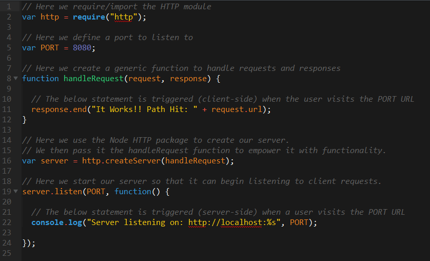

* During your commentary be sure to point out how:

  * We incorporated the `http` module. This, in essence, is a package ("small box") which allows our server ("big box") to have the capability of handling HTTP requests and responses. HTTP is a package that comes with the standard Node library.

  * We specified a port. This could be anything between 80 and above. In essence, a port is like a portal through which servers and clients communicate. The number itself doesn't matter so much for right now, but later we'll be using port 80 which is the standard port URLs use.

  * We created a function for handling requests and responses and then gave this function to our created server.

  * Finally, we set up the server such that it listens at the PORT specified.

* Once you have completed the code write-up, run the application by typing `node server.js` from the command line. Then visit the URL `localhost:PORT`, where `PORT` is the port you specified in the server file. Point out how this emulates our browser (client) making a request of our localhost (server), and in turn receiving a single string response.

  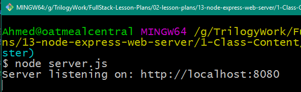

  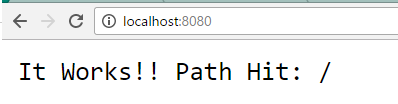

* Answer any questions that remain for this example before proceeding to the next activity.

### 3. Students Do: Two Servers App (0:20)

* Now it's students' turn to build a web server (or rather two). Slack out the following:

* **Instructions**

  * Using the previous example as a guide, create an app that has two web servers: one that listens on port 7000 and one that listens on port 7500.

  * Each server will respond with a different inspirational quote of your choosing.

  **Bonus**

  * Randomly select the quotes from a predefined array.

### 4. Instructor Do: Review Two Servers App (0:05)

* Congratulate the students for having just built their very own web servers!

* Run [02-Two-Servers/server.js](../../../../01-Class-Content/13-express/01-Activities/02-Two-Servers/Solved/server.js) and demonstrate how the message differs when you visit `http://localhost:7000` vs `http://localhost:7500`.

* Then open the code and explain to students the solution. In offering your solution, be sure to mention that in this example, we effectively created two servers. Each server used a different port, a different listener, and a different function for handling requests.

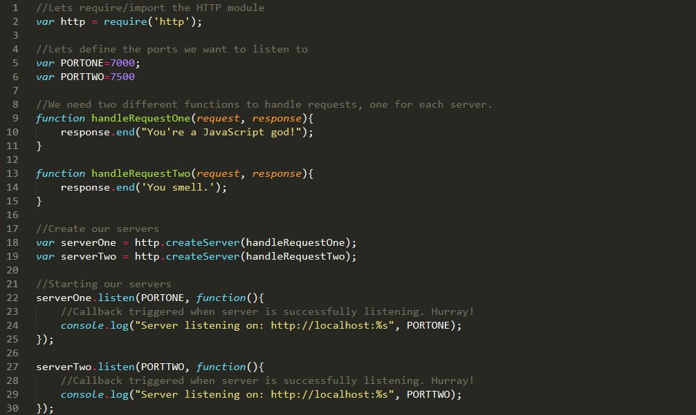

* Slack a copy of the completed app to the class: `02-Two-Servers/server.js`.

* Then proceed to the next demo.

### 5. Instructor Do: Portfolio Server (0:15)

* In this demonstration, you will be showing students a basic "URL parsing" and "routing" example. Remember! Let students know that the exact syntax of this example isn't what's important. (They will be using Express next to do it more simply). However, they should take the time necessary to understand what is happening here at a conceptual level.

* Open the file [03-Portfolio/server.js](../../../../01-Class-Content/13-express/01-Activities/03-Portfolio/server.js) and run the application using Node.js.

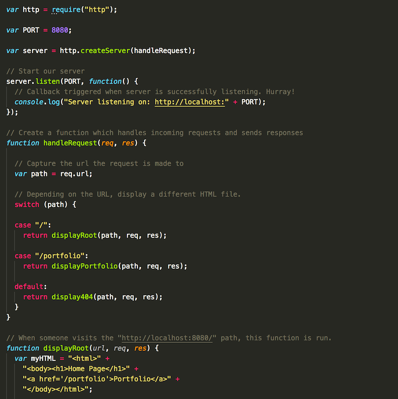

* In discussing the code, point out the following discussion items:

  * The use of the abbreviated terms `req` and `res`, which are short for request and response.

  * The use of the switch-case statement which routes the code to a different function depending on the URL provided.

  * Finally, the way in which we created HTML dynamically and rendered it on the page in each function.

* Slack out the solution when complete.

### 6. Students Do: Discuss Portfolio (0:07)

* Have students discuss the code with one another before asking them to re-explain it back to you. Tie up any loose ends that may remain.

### 7. Instructor Do: Serving HTML (0:15)

* In this next activity, we will be using `fs` to read and serve HTML files.

* Open the code for [04-Serving-HTML/server.js](../../../../01-Class-Content/13-express/01-Activities/04-Serving-HTML/server.js) and give students a minute to look it over. Ask them what they think is going to happen when you visit `localhost:80`?

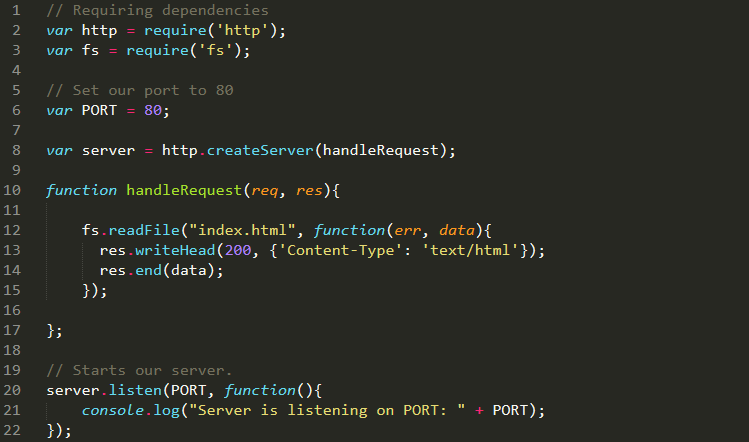

* Run [04-Serving-HTML/server.js](../../../../01-Class-Content/13-express/01-Activities/04-Serving-HTML/server.js) and open `localhost:80` in your browser. It's a website!

* Point out how, in this example, we used the `fs` package to read in the `index.html` file. We then used the node server to output this same file back to the user as a response.

### 8. Students Do: Discuss Serving HTML (0:04)

* Have students discuss the code with one another before asking them to re-explain it back to you. Tie up any loose ends that may remain.

### 9. Students Do: Serve-Favorites (0:30)

* Next, run the [05-Serve-Favorites/server.js](../../../../01-Class-Content/13-express/01-Activities/05-Serve-Favorites/Solved/server.js). Visit each of the routes in that file (i.e. `localhost:8080/food`, `localhost:8080/movies`, etc.). Point out how the contents of the page change each time.

* Then slack out the following activity for students to complete.

* **Instructions:**

  * Create a website with four routes:
    * Home
    * Favorite Food
    * Favorite Movies
    * Favorite CSS Frameworks
  * Each route should be triggered by a different URL.
  * Each route should display an HTML page listing your favorite three things of each.
  * Be sure to use `fs` to serve your HTML files.

### 10. Instructor Do: Review Students Serve HTML (0:10)

* Review the code in this example. During your discussion, be sure to point out:

  * How we created the basic skeleton of a Node server (requiring: `http` and the port number)

  * How we set up a listener to initiate the server's handling of requests.

  * Created a function `handleRequest` which takes in a request URL, parses it, then relays the user to the correct page.

    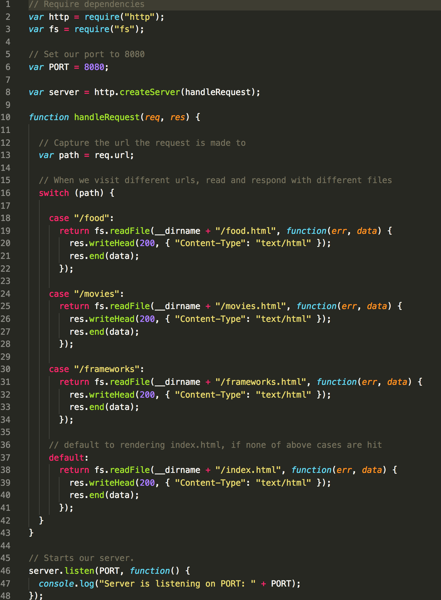

  * This solution contains a lot of repeated code.  Ask your students if they have any suggestions for how we might refactor this.  Then open `server-bonus.js` and point out how we implement just one `fs.readFile()` command by passing in a filePath into a `renderHTML` function.

- - -

### 11. Lunch (30 min)

- - -

### 12. Instructor Do: Request Methods (0:10)

* Up until now, students have just been exposed to GET requests. (They may not even realize it yet, but all the URL visits they've made thus far have been GET requests). In this activity, we will very briefly introduce them to other HTTP methods.

* Open [06-Request-Methods/server.js](../../../../01-Class-Content/13-express/01-Activities/06-Request-Methods/server.js) in your editor.

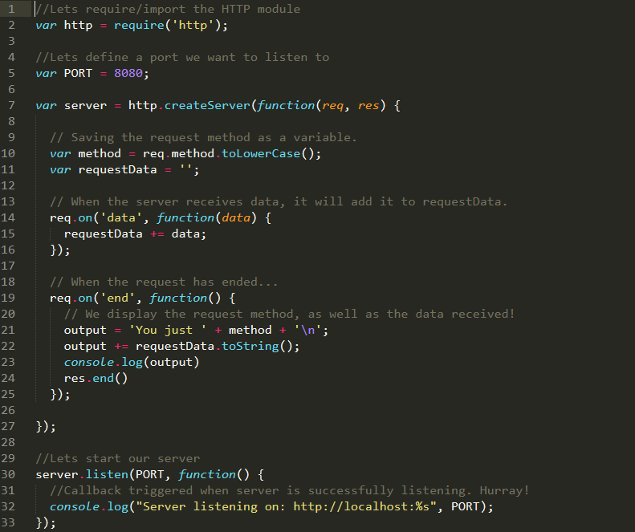

* Briefly run through the code and explain that this app is going to log the type of request it receives, along with any information that was sent with the request.

* Have students download the application [Postman](https://www.getpostman.com/). If you've never worked with Postman before, it's a simple application interface for performing HTTP request (GET, POST, PUT, DELETE, and more).

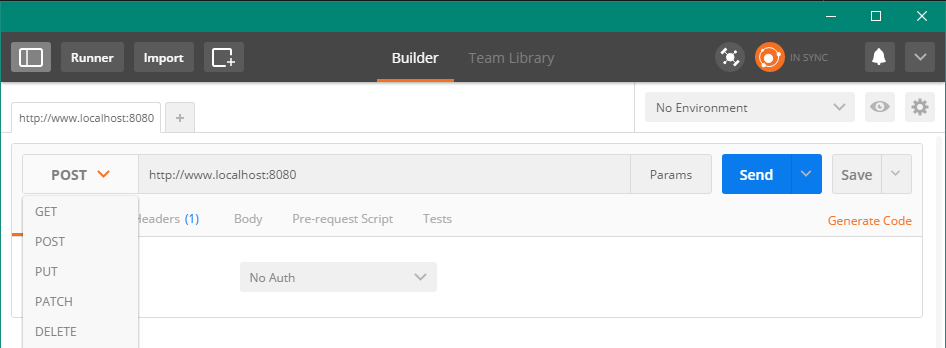

* Run the server and use Postman to make different types of requests. Show the students how every time a request is made, it is logged in the server's console.

* Let the students know that the body of Postman requests must be sent in `raw`, and GET requests cannot have a body in Postman

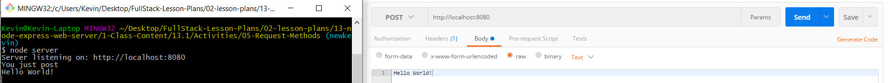

* Alternatively you can use CURL

  * `curl -i -H "Accept: application/json" -X GET -d "firstName=james" http://localhost:8080`
  * `curl -i -H "Accept: application/json" -X POST -d "firstName=james" http://localhost:8080`
  * `curl -i -H "Accept: application/json" -X PUT -d "firstName=james" http://localhost:8080`
  * `curl -i -H "Accept: application/json" -X DELETE -d "firstName=james" http://localhost:8080`

* Slack students a copy of this server code: `06-Request-Methods/server.js`.

* Let students know that we will be fleshing out this concept over the course of the week.

### 13. Student Do: POST Requests (0:20)

* In this exercise, students will create a server that will accept `POST` requests.

* Slack out the following instructions:

* **Instructions:**

  * Create an HTML file with a form that will post data.
  * Create a server that will accept the POSTed data and log it to the console.
  * Note: You might have to do some Googling to figure this one out!

### 14. Review Post Requests (0:10)

* Go over to the solution to the previous exercise with students.

* In your discussion:

  * Lightly discuss the concept of a `POST` route, specifically mentioning how POST routes are effectively endpoints that client-side code can use to send data to the server.

  * If you have time, take a few moments to show students how to test this POST route using Postman.

  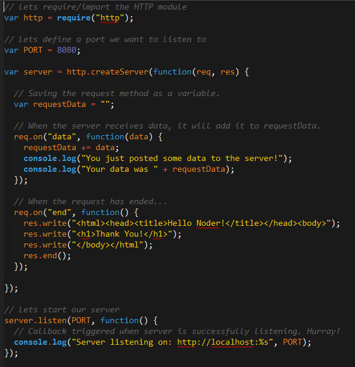

### 15.	Everyone Do: Introduce Express (0:04)

* Use the slides to introduce the concept of the Express framework and routing.

* At one point in the slideshow, you will be pointed to the NYT Scraper App website. Remind students how the webpage works (namely that the site lets users retrieve articles from the New York Times and store them in a "saved" list). Then use the proceeding slides to discuss the concept of GET and POST routes. Give them a heads-up that we'll be able to use AJAX and jQuery to make both these types of communications.

### 16.	Instructor Do: Demo basic routing with server1.js (0:05)

* The next few activities will be spent incrementally building out the express StarWars app.

* Before you start working with the code go to the link: [starwars-express-fsf.herokuapp.com/](https://starwars-express-fsf.herokuapp.com/) and show students how the page works. Essentially, you can type in a Star Wars Character's name and search the "database" to see his/her properties. You can also add characters to the database using the simple form. Add a character and show how it gets displayed on both the page and the API. (Note: When searching do not enter spaces between character names).

  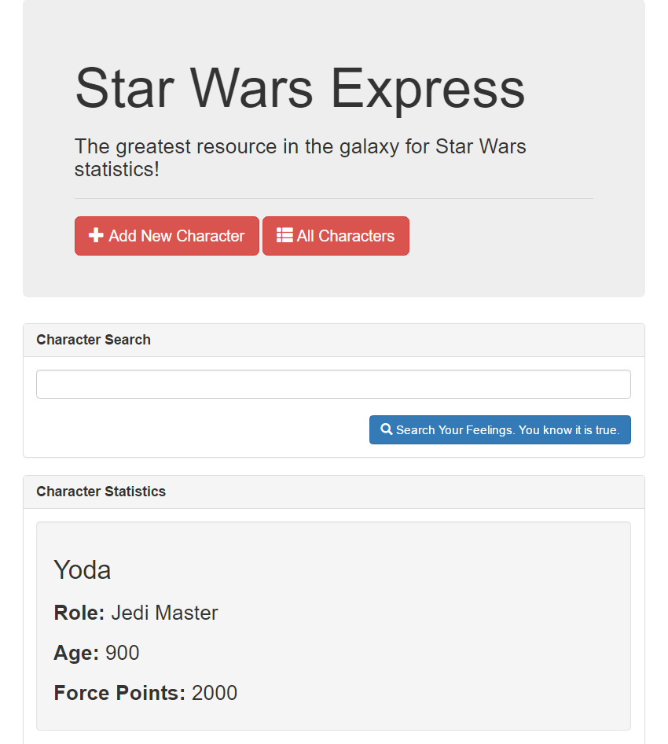

* To show the API you can simply go to this link: <http://starwars-express-fsf.herokuapp.com//api>\ (or <http://starwars-express-fsf.herokuapp.com//api/characters> to display all characters).

* The API also accepts an additional parameter at the end of the URL in the form of <http://starwars-express-fsf.herokuapp.com//api/characters/charactername>.

* As an example: <http://starwars-express-fsf.herokuapp.com//api/characters/yoda>.

* Now open the file [08-StarWars-1/server.js](../../../../01-Class-Content/13-express/01-Activities/08-StarWars-1/server1.js). Walk students through the general gist of the code. _For now the key focus is to give them an understanding of express(), routing, and the listener_.

* Run the `server1.js` file and show them how it works. (Don't forget to talk about `npm install`).

* Once you've discussed the key pieces proceed to the activity.


### 17.	Students Do: Add Route to server1.js (0:07)

* Slack out the following file and instructions:

* **File:**

  * `server1.js` (`08-StarWars-1`)

* **Instructions:**

  * Work with those around you to confirm your `server1.js` file working. This means figuring out: what dependencies to install, how to run the file, and how to view the resulting website in your browser. This step requires you to make zero changes to the code file. At this point, you are just getting the file you are given to run.

  * Then, once you've got the original code to display in the browser, create a new `Obi-Wan Kenobi route` to display Kenobi's information. Use the comments and the previous code in the file as a guide.

  * Help those around you when done.

### 18.	Instructor Do: Review Previous Activity	(0:05)

* Review the previous activity by coding it out yourself. Your solution should look like something of the below:

```js
var obiwankenobi = {
  name: "Obi Wan Kenobi",
  role: "Jedi Knight",
  age: 42,
  forcePoints: 1350
}

app.get('/obiwankenobi', function(req, res){
  res.json(obiwankenobi);
})
```

### 19.	Partners Do: Dissect req.params (0:05)

* Next slack out the following file and instructions.

* **File:**

  * `server2.js` (`09-StarWars-2`)

* **Instructions:**

  * Examine the code sent to you. Once again, run the `server2.js` file and view the page in the browser. Troubleshoot any issues that arise. Again NO CODE CHANGES required.

  * Then once you have a working server instance, begin to examine the file. Try to explain to yourself and those around you what the significance of `/:character` and `req.params.character` is.

  * Create a test case to check your hypothesis.

### 20.	Instructor Do: Review Previous Activity	(0:03)

* Have students try to explain to you what they found.

* If no one offers the correct answer, explain that the `/:character` syntax is a way of saying we have a "variable" parameter in the URL route. Show them via the browser that this means they can search for a given character using the URL and it will display in the console.

  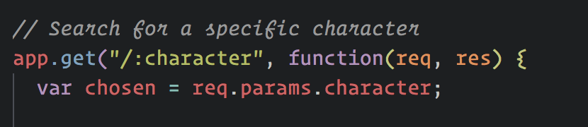


### 21.	Partners Do: Dissect Parameter Match (0:05)

* Now slack out the next file:

* **File:**

  * `server3.js` (`10-StarWars-3`)

* **Instructions:**

  * Examine the code flagged in the comments. Explain to those around you what it does and how it works. Be sure to create test cases that confirm your hypothesis.


### 22.	Instructor Do: Review Previous Activity (0:05)

* Use the same process as before to ask students to explain the for-loop concept to you.

* If no one offers the correct answer, explain that this for-loop "checks" which character is being sought after in the URL -- then find that character's information and re-displays it back to the user in the form of a JSON.

  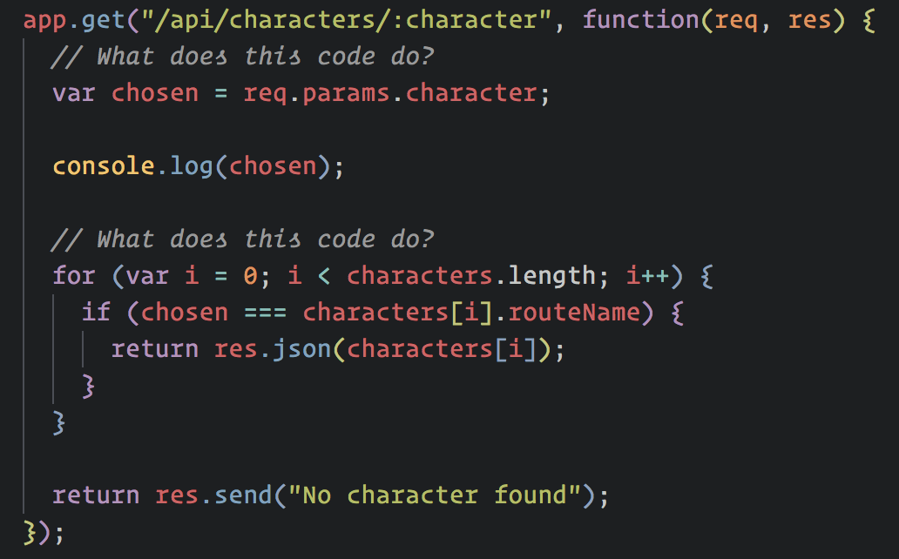

* Show them how this works by searching for the character `Yoda`. Then try searching for a non-existent character like `hansolo`.

* Ask students of an example where this concept of routing where the URL is changing might be found. (suggested answer: Newspapers. Every newspaper has an url like `/2016/01/01/Great-story-of-the-day` )

### 23. Instructor Do: Introduce Friend Finder Homework (0:05)

* Finally, end the class by opening the solution to the Homework (FriendFinder). Run the application using `node server.js` then visit `localhost`. Walk students through the basic gist of the application, describing it as a type of dating application or compatibility test. In essence, the application saves each user's survey responses in the database, then compares the responses against everyone in the database to identify the best match.

### 24. Questions (5 mins)

Tell students this is a challenging unit, but it will make more sense after our next class. Answer lingering questions.

### Lesson Plan Feedback

How did today's class go?

[Went Well](http://www.surveygizmo.com/s3/4325914/FS-Curriculum-Feedback?format=ft&sentiment=positive&lesson=07.01)

[Went Poorly](http://www.surveygizmo.com/s3/4325914/FS-Curriculum-Feedback?format=ft&sentiment=negative&lesson=07.01)
