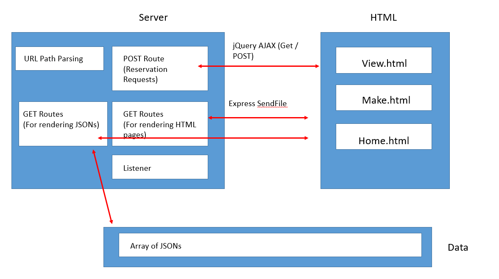
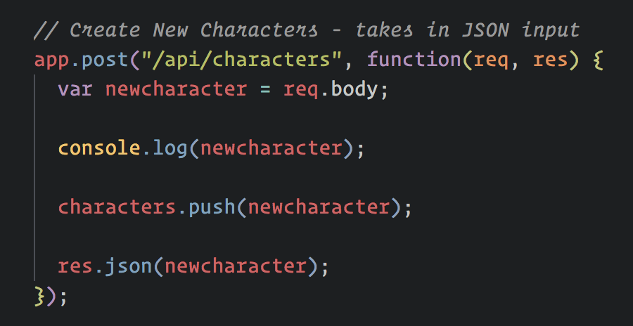
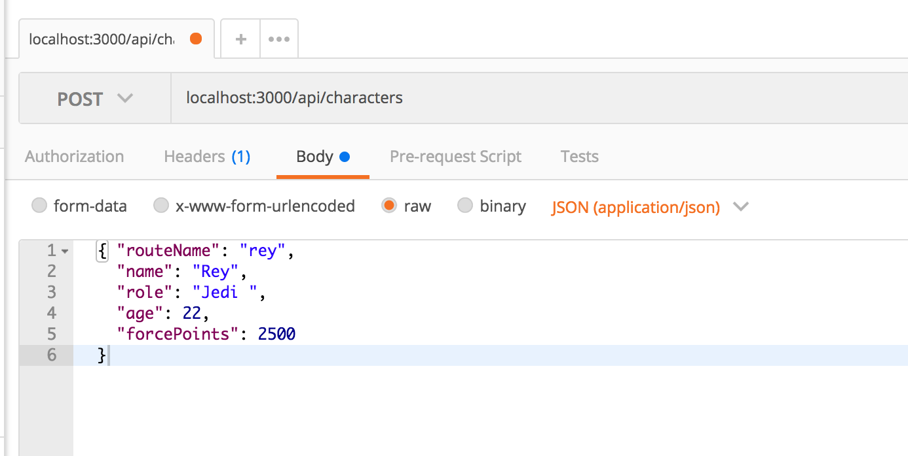
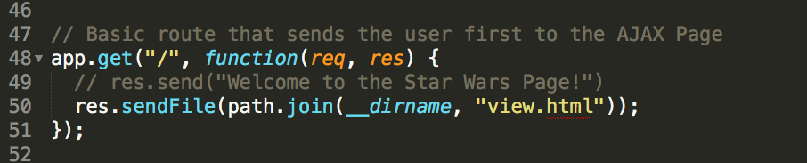
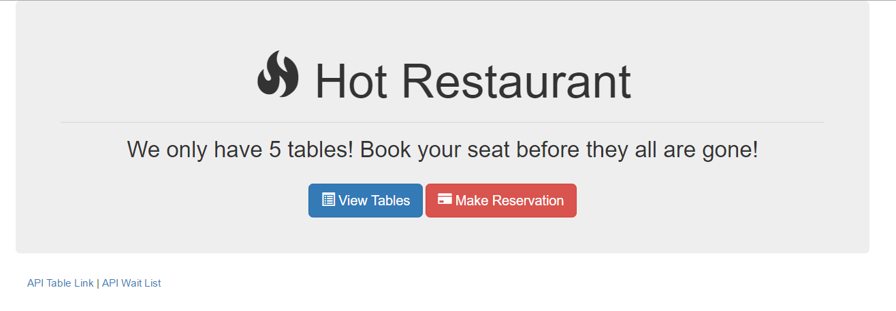
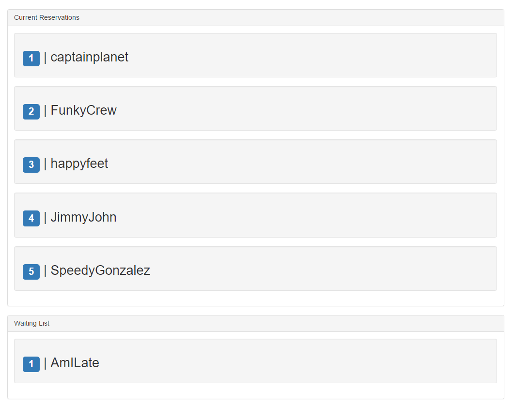
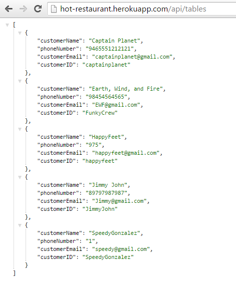
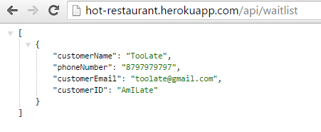

## 7.2 - Express Yourself & Hot Restaurant Activity (10:00 AM) <!--links--> &nbsp; [⬅️](../01-Day/01-Day-LessonPlan.md) &nbsp; [➡️](../03-Day/03-Day-LessonPlan.md)

### Overview

Today, we'll be asking students to create an Express based web application for handling reservation requests. In the process of building today's assignment, students will reinforce their understanding of Express Servers, Routing, and the utility AJAX for front-end interaction.

`Summary: Complete activities 11-14 & begin activity 16 in Unit 13`

##### Instructor Priorities

By the end of class students will:

* Be guided through the "Star Wars Express" application.
* Begin the hot restaurant activity.
* Complete the MySQL Checkpoint.

Instructor/TAs should focus on providing students assistance in small-group format.

##### Instructor Notes

* Give students a heads-up that today's class is **critical** and that we will be re-using the concepts throughout the remainder of the course.

* Be sure to slack out the [video walkthrough](https://youtu.be/ygk-kNstqK0?list=PLgJ8UgkiorCmI_wKKVt5FlkTG63sQF6rr) at the end of the star wars activity! This will help students tremendously in understanding how to approach Express based application builds.

* The focus for the latter half of the day is to immerse them in a build-it-first approach to learning.

* Stronger students will find today's class refreshing because of the challenge, but weaker students may walk out fairly confused.

* Throughout the hot restaurant activity, encourage students to look back at the Star Wars Express application. 

* Additionally, you may want to slack students a copy of the diagram below as a reference at some point during their coding. It may help them visualize the overall application they are building.

  

* Have your TAs reference [02-Day-TimeTracker](02-Day-TimeTracker.xlsx) to help keep track of time during class.

### Sample Class Video (Highly Recommended)

* To view an example class lecture visit (Note video may not reflect latest lesson plan): 

[Class Video](https://codingbootcamp.hosted.panopto.com/Panopto/Pages/Viewer.aspx?id=7d46ae85-7c8f-459f-ba32-a86c00f79153)

- - -

### Class Objectives

* Understand the Star Wars Application
* Create a real-world application for handling reservations using Node/Express
* Complete the MySQL Checkpoint

- - -

### 1. Instructor Do: Welcome (1 mins)

* Begin class by welcoming students.

### 2. Instructor Do: Re-demonstrate Previous Solved Activity (10 mins)

* Open the file [11-StarWars-4/server4.js](../../../../01-Class-Content/13-express/01-Activities/11-StarWars-4). This file simply includes a line-by-line commenting example from the end of yesterday. Slack out this file to students so they can look over it during the next few exercises.

### 3. Instructor Do: Show code for Post Route (10 mins)

* Now open the file [12-StarWars-5/server5.js](../../../../01-Class-Content/13-express/01-Activities/12-StarWars-5/server5.js). In this example, simply point students through the fact that we've created a new POST route. Explain that this route will take in JSON inputs then DO work with them. In this case it will save the JSON to the database and return a JSON of the new character.

  

### 4. Students Do: req.body dissection (5 mins) (High)

* Now slack out the following file and instructions.

* **File:**

  * `server5.js` (`12-StarWars-5`)

* **Instructions:**

  * Spend a few moments researching what `body-parser` is for and what `req.body` means in the context of Express.

  * Then research how you can POST data to the Express server.

### 5. Instructor Do: Postman Demo (10 mins)

* Have students articulate their answers before explaining to them that `body-parser` is a module that allows Express to receive user posts (JSON, text, etc).

* Normally data sent to the server isn't easily readable by humans, as it comes in as a low level stream.

* Explain that `body-parser` is an example of **middleware**.

  * Middleware is a function which we set to run between our server receiving a request and it being available inside of our routes.

  * Middleware can be defined using the `app.use` method.

  * Middleware can transform the request from the browser before we work with it. In the case of `body-parser`, it takes the unreadable request and turns it into a readable object and attaches it to `req.body`. By the time the request gets to our routes, `body-parser` has already formatted it for us.

* Then explain to them that in future applications we'll eventually be using jQuery's AJAX methods for sending such post requests to our server.

* Then have them install the program [Postman](https://www.getpostman.com/). We'll be using Postman so both windows users and mac users can be taught how to send POST requests using the same program. (Note: Students may ask questions like: "Do you always have to use postman to send post requests?" Use this as an opportunity to explain that Postman is simply a GUI for development, and that in future opportunities we'll be using jQuery or other front-end code approaches for sending the same post requests.)

* Walk students through the process of sending POST requests in Postman. If you are unfamiliar use the following points as a guide:

  1. Run your server instance.
  2. Open Postman.
  3. Select POST in the drop-down next to the link. Then enter the URL of your server's POST route.
  4. Click the button: "Body". Click the setting "Raw". Then hit the dropdown that says "Text" and click JSON.
  5. Enter in a complete JSON. You can use:
     ```json
     {
       "routeName": "darthvader",
       "name": "Darth Vader",
       "role": "Sith Lord",
       "age": 42,
       "forcePoints": 1900
     }
     ```
  6. Hit "Send"
  7. Now check back to your Star Wars API to confirm that Postman received the request body.
     

### 6. Students Do: Postman Exercise (10 mins) (High)

* Now have students perform the same exercise with their own servers.

* You can slack out the following file and instructions:

* **File:**

  * `server5.js` (`12-StarWars-5`)

* **Instructions:**

  * Use Postman to send a POST request to the server you've been provided. Confirm that your character has been added to the database correctly.

### 7. Instructor Do: Demo sendFile (server6.js + view.html) (10 mins)

* Open the file [13-StarWars-6/server6.js](../../../../01-Class-Content/13-express/01-Activities/13-StarWars-6/server6.js). Look at the line under the `app.get('/')` route. Point out to students the use of the `res.sendFile` code. This code is used to send users a specific HTML file in response to their visiting a route.

  

* Be sure to point out how we make use of the built in `path` library to join relative and absolute file paths. In this case, we **could** just omit `path.join` pass `sendFile` relatives paths to the HTML files instead, but it's safer to provide absolute paths in case our Express app is ever started from a different directory. Normally this would be an issue, since absolute paths will almost always be different on different computers, as well as on Heroku. Thankfully we can make use of Node's built in `path` library. `path.join` is a function which accepts any number of String arguments, which are also expected to be file paths or partial file paths. `path.join` takes the passed in file paths, combines them into a new path, and returns it.

* The `__dirname` keyword is built into Node and available in every JavaScript file on the server. It's always equal to a the absolute path of the current directory. By passing `__dirname` as well as the relative path to the file we want to send into `path.join`, we'll get back an absolute path to the specified file.

### 8. Students Do: Dissect .get view.html (10 mins) (High)

* **File:**

  * `server6.js` (`13-StarWars-6`)

* **Instructions:**

  * Look at the file sent to you then explain to the person next to you what the `res.sendFile` line does. Then try creating a new HTML file and routing to that one instead.

### 9. Instructor Do: Review Activity (10 mins)

* Review the previous exercise and answer any questions. Try to get students to think about the distinction between routing users to "data" and routing them to rendered "HTML" pages. Try to get them to think about when you would use `res.json` and when you would use `res.sendFile`.

### 10. Instructor Do: Demo Complete Application (5 mins)

* Open the completed application found in [14-FinalStarWarsApp](../../../../01-Class-Content/13-express/01-Activities/14-FinalStarwarsApp). Walk students through the overall folder structure and how there is a mix of the `server.js` file and the HTML files which will be relayed to users. Also point out how we have a new `add.html` file.

### 11. Students Do: Dissect .post (add.html) (10 mins) (High)

* Slack out a zipped copy of [14-FinalStarWarsApp/server.js](../../../../01-Class-Content/13-express/01-Activities/14-FinalStarwarsApp/server.js). Then task students with the following:

* **Instructions:**

  * Spend a few moments looking over the code sent to you. First, get the server running, then begin to dissect the JavaScript code found at the bottom of `add.html`.

  * Explain to one another what the code does, what its for, and why its relevant to the application so far. Be sure to explain to one another what the `$.post` code is doing.

### 12. Instructor Do: Review Activity (add.html) (10 mins) (High)

* Walk students through the meaning of the JavaScript in `add.html`. Go line by line and explain how jQuery is used to grab the values in the form -- then immediately POSTs these values to the API. The API then saves the records into the database.

* Answer any questions that remain. Then encourage students to look back at their class repository when completing the homework as there will be additional examples on folder structure relevant to their homework assignment.

* Finally, slack out a link to the [YouTube video walkthrough](https://youtu.be/ygk-kNstqK0?list=PLgJ8UgkiorCmI_wKKVt5FlkTG63sQF6rr) and encourage them to review at home. This will be a _huge_ help to students.

### 13. Instructor Do: Introduce Heroku (5 mins) (High)

* Local development is fun, but it's much more fun to deploy and share with others!

* Ask students what we've been using so far to deploy, and ask if anyone has any idea why that solution might not work now.

  * After students give suggestions, explain that GitHub Pages only hosts "static" pages, and doesn't support the server side of our application.

  * Explain that GitHub Pages won't actually run any code for your app, it just hosts your HTML, CSS, JS, and other static files. It's similar to accessing your local files through your browser, only they're on a publically accessible machine.

* That means we need something that will both host our files _and_ run our server-side code.

* Ask them if they can guess what we're going to use to host our full-stack application.

  * There are a ton of options, but specifically we're going to be using Heroku!

* Explain that Heroku is a platform as a service (PaaS). It allows deployment of a back-end and will start up and host your web server and server-side code for you!

  * Explain that the value here is similar to that of GitHub Pages, but for your whole app.

  * Heroku will manage your application and give it a public URL that anyone can access.

### 14. Students Do: Deploy to Heroku (30 mins) (Critical)

* Tell students that we're going to host that Star Wars app, so that even those in a galaxy far, far away can access it.

* Then have students login to their Heroku accounts online. Many of them will have forgotten their passwords, and may spend a significant portion of this activity getting set up.

* **File:**
  * [01-Activities/14-FinalStarWarsApp](../../../../01-Class-Content/13-express/01-Activities/14-FinalStarwarsApp) (solution, zipped)
  
  * [03-Supplemental/HerokuGuide](../../../../01-Class-Content/13-express/03-Supplemental/HerokuGuide.md) (slacked out or link to class repo posted)

* **Instructions:**
  * Push the finished Star Wars app to heroku following the steps from the guide.

  * **BONUS:** Begin making the below additional page for your Star Wars app. Push those changes up as you build the new feature. Specifically, this will require:

    * Create a new page on your Star Wars website that displays a table of ALL characters in the database. This will involve at minimum:

      * Creating a route in the server.js file for displaying data

      * Creating a route in the server.js file for sending users a new HTML file

      * Creating an HTML file that grabs data from the server.

* Be sure to walk around and help students as they hit snags or have problems pushing to heroku, consulting the troubleshooting tips below as needed.

- - -

### Troubleshooting Guide

* **Forgetting to git "add -A, git commit -m":** Often students will completely skip the step where they save and commit their changes prior to pushing to GitHub. This will mean their web page is essentially blank. As a starting point, ensure their code is present in GitHub before tinkering with Heroku issues. If they have no code in GitHub, they certainly have no code in Heroku

* **Images and/or CSS not appearing:** All filenames and paths are case sensitive. Ensure that all links in HTML are using case-sensitive paths that match the folder directories casing.

* **Not using relative paths:** Students using absolute paths to reference their CSS, JS, or image files. Help them to convert these to relative paths.

* **Not knowing where their site deployed:** Show students that they need to login to the site and they will see the new app deployed on their menu. Then help them go to Settings and scroll until you see the "Heroku Domain".

* **Heroku Login not working on Windows:** For first time Windows Users, you need to use `cmd.exe` to login to Heroku. If you do not do this, bash will likely prevent you from logging in  and you will be unable to proceed with Heroku Steps.

* **More than five Heroku apps:** As students progress in the course, they will have many more Heroku apps. Once you get to five apps, Heroku requires users to authenticate their identity with a credit card. This credit card won't be charged, but its a requirement to have more than five active apps.

* **Not using environment variable for port:** Help students update their app so that they are getting the port the app is listening on from `process.env.PORT`.

* **Not having start script in `package.json`:** Help students update their app so that they have a start script in the `scripts` block of their `package.json` file, and ensure that they can run `npm start` to start up their server.

* **Not having production dependencies in `package.json`:** Ensure that any required packages are listed in the `dependencies` block in the `package.json` file.

- - -

### 15. Lunch (25 mins)

- - -

### 16. Instructor Do: Welcome students back from lunch (5 mins)

* Welcome students back from lunch.

* Let students know that the concepts covered regarding Node and Express servers are some of the most important concepts in the class. Let them know that it really gets to the heart of what full-stack web development is -- and for this reason, it's important they push themselves to learn it now.

* Slack out the below resources:

  * <https://scotch.io/tutorials/use-expressjs-to-get-url-and-post-parameters>

  * <https://scotch.io/tutorials/build-a-restful-api-using-node-and-express-4>

### 17. Instructor Do: Demo End Application (10 mins)

* Then begin to remind students that the best way to learn to code -- especially challenging concepts -- is sometimes just to force yourself to code.

* Slack out the following link: [hot-restaurant.herokuapp.com](http://hot-restaurant.herokuapp.com).

  

* Then ask all students to make a Reservation request on the website.

* Once they are done, visit the page: <http://hot-restaurant.herokuapp.com/tables>. Point out how their reservation requests have been captured and listed on the site. Depending on whether or not they were one of the first five requests, they were added to the reservation list -- otherwise they were put on the waitlist.

  

* Then take a few moments to flip through the screens. Point out how there is a page for creating reservations, a page for viewing reservations, and two pages for viewing JSONs of the current reservations and waitlisted parties.

  

  

* Let students know that they will be building this application from scratch over the course today and tomorrow's class.

### 18. Instructor Do: Group Formation + Initial Instructions (10 mins)

* Have students divide themselves into groups of 4 (with 2 members from each section).

* Then slack out the following instructions:

* **Instructions:**

  * You will be building a Node / Express based web applications for handling reservation requests.

  * Your application will be made up of two parts: 1) A front-end set of HTML/CSS/JS pages for entering and viewing data and 2) A back-end composed of Node/Express and basic JS for storing, updating, and relaying reservation data.

  * Spend the time necessary to map this application out. Consider the concepts we've covered in class so far:

    * Servers
    * Routing
    * APIs
    * AJAX (GET and POST Requests)

  * You should be referencing the code from the previous Star Wars application.

  * Feel encouraged to use the following application as a reference: <http://hot-restaurant.herokuapp.com/>

  * Note: We know this is a hard activity. We know you aren't yet comfortable with Node or Express. But push yourself. The best way to learn is to push through the discomfort and BUILD! Ask for help when you need it. We're here to help you through the process.

* Let them know that you will be providing them with guidance on how to proceed every 20 minutes or so. 

### 19. Partners Do: Phase I - Pseudocode (10 mins)

* For this first phase, slack out the following instructions:

* **Instructions:**

  * Phase I: For this first phase, aim to write out the pieces that will need to be programmed to create the functionality of your application. Try to break it into 6-7 pieces.

* **Instructors/TAs:** Once time is up have students share their breakdowns. As a suggestion, here is a list that you can slack them.

  * Create the front-end (visuals) for home page, reservation form, and reservation views.

  * Create a basic server using Express.JS

  * Create a few array variables that will hold the data

  * Create a set of routes for getting and posting table data

  * Create a set of routes for displaying the HTML pages

  * Use jQuery to run AJAX calls to GET and POST data from users to the Express server

### 20. Partners Do: Phase II - Frontend + Server Creation (20 mins) (Critical)

* Proceed with the next phase. Slack out the following instructions to help guide them:

* **Instructions:**

  * Phase II: For this second phase, aim to complete the following:

    * Backend Team:

      * Create a basic Express server.

      * Your server at this point should do the BARE MINIMUM. (Effectively, it should just say: "Listening at PORT 3000" when the command `node server.js` is run.)

    * Frontend Team:

      * Create three HTML files one called `home.html`, another called `tables.html`, and another called `reserve.html`. Use dummy data and create pages similar to the one shown to you on the sample Hot Reservation webpage.

    * All: If you finish early, begin thinking about how the Data, API, and Routes should look.

* **Instructors/TAs:**

  * Have students who accomplished this task share their code with you (via GitHub) and display it on screen. Then have them come up and talk about what they did.

### 21. Partners Do: Phase III - API Routing + Frontend Delivery (35 mins)

* Proceed with the next phase. Slack out the following instructions to help guide them:

  * Phase III: For this third phase, aim to complete the following:

    * Backend Team:

      * Create a set of variables (hint: arrays of objects) for holding the reservation and waitlist data.

      * Create a set of routes that then display this data as JSONs. Users should be given these JSONs if they visit the appropriate page (i.e. if a user visits `localhost:3000/api/tables` they should see a JSON of table data).

    * Frontend Team:

      * Temporarily join the backend team. Your task will be to create Express routes that display your HTML pages when a user visits the appropriate page. (i.e. if a user visits `localhost:3000/tables`... they should be shown the `table.html` page.)

      * If you finish early begin creating the code necessary to convert your form data into JSON objects.

### 22. Instructor Do: Introduce Checkpoint - MySQL (5 mins) (Critical) 

* Let your class know that they will now be taking a short multiple choice assessment to check their understanding of MySQL

* DO NOT SKIP THIS INTRODUCTION. DO NOT JUST SEND OUT THE LINK WITHOUT CONTEXT

* Reassure the students that they need not be nervous about the Checkpoint:

  * "This will not affect your grade or graduation requirements."

  * "This is not like the tests and quizzes you might be used to from school or college. The purpose of these tests is not to motivate you to study or punish you for struggling."

  * "This is as much a test of me as an instructor and of the course content as it is of you. We are here to ensure your success, and this is one of the tools we use to make sure we are doing that effectively. This class moves _fast_, so if some or all of you misunderstand something important we as an instructional team need to find out as fast as possible so we can help."

  * "Long story short, this quiz can not hurt you. Only help you."

* Let students know that they should read carefully and focus on thinking about the right answer rather than using any test-taking skills they may have learned:

  * "There are no silly answers or obvious throwaway responses on this quiz, because those kinds of answers reduce the likelihood that we'll be able to figure out whether we've taught something effectively."

  * "Test taking strategies you may have learned for standardized tests _will not work_, so instead of focusing on eliminating wrong answers or looking for sneaky context cues, read the question and each of the possible choices carefully."

* Reassure students once again that the purpose of this is to help them, and remind them that the outcome does not impact their grade or graduation requirements. You should do this _every single time_ you give an Checkpoint.

* You or your TAs should now get the link specific to your class:

  * Navigate in your browser to: `https://www.switchboard.tech`

  * Select your class code (if it doesn't show up on its own)

    * If the class is a parallel class, a class that has two classes combined on a Saturday, and doing a checkpoint with two classes at once you will **need** to slack out two links.

    * One for your class and one for the other. 

  * Select the Checkpoint and copy the resulting link

### 23. Students do: Take Checkpoint - MySQL (10 mins) (Critical)

* Slack out the link to the Checkpoint.

* Let your students know that once they select their name, it will take them to the quiz.

* Checkpoints must be completed in class, **not at home**, to ensure you will be able to effectively find and help struggling students.

* TAs should walk around the class to ensure students aren't looking up answers.

* Keep in mind we do not use grades from assessments toward graduation requirements. However, students will be tempted to avoid feeling like they don't understand something.

* It's important for instructional teams to create an environment where it is safe to fail, but also where such failure is visible. You should not be worried about "cheating" on checkpoints, only making sure that students who need help aren't remaining invisible.

* Your SSM will have the results of the Checkpoint within an hour of its completion.

### 24. End (0 mins)

### 25. TAs Do: Structured Office Hours - Review MySQL (30 min)

* Navigate in your browser to: `https://github.com/coding-boot-camp/checkpoint-bank/blob/master/checkpoints/multiple-choice/08-SQL-MC/08-SQL-MC.md`

* There you will find the questions and answers to the Checkpoint given.

* Please take the entire office hours time to review the questions with the students.

* Suggestion Format:

  * TAs ask a question at a time to the class.

  * Let the students try to answer it.

    * If you see that a majority of the class has a misunderstanding with a question:

      * Take your time on this question!

    * If you see that a small number of students has a misunderstanding with a question:

      * Do your best to reinforce the misunderstanding but be cautious of your time.

      * Make note of the students that are still struggling with the question and schedule a 1:1 with the students.

  * If applicable, demo the answer.

* Take your time on these questions!

* This is a great time to reinforce concepts and misunderstandings!

### Lesson Plan Feedback

How did today's class go?

[Went Well](http://www.surveygizmo.com/s3/4325914/FS-Curriculum-Feedback?format=ft&sentiment=positive&lesson=07.02)

[Went Poorly](http://www.surveygizmo.com/s3/4325914/FS-Curriculum-Feedback?format=ft&sentiment=negative&lesson=07.02)
