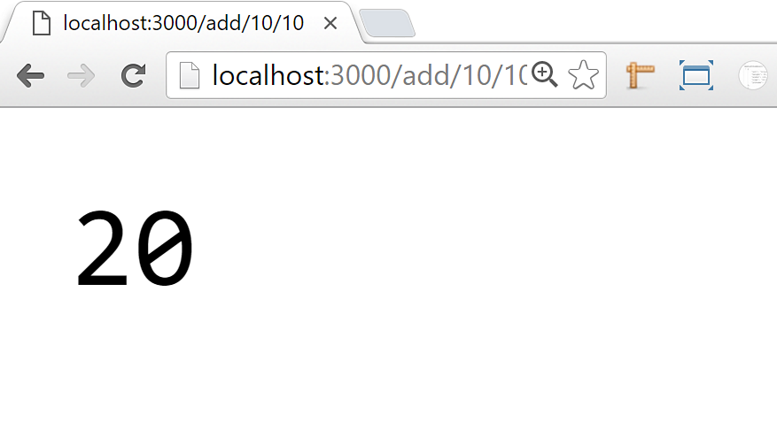
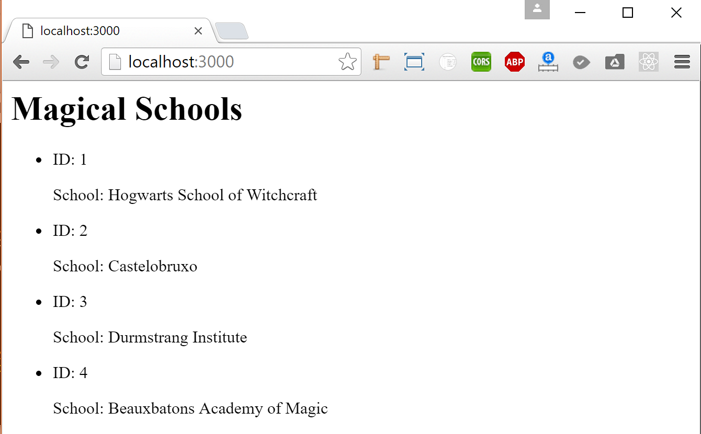

## Day 3 - Hot Restaurant Continued & SQL Front to Back <!--links--> &nbsp; [⬅️](../02-Day/02-Day-LessonPlan.md) &nbsp; [➡️](../04-Day/04-Day-LessonPlan.md)

### Overview

`Summary: Complete activity 16 in Unit 13 & activities 01-03 in Unit 14`

##### Instructor Priorities

By the end of class students will:

* Reinforce their understanding of Express Servers, Routing, and the utility AJAX for front-end interaction. 

* Go over how to send MySQL data from the back-end to the front-end.

* Be introduced to sending MySQL data from the back-end to the front-end.

##### Instructor Notes

* Let all students know that there is a thorough video outlining the solution to the hot restaurant activity that you will Slack out. (See Recap)

* As much as possible, focus on providing students assistance in small-group format.

* We will be going over how to send MySQL data from the back-end to the front-end.

* Have your TAs reference [03-Day-TimeTracker](03-Day-TimeTracker.xlsx) to help keep track of time during class. 

### Sample Class Video (Highly Recommended)
* To view an example class lecture visit (Note video may not reflect latest lesson plan): [Class Video](https://codingbootcamp.hosted.panopto.com/Panopto/Pages/Viewer.aspx?id=2853f322-e47f-4232-9cd1-a85e00f7735f)

- - -

### Class Objectives

* To create a real-world application for handling reservations using Node/Express

* To send MySQL data from the back-end to the front-end using Expres

- - -

### 1. Instructor Do: Welcome (1 min)

* Welcome students back, and ask them to get into their groups from yesterday - we're going to finish hot restaurant today!

### 2. Partners Do: Phase IV - Backend Logic + AJAX (60 min)

* Proceed with the next phase. Slack out the following instructions to help guide them:

  * Phase IV: For this fourth phase, aim to complete the following:

    * Backend Team:

      * Create the logic that handles reservation requests. Your code should work such that POST requests take in JSON objects, checks if there is any space left, then adds the JSON object to either the reservation array or the waitlist array. Your POST route should also respond to requests with a confirmation (true or false) of whether or not the requestor has a reservation (or is on the waiting list).

      * You should be using Postman to do all your testing at this point.

    * Frontend Team:

      * Begin to do serious research on AJAX. Specifically, focus your attention on how AJAX can be used to do both GET and POST requests.

      * Then create the necessary code on your `tables.html` page such that it can retrieve data from the Backend Team's API. In essence you will be creating an AJAX GET request to retrieve the data.

      * Then create the necessary code on your `reserve.html` page such that it can send data to the Backend Team's API. In essence you will be creating an AJAX POST request to send the data.

    * All: This is the most challenging part of today's activity. Be persistent! You can do this!

### 3. Partners Do: Phase V - De-bugging + Bonus (20 min)

* Proceed with the final phase. Slack out the following instructions to help guide them:

  * Phase V: For the fifth and final phase, aim to complete the following:

    * All:

      * Complete any remaining functionality from the previous phase if you need more time. 

      * Then, thoroughly test your application for bugs. Check if there are any obvious ways to crash the application.

### 4. Instructor Do: Recap (0:10)

* Take the stage again. Let students know that this was a hard activity but an incredibly realistic one.

* Encourage them by informing them that they've reached a highly significant point in their coding careers. Being able to build front-end and back-end applications like this one will allow them to build any number of applications.

* Then let them know that -- because of how important it is to understand these concepts, they should thoroughly examine the solution after class today.

* Slack out the [video solution](https://youtu.be/G7RvQMW2DOg?list=PLgJ8UgkiorCmI_wKKVt5FlkTG63sQF6rr) and HIGHLY HIGHLY encourage them to review it on their own. Let them know that the accompanying code has been thoroughly commented and that they should consider working in groups to dissect it.

* Finally, say something funny -- you've already done some great education today!

- - -

### 5. Lunch (30 min)

- - -

### 6. Students Do: Express Calculator (20 minutes)

* After answering any and all questions your students may have, slack out the following instructions for the warm-up assignment...

* **Instructions**

  * You will create an Express calculator application with one get route that is able to take in three parameters: an operation and two numbers.

  * There are four operation values which a user may use: addition, subtraction, multiplication, and division.

  * When the route is hit, your browser should display the result of the math operation and the two numbers on the screen.

    * For example, when the user goes to the url <http://localhost:3000/add/10/1>, the page should display 11.

### 7. Everyone Do: Express Calculator Review (15 minutes)

* After your class has completed the calculator exercise, open up [01-ExpressCalculator/Solved/expressCalculator.js](../../../../01-Class-Content/14-handlebars/01-Activities/01-ExpressCalculator/Solved/expressCalculator.js) within your editor and have your students go through the code line-by-line with you.

    

* Make sure that everyone in your class seems comfortable working with Express. If your students seem confused or lost, feel free to review Express with them. While Handlebars is a very useful templating language, understanding Express is very important in web development.

### 8. Instructor Do: Wizarding Schools (15 minutes)

* Open up [02-MagicalSchools/schema.sql](../../../../01-Class-Content/14-handlebars/01-Activities/02-MagicalSchools/schema.sql) and run it within MySQL Workbench.

* Open up and run `02-MagicalSchools/magicSchools.js` within both your editor and within your terminal before running the code.

* Make sure to run `npm install` before running `node magicSchools.js` within your terminal.

    

* Explain to your students how the HTML within your code is being generated and sent to the browser.

* Information is being taken from the MySQL database, looped through, and then given HTML syntax so that it appears with some basic styling upon the page.

### 9. Partners Do: Seinfeld Application (20 minutes)

* Once all questions regarding MySQL and Express have been answered, copy [03-SeinfeldApp/schema.sql](../../../../01-Class-Content/14-handlebars/01-Activities/03-SeinfeldApp/Solved/schema.sql) into MySQL Workbench and run the code to set up the database.

* Navigate into the `03-SeinfeldApp` and open up your terminal. Run `npm install` and `server.js`, and then show your students the Seinfeld application in action by going to the following urls:

  * <http://localhost:3000/cast>
  * <http://localhost:3000/coolness-chart>
  * <http://localhost:3000/attitude-chart/relaxed>

* After showing off how the application functions and answering whatever questions your students may have, slack out the following instructions...

* **Instructions**

  * Create a seinfeld_db database with an actors table.

    * The actors table will have a column for id (PRIMARY KEY AUTO_INCREMENT int), name (varchar), coolness_points (int), and attitude (varchar).

  * Add in four actors with different names, coolness_points, and attitudes.

  * Create a Node Application with Express, MySQL, and Body Parser with three Express routes.

    * Create a `/cast` route that will display all the actors and their data ordered by their id's.

    * Create a `/coolness-chart` route that will display all the actors and their data ordered by their coolness points.

    * Create a `/attitude-chart/:att` route that will display all the actors for a specific type of attitude.

### 10. Instructor Do: Seinfeld Review (15 minutes)

* Go over the previous exercise with the class. Call upon one unique student for each part of the previous exercise to explain what they did for that part of the exercise. If anyone seems lost or confused about a specific part, make sure to go over that section of the code in further detail.

### 11. Instructor Do: SQL + HTML = Bad Idea (5 minutes)

* Talk with your students about why combining data collected from a MySQL server with HTML might be considered a bad idea.

* There are a couple good reasons why you might not want to do this, but the main reason is that you would have to write out a whole lot of HTML and maintain it within a server-side JavaScript file.

* It would be far easier if there were a means to template back-end data on the front-end instead.

* Luckily there is... and we will be diving into this topic next class.

### 12. Instructor Do: Introduce HW (5 minutes)

* Open up your terminal so that you are inside of the [2-Homework/Solutions/BurgerSolution](../../../../01-Class-Content/14-handlebars/02-Homework/Solutions/BurgerSolution) folder, run `npm install`, run `node server.js`, and then open up the application within your browser.

* Show all the functions for the application, doing your best to explain them.

* Tell your students that it uses Node, Express, MySQL, and the templating language Handlebars which they will be learning later this week.

### 13. Groups Do: Homework (Hot Restaurant) (55 min)

* Put students into groups to work on homework to work on their Hot Restaurant homework

### Lesson Plan Feedback

How did today's class go?

[Went Well](http://www.surveygizmo.com/s3/4325914/FS-Curriculum-Feedback?format=ft&sentiment=positive&lesson=07.03)

[Went Poorly](http://www.surveygizmo.com/s3/4325914/FS-Curriculum-Feedback?format=ft&sentiment=negative&lesson=07.03)
