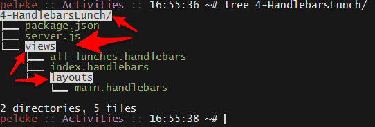
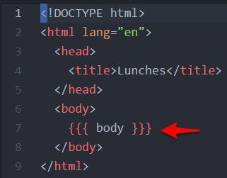
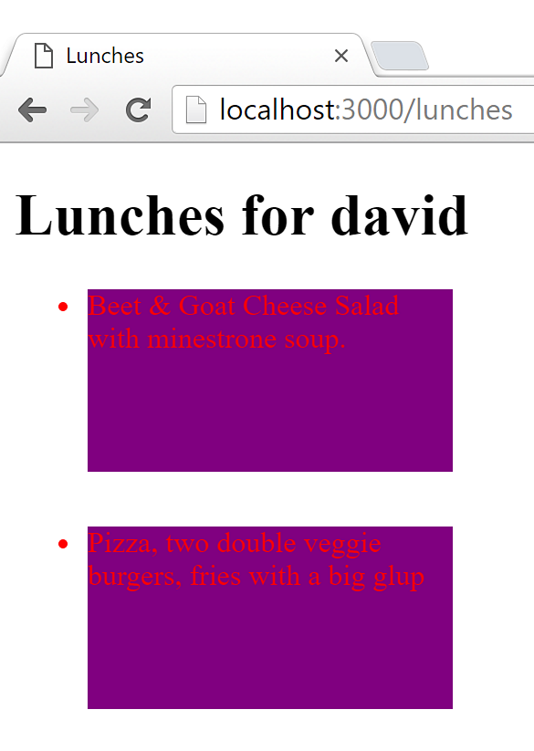
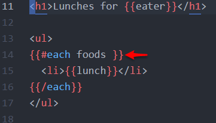

## Day 4 - Intro to Handlebars & Bringing it from the Front to the Back <!--links--> &nbsp; [⬅️](../03-Day/03-Day-LessonPlan.md) &nbsp; [➡️](../05-Day/05-Day-LessonPlan.md)

### Overview

Students will be diving into the basics of Handlebars today, a semantic templating language which can be used to link back-end JavaScript data to front-end HTML with relative ease.

Students will bring all of their front-end and back-end knowledge together to create a fully-functional Node application.

`Summary: Complete activities 4-10 in Unit 14`

##### Instructor Priorities

By the end of class students will

* Be able to pass server-side data to the page using Express and Handlebars.

* Have a firm understanding of how to use GET, POST, PUT, and DELETE commands for sending data from the front-end to the back-end

* Be able to apply the basics of CRUD (Create. Read. Update. Delete.) to create a full-stack web application.

* Know how to use Express, MySQL, and Handlebars all together to create dynamic webpages.

##### Instructor Notes

* Handlebars can seem daunting at first, but it is ultimately a very powerful templating tool which your students might find useful. Try to keep to a pace that your students seem comfortable learning, so as to make sure no one is left behind.

### Sample Class Video (Highly Recommended)
* To view an example class lecture visit (Note video may not reflect latest lesson plan): [Class Video](https://codingbootcamp.hosted.panopto.com/Panopto/Pages/Viewer.aspx?id=69a17268-b438-4fdc-8103-a85f00f88ab9)

- - -

### Class Objectives

* To understand semantic templating using Handlebars
* To understand the basic syntax for Handlebars-based web applications
* To create an Express connection to a front-end application which takes in MySQL data and prints it to the screen using Handlebars
* To use HTML/jQuery GET, POST, PUT, and DELETE commands appropriately
* To create full-stack web applications that will Create, Read, Update, and Delete data from a MySQL database
* To use Express.js, MySQL and Handlebars together to create a dynamic application

- - -

### 1. Instructor Do: Introduction to Handlebars (25 min)

* Open up the `04-HandlebarsLunch` folder and then open up [04-HandlebarsLunch/server.js](../../../../01-Class-Content/14-handlebars/01-Activities/04-HandlebarsLunch/server.js) within your editor.

* Point out to them how, just like in our past activities, we are using Express here to send data from the back-end to the front-end. Unlike our past applications, however, the view engine which we have provided our application with is something called "Handlebars."

* Handlebars is what is known as a "Semantic Templating" framework for JavaScript and HTML. Frameworks like these are used as a replacement to constructing long strings of HTML within your JavaScript code while also providing programmers with a simpler method through which to dynamically create or to fill HTML elements.

* Open up your browser and navigate to the [Handlebars Website](http://handlebarsjs.com/) to show them how simple the syntax for Handlebars appears to be.

* Handlebars makes it so you can pass back-end variables to your front-end HTML simply by including the name of the variable you are sending from the server inside of two sets of curly-brackets within your front-end code. Example: `{{VALUE}}`.

* There are a few oddities and hurdles to getting Handlebars up and running on your website, however, since the required file paths for this framework are not exactly commonplace. It requires that you create a `Views` folder which contains all of your Handlebars files as well as a `Layouts` folder which contains your `04-HandlebarsLunch/views/layouts/main.handlebars` file. All files which contain Handlebars inside of them must also be saved using the `.handlebars` file type.

* Open up the `04-HandlebarsLunch` folder once more in order to show your class how this folder system functions.



_Handlebars expects to find views and layouts directories in specific locations._

* Also open up `04-HandlebarsLunch/server.js` within your editor once more in order to show them how, within our declaration of the view engine, we are telling it that our `defaultLayout` is `main`. This tells the server that the `04-HandlebarsLunch/views/layouts/main.handlebars` file contains the primary layout for our HTML.

* Open up `04-HandlebarsLunch/views/layouts/main.handlebars` and `04-HandlebarsLunch/views/index.handlebars` within your editor, and go over this code with your class.

* Start by showing your class how `04-HandlebarsLunch/views/layouts/main.handlebars` contains the declaration of our HTML and only seems to contain one Handlebars element in the form of `{{{ body }}}`. Explain how the usage of triple curly-brackets tells your program to read and render HTML elements while double curly-brackets will not.



_Our main layout contains a single Handlebars variable to interpolate._

* For Example, `{{{ <p> Hello World </p> }}}` would show up in our HTML as `<p>Hello World</p>` while, if we had used double curly-brackets, our code would look really ugly and come out as something like `&lt;p&gt;Hello World&lt;/p&gt;`.

* The `04-HandlebarsLunch/views/layouts/main.handlebars` code uses triple curly-brackets because we are going to be passing our other Handlebars components into it using statments like `res.render('index', lunches[1])` in our `04-HandlebarsLunch/server.js` file where `index` is a Handlebars component.

* Now turn your focus onto `04-HandlebarsLunch/views/index.handlebars` and discuss with your class how this file is taking in the variable `lunch` and is placing it with a pair of `<h1>` tags before sending that file into `04-HandlebarsLunch/views/layouts/main.handlebars` to be used. The method we use to pass the data into `04-HandlebarsLunch/views/index.handlebars` is just like any other Express statement.



### 2. Partners Do: Explaining Lunches Application (10 min)

* Slack out a zipped version of `04-HandlebarsLunch` to your students, have them open it up, and to those students around them, have them explain how the code functions. Once they are finished going over `main` and `index`, instruct them to look into `all-lunches` in an attempt to figure out how the code in there works as well.

* Tell them that, if they are lost or confused, the [Handlebars Website](http://handlebarsjs.com/) could be helpful in figuring the code out.

### 3. Everyone Do: Explaining Lunches Cont. and the "Each" Helper (10 min)

* Call on random students to explain the code to the rest of the class. Start with `04-HandlebarsLunch/views/layouts/main.handlebars`, `04-HandlebarsLunch/views/index.handlebars`, and `04-HandlebarsLunch/server.js` before having them move on to try and explain how `04-HandlebarsLunch/views/all-lunches.handlebars` functions.

* Open up `04-HandlebarsLunch/views/all-lunches.handlebars` within your editor, and go over the `{{#each foods}}` and `{{/each}}` statements in particular.

* The `{{#each}}` helper within Handlebars is essentially a for-loop which loops through an array and inserts the values of said array into your HTML code. It will do this for however many variables are contained within your array and will append your HTML instead of replacing it.



_Handlebars each blocks are analogous to for loops._

* There are other helpers which Handlebars uses, but we will be getting into those later on.

### 4. Partners Do: Ben and Jerry's App (15 min)

* Answer whatever questions your students may have and then slack out the following activity...

* **Instructions**

  * In this activity, you are going to be creating your own Ben and Jerry's App where users can see all of the different flavors Ben and Jerry's have to offer while also getting specific information on a flavor by searching for it within the URL.
    ```
    var icecreams = [
      {name: 'vanilla', price: 10, awesomeness: 3},
      {name: 'chocolate', price: 4, awesomeness: 8},
      {name: 'banana', price: 1, awesomeness: 1},
      {name: 'greentea', price: 5, awesomeness: 7},
      {name: 'jawbreakers', price: 6, awesomeness: 2},
    ];
    ```
  * Do not use MySQL for this assignment! Use the `icecreams` variable above as your data. Add the variable to your `server.js` file.

  * Using handlebars and express, create a route called `/icecreams/:name`. When the route is hit, it will display the name, price and awesomeness for that specific ice cream.

  * Create an `/icecreams` route. It will loop over all the ice creams and display them all to the user.

### 5. Everyone Do: Ben and Jerry's App Review (5 min)

* Open up the `05-BenAndJerrys` folder within your editor.

* Go over the previous exercise with the class. Call on a unique student for each part of the previous exercise to explain what they did for their respective parts. If your class seemed to have struggled on a particular part of the activity, make sure to cover that section in more detail during this time.

### 6. Instructor Do: Demo the Warm Up (5 min)

* Open up the `06-HandlebarsAnimals/Solved` folder within your terminal before running `npm install` and `node server.js` so as to demonstrate what your students will want to create in their warm-up activity.

* Go to the following routes to show off how the application works:
  * <http://localhost:3000/dog>
  * <http://localhost:3000/all-pets>
  * <http://localhost:3000/all-non-pets>

### 7. Students Do: Handlebars Animals (20 min)

* Answer whatever questions your students may have about the application's functions before slacking out the following:

  * **Files**

    * `06-HandlebarsAnimals/Unsolved`

  * **Instructions**

    * You will edit the `server.js` file, the `dog.handlebars` file, and the `index.handlebars` file in an attempt to recreate the application that we demonstrated just a couple of minutes ago. Instructions on what to do are contained within each file you will have to edit.

    * You won't be using MySQL for this exercise but will instead be using the animals array in the `server.js` file.

### 8. Everyone Do: Handlebars Animals Review (15 min)

* Open up the files contained within [06-HandlebarsAnimals/Solved](../../../../01-Class-Content/14-handlebars/01-Activities/06-HandlebarsAnimals/Solved), and go over the previous exercise with the class.

* Call on a unique student for each part of the activity to explain what they did for their respective parts. Make sure to step in and to explain aspects of the code with which your class might be struggling.

### 9. Instructor Do: In Need of Some REST (15 min)

* Explain HTTP (Hypertext Transfer Protocol) actions in the context of REST to the class.

* REST stands for Representational State Transfer, and it is essentially a set of standards for the web. RESTful applications have a uniform interface, are stateless, are cacheable, keep the server separate from the client, and are a layered system in that there may be intermediary servers between the client and the database with which they are working.

* Do not worry if your students have some problems understanding all of these constraints, as a lot of this language is inherently difficult to understand. If they would like to learn more about the subject, however, then feel free to slack out [RestApiTutorial.com](http://www.restapitutorial.com/lessons/whatisrest.html), which has a lot more information on how RESTful styling works.

* Your students actually already know half of the HTTP actions (GET and POST), but there are two other HTTP actions which we have not yet covered: PUT and DELETE.

  * GET requests read data from a database.

  * POST requests are used to create new data into a database.

  * PUT requests are used to update a row within a database.

  * DELETE requests are used to delete a row from a database.

* It is not actually a requirement to use RESTful conventions as you can select, create, update, and delete data from a database using nothing but GET requests. You should not do this, however, because it is a best practice to use GET requests only to retrieve information whilst letting other request types handle inserting, updating, and deleting.

* You should follow best practice, but it is helpful to realize that it doesn't have to be that way in order to get your application to work.

### 10. Partners Do: Understanding GET, POST, PUT, and DELETE (5 min)

* Have students explain GET, POST, PUT and DELETE to each other as best they can before calling them back together and having four randomly selected students explain to the class what each method does.

- - -

### 11. Lunch (30 min)

- - -

### 12. Instructor Do: Using HTTP Requests (15 min)

* Demonstrate the application stored within the [07-TaskSaver](../../../../01-Class-Content/14-handlebars/01-Activities/07-TaskSaver) folder with GET and POST commands in front of students.

* Make sure to copy `07-TaskSaver/schema.sql` into MySQL Workbench and run the code so as to set up the database you will be reading/affecting.

* Also make sure to run `npm install` within the terminal.

* Point out how lines 1–33 in `07-TaskSaver/server.js` is boilerplate code meant to set up the application which we will be able to copy and paste into future applications.

* Explain the routes within `07-TaskSaver/server.js`, being sure to point out how data is being collected and added from our MySQL database.

* Explain how the form's method inside of `07-TaskSaver/views/index.handlebars` is POST and the action of `'/'` points to the following part of the `server.js` file: `app.post('/', function(req, res)`.

* By making it so that the form's method is POST, we are essentially telling our server that we are going to be posting data to our database. It is extremely similar to using a `jQuery.post()` command.

* Explain that you need the `body-parser` middleware to be able to use `req.body.task` in `07-TaskSaver/server.js` within the `app.post('/', function(req, res)` section.

  * Check to make sure students remember the concept of middleware:

    * Middleware is a function we can run before the browser's request reaches our routes.

    * The `body-parser` middleware transforms the request so that we can read the data that was sent on `req.body`.

    * Middleware can be defined using the `app.use` method.

* Explain what `{{#each tasks}}` is doing in the `07-TaskSaver/views/index.handlebars` file.

* Explain the following line from the `07-TaskSaver/views/index.handlebars` file: `<textarea type="text" name="task"></textarea>`.

* When data is sent from the front-end to the back-end using the POST method, the key which a specific set of data is contained within is determined by the "name" of the HTML element.

### 13. Partners Do: Understanding TaskSaver (15 min)

* Before answering any questions regarding the previous section, slack out [07-TaskSaver](../../../../01-Class-Content/14-handlebars/01-Activities/07-TaskSaver) to your class and have them set up the application on their computers.

* Have your students go through the code line-by-line with the person sitting next to them as they work to solidify the lessons learned up above.

### 14. Students Do: Wishes Application (15 min)

* After answering whatever questions your students may have regarding the previous activity, open up the [08-Wishes](../../../../01-Class-Content/14-handlebars/01-Activities/08-Wishes) application and demonstrate what your students will be building over the next 20 minutes.

* Slack out the following instructions:

  * **Instructions**

    * Create an app with Express, MySQL and Handlebars.

      * HINT: this app will be very similar to the app your instructor just demonstrated and slacked out. Please feel free to leverage that code when creating this code.

    * Create a `schema.sql` file and create the following inside of that file:

      1. Make a database called "wishes_db"

      2. Inside of that database, make a table called "wishes" which will have a wish column and an id column. The id will be automatically incremented while also being the primary key.

      3. Run your `schema.sql` file within MySQL Workbench before moving onto the next steps.

    * In your `server.js` file, you will have to create two routes: a get route for `'/'` and a post route for `'/'`.

      * Render all of the wishes from the wishes table when the `'/'` get route is hit. Additionally show the form that the user can use to create a new wish. The form will POST to the `'/'` route.

      * The `'/'` post route will insert the wish from the form into the wishes table and will redirect the user back to the `'/'` get route.

### 15. Instructor Do: Wishes Application Summary (15 min)

* Open up the [08-Wishes](../../../../01-Class-Content/14-handlebars/01-Activities/08-Wishes) folder and its files within your editor, and go over the code line-by-line with your class, making sure to explain what is happening within your code to the best of your ability.

### 16. Instructor Do: Putting and Deleting (20 min)

* Open up the [09-DayPlanner](../../../../01-Class-Content/14-handlebars/01-Activities/09-DayPlanner) folder within your editor and within your terminal, running `npm install` before running `server.js` and opening up the application within your browser to demonstrate how the application works.

* Point out how we create PUT and DELETE routes with Express

* Point out how to use jQuery to send PUT and DELETE requests (and that there are no shorthand methods available like for GET and POST).

### 17. Partners Do: Going Over the Day Planner (15 min)

* Slack out `09-DayPlanner` to your students, have them run the application on their computers, and then have them explain the code to their partners line-by-line.

### 18. Everyone Do: Watch List (20 min)

* Once everyone seems to have finished picking their way through the code and you have answered whatever questions your students may have had, slack out the following instructions:

  * **Instructions**

    * Create a full-stack application with Express, MySQL and Handlebars.

      * HINT: this web application will be very similar to the app your instructor just demonstrated and slacked out. Please feel free to leverage that code when creating this code.

    * Create a `schema.sql` file. Inside of that file, do the following:

      1. Make a database called moviePlannerDB

      2. Inside of that database make a movies table which will contain a movie column and an id column. The id will be automatically incremented while also being the primary key.

      3. Run your `schema.sql` file within MySQL Workbench before moving onto the next steps.

    * In your server.js file, you will create four routes: `get`, `post`, `put`, and `delete`.

      * Render the main `index.handlebars` when the `'/'` get route is hit with all of the movies from the movies table.

      * Your application should have a set of routes on `'/movies'` for create, update, and delete operations on the movies table.

      * Show a delete button next to each movie. When one of the delete buttons is clicked, the code should send a DELETE request to  delete the associated movie from your database.

      * Additionally, show the form that the user can use to add a movie to be watched.  When the submit button is clicked, the code will post to the `'/movies'` route, which will insert the movie from the form into the movies table and return the ID of the new movie.

      * Have another form that will update a movie in the movies table. The form will include two inputs: an id input and a movie title input. Remember to leverage a PUT method.

      * Remember: best practices for REST include:

        * Put your REST API on it's own URL (e.g. `'/todos'`).

        * A POST that creates an item should return the ID of the item it created.

        * PUT and DELETE should specify the ID of the item they're intended to affect in the URL (e.g. `'/todos/123'`).

        * If the ID for the item specified in a PUT or DELETE couldn't be found, return a 404.

        * If an error occurs in the server, return an error code (e.g. 500).

### 19. Everyone Do: Watch List (15 min)

* Open up the [10-WatchList](../../../../01-Class-Content/14-handlebars/01-Activities/10-WatchList) folder and its files within your editor, and go over the code line-by-line with your class, making sure to explain what is happening within your code to the best of your ability.

### Lesson Plan Feedback

How did today's class go?

[Went Well](http://www.surveygizmo.com/s3/4325914/FS-Curriculum-Feedback?format=ft&sentiment=positive&lesson=07.04)

[Went Poorly](http://www.surveygizmo.com/s3/4325914/FS-Curriculum-Feedback?format=ft&sentiment=negative&lesson=07.04)
