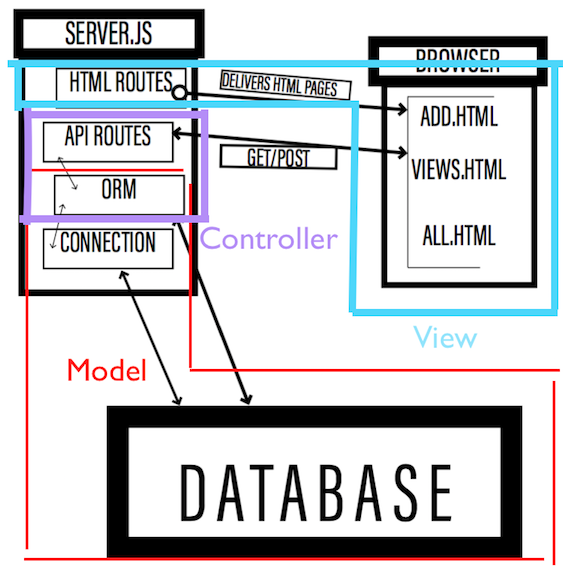
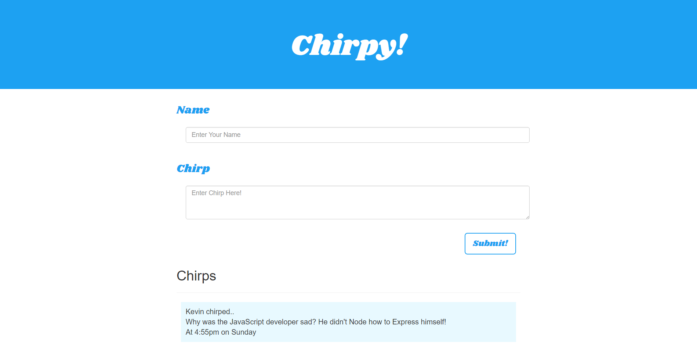
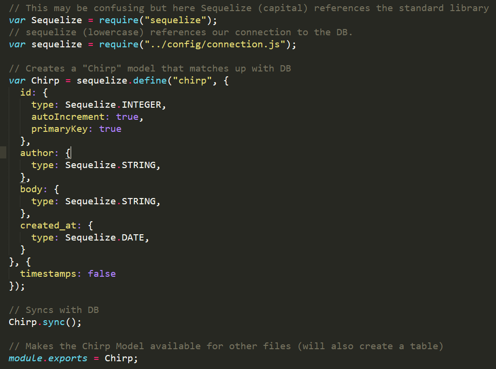
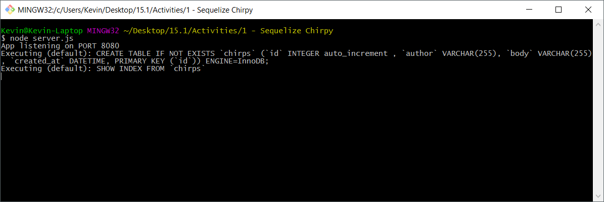
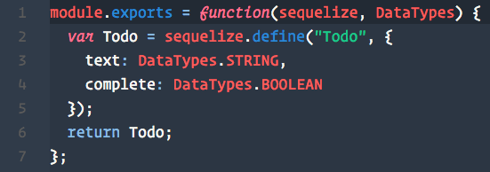
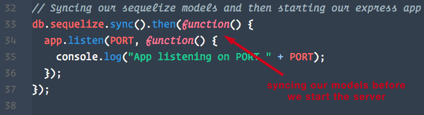
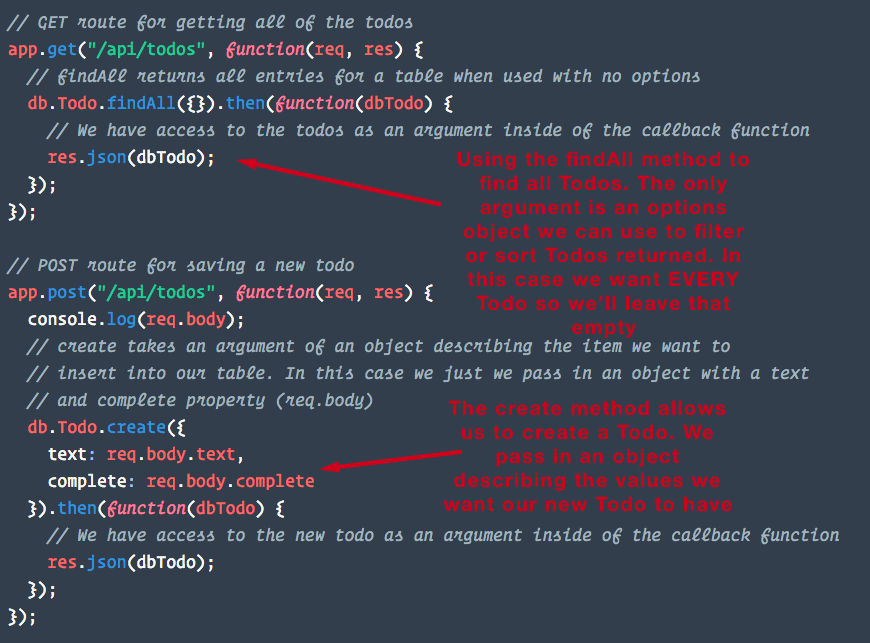

## 8.1 - The Sequel to MySQL & Creating and Reading with Sequelize (10:00 AM) <!--links--> &nbsp; [⬅️](../../07-Week/05-Day/05-Day-LessonPlan.md) &nbsp; [➡️](../02-Day/02-Day-LessonPlan.md)

### Overview

In this class, we will introduce students to the Sequelize ORM. This tool makes coding with MySQL databases a smoother experience--once you get past the learning curve.

We'll introduce new Sequelize methods for updating and deleting records.

`Summary: Complete Activities 1-8 in Unit 15`

* When using any of the `Supplemental PDFs`, please download and open. Do NOT preview on GitHub as they may not display properly in the browser.

##### Instructor Priorities

By the end of class students will

* Understand the concept of Sequelize models, and how we can sync them with a MySQL database to create tables with schemas written out in JavaScript.

* Be able to initialize a Sequelize project using the command line interface.

* Become familiar with the "where" query attribute to filter items from our database.

* Become more comfortable converting a project using a different ORM to use Sequelize, as well as understand what's needed to set Sequelize up from scratch.

* Complete the Express Checkpoint.

##### Instructor Notes

* Make sure you change all of the connection information so the examples have your MySQL username/password!

* If you don't want to have to do it live, create the databases required to show off today's exercises before class!

* THIS IS TOUGH STUFF! This week, tell your class to not feel discouraged if there are concepts that they can't nail down completely. Tell them to try their best, but to speak with you or a TA if they're unsure of anything.

* Let students know Sequelize is a popular and powerful Node ORM. However, it may be important to note that this week is largely an exercise in learning a new library. Students will have to read documentation, go through tutorials, search and post on StackOverflow in order to find specific answers once they've identified specific problems as they're working through projects.

* You should check out the solutions to this week's homework before starting this class, especially if you haven't used Sequelize before. This will give you a brief rundown of how the ORM works.

  * Be sure to check the answers to the quiz in [02-SequelizeQuestions/Solved](../../../../01-Class-Content/15-sequelize/01-Activities/02-SequelizeQuestions/Solved/Sequelize_Answers.md) before starting the class. You should be an expert on these concepts, so that if students ask you about the answers after the quiz, you can give them a thorough explanation.

* **BE VERY CAREFUL TO NOT GO TOO IN DEPTH.** There are a ton of components that make Sequelize work, but much of it is boilerplate that doesn't need much explanation. Focus on the parts we tell you about in this guide.

* Make sure you have a MySQL database named "todolist" created on your machine before class starts. Try and familiarize yourself with how the todolist app is supposed to work.

* **Important**: Well be working with the same application, converting it over to use Sequelize and adding some additional functionality. As we're going along doing this, the app will break. It won't be fully functioning till towards the end, but the instructions for each activity will how to verify that it was done correctly, i.e. "sequelize should have created a table with these values".

* **DO NOT HAVE STUDENTS CONNECT TO A REMOTE DATABASE WHEN DEVELOPING LOCALLY.** The correct process is described in [Supplemental/SequelizeHerokuDeploymentProcess.pdf](../../../../02-lesson-plans/full-time/08-Week/Supplemental/SequelizeHerokuDeploymentProcess.pdf), and if you try to skip this, your students may not be able to work on activities or homework on your classroom's internet connection (also, using a remote database for local development is considered bad practice).

### Sample Class Video (Highly Recommended)
* To view an example class lecture visit (Note video may not reflect latest lesson plan): [Class Video](https://codingbootcamp.hosted.panopto.com/Panopto/Pages/Viewer.aspx?id=e816511a-6e34-41ef-8ac2-a8720159c753)

- - -

### Class Objectives

* To introduce Sequelize as a complex tool that simplifies MySQL.

* To demonstrate the makeup of a Sequelize directory, how to make one, and how to make queries using Sequelize.

* To provide students a refresher on setting up a project to work with Sequelize.

* To review the creation of models using Sequelize.

* To review Sequelize CRUD methods introduced in the last class and to introduce methods for updating and deleting database entries.

* To complete the Express Checkpoint

- - -

### 0. Instructor Do: Welcome Students (0 mins)

* Say your hellos and welcome your class.

- - -

### 1. Instructor Do: Refresher on last week (5 mins)

* You're going to be going over the concepts of MVC. Open up the [00-MVCDiagram](../../../../01-Class-Content/15-sequelize/01-Activities/00-MVCDiagram/MVC Diagram.pdf) folder, and ask students which components belong to the model, the view and the controller (the solution is represented in the image below).

  

  * Remember:
    * The Model represents the application core (our database and it's hook to our back-end).
    * The View displays the data (our HTML routes and the public files).
    * The Controller handles the input to our database (accepting input from the view, sending it to the model, taking a response from the model, and sending it back to the view.)

- - -

### 2. Students Do: (20 mins)

* Before we get into new material, we are going to do a quick review of MySQL concepts by building a simple app. We will revisit this example later on with the Sequelize ORM, but for now we are only going to use the MySQL package.

* Open up the completed Chirpy activity and demonstrate its functionality. It is a simple twitter-like app that allows you to write new Chirps (tweets), and view all of your previous Chirps.

* NOTE: Make sure you have used the schema.sql file to create the Chirpy database and the table that will be used to hold our Chirp data. If you haven't done this the app won't work. You can do it before class or do it live as a review for the students.

* Slack out the [01-Chirpy-mySQL](../../../../01-Class-Content/15-sequelize/01-Activities/01-Chirpy-mySQL) folder and the following instructions:

  * Using the app skeleton provided to you:
    * Create a MySQL database named `'chirpy'` with a `'chirps'` table to hold your data.
    * Your `'chirp'` table should include a field for id, author, chirp, and time created.
    * Modify the connection.js file to create a connection to your database.
    * Modify the api-routes.js file so that there is a route for adding a new chirp, as well as retrieving all chirps.
    * Create a simple front-end for the app using HTML/JavaScript.

* If students finish early, have them work on routes for editing and deleting chirps.

- - -

### 3. Instructor Do: Review Chirpy (5 mins)

* Review the main parts of the Chirpy application:
  * Creation of the database and the table in mySQL Workbench (or your choice of GUI).
  * Use of mysql npm package to connect to the database as well as configuration of `connection.js` file.
  * API routes and mySQL queries that were used to retrieve data from the DB.
  * Making our AJAX calls and displaying data on the front-end.

- - -

### 4. Instructor Do: Introduce Sequelize Before a Quiz (5 mins)

* Tell your class while the Chirpy app is functional, there's a way to make it work with our database with a lot less hassle. It might take time to learn, and this week will be a tough one, but this tool is going to take your students from beginners to truly adept MySQL coders.

* Load up the Sequelize site on your screen and slack out the website to your students. (<http://docs.sequelizejs.com/en/latest/>). Tell the class that Sequelize is a premade ORM that simplifies database queries in Node applications, allowing us to do complex data management with simple JavaScript methods.

* Inform your class that today will focus on getting Sequelize set up on their machines and how to navigate a Sequelize project. You'll be doing this by converting the Chirpy app from the last assignment into a Sequelize app.

- - -

### 5. Partners Do: Sequelize Quiz (10 mins)

* Slack out the unsolved portion of [02-SequelizeQuestions](../../../../01-Class-Content/15-sequelize/01-Activities/02-SequelizeQuestions/Unsolved/Sequelize_Instructions.md)

* Have your students partner up into two-person teams. Each team will need to come up with answers to the questions in the quiz. Check out the answers in the solved portion in the meantime.

* Tell them they should use the Sequelize documentation, as well as any info they may find on the usual sites (stack overflow, quora, etc.) to answer these questions.

- - -

### 6. Everyone Do: Go over Answers (10 mins)

* "Times up! Let's see how everyone did."

* Open the unanswered version of [02-SequelizeQuestions](../../../../01-Class-Content/15-sequelize/01-Activities/02-SequelizeQuestions/Unsolved/Sequelize_Instructions.md) and display it. Go down the list and ask your students to give you their answers. If everyone is stumped, refer to the answers in the solved version, then ask the students if this makes sense. If not, offer more of an explanation.

* Ask your class the same question you asked on week 1: "How would you define full-stack development?" At this point students should be much more savvy than they were on Week 1, so expect solid answers.

- - -

### 7. Instructor Do: Chirpy with Sequelize (10 mins)

* Open the Sequelize version of the Chirpy app and show it off again. This time inform students that this new version of Chirpy is using the Sequelize ORM we just learned about. Slack out the completed Chirpy-Sequelize app [03-Chirpy-Sequelize](../../../../01-Class-Content/15-sequelize/01-Activities/03-Chirpy-Sequelize) and encourage students to follow along as you work through the code.

* Open up the Chirpy code in your editor and illustrate the key differences between using Sequelize and stock MySQL.

  * In the connection.js file we require the Sequelize package, and use it to create a connection to our database. This is very similar to how we use the MySQL package.
  * One of the biggest changes is the addition of a models folder with our new `chirp.js` file.

    

    * Note how we first require the Sequelize library, and then the connection that we will use to connect to the database (Sequelize with a little "s").
    * Reiterate the key aspects of Sequelize models. A model represents a table in the database. Here we are defining the different columns that will be in our table, as well as assigning them a data type. In addition, we sync our model with the database. Sequelize will create a table in our database for each model if it does not already exist. Point out that we don't need to define an id column in our Sequelize models. By default, we're given a NOT NULL, auto-incrementing id of type INTEGER to serve as the primary key. We can explicitly define an id column if we wanted to give it a different configuration, but we can just omit this most of the time.

      

  * In api-routes.js we first require the Chirp model, then we use sequelize query methods to query our database. In our example we are using `Model.findAll()` and `Model.create()` but there are many more! Illustrate how instead of having to write out an entire mySQL query string, we can use predefined query methods defined by Sequelize. This allows us to greatly simplify how we retrieve data from our database!

    

  * **Note**: If we were to `console.log` the `result` object returned from a sequelize query, we'd see that it is a large object with many nested keys and methods. It contains a `dataValues` property that contains the record data we're looking for.

  * When we send the large `result` object back to the client using `res.json`, only the `dataValues` property is sent back.

  * This is worth knowing since it may come up when debugging students code.

- - -

### 8. Students Do: Star Wars MySQL to Sequelize (20 mins)

* Now it's the students' turn to get their hands dirty with Sequelize. They will be taking an app that currently uses the MySQL package, and updating it to use the Sequelize ORM.

* Open the Star Wars app within [04-StarWars/Solved](../../../../01-Class-Content/15-sequelize/01-Activities/04-StarWars/Solved) and demonstrate its functionality. Inform students that they will be taking this fully functioning app and converting it to use Sequelize!

* Slack them the Star Wars skeleton folder [04-StarWars/Unsolved](../../../../01-Class-Content/15-sequelize/01-Activities/04-StarWars/Unsolved) along with the following instructions:
  * Using the instructions in server.js, reconfigure the Star Wars app to use the Sequelize ORM.
  * If you need help, refer to the previous example for guidance.

### 9. Instructor Do: Review Star Wars Example (10 mins)

* Review the Star Wars app with the class, touching once again on the major differences and advantages of using the Sequelize ORM.

- - -

### Lunch (25 min)

- - -

### 10. Students Do: Sequelize Library (20 min)

* In this activity, students will be building the backend of a Sequelize application.

* Open the Sequelize-Library solution [05-SequelizeLibrary/Solved](../../../../01-Class-Content/15-sequelize/01-Activities/05-SequelizeLibrary/Solved) and demonstrate its functionality. Add a few books to the library then show students how we can search for books by title/author/genre, choose to view all books, or view short/long books.

* This app will require students to research more advanced sequelize querying. Urge students to use the Sequelize documentation to find these answers.

* Slack them the Sequelize Library skeleton folder [05-SequelizeLibrary](../../../../01-Class-Content/15-sequelize/01-Activities/05-SequelizeLibrary/Unsolved) along with the following instructions:
  * Instructions
    * Create a `'sequelize_library'` DB.
    * Modify `'connection.js'` to include your MySQL user/database information.
    * In the `'models'` folder, modify the `book.js` file to create a book model. Further details can be found inside this file.
      * Your book model must include a title, author, genre, page numbers.
    * Modify `'api-routes.js'` using sequelize query methods to create the required routes.

- - -

### 11. Instructor Do: Go over Sequelize Library (10 min)

* Go over Sequelize implementation. Focus on aspects of this activity that were new such as the advanced querying techniques as well as the CRUD operations. Inform students that this was a difficult activity and that we will spend more time with CRUD operations next class.

- - -

### 12. Instructor Do: Intro to Sequelize CLI (10 mins) (High)

* Explain to students that we can also initialize Sequelize projects using the Sequelize Command Line Interface.

* This will allow us to quickly start new projects, take advantage of advanced Sequelize features, as well as work with multiple models more easily at scale an ultimately have to write less code as our project grows.

* Slack out the Sequelize CLI Skeleton [06-SequelizeCLI](../../../../01-Class-Content/15-sequelize/01-Activities/06-SequelizeCLI/Unsolved)

* As well as the [Sequelize Quick Start Guide](../Supplemental/SequelizeQuickStartGuide.pdf) have the students follow along with you as you initialize a new project using the Sequelize CLI.

We will be using this method of setting up Sequelize projects going forward, so encourage students to practice with this guide before next class.

**NOTE**: The Sequelize CLI has a lot of functionality, including creating models via the CLI. **We will only be using be using the CLI to initialize an index.js file, and a config.json file**. Discourage model creation with the CLI (if it comes up at any point), as while this is fine for simple models, it will create far more trouble than it's worth later in the week when our models become more complex if students have never written them by hand before.

- - -

### 13. Instructor Do: TodoList Demo (10 mins)

* Praise your students for picking up the concepts you just discussed, but just to be sure you're on the same plane, you have an exercise for them to do.

* Inform students that today they are going to play the role of a backend developer. We have a todo list app that previously was using a simple ORM to communicate with a database, but now we're coming in to perform a few upgrades.

* Open the solved folder inside [10-Sequelize-Validations/Solved](../../../../01-Class-Content/15-sequelize/01-Activities/10-Sequelize-Validations/Solved). In terminal run `npm install` and then `node server`. Navigate to `localhost:8080` and explain to your students that by the end of class they will have fully converted this todo list app to use sequelize instead of the ORM it's currently using.

* Let students know that this application makes use of each CRUD action. It allows the user to CREATE new todo items, it READS todos from the database, it allows the user to UPDATE current todo items, and allows a user to DELETE todos.

* Be sure to demonstrate each piece of functionality to the class. You can toggle a todo's edit mode by clicking it. Inform them that they will be converting one piece of functionality at a time per activity, and **things will inevitably break temporarily while we're doing that**. This is important to keep in mind as we'll be working with the same application throughout this lesson.

* Inform students they won't need to (and shouldn't) touch any front end JavaScript or HTML.

* Answer any questions before the exercise begins.

- - -

### 14. Connect to Sequelize and Create a Todo Model (30 mins) (High)

Slack out the following folder and instructions:

* Folder: [07-ORM-To-Sequelize/Unsolved](../../../../01-Class-Content/15-sequelize/01-Activities/07-ORM-To-Sequelize/Unsolved)

* INSTRUCTIONS:

  1) Create a new local MYSQL database called 'todolist', but don't create any tables.

  2) Delete any references to the orm.js file inside the `api-routes.js` file.

  3) Delete the config folder.

  4) While inside the activity folder, run npm install in terminal.

  5) In terminal, type in the following command: "sequelize init:models & sequelize init:config". If this produces an error, then you may not have the sequelize and the sequelize-cli installed globally. Fix this by running `npm install -g sequelize sequelize-cli` in your terminal and trying again.

  6) Step 5 should have created a config and a models folder for us. Navigate to the config folder, open `config.json`, and modify the development object's "database","username" and "password" values to match your MYSQL database on your machine.

  7) Navigate to the models folder and create a new file called `todo.js`. Create a Todo model with columns for "text" (DataTypes.STRING), and "complete" (DataTypes.BOOLEAN).

  8) Navigate to the server.js file and require all of our models by requiring the models folder. Save this to a variable and name it "db".

  9) Sync the models by running db.sequelize.sync() before we start the express server.

  10) In your terminal, run "node server". Check MYSQL Workbench to see if a Todos table was created. If so, you were successful. If not, check your terminal for any errors.

**Refer to the Sequelize Quick Start Guide in the Supplemental folder if you experience any issues**

- - -

### 15. Instructor Do: Review the ORM-To-Sequelize Activity (10 mins) (High)

* When time's up, load up the solved version inside [07-ORM-To-Sequelize/Solved](../../../../01-Class-Content/15-sequelize/01-Activities/07-ORM-To-Sequelize/Solved) solution on your machine. Be sure to show students your `config.json` file as well as your Todo model.
  

* Then highlight the fact that we sync() our models in the `server.js` file before we start our server. This is what ensures our tables are created and ready when we try and start up our express server.
  

* Show them where our models are required inside of the `api-routes.js` file where will use it in the next exercise.

* Show students how the Todos table its made for us when we run `node server` and our database syncs.

* Inform the class that they will be implementing functionality to retrieve Todos from the database using the Sequelize "findAll" and "create" methods.

- - -

### 16. Partners Do: findAll and create (15 mins) (Critical)

Slack out the following folder and instructions:

* Folder: [08-Sequelize-Create-Read/Unsolved](../../../../01-Class-Content/15-sequelize/01-Activities/08-Sequelize-Create-Read/Unsolved)

* INSTRUCTIONS:

  1) Open the folder and run `npm install`.

  2) Update the `config.json` file's development object with your own local MYSQL database settings.

  3) Navigate to the `api-routes.js` folder.

  4) Add a Sequelize findAll method inside the GET route which finds all of the todos and returns them to the user as JSON.

  5) Add a Sequelize create method to the POST route to save a new todo to the database using the data sent to the server in req.body.

  6) To test if this worked, open your terminal and run `node server` and navigate to localhost:8080. If you are able to save new todos, you were successful.

  7) Hint: We can access the Todo model here with "db.Todo"

  If you get stuck or finish early, check out the Sequelize Star Wars solution from last class, or try and see if you and your partner can make sense of Sequelize's docs for the findAll and create methods

  <http://docs.sequelizejs.com/en/latest/api/model/#findalloptions-promisearrayinstance>

  <http://docs.sequelizejs.com/en/latest/api/model/#createvalues-options-promiseinstance>

- - -

### 17. Everyone Do: Review findAll and create (10 mins) (Critical)

* Go through the [08-Sequelize-Create-Read/Solved](../../../../01-Class-Content/15-sequelize/01-Activities/08-Sequelize-Create-Read/Solved) as a class.

* Point out how in the `api-routes.js` file, the db.Todo.create method takes in an object with the values we want our new Todo to have as an argument.
  

* Run the app, create a new todo and open your terminal. There will be a console log of the data being passed to the db.Todo.create method, as well as the MySQL code this executes.

* **Note**: If we were to `console.log` the `dbTodo` object returned from a sequelize query, we'd see that it is a large object with many nested keys and methods. It contains a `dataValues` property that contains the record data we're looking for.

  * When we send the large `dbTodo` object back to the client using `res.json`, only the `dataValues` property is sent back.

  * This is worth knowing since it may come up when debugging students code.

* Answer any remaining questions about this exercise.

### 18. Instructor Do: Introduce Checkpoint - Express (5 min) (Critical)

* Let your class know that they will now be taking a short multiple choice assessment to check their understanding of Express.

* DO NOT SKIP THIS INTRODUCTION. DO NOT JUST SEND OUT THE LINK WITHOUT CONTEXT.

* Reassure the students that they need not be nervous about the Checkpoint:

  * "This will not affect your grade or graduation requirements."

  * "This is not like the tests and quizzes you might be used to from school or college. The purpose of these tests is not to motivate you to study or punish you for struggling."

  * "This is as much a test of me as an instructor and of the course content as it is of you. We are here to ensure your success, and this is one of the tools we use to make sure we are doing that effectively. This class moves _fast_, so if some or all of you misunderstand something important we as an instructional team need to find out as fast as possible so we can help."

  * "Long story short, this quiz can not hurt you. Only help you."

* Let students know that they should read carefully and focus on thinking about the right answer rather than using any test-taking skills they may have learned:

  * "There are no silly answers or obvious throwaway responses on this quiz, because those kinds of answers reduce the likelihood that we'll be able to figure out whether we've taught something effectively."

  * "Test taking strategies you may have learned for standardized tests _will not work_, so instead of focusing on eliminating wrong answers or looking for sneaky context cues, read the question and each of the possible choices carefully."

* Reassure students once again that the purpose of this is to help them, and remind them that the outcome does not impact their grade or graduation requirements. You should do this _every single time_ you give an Checkpoint.

* You or your TAs should now get the link specific to your class:

  * Navigate in your browser to: `https://www.switchboard.tech`

  * Select your class code (if it doesn't show up on its own).

    * If the class is a parallel class, a class that has two classes combined on a Saturday, and doing a checkpoint with two classes at once you will **need** to slack out two links.

    * One for your class and one for the other.

  * Select the Checkpoint and copy the resulting link.

### 19. Students Do: Take Checkpoint - Express (10 min) (Critical)

* Slack out the link to the Checkpoint.

* Let your students know that once they select their name, it will take them to the Checkpoint.

* Checkpoints must be completed in class, **not at home**, to ensure you will be able to effectively find and help struggling students.

* TAs should walk around the class to ensure students aren't looking up answers.

* Keep in mind we do not use grades from assessments toward graduation requirements. However, students will be tempted to avoid feeling like they don't understand something.

* It's important for instructional teams to create an environment where it is safe to fail, but also where such failure is visible. You should not be worried about "cheating" on checkpoints, only making sure that students who need help aren't remaining invisible.

* Your SSM will have the results of the Checkpoint within an hour of its completion.

### 20. End (0 mins)

### 21. TAs Do: Structured Office Hours - Review Express (30 min)

* Navigate in your browser to: `https://github.com/coding-boot-camp/checkpoint-bank/blob/master/checkpoints/multiple-choice/07-Express-MC/06-Express-MC.md`

* There you will find the questions and answers to the Checkpoint given.

* Please take the entire office hours time to review the questions with the students.

* Suggestion Format:

  * TAs ask a question at a time to the class.

  * Let the students try to answer it.

    * If you see that a majority of the class has a misunderstanding with a question:

      * Take your time on this question!

    * If you see that a small number of students has a misunderstanding with a question:

      * Do your best to reinforce the misunderstanding but be cautious of your time.

      * Make note of the students that are still struggling with the question and schedule a 1:1 with the students.

  * If applicable, demo the answer.

* Take your time on these questions!

* This is a great time to reinforce concepts and misunderstandings!

- - -

### 22. Instructor Do: Assign Homework (0 mins)

* Send your students the instructions for this week's homework.

* Essentially they'll be taking last week's assignment and converting it from a pure MySQL project to one incorporating Sequelize. This will mean connecting their MySQL database to Sequelize, creating a Burger Model, and updating their current queries to use Sequelize queries.

* With what they've learned today, this will be a perfect way for them to work through Sequelize's intricacies.

* With the Sequelize Quick Start guide and examples we went over in class, students should know enough to at least get started tonight.

* Slack out the `SequelizeDeploymentProcess.pdf` This describes the process for deploying a Sequelize application to Heroku and making use of JAWSDB.

### Lesson Plan Feedback

How did today's class go?

[Went Well](http://www.surveygizmo.com/s3/4325914/FS-Curriculum-Feedback?format=ft&sentiment=positive&lesson=08.01)

[Went Poorly](http://www.surveygizmo.com/s3/4325914/FS-Curriculum-Feedback?format=ft&sentiment=negative&lesson=08.01)
