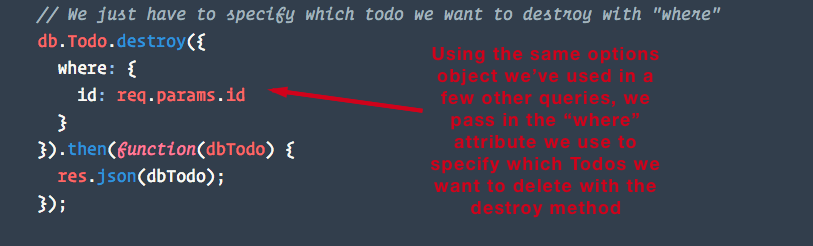
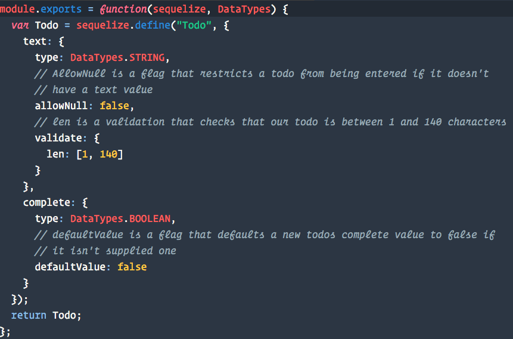
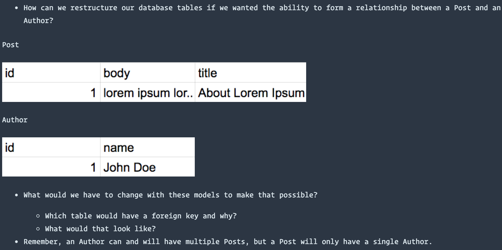
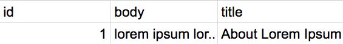
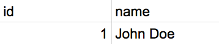
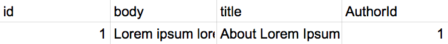

## Day 2 - Update, Delete with Sequelize & Getting Associated with Relations <!--links--> &nbsp; [⬅️](../01-Day/01-Day-LessonPlan.md) &nbsp; [➡️](../03-Day/03-Day-LessonPlan.md)

### Overview

Introduce students to update, delete, and validations in sequelize. We'll also reinforce some concepts from the last lesson.

`Summary: Complete Activities 9-14 in Unit 15`

* When using any of the `Supplemental PDFs`, please download and open. Do NOT preview on GitHub as they may not display properly in the browser.

##### Instructor Priorities

By the end of class students will:

* Understand how through the use of validations on their models, they can restrict what type of data can be saved into their databases.

* Feel more comfortable with model creation in Sequelize.

* Begin to get comfortable looking for answers to specific problems in the Sequelize documentation.

* Feel more comfortable performing each CRUD action using Sequelize.

##### Instructor Notes

* **Important**: Well be working with the same application, converting it over to use Sequelize and adding some additional functionality. As we're going along doing this, the app will break. It won't be fully functioning till towards the end, but the instructions for each activity will how to verify that it was done correctly, i.e. "sequelize should have created a table with these values".

* Today students will see some unfamiliar syntax and there will be a good amount of going through the Sequelize docs, though we'll save them some time and trouble by pointing them in the right direction.

* Make sure you have a MySQL database named "blogger" created on your machine before class starts.

* Throughout class, stress to students that today will be all back-end coding. The exercises are all built in a way where they don't need to modify any client side code in order to better focus on Sequelize.

  * Make sure students are starting with the unsolved version for each activity, instead of just continuing to build on the previous activity. This will help ensure they're getting started on the right foot. 

### Sample Class Video (Highly Recommended)

* To view an example class lecture visit (Note video may not reflect latest lesson plan): [Class Video](https://codingbootcamp.hosted.panopto.com/Panopto/Pages/Viewer.aspx?id=898884fb-4715-4f61-aceb-9247747c2b6e)

- - -

### Class Objectives

* To introduce the concept of relations using Sequelize.

* To introduce the "include" option for performing joins with our queries.

* To get students used to looking through Sequelize's documentation for answers to specific questions.

* Students will create a blog app with a content management system that can be used to update it's data.

- - -

### 1. Instructor Do: Welcome Students

* Let students know the last class was challenging, and this one will be no different, but you will get through it together!

### 2. Instructor Demo: Update and Delete (5 mins)

* Inform students that now they will be working on functionality to delete todos and to update todos.

* Open the solved folder inside [10-Sequelize-Validations/Solved](../../../../01-Class-Content/15-sequelize/01-Activities/10-Sequelize-Validations/Solved) and run the program. Show students how they can delete todo items by clicking the `x` button on the todo. Refresh the page to prove that todo is gone.

* Demonstrate how when clicking a todo item, you can update the todos text. After editing, hit "Enter" to finish editing, or click anywhere else on the page to cancel editing. Also demonstrate how clicking the check mark toggles a todo's complete property. Refresh the page again to prove this works.

- - -

### 3. Partners Do: Update and Delete (20 mins)

* Slack out the following folder and instructions.

  * Folder: [09-Sequelize-Update-Delete/Unsolved](../../../../01-Class-Content/15-sequelize/01-Activities/09-Sequelize-Update-Delete/Unsolved).

* INSTRUCTIONS:

   1) Open the folder slacked out to you

   2) Run `npm install`

   3) Update the `config.json` file's development object with your own local MYSQL database settings.

   4) Inside the `api-routes.js` file, look for the DELETE route and add a Sequelize method to delete the todo with the id available to us in `req.params.id`.

   5) Inside of the same file, look for the PUT route and add a Sequelize method to update a todo with the new todo data available to us inside req.body.

   6) Again, you won't need to touch the front end HTML or JavaScript to make any of this work.

   7) **HINT**: you will need to pass in an options object with a "where" attribute into both methods in order to filter these queries to target the Todos we want to update or delete.
   <http://docs.sequelizejs.com/en/latest/docs/querying/#where>

   1) Navigate to localhost:8080. If you can update and delete todos without errors, you were successful.

   2) If you get stuck or finish early, discuss the documentation for the `update` and `destroy` methods with your partner here:

   <http://docs.sequelizejs.com/class/lib/model.js~Model.html#static-method-update>

   <http://docs.sequelizejs.com/class/lib/model.js~Model.html#static-method-destroy>

**Instructors and TA's should be walking around offering support during this exercise**

### 4. Everyone Do: Review Update and Delete (15 mins)

* Slack out the solved folder inside [09-Sequelize-Update-Delete](../../../../01-Class-Content/15-sequelize/01-Activities/09-Sequelize-Update-Delete/Solved) and have students explain to you how the "where" query attribute works when it comes to filtering the records you want to query.

  

  

* Inform students that now that they have a good grasp on CRUD actions with Sequelize, as well as how to filter queries with "where", they already know how to do what they'll be doing 80% of the time with an ORM.

* Answer any remaining questions about this exercise.

* Explain to students that at first the Sequelize documentation can be a little difficult to navigate, but after understanding the basics they're much more useful.

* Thank students for working to find answers to the past few exercises. Reading documentation is it's own skill they'll become better at with practice. In the meantime, we've created a Sequelize CRUD actions cheat sheet for them that should make basic usage much easier.

* Slack out the Sequelize CRUD actions cheat sheet [`CRUD Actions Cheat Sheet`](../Supplemental/SequelizeCRUDActionsCheatSheet.pdf) 

- - -

### 5. Instructor Do: Validations (5 mins)

* Explain to the class that as some of them may have already noticed, there's a small flaw with our todolist application. And that is that while our Todos table's text column won't save any data type other than a Sequelize.STRING, it is possible to save a todo with empty text or even one with a null text value.

* While it is possible to restrict this functionality client side (and we definitely should at some point), if someone knew how to use Chrome Developer Tools, they could circumvent any restrictions we put in our front-end JavaScript.

* Knowing that any code we write on the client is potentially available for the user to tamper with. Ask the class what steps we might be able to take on the back end to validate what we're receiving to put into our database.

- - -

### 6. Everyone Do: Discuss With Partners (10 mins)

* Have the class discuss with their partners for a few minutes about what options we may have to further restrict what kinds of data can be saved into our Todos table.

* After a few minutes have any volunteers suggest their solutions. Most likely suggestions will be to have a conditional that checks the value before trying to insert it. Some may suggest that Sequelize may have something built in for this.

* Inform students that Sequelize does indeed have built in validations and flags we can include with our models.

* An example of a validation might include making sure that text is a URL or email, or that a credit card number is formatted correctly.

* A flag might include making sure a value is not null before entering it into the database or having a default value for a field if one is not supplied.

* The difference is that flags are ways for us to implement MYSQL constraints we're already familiar with such as "NOT NULL" or "DEFAULT" and validations are additional built in or custom methods we can run before Sequelize inserts a record.

- - -

### 7. Partners Do: Sequelize Validations (15 mins)

* Slack out the following folder in `15/10-Sequelize-Validations`

  * Folder: [10-Sequelize-Validations/Unsolved](../../../../01-Class-Content/15-sequelize/01-Activities/10-Sequelize-Validations/Unsolved)

* INSTRUCTIONS:

  1) Open the folder slacked out to you.

  2) Run `npm install`.

  3) Update the `config.json` file's development object with your own local MYSQL database settings.

  4) Modify the `todo.js` file so that the Todo model has a flag to prevent the text field from being null. Also add a validation to make sure the text field is at least one character, but no more than 140 characters.

  5) Modify the complete field in our Todo model so that it supplies a default value of false if one is not supplied during Todo creation.

  6) Once a Sequelize model has been created and synced for the first time, any changes we make to our Todo model won't be picked up by our database. The easiest way to get around this during the development process is to pass "{ force: true }" as an argument into our sync method inside `server.js` file. This will make it so that every time we run our app, our Todos table will be dropped and recreated with the new configuration. More info here: <http://docs.sequelizejs.com/class/lib/sequelize.js~Sequelize.html#instance-method-sync>

  7) Navigate to localhost:8080 to test that this worked. Try to save a Todo without any text in it, and then try and save a Todo with over 140 characters. If these didn't save and you see errors in your console that have to do with validation, you were successful.

  8) **Big Hint**: Sequelize documentation on validations with examples can be found here: <http://docs.sequelizejs.com/en/latest/docs/models-definition/#validations>

- - -

### 8. Instructor: Review Validations (10 mins)

* Slack out [10-Sequelize-Validations/Solved](../../../../01-Class-Content/15-sequelize/01-Activities/10-Sequelize-Validations/Solved) and show students how we added validations and flags to the Todo model. Go through each new item and have students try and explain to you what they believe each piece of new code does.

  

* Assure students there's no need to memorize these. Validations are some of the easier things to look up in the Sequelize documentation. Or even easier, refer back to this project.

### 9. Instructor Do: Demo App (10 mins)

* **Before demonstrating the app, make sure you update the `config.json` file in the `config` folder to match your own MySQL database.**
* Open and run the `12-Blog-CRUD-Solved` folder inside ``5/12-Blog-CRUD/`. Navigate to `localhost:8080` and explain to your students that they will be setting up much of the back-end for this blogging Content Management System app. Show students how we can create posts, delete posts, and edit posts. Additionally we can select which categories of posts we want to see by using the drop down on the blog page.
* Answer any questions about the desired functionality of this app before the exercise begins, but try not to get too off topic. We just want them to understand what the app does right now. There's no need to worry about the front end code today, and we'll just be creating the post model in this first activity.

- - -

### 10. Create a Post Model (15 mins)

Slack out the following folder and instructions:

* **Folder**: [11-Post-Model/Unsolved](../../../../01-Class-Content/15-sequelize/01-Activities/11-Post-Model/Unsolved)

* **INSTRUCTIONS**:

  The goal of this exercise is to create a Post model using Sequelize.

  1) Open the folder slacked out to you, run `npm install`

  2) Create a new MySQL database and name it `blogger`. Don't create any tables.

  3) Open the `config` folder and update the `config.json` file's `development` object to match your own local MySQL database.

  4) Go to the `models` folder and open the `post.js` file.

  5) Create a Sequelize `Post` model here. The model should have a title property of type DataTypes.STRING, a body property of DataTypes.TEXT, and a category property of DataTypes.STRING. 
  (<http://docs.sequelizejs.com/variable/index.html#static-variable-DataTypes>)

  6) To check if this worked, run `node server` in your terminal. Then open MySQL Workbench to check if a Posts table has been created.

  **Note**: We still have some code to add in the next exercise to get this app fully functioning, just concentrate on creating the Post model and verifying that you were successful for now.

  **BONUS**

  If you complete the activity before time's up, try adding the following:

  1) Flags to the title and body to prevent NULL values from being entered.

  2) A validation to the title so that it must be between 1 and 160 characters.

  3) A validation to the body so that it must be at least 1 character long.

  4) A flag to the category so that it has a default value of "Personal" if a value is not supplied.

- - -

### 11. Instructor Do: Review the Post Model Activity (15 mins)

* When time's up, load up the solved version of the activity on your machine [11-Post-Model/Solved](../../../../01-Class-Content/15-sequelize/01-Activities/11-Post-Model/Solved/).

  * Be sure to show students the `config.json` file and how you updated it to match you local MySQL database.

  * Show students the `post.js` file and walk through each part of the code, have students try and explain what each piece is doing.

    * Go over the validations and flags, but inform students not to worry if they didn't have time for the bonus. It's more important to understand creating models first.

* Start the server and show the class how a Posts table was created for us in MySQL Workbench.

* Answer any remaining questions, if there are none, ask the class:

  * What is the difference between DataTypes.STRING and DataTypes.TEXT? We haven't used this until just now.

    * STRING is the equivalent of varchar (255) in MySQL. Useful for storing relatively small values.

    * TEXT is a virtually unlimited amount of storage for characters. We might use this if we needed to store something larger or of unknown size.

    * This isn't something they need to memorize, a quick search of `Sequelize Data Types` will bring this right up.

* Navigate to the `server.js` file and point out the section of code where we sync our database.

  * Point out the `{ force: true }` object inside of the sync method. What is this doing?

    * This means that whenever we sync our database (whenever we start our app), we want to drop our tables and recreate them with any updated schemas. This is useful during the development process when we're experimenting with our database structure. During today's activities we'll be changing our models quite a bit, so this is useful to have. We'd want to remove this before deploying to a production environment. (otherwise we'd lose all of our data whenever our app starts)

- - -

### 12. Instructor Do: Introduce CRUD Activity (5 mins)

* Open the folder inside of [12-Blog-CRUD/Solved](../../../../01-Class-Content/15-sequelize/01-Activities/12-Blog-CRUD/Solved) and start the server.

* Demonstrate to students again how in the solved copy we're able to retrieve all posts, retrieve posts of a certain category, create new posts, update posts, and delete posts.

* Inform students that now they'll be setting up the additional back-end functionality for this code inside of the `api-routes.js` file.

* Again, stress that they won't need to (and shouldn't) modify any of the client side code to make this work.

- - -

### 13. Partners Do: CRUD Activity (20 mins)

Slack out the following folder and instructions:

* **Folder**: [12-Blog-CRUD/Unsolved](../../../../01-Class-Content/15-sequelize/01-Activities/12-Blog-CRUD/Unsolved)

* **INSTRUCTIONS**:

  The goal of this exercise is to add Sequelize CRUD methods inside each route specified in the comments in the api-routes.js file.

  1) Open the folder slacked out to you, run `npm install`

  2) Open the `config` folder and update the `config.json` file's `development` object to match your own local MySQL database.

  3) Navigate to the `api-routes.js` file inside of the `routes` folder.

  4) Fill in each route with the code described in the comments to add each CRUD action.

* We can test our code works by checking to see if we have the following functionality (recommended order):

  * Create a new post
  * Get a list of all posts
    * Get a list of all posts of a category
    * Edit a post
    * Delete a post

* **If things aren't working as expected, check to see if any errors logged to the terminal.**

- - -

### 14. Everyone Do: Review the CRUD activity (15 mins)

* Go through the solution in [12-Blog-CRUD/Solved](../../../../01-Class-Content/15-sequelize/01-Activities/12-Blog-CRUD/Solved) together. Have students explain to you what each method does, what the "where" attribute is doing in the methods using it.

* Answer any remaining questions about the solution. Feel free to spend a bit more time reviewing this activity if necessary.

- - -

### 15. Lunch (30 min)

- - -

### 16. Instructor Do: Demo Post Author Relationships (15 mins)

* Open the [14-Post-Author-Joins/Solved](../../../../01-Class-Content/15-sequelize/01-Activities/14-Post-Author-Joins/Solved) application in Chrome and demonstrate how the app's functionality has changed some.

  * We've gotten rid of categories, but now we have a second model, Authors. In this example, Authors have Posts, and Posts belong to Authors. 

  * Demonstrate how when we first start the app and try and create a new post, we're directed to the `author-manager.html` page, where we must first create an Author.

  * Demonstrate how after creating an Author, we now have the option to create a new Post for that Author.

  * After creating a new Post, we are redirected to the blog page where we see the Author's name by that Post.

  * After creating a few Authors with Posts, navigate to `localhost:8080/api/posts` to show students what the data returned fro the API looks like now. Each Post has a nested Author object. This lets us easily grab information about the Author who wrote the Post with very little work on the client side.

* Answer any questions about the app's functionality here, or why we might want to include the Author with a Post object when doing a GET request.
* Concentrate on making sure students understand what the app is supposed to do, but try not to go into too much detail about the implementation here. We're going to talk about how we can restructure our models and queries to make this happen over the next few exercises.

- - -

### 17. Partners Do: Discuss Relations (5 mins)

Slack out the following image and instructions and have students discuss with their partners.

**Image**:  

**Post**

**Author**

* **Instructions:** 

  * How can we restructure our database tables if we wanted the ability to form a relationship between a Post and an Author?

  * What would we have to change with these tables to make that possible?

    * Which table would have a foreign key and why?
    * What would that look like?

  * Remember, an Author can and will have multiple Posts, but a Post will only have a single Author.

  * Assume we won't be making a third table.

- - -

### 18. Everyone Do: Discuss Relations (5 mins)

* As a class discuss together the previous activity.

* Have any volunteers explain their solutions to the class.

* We're not so much looking for "the right" answer here, since there are multiple ways to create relations between tables, but we do want them to understand the solution we're going to be going with.

* We're going to have a foreign key for the Author ID on the Posts table because:

  * It would allow us to have multiple Posts all pointing to the same Author.

  * We could make the foreign key a NOT NULL column. This way we could restrict a Post's creation if there is no Author.

Show students the image below or slack it out to illustrate what this might look like:

**Posts Table**

### 19. Groups Do: Homework (50 mins)

* Break students into groups, and have them work on their homework.

### Lesson Plan Feedback

How did today's class go?

[Went Well](http://www.surveygizmo.com/s3/4325914/FS-Curriculum-Feedback?format=ft&sentiment=positive&lesson=08.02)

[Went Poorly](http://www.surveygizmo.com/s3/4325914/FS-Curriculum-Feedback?format=ft&sentiment=negative&lesson=08.02)
