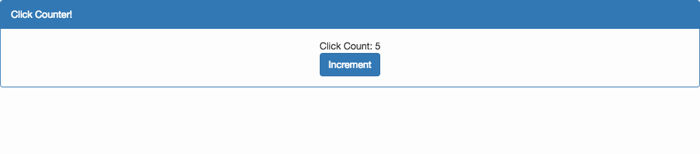
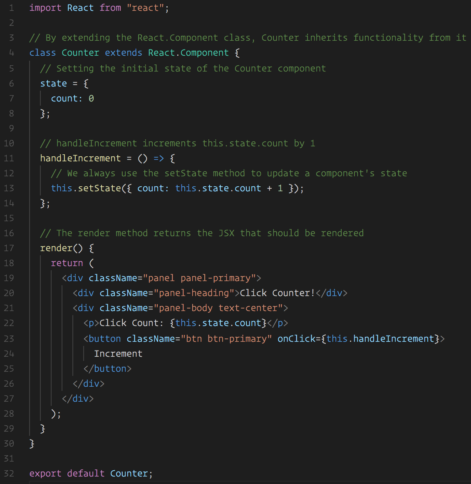

## 10.2 - Intro to React, Components and JSX (10:00 AM) <!--links--> &nbsp; [⬅️](../01-Day/01-Day-LessonPlan.md) &nbsp; [➡️](../03-Day/03-Day-LessonPlan.md)

_If pacing on activities is a bit too fast this week, remember that you have
some time at the end of the week to review. Please let us know by opening
an issue if any activities in particular need a bit more time, so we can
adjust the schedule for the week._

### Overview

In this class, we will be introducing students to the basic concepts of ReactJS, JSX, and building layouts through a component-based mindset.

We will then be deepening students understanding of ReactJS. They further expand upon their understanding of props, learn how to programmatically render components from a list of data, and introduce the concept of class components and component state.

`Summary: Complete activities 1-15 in Unit 19`

##### Instructor Priorities

* Students should be able to articulate a basic definition of components.

* Students should be able to scaffold out React applications with Create React App.

* Students should begin to feel comfortable building static UIs with JSX.

* Students should firmly understand how to pass data between parent and child components &mdash; and vice versa.

* Students should understand the difference between states and props and the use cases for each.

* Students should be able to use the Array.prototype.map method in order to programmatically render components from a list of data.

#### Instructor Notes

* It is recommended that you arrange for students to globally install both Create React App and Yarn before today's class.

* Let students know that today's class is meant to be a **gentle** introduction to React. Few if any of your students will have even the faintest knowledge of React &mdash; so this class is all about an initial exposure.

* Let students know that we won't be able to teach them **all** of React in the amount of time we have. In order to "get good" they are going to have to do their own work outside of class. Our role is essentially, to give them the high-points so they understand the terms and know how to proceed.

* Students may feel a little overwhelmed with the new unusual syntax. Remind them that at the end of the day, we're still just working with JavaScript. Prioritize making sure they understand concepts, rather than worrying about them perfectly memorizing syntax. Memorization will come with practice and repetition, so work on instilling concepts early on.

* Explain any unfamiliar ES6 syntax as you go along as necessary, but try not to go deeper than necessary. Students will have plenty of time to practice ES6 as we go through the material over the next two weeks.


* **Important:** In order to avoid continuous NPM/Yarn installs, all of today's activity Solved and Unsolved versions include only a `src` folder. Students and yourself should scaffold out a React app once with Create React App, and then swap out the `src` folder for each activity.

* The latter part of today's class  (starting with props) will be more challenging than the last class for many students. Syntax errors will abound as students confusedly mix states and props, and forget to pass attributes to their child components. Explain that memorizing syntax will come with time and practice, it's far more important to understand the concepts covered as exact syntax can always be looked up.

* All of the Solved/Unsolved activities contain only the application's `src` folder. At the start of class scaffold out a React application using Create React App, and swap out the `src` folder for each activity to avoid repetitive npm/yarn installs.

* Have your TAs reference [02-Day-TimeTracker](./02-Day-TimeTracker.xlsx) to help keep track of time during class.

- - -

### Class Objectives

* To begin to feel comfortable building static UIs with JSX.

* To gain an initial understanding of the component-based paradigm in ReactJS.

* To dissect and build a few simple examples using ReactJS.

* To deepen understanding of passing props between React components.

* To gain a firm understanding of the concept of child-parent relationships in React.

* To be able to programmatically render components from an array of data.

* To introduce the concept of class components and component state.

- - -

### 1. Instructor Do: Welcome and Encouragement (0 mins)

### 2. Instructor Do: Go Through Slides (8 mins)

* This unit uses a web-based slideshow found here: [React Gently](https://react-gently.netlify.com/).

  * Use the left and right arrow keys to cycle through the slides. It is advisable to view the slideshow in fullscreen Chrome.

* The most important part to get across today is the concept of components &mdash; self-contained modules that are responsible for producing part of an application's UI and functionality (i.e. all of the layout and functionality code for a "chat box" or "like button" might be in the same file or folder). This is radically different from the concept of separating the view and logic layers. When we split up our application into components, we're still separating its concerns, but we aren't necessarily separating its technologies.

* Remember to emphasize that today's class is meant to be a primer. Not comprehensive coverage. Don't let them get intimidated.

### 3. Partners Do: Installation + Documentation Research (10 mins)

* Slack out (../../../../01-Class-Content/19-react/01-Activities/01-Stu_DocumentationQuestions/README.md)

* Have students work with partners and go through [01-Stu_DocumentationQuestions](../../../../01-Class-Content/19-react/01-Activities/01-Stu_DocumentationQuestions/README.md).

* The first task in this assignment instructs them to install Create React App and Yarn if they haven't already. Instructional staff should be walking around offering assistance with the research questions, as well as the installation process (which should be fairly straight forward).

* Have them work with one another on answering the questions listed using the React.js documentation. Have them divide up the work the questions among teammates, and discuss answers afterwards rather than going through them all one at a time together.

* Let them know that going through the official documentation may feel challenging at first, but encourage them to revisit it again after todays class. Once they have a basic understanding of React, they should find that the React documentation is some of the best there is for any library.

* Encourage them to take this task seriously as it will help them gain a basic sense of things.

### 4. Instructor Do: Review Questions (10 mins) (High)

* Slack out the [Solved](../../../../01-Class-Content/19-react/01-Activities/01-Stu_DocumentationQuestions/Solved/README.md) version of the activity and call on various students to answer a few of the questions out loud.

* Most importantly, make sure students have a basic understanding of JSX and components along with some of the motivations behind them.

  * We use components as a way to separate our application into reusable pieces of its UI. This allows us to think about each part of our application's interface in isolation and allows us to quickly build new views into our apps over time since we'll be able to reuse component's we've already created.

  * Using JSX is optional but most React projects make use of it. JSX allows us to describe the UI our components using familiar HTML-like markup in our JavaScript. This allows us to quickly describe and understand the UI our components will produce as well take advantage of the full power of JavaScript, rather than be limited to the features available in a templating language such as Handlebars.

* Answer any additional questions students may have before moving on, but assure the class things will become clearer as we work with a few examples.

### 5. Instructor Do: Demo Create React App (8 mins)

* Demonstrate for students how we can quickly create a React application using Create React App. Run the following command in the terminal and have students follow along if they wish:

  * `create-react-app reactpractice`

    * Explain that to scaffold out a React app with create-react-app, we run `create-react-app` followed by a name for our application.

* Once everything has been installed, cd into your application's directory and start the app by running `yarn start` in your terminal and navigating to `localhost:3000`. Explain that this command starts our app in development mode, i.e. this "mode" is meant for development as our application will auto-reload as we make changes to it.

  

* Show off the resulting web page, then go back to your code and walk the class through the generated boilerplate. In particular, point out the following key aspects:

  * A `src` folder is generated, and we'll mostly be working out of here. Anything inside this folder gets processed by Babel, and then combined into a single `bundle.js` file by webpack. You can see what the combined `bundle.js` file looks like if you were to navigate to [localhost:3000/static/js/bundle.js](http://localhost:3000/bundle.js) in your browser.

  * We have an `index.js` file in the `src` directory. This is where execution of our React application begins. In this way, it is similar to the `server.js` file we've been starting all of our node applications with. In order to run any code in our React app, it needs to be directly written here, or else required/imported here.

    

  * The `src` folder is where our React components will live. For now, we just have an `App` component. Don't go too deep into the specifics of the `App.js` file yet, but point out that this file is producing some JSX, which corresponds to the web page we have rendered in the browser.

  * The `src` folder is also where we'd put any tests we'd like to associate with our components. Create React App ships with [Jest](https://facebook.github.io/jest/), a library for running JavaScript tests that work with React out of the box. For our purposes of learning to use React to build applications, we won't dive into writing tests for React apps, but it's nice to know that we **can** without any extra overhead.

  * Point out the `registerServiceWorker.js` file. At the time of writing, this is a fairly new addition to Create React App. We don't need to understand the contents of this file, and most of the activities we'll go over will have it removed for brevity, but it helps cache API responses to help make our app perform better for users with poor internet connections.

  * We have a `public` folder. This is primarily for containing the `index.html` that will eventually be served to users visiting our application. Point out the `#root` element &mdash; explain that this will contain our entire rendered, React application. Explain that when we build our React application for production, a `bundle.js` file containing all of our application's JavaScript is generated and added inside of the `index.html` file. We can also store files in this folder which we don't want to be processed by Webpack and Babel. For example, we can place static CSS files here or link to external CDNs in the `head` tag of the `index.html`.

  * Assure the class that we're going to see this setup over and over again, and there isn't a need to completely memorize every aspect of the Create React App boilerplate right now. The most important takeaways are:

    * We're going to be writing most of our code inside of the `src` folder.

    * The "entry" file to our React application will be the `index.js` file.

    * We start our React app in development mode with the command `yarn start`. This means our app will live update as we change it, which is why we're running our app on a server.

### 6. Partners Do: Hello World Example (10 mins)

* Inform the class that now that we have a high-level understanding of Create React App, they're now going work in groups to dissect a simpler example and answer some questions.

  * Slack out [02-Stu_HelloReact/Unsolved](../../../../01-Class-Content/19-react/01-Activities/02-Stu_HelloReact/Unsolved)

* **Instructions:** [README](../../../../01-Class-Content/19-react/01-Activities/02-Stu_HelloReact/README.md)

* **Folder:** [Unsolved](../../../../01-Class-Content/19-react/01-Activities/02-Stu_HelloReact/Unsolved)

### 7. Instructor Do: Review Hello World Example (10 mins)

* Slack out the [Solved](../../../../01-Class-Content/19-react/01-Activities/02-Stu_HelloReact/Solved/README.md) version of the activity and go over the answers with the class. Use the solution as a guide to walk the class through the code.

* Point out how JSX can either represent primitive HTML tags or React components.

* Demonstrate how we can alternatively write all of our component's code inside of `index.js`. Inform them that this is fine for very small examples, but we'll want something closer to the original setup as our projects grow.

* If necessary, take a few extra minutes here to briefly discuss any confusing ES6 syntax. This portion of the lesson utilizes the `const` identifier, arrow functions, and ES2015 modules.

  * Major ES6 takeaways are:

    * `const` works like var, but it's meant for values that aren't going to be reassigned, otherwise `let` is preferred.

    * `arrow functions` are shorter function syntax where `this` is bound to the context where the function was created.

      * If an arrow function body contains a single expression (such as a block of JSX code), that expression is implicitly returned without having to use the `return` keyword or curly braces.

      * Arrow functions aren't meant to replace regular functions altogether, as they lack a few features we won't have to worry about today. But they can make for some more elegant code if used properly.

    * `ES2015 modules` are part of a new module system introduced with ES6. So far we've been working with CommonJS modules (`module.exports` & `require` syntax) &mdash; which for our purposes today will work similarly.

      * As we'll see a bit later, ES2015 modules allow for finer tune control over what is exported and imported from a module. For now just compare the new syntax to what they're used to.

* Take a moment to answer any lingering questions.

### 8. Students Do: HelloDiv (10 mins) (Critical)

* In this activity students will write a React component that displays their name and some information about themselves.

* **Instructions:** [README](../../../../01-Class-Content/19-react/01-Activities/03-Stu_HelloDiv/README.md)

* Slack out [03-Stu_HelloDiv/Unsolved](../../../../01-Class-Content/19-react/01-Activities/03-Stu_HelloDiv/Unsolved)

### 9. Instructor Do: Review HelloDiv (5 mins)

* Once time is up, go over the [Solved](../../../../01-Class-Content/19-react/01-Activities/03-Stu_HelloDiv/Solved) version of the activity as a class.

* Make sure everyone understands the following concepts:

  * `HelloDiv` is exported and rendered inside of `App`.

  * `App` is exported and then rendered inside of `index.js` as the first argument to the `ReactDOM.render` method.

  * The second argument to the `ReactDOM.render` method is the real DOM element that our React application should be rendered inside of.

  * `HelloDiv`, like most components we'll write, is a JavaScript function; it returns some JSX.

    

    * Some students may have an error when they tried to render multiple JSX elements. Explain that _normally_, we aren't able to render multiple JSX elements from a component without an enclosing parent tag. 
    
      * This may seem strange at first, but if we think about our component in the same way we think about any other JavaScript function, it makes perfect sense: a JavaScript function can only return one value. To have separate groups of JSX being returned outside of a parent element would be like trying to write a JavaScript function that returns multiple different variables at once.

  * **Note:** With the release of React 16, we _do_ have another option for returning multiple JSX elements from a component: we can return an array. 
  
    * Based on your students' level of understanding and comfort so far, you may want to skip over explaining this as there aren't any activities or use cases we'll run into where understanding this pattern is required.
    
    * If you choose to proceed, the `HelloDiv` component can also be written as follows:

    ```jsx
      const HelloDiv = () => [
        <h1>Hey guys! I'm a header!</h1>,
        <h2>Things I like!</h2>,
        <ul>
          <li>Peas</li>
          <li>Carrots</li>
          <li>Love</li>
        </ul>
      ];
    ```

- - -

### 10. Instructor Do: Hello Bootstrap (10 mins)

* Welcome the class back from break!

* So far we've only just begun to work with React but we've still managed to learn a few key things:

  * In React, we structure our code into components.

  * A component is a JavaScript function that describes some part of our application's UI.

  * Inside of our components, we describe our application's UI using JSX: a markup syntax that resembles HTML.

* Explain that we're now going to go over how we can add Bootstrap to a React project.

* Replace your React application's src folder with [04-Ins_HelloBootstrap/src](../../../../01-Class-Content/19-react/01-Activities/04-Ins_HelloBootstrap/src) and start the development server by running `yarn start`. See the rendered application at [localhost:3000](http://localhost:3000).

  

* Explain to the class that the rendered elements in this example are using Bootstrap classes.

  * Without going into the component code yet, assure everyone that all of the React code is correct. Ask the class: Why then isn't my page rendering Bootstrap elements? What did I forget?

    * We need to include Bootstrap into our project somehow.

    * Open up the example in your code editor and ask the class: What should I do to if I wanted to add Bootstrap using a CDN?

      * So you don't have to go looking for it: `<link rel="stylesheet" href="https://cdnjs.cloudflare.com/ajax/libs/twitter-bootstrap/4.0.0/css/bootstrap.min.css"/>`

      * Try to get the class to lead you to the `index.html` file inside of the `public` folder. Ask them: Where should I put this link? Remind them that earlier we mentioned there was a folder where we keep static assets we don't want to be processed.

      * We can add our Bootstrap CDN to `public/index.html` in the Create React App generated code in order to include Bootstrap for all of our components. After adding the CDN, go back to your web browser and demonstrate the updated page.

    

* Now open up the `components/HelloBootstrap.js` file and demonstrate the code. The JSX code being rendered is close to the HTML we'd use to render the same Bootstrap elements without React.

  

* Ask the class: can anyone spot the key difference between this JSX and the HTML we'd normally write?

  * `className` is used instead of `class`. Explain that this is because in JavaScript, `class` is a reserved word, similar to `var` or `for` or `function`.

    * Explain that there are other differences between HTML and JSX which we'll run into soon.

  * Remind students that JSX isn't HTML, so there are a few caveats. JSX is sugar syntax for calls to the `React.createElement` method, and according to [Facebook's React Docs](https://facebook.github.io/react/docs/introducing-jsx.html#specifying-children-with-jsx): "JSX is closer to JavaScript than HTML".

### 11. Students Do: Hello Bootstrap (10 mins)

* In this activity, students will be given slightly less starter code and tasked with creating a React application which renders Bootstrap components to the page.

* **Instructions:** [README](../../../../01-Class-Content/19-react/01-Activities/05-Stu_HelloBootstrap/README.md)

* Slack out `05-Stu_HelloBootstrap/Unsolved`

### 12. Instructor Do: Review Hello Bootstrap (5 mins)

* Briefly go over the [Basic Solved](../../../../01-Class-Content/19-react/01-Activities/05-Stu_HelloBootstrap/Solved/Basic) version of the previous activity.

  

* The most important takeaways are:

  * If we want to render multiple JSX elements, they should be contained within a single parent element, such as a `div`.

  * Void elements, such as `input` tags, are represented by JSX tags with a self-closing forward slash, i.e. `<input />`.

  * We need to import the `react` library anywhere that we are utilizing JSX.

  * We use `className` instead of `class` because `class` is a reserved word in JavaScript.

* Take a few moments to demonstrate the [Bonus Solution](../../../../01-Class-Content/19-react/01-Activities/05-Stu_HelloBootstrap/Solved/Bonus). The rendered page should be the same, so you only need to walk demonstrate the code in your editor.

  * The main takeaway here is that we can define our components in different files and compose multiple components inside of another component (`Navbar`, `Jumbotron`, and `Card` are rendered inside of `App`).

    

  * This is powerful because it begins to demonstrate the potential for code reuse. Instead of having to rewrite every UI element from scratch using individual HTML tags, we could write a component once and reuse it across our entire application.

### 13. Instructor Do: JSX Variables (8 mins)

* Replace your React app's `src` folder with [06-Ins_JSXVariables/src](../../../../01-Class-Content/19-react/01-Activities/06-Ins_JSXVariables/src), run the app in developer mode with `yarn start`.

* Once the app starts, open [localhost:3000](http://localhost:3000) in your web browser.

  

* Point out that the HTML code being rendered to the browser isn't much different than the code we've already worked with. At first glance, it doesn't appear as though we're doing anything new.

* Open `src/components/JSXVariables.js` and walk the class through the code.

  

* Point out the following key points:

  * We can write comments inside of our JSX using JavaScript's multi-line comment syntax inside of curly braces. If we were to try and write regular JavaScript comments inside of our JSX, the code would break.

  * In addition to being able to write comments inside of the curly braces, we can also embed JavaScript expressions. This works similarly to the `{{ }}` double curly braces we've worked with in Handlebars.

    * We use the `name`, `num1`, and `num2` variables inside of our JSX code. Try updating the `name` variable and demonstrating to the class how when the page refreshes, we have the updated name being rendered.

    * Rendering `name` is a fairly simple example, but we can also evaluate entire expressions inside of JSX curly braces. Point out how we're producing random numbers and reversing `name` further down below.

      * Explain that an expression is any valid set of literals, variables, operators, and expressions that evaluates to a single value. In other words, anything we can assign to a variable or pass as a function argument is an expression. This doesn't include loops or conditionals, which we have various ways to deal with that we'll go over later.

    * Explain that these curly braces are how we get data from our JavaScript code into the views React renders.

      * Point out that this is different from jQuery or vanilla JavaScript where we have to call methods to explicitly set the inner text of an element.

    * Remind everyone that when we were working with Handlebars, we couldn't write raw JavaScript code inside of the `{{}}` double curly braces. Instead we had to use the Handlebars templating language which only exposed certain functionality. Since what we're writing inside of the JSX curly braces is just regular JavaScript, we have access to the full power of JavaScript inside of our views.

* Take a moment to answer any questions, but avoid getting too off track.

### 14. Students Do: JSX Variables (10 mins) (Critical)

* In this activity students will render JavaScript expressions inside of JSX curly braces.

* **Instructions:** [README.md](../../../../01-Class-Content/19-react/01-Activities/07-Stu_JSXVariables/README.md)

* Slack out `07-Stu_JSXVariables/Unsolved`

### 15. Instructor Do: Review JSX Variables (5 mins)

* Go over the [Solved](../../../../01-Class-Content/19-react/01-Activities/07-Stu_JSXVariables/Solved) version of the activity.

  

* Make sure everyone understands that when we use JSX curly braces, it means we want to evaluate a JavaScript expression inside. The final value of the expression will be rendered to the page.

### 16. Instructor Do: CSS Demo (8 mins) (High)

* Inform the class that now we're going to talk about some new built-in options for styling our components.

* Replace your React app's `src` folder with [08-Ins_CSSDemo/src](../../../../01-Class-Content/19-react/01-Activities/08-Ins_CSSDemo/src), run the app in developer mode with `yarn start`.

* Open your browser to [localhost:3000](http://localhost:3000) and demonstrate the rendered application.

  

* Explain that Create React App allows us to import CSS into our components. Open the `Header` component to demonstrate this.

  

* Point out that we aren't saving the stylesheet to a variable. Instead, whenever we import a stylesheet, an internal style tag is created and added to the document.

* Demonstrate how the `Header` is using the classes defined in the `Header.css` stylesheet it's importing.

  

* This approach may be a good idea if we want to keep our component more closely coupled to its styles. Ask the class: How many times have you been working on a project or homework assignment and had a CSS issue because of CSS that was a little messy?

* By separating our CSS files by component, we'll generally have smaller, more manageable stylesheets. Adding new styles or changing existing ones should be easier as our applications grow larger.

* Explain that we are also able to add inline styles to JSX elements. Open the `Card` component to demonstrate this.

  

* Point out that we can set a `style` similarly to how we can when writing regular HTML code, but with two key differences. Ask the class: What's happening inside of our JSX that we wouldn't do with regular HTML?

  * React expects the `style` property to be an object, rather than a string.

  * We're using JSX curly braces to embed the style object.

* Point out that the object properties are camelCased and non-numerical values are strings. Numerical values will default to pixels if a unit of measurement is expected.

* Explain that writing inline styles with JavaScript objects may feel a little strange, but this has some advantages over using actual stylesheets:

  * Using a `style` property, our styles are scoped to the components they're attached to, meaning we won't have any issues with CSS scoping or naming collisions.

  * Because our styles are defined using a JavaScript, we can can write JavaScript logic to determine what our styles should be at any given point. This will be useful as we begin to build more dynamic apps.

* Explain that we could define our component's styles inside of a CSS stylesheet, we could use inline styles, or we could use some mixture of the two.

  * It's up to us to decide how we want to organize our component styles, but there is value in being consistent in whichever approach or hybrid approach we take.

### 17. Students Do: CSS Props (10 mins)

* In this activity students will change the appearance of an application's components using inline styles.

* **Instructions:** [README.md](../../../../01-Class-Content/19-react/01-Activities/09-Stu_StyleProp/README.md)

* Slack out [09-Stu_StyleProp/Unsolved](../../../../01-Class-Content/19-react/01-Activities/09-Stu_StyleProp/Unsolved)

### 18. Break (30 mins)

### 19. Instructor Do: Go through Slides (8 mins)

* This unit uses a web-based slideshow found here: [ReactJS Recap slides](https://react-reacap.netlify.com/#/). Be sure to give students enough time to answer each question and discuss before going over the answers.

  * Use the left and right arrow keys to cycle through the slides. It is advisable to view the slideshow in fullscreen Chrome.

### 20. Instructor Do: Props Demo (10 mins) (High)

* Inform the class that we can conceptualize React components as JavaScript functions.

* It's a component's job to describe and _return_ some part of our application's UI.

* Ask the class: If a component is a function that _returns_ some data, what else might a component be able to do?

  * Since it's a function, a component can also receive arguments.

* This allows us write components that behave differently based on the arguments that they receive.

* We call the arguments we pass into React components `props`.

* If you haven't already done so, scaffold out a React application by running the following command in your terminal: `create-react-app demoapp`.

* This example uses Bootstrap. Add the following link tag to your React app's `public/index.html` file:

  ```
    <link rel="stylesheet" href="https://cdnjs.cloudflare.com/ajax/libs/twitter-bootstrap/3.3.7/css/bootstrap.min.css" />
  ```

* Replace your React app's `src` folder with [10-Ins_PropsDemo/src](../../../../01-Class-Content/19-react/01-Activities/10-Ins_PropsDemo/src) and start the development server by running `yarn start`.

* Demonstrate the rendered page in your web browser:

  

* This example is rendering a simple Bootstrap alert element. Open [src/components/Alert.js](../../../../01-Class-Content/19-react/01-Activities/10-Ins_PropsDemo/src/components/Alert.js)  and demonstrate the code:

  

* Explain that every component has access to a `props` argument. Props is always an object containing all of the values passed the component.

* We're using `props.type` to determine what the evaluated `className` of the `div` element is.

* This component renders `props.children` between it's `div` tags.

* Compare this to the value of `props` as it is logged to the console:

  

* Point out that since `props.type` is equal to "danger", then the computed `className` of the `div` in the `Alert` component is "alert alert-danger". This Bootstrap class is providing our component its styles.

* The `Alert` component is also receiving a `children` prop with a value set to "Invalid id or password" &mdash; the same message being displayed inside of the rendered Bootstrap alert element.

* Open [src/App.js](../../../../01-Class-Content/19-react/01-Activities/10-Ins_PropsDemo/src/App.js) in your editor and explain to the class how these props are being passed into the `Alert` component.

  

* We have 2 ways of passing props into a component:

  1. We can set an attribute to the rendered component's tag.

     * We're passing a `type` prop equal to `danger`.

  2. We can give a component a sibling tag and pass an expression between the tags.

     * We don't name this prop, it is automatically set a `children` key.

     * We're passing a `children` prop equal to "Invalid user id or password".

* Demonstrate how you can change what is rendered by the `Alert` component by passing it a different `type` and `children` prop.

  * For example, setting `type` to "success" and `children` to "Welcome Back!" would render the following in the browser:

    

* Explain that having this familiar syntax for passing props to our components is another way for JSX to be similar to HTML. We don't need to explicitly call any functions or modify any object properties ourselves.

* Explain that props allow us to customize our components so that we can reuse them in different situations.

  * For example, we might use this `Alert` component on a sign-in page and render a different alert depending on whether or not a user has successfully logged into their account.

* Inform the class that we can pass any type of data as a prop, including strings, numbers, arrays, functions, even entire components.

* Props are the primary means by which we pass data around our React apps. React utilizes a unidirectional data flow, meaning data only flows one direction: from the top down, parent to child.

  * This unidirectional data flow makes changes in React apps more predictable and easier to debug.

* Ask the class: If a prop inside of our component isn't what we expect it to be, where could we look to find out why?

  * We could look at the component's parent.

  * In this example, `App` and `Alert` have a parent/child relationship. `Alert` is being rendered inside of `App` and `App` is passing props to `Alert`.

* Take a moment to answer any questions before the next activity.

### 21. Partners Do: Calculator Props (10 mins)

* In this activity students will work with a partner to write a component that accepts props, performs arithmetic and renders the result.

* Slack out [11-Stu_PropsCalculator/Unsolved](../../../../01-Class-Content/19-react/01-Activities/11-Stu_PropsCalculator/Unsolved)

* **Instructions:** [README](../../../../01-Class-Content/19-react/01-Activities/11-Stu_PropsCalculator/README.md)

### 22. Instructor Do: Review Calculator Props (10 mins) (High)

* Slack out the [solution](../../../../01-Class-Content/19-react/01-Activities/11-Stu_PropsCalculator/Solved) to the previous activity. Go through the code as a class.

* Demonstrate how the completed example renders the result of each problem in the browser:

  

* Demonstrate the code inside of the `Calculator` component:

  

* Point out how we're passing each `Math` component 3 props:

  * `num1`

  * `operator`

  * `num2`

* Point out how the numbers are wrapped in JSX curly braces, but the operator is in quotes.

  * Ask the class: Why do you think this is?

    * The operator is a string literal, and we can express that shorthand just using quotes without curly braces. The following are equivalent:

      ```jsx
      <Math num1={19} operator={"+"} num2={341} />
      ```

      ```jsx
      <Math num1={19} operator="+" num2={341} />
      ```

    * This shorthand only works for string literals. All other values we pass as props need to be in JSX curly braces.

* Open the `Math` component and go through the code:

  

* Point out that the `props` argument should be an object containing all of the values passed to the rendered `Math` component in the `Calculator.js` file.

* We're running a switch case over `props.operator`. Depending on the operator, a different operator is performed with `props.num1` and `props.num2`. The result is stored in the `value` variable.

* Point out how at the bottom of the function, we're returning `<span>{value}</span>`.

* Explain that a function component only renders what is returned from it. With arrow functions, we have to explicitly write the `return` keyword when the function contains more than one statement.

* Explain that we must either return JSX from a component, or nothing at all. This is why we had to wrap the `value` inside of the span tags.

* Take another few minutes to answer any remaining questions.

### 23. Partners Do: Props Review (10 mins)

* Slack out [11-Stu_PropsReview/Unsolved](../../../../01-Class-Content/19-react/01-Activities/12-Stu_PropsReview/Unsolved)

* In this activity students will work with partners to make an existing React application more DRY through the use of reusable components and props.

* **Instructions:** [README.md](../../../../01-Class-Content/19-react/01-Activities/12-Stu_PropsReview/README.md)

* Instructional staff should be walking around the room available to assist students during this activity.

### 24. Instructor Do: Review Props Review (10 mins)

* Slack out the [solution](../../../../01-Class-Content/19-react/01-Activities/12-Stu_PropsReview/Solved) to the previous activity. Go through the code as a class.

  

* Point out how the application being rendered to the browser doesn't look any different to the unsolved version, but now we've made our code more DRY by creating a reusable component, `FriendCard`, to render each friend with the appropriate prop inside of the `App` component.

  

* Open the [src/components/FriendCard/FriendCard.js](../../../../01-Class-Content/19-react/01-Activities/12-Stu_PropsReview/Solved/src/components/FriendCard/FriendCard.js) file and go through the code.

  

* Point out that we use the `props` argument to access all of the values passed into the `FriendCard` component.

  * Since props is an expression we want to embed inside of our JSX, we use JSX curly braces to do so.

* Ask the class: In a real application, where might all of the friend JSON data come from?

  * Normally we might receive the friend JSON from an AJAX request, and probably won't know ahead of time which friends will need to be rendered.

* In your editor's sidebar, point out how each component is contained inside of its own folder containing the component, a CSS file, and an `index.js` file.

  

* Open up [src/components/FriendCard/index.js](../../../../01-Class-Content/19-react/01-Activities/12-Stu_PropsReview/Solved/src/components/FriendCard/index.js), ask the class: Can anyone guess what this code is doing?

  

  * Explain that the `index.js` file inside of each component's folder allows us to export the component from the `index.js`, in addition to its own file (`FriendCard.js`).

  * Whenever we require/import a folder instead of a file, the folder's `index.js` file is required/imported by default (if it exists).

  * This allows us to keep our paths for importing these components short. e.g. we can do:

  ```js
  import FriendCard from "./components/FriendCard"
  ```

  * instead of:

  ```js
  import FriendCard from "./components/FriendCard/FriendCard"
  ```

  * Giving all of our components their own folder is another option for organizing our React apps. Each folder could contain any CSS or other dependencies the component will need.

* Spend another moment making sure the class understands the overall concept of passing and receiving props. Go back and forth between the `friends.json` file, the `FriendCard` component, and your web browser to visually demonstrate how the data is being used.

* Point out that while is code is more DRY than it was, we're still manually rendering a `FriendCard` for each piece of data &mdash; we'll come back and solve this problem in a later activity!

### 25. Students Do: Component Map (10 mins)

* Slack out [13-Stu_ComponentMap/Unsolved](../../../../01-Class-Content/19-react/01-Activities/13-Stu_ComponentMap/Unsolved)

* In this activity, students will utilize the map method in order to render JSX from an array of objects.

* **Instructions:** [README.md](../../../../01-Class-Content/19-react/01-Activities/13-Stu_ComponentMap/README.md)

* Instructional staff should be walking around the room making themselves available for assistance.

### 26. Instructor Do: Review Component Map (10 mins)

* Slack out the [solutions](../../../../01-Class-Content/19-react/01-Activities/13-Stu_ComponentMap/Solved) to the previous activity and go over the code as a class.

* For the basic solution:

  

  * Point out how the array of grocery objects is passed into the `List` component from inside of `App`, making it available inside of the `List` component as `props.groceries`.

  * Inside of the `List` component, we insert JSX curly braces inside of the `ul` element. We map over `props.groceries` and return one `li` tag for every element in `props.groceries`.

  * Ask the class: What type of value is returned by the map method here?

    * Explain that the map method will always return an array &mdash; in this example it's returning an array of JSX elements.

    * React is smart enough to know what whenever we're rendering an array containing JSX, it should deconstruct the array and render each element inside of their parent.

  * Point out the `key` property attached to the `li` tag inside of the map. Ask the class: Was anyone able to read about what this is for?

    * The application will still run if we were to remove the `key` prop, but we'd get a very specific warning telling us we should include it.

    * Whenever an array of JSX is being rendered, React expects each rendered parent JSX tag to have a unique `key` prop. This is a special type of prop that helps React efficiently re-render the list of JSX if it should ever need to change.

      * The `key` prop should be unique and specific to the data being rendered. Often this comes in the form of an `id` from a database. But it can be anything we can guarantee to be unique.

      * Using the index of the element in the array is not a good idea, since an element's index could change if the data we modified. This could potentially cause strange bugs.

  * Assure the class they don't need to stress out too much about the `key` prop since they'll get a very specific warning about it should they forget to include it and their code will still work.

  * The most important takeaway from this activity is that we can use the map method to loop over an array and return a new array of elements inside of JSX curly braces. React will then render each element in the resulting array.

  * Take a moment to answer any additional questions.

* For the bonus solution:

  

  * Demonstrate how we can create a `notPurchased` array by filtering `props.groceries` for groceries which have a `purchased` property set to false.

  * Remind everyone that while the map method returns a new array the same length as the original, the filter method returns a new array containing only the elements whose callback functions return truthy values.

  * Explain that we still need to use the map method to actually render the `li` elements. But we first filter for groceries which haven't been purchased, and then map over the new array, rather than `props.groceries`.

* Answer any questions before the break.

### 27. Instructor Do: Introduce Stateful Components (15 mins)

* Explain to the class that what we've been working with so far are known as stateless, functional components. Sometimes called "dumb components".

* These components can render JSX, receive props, and embed JavaScript expressions inside of themselves.

* In a React application, **most** components should be stateless components. These are easy to test, debug, and they tend to be more reusable &mdash; even across applications &mdash; because they usually don't depend on how the rest of the application works.

* So far we've been using stateless components to create static, unchanging UIs. In a real application, we'd want to give some of our components more complex dynamic behaviors.

* Now we're going to introduce stateful components. These special components aren't created using plain JavaScript functions, but with ES6 classes (which, if we want to get technical, are still JavaScript constructor functions once compiled).

* Explain that `state` is a special type of property attached to a class component that can contain data we want to associate with that component.

* Explain that values stored on a component's state are different from regular variables because unlike regular variables, when a component updates its `state` the React application will update itself in the browser to reflect the change wherever necessary.

  * Explain that a component can set and update its own state, whereas its props are always received from up above and considered immutable (can't/shouldn't be changed).

* Replace your Create React App's `src` folder with [05-Ins_BasicState](../../../../01-Class-Content/19-react/01-Activities/14-Ins_BasicState/src). Start the app in dev mode by running `yarn start`.

* Open your browser to [localhost:3000](http://localhost:3000) and demonstrate the rendered app.

  

* Whenever we click the "Increment" button, the click counter goes up by 1. Point out that this is the first time we've built in any kind of dynamic behavior such as event listeners and UI updates into our React apps.

* Open [src/components/Counter.js](../../../../01-Class-Content/19-react/01-Activities/14-Ins_BasicState/src/components/Counter.js) in your editor, walk the class through the code:

  

  * We create a new class named `Counter` which _extends_ the `React.Component` class.

    * Explain that `React.Component` is a class built-in to React which has special features we don't get with stateless functional components. By extending the `React.Component` class, `Counter` now inherits this extra functionality.

  * Then we set a `state` property on the component. We set its value to an object with a `count` property set to `0`. This is the initial counter value displayed when the component first loads.

    * Our component's `state` property must always be set to an object.

    * Because this component contains its own state, we call this a **stateful component**.

    * Create React App allows us to use [ES7 property initializer](https://babeljs.io/docs/plugins/transform-class-properties/) syntax. This allows us to attach properties to the class instance without writing out a constructor method.

  * Scroll down to the `render` method. Explain to the class that this method is built-in to React, and as the name implies, its job is to return the JSX that the component should render. Every class component needs to have this method defined.

  * Scroll down further to the "Increment" button and point out how the button has an `onClick` prop set to `this.handleIncrement`.

    * Explain that this is how a click event listener is defined in React. When the button is clicked, this component's `handleIncrement` method is called.

    * Explain that event names in React are similar to vanilla JavaScript or jQuery, e.g. `onClick`, `onSubmit`, `onChange`, etc.

  * Scroll back up to the `handleIncrement` method definition. Point out that unlike `render`, this method is using arrow function syntax.

    * Due to the nature of how props are passed to React elements, `this` inside of any method passed as a prop will be `undefined`, rather than the intended component. This is a common source of frustration and bugs for developers new to React. But thanks to the new class property initializer syntax, we can simply write all of our custom methods using arrow functions and never have to worry about this issue.

  * Point out how inside of `handleIncrement` we're calling `this.setState` and passing in an object as an argument.

  * Explain that `setState` is built-in to all class components. We use this method to update our component's `state` by passing it an object containing parts of the component's state we want to update and their new values.

    * Explain that whenever we want to update our component's state, we **ALWAYS** use `this.setState` to do so. Updating our state with this method tells our component that it should re-render itself and all of its children to account for the new state.

    * Explain that if we just updated `this.state.count` directly without using `setState`, we'd never see the click count go up in the view since there'd be no re-render.

      * Example:

      ```js
      // This wouldn't work as expected
      this.state.count = this.state.count + 1
      ```

* Take a moment to answer any high-level questions the class may have. Most importantly make sure they understand the following:

  * We can use `state` to associate data with our components and keep track of any values we want to update the UI when changed.

  * We can define methods on a class component and pass them as props.

  * The `onClick` prop can be used to set a click event listener to an element.

### 28. Partners Do: Decrement Counter (10 mins)

* Slack out [15-Stu_DecrementCounter/Unsolved](../../../../01-Class-Content/19-react/01-Activities/15-Stu_DecrementCounter/Unsolved)

* In this activity students will add a "Decrement" button and event handler to the previous Click Counter example.

* **Instructions:** [README.md](../../../../01-Class-Content/19-react/01-Activities/15-Stu_DecrementCounter/README.md)

### 29. Instructor Do: Review Decrement Counter (10 mins)

* Slack out the [solved](../../../../01-Class-Content/19-react/01-Activities/15-Stu_DecrementCounter/Solved) versions of the previous activity and go over both solutions.

  

* First go over the code in the basic solution:

  

  * Point out how we've defined a `handleDecrement` method which decreases the counter by 1.

  * Explain that like all event handlers, `onClick` expects a callback, which is why we write `onClick={this.handleDecrement}` instead of `onClick={this.handleDecrement()}`.

* Then go over the bonus solution:

  * 

  * Point out that we've replaced the `.card-body` div with a `CardBody` component which renders its contents.

  * We pass the click count and the event listeners to the `CardBody` component.

* Demonstrate the code inside of the `CardBody` component:

  * 

  * This component renders the same JSX that was removed from the `Counter` component. The only difference is that we're accessing the click counter and event handlers on the props argument.

  * Explain that even though the buttons are inside of a child component, the `Counter` component's `count` state is still updated when the buttons are clicked.

  * When the `count` state is updated, The `Counter` component and any of its child components re-render themselves. This is what allows the view to be updated in the browser when the buttons are clicked.

  * Explain that even though data still technically only flows one way (from the top-down) in React, we can allow child components to update their parent's state by passing them a method created in the parent.

* Assure the class that they'll get more practice with working with class components.

* Take a moment to answer any additional questions.

### 30. TAs DO: Slack out information (0 mins)

* Slack out the [solved](../../../../01-Class-Content/19-react/01-Activities/18-Stu_FunWithForms/Solved) version of the previous activity. If any time remains go through the code as a class.

* Inform the class that we'll continue to go through forms in the next lesson.

* Recommend students do their best to go through the following sections of the React documentation before the next class:

  * [Forms](https://facebook.github.io/react/docs/forms.html)

  * [Lifting State Up](https://facebook.github.io/react/docs/lifting-state-up.html)

  * [State and Lifecycle](https://facebook.github.io/react/docs/state-and-lifecycle.html)

### 33. End (0 mins)

### Lesson Plan Feedback

How did today's class go?

[Went Well](http://www.surveygizmo.com/s3/4325914/FS-Curriculum-Feedback?format=ft&sentiment=positive&lesson=10.02)

[Went Poorly](http://www.surveygizmo.com/s3/4325914/FS-Curriculum-Feedback?format=ft&sentiment=negative&lesson=10.02)
