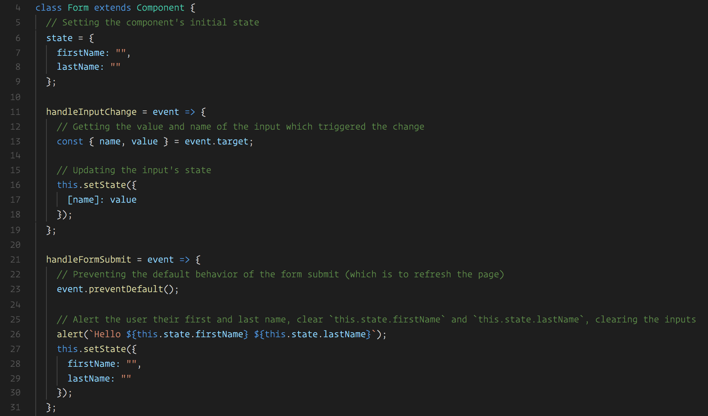
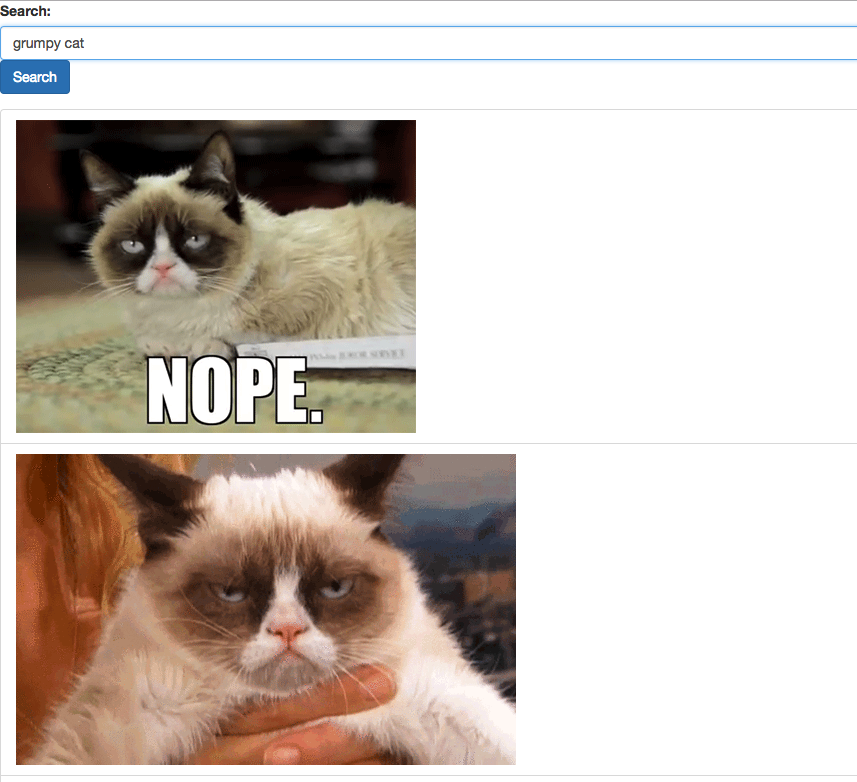
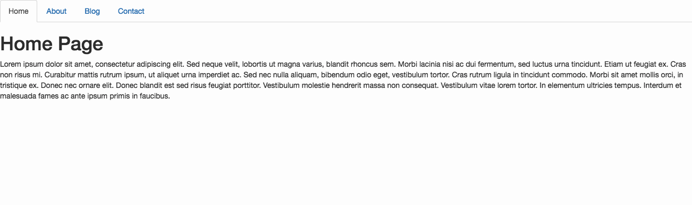

## 10.3 - Continuing React State (10:00 AM) <!--links--> &nbsp; [⬅️](../02-Day/02-Day-LessonPlan.md) &nbsp; [➡️](../04-Day/04-Day-LessonPlan.md)

_If pacing on activities is a bit too fast this week, remember that you have
some time at the end of the week to review. Please let us know by opening
an issue if any activities in particular need a bit more time, so we can
adjust the schedule for the week._

### Overview

After continuing some of yesterday's lesson on React state,
we will be deepening students understanding of ReactJS. We will further expand on their introduction to managing component state and cover performing AJAX requests, using forms, and conditionally rendering components.

`Summary: Complete activities 13 - 18 in Unit 19 & 1 - 6 in Unit 20`

##### Instructor Priorities

* Students should be able to use forms with React.

* Students should understand how to conditionally render components.

* Students should be able to utilize the axios library for making AJAX requests.

* Students should have a basic understanding of React Router.

* Students should complete the Mongo Checkpoint.

#### Instructor Notes

* In today's class we'll introduce some new class component syntax, cover using forms with React, perform AJAX requests with axios, and go over conditionally rendering components before introducing students to the React Router library.

* You should scaffold out a React application with Create React App at the beginning of class and suggest students do the same. The activities we go over today will only include the applications `src` folder which you should replace in your React app's boilerplate to avoid. It's recommended that that you stop and restart the dev server between each activity.

* Today's lesson will feature more instructor led demonstrations than the previous class, be sure to spend some time before class reviewing the examples.

* Have your TAs reference [03-Day-TimeTracker](03-Day-TimeTracker.xlsx) to help keep track of time during class.

* **Important:** In order to avoid continuous NPM/Yarn installs, all of today's activity Solved and Unsolved versions include only a src folder. Students and yourself should scaffold out a React app once with Create React App, and then swap out the src folder for each activity.

- - -

### Class Objectives

* To deepen understanding of managing state with React components.

* To cover conditional rendering React components.

* To introduce the axios library and the concept of the component lifecycle.

* To introduce routing with React Router.

* To complete the Mongo Checkpoint.

- - -

### 1. Instructor Do: Welcome Class and State Review (5 mins) (Critical)

* Open [05-Ins_BasicState](../../../../01-Class-Content/19-react/01-Activities/14-Ins_BasicState/src/components/Counter.js) in your editor for a quick review.


* Call on students to answer the following questions one at time, filling in gaps in their explanations as necessary:

  * **Q:** What is the difference between `props` and `state`?
    **A:** `props` are passed down from the parent component and are immutable. `state` stores data that is going to change and is stored in the component class itself rather than coming from a parent component.
  * **Q:** What is the purpose of calling `setState`?
    **A:** `setState` re-renders the component and all its children any time the state changes.
  * **Q:** What is the render method?
    **A:** `render` is a required method on any subclass of React.Component. Its job is to return the JSX that the component should render.
  * **Q:** How do we set a click event listener on an element in React?
    **A:** We use the `onClick` prop.

### 2. Students Do: Friend Refactor (20 mins) (Critical)

* Slack out [16-Stu_FriendRefactor/Unsolved](../../../../01-Class-Content/19-react/01-Activities/16-Stu_FriendRefactor/Unsolved)

* In this activity students will further refactor the Friends List application from earlier to use class components, events, and programmatically render the `FriendCard` components.

* **Instructions:** [README.md](../../../../01-Class-Content/19-react/01-Activities/16-Stu_FriendRefactor/README.md)

### 3. Instructor Do: Review Friend Refactor (15 mins)

* Go over the [solution](../../../../01-Class-Content/19-react/01-Activities/16-Stu_FriendRefactor/Solved) to the previous activity.

* Demonstrate the completed application in the browser. Point out how we can remove friends by clicking the red x icon.

  

* Briefly go over the syntax for writing a class component. Be sure to point out the constructor method, how we set the application's initial state. Explain that when defining object properties with ES6, if the object's key and value have the same name, we can omit the colon &mdash; this is just an optional shorthand syntax.

* Point out how we bind the `removeFriend` method inside of the constructor. Ask the class: how does this method remove a friend?

* Point out how inside of the `removeFriend` method we use the filter method to create a new `friends` array from `this.state.friends`. We include only friends with an `id` property **not** equal to the `id` being received into this method. Then we use the `setState` method in order to set `this.state.friends` equal to the new filtered friends array.

  

* Explain that when we update our component's state by removing one of the friend objects, our component re-renders itself. On the new render, `FriendCard` components are created for each object in `this.state.friends`, which no longer includes the deleted friend. This then triggers our component to re-render, now minus one friend.

  * Remind students that in React, we never modify state directly, but we create new state instead. If the state we're modifying is an array, we'll often use the filter or map method.

* Scroll down to the code where we map over `this.state.friends` and render a `FriendCard` component for each element.

  * Point out the props being passed, in particular, the `id` and the `key` prop. Remind the class that whenever we map over a list of data and return JSX, React wants us to give each element a unique `key` prop. React uses this value internally to help it efficiently render and re-render components from arrays of data.

    * Explain that the `key` prop is unusual because it's used by React but isn't actually available for us to use inside of the component we pass it to. We pass the friend `id` in as a separate prop because we'll need it inside of the `FriendCard` component.

* Open up the `FriendCard` component.

  

* Point out how we've attached the `onClick` handler to the "remove" span. When clicked, it calls the `removeFriend` method and passes in `props.id`.

* Ask the class: Why do we have the `removeFriend` handler wrapped inside of another function?
  * Explain that since our event handlers need to be callbacks, we normally can't pass in arguments without invoking them right away. But by wrapping the `removeFriend` method in an another function, we can pass the `id` prop into the inner `removeFriend` method. When the span is clicked, it calls the anonymous callback function, which then calls the `removeFriend` method with the friend's `id` as an argument.

* Take a moment to answer any lingering questions.

### 4. Instructor Do: Demonstrate Forms (15 mins) (High)

In this example we will demonstrate how to handle simple forms with React.

* Swap out your application's `src` folder with [src](../../../../01-Class-Content/19-react/01-Activities/17-Ins_FormsDemo/src). Stop the dev server if it is already running. Start the app in dev mode by running `yarn start`.

* Open [localhost:3000](http://localhost:3000) in your web browser and demonstrate the rendered application.

  

  * Whenever we type into the input fields we see the input appended to the "Hello" statement.

  * When we click the "Submit" button, we get an alert with the provided first and last name.

    

* Now open [src/components/Form/Form.js](../../../../01-Class-Content/19-react/01-Activities/17-Ins_FormsDemo/src/components/Form/Form.js) and demonstrate the underlying code. It may be easier to begin with this component's `render` method.

  

  * Point out the following props attached to the `input` elements:

    * `value`: set to `this.state.firstName` or `this.state.lastName`

    * `name`: set to `firstName` or `lastName`

    * `onChange`: both set to `this.handleInputChange`

* Then go up to the component's `constructor` method. Point out how `this.state.firstName` and `this.state.lastName` are both initially set to an empty string.

  * To make sure everyone is following along so far, ask the class: Where is this state object coming from? Why do we use it?

    * A component's "state" is a property defined on a class component instance used for storing values that we want to associate with it. This property is recognized by React and can be used to embed data inside a component's UI which we want to update over time. Whenever a component's state is updated, its `render` method is fired along with the `render` methods of all of its children. This updates the application's UI to display the new data without having to refresh the browser.

* Then scroll back down to the `render` method and point out how each input has a `value` prop set to the value of one of these state properties.

  

* Ask the class: What would happen if I pre-set the first and last name states to values other than empty strings?
  * The text inside of each input field is determined by their `value` prop. By changing this component's initial state, we're also changing the initial values of the input fields. Demonstrate this live for the class.

* Then scroll down to the `handleInputChange` method. Ask the class: What do you think this method's job is?

  * This method is responsible for updating our state as the user types into the input fields.

* Then ask: What do you think would happen if I removed the `onChange` props from the input fields?

  * Proceed to remove the `onChange` props from both input elements. You should now be unable to type any new characters into the input fields after doing to.

  * Explain that `onChange`, like `onClick` or `onSubmit`, is a built-in event we can listen for by attaching a prop to a primitive JSX tag (a JSX tag that represents a basic HTML element).

  * Explain that by removing the `onChange` prop, we are no longer responding to the input's "change" event and thus are no longer updating our `Form` component's state. The `value` prop on each input field continues to point to the same unchanging state value.

  * Explain that if we were to also remove the `value` prop from an input field altogether, then we could update it, but it wouldn't update our state and we wouldn't have access to its value if we needed it. Explain that we use the `value` and `onChange` props on the input element to sync its value with our components state.

* Go back to the `handleInputChange` method and walk through its logic.

  * `handleInputChange`, like all event handlers, is passed an `event` object that describes the event that took place. We pull off the `name` and `value` properties from the `event.target` object. These correspond to the `name` and `value` properties attached  to the element the event was triggered from.

    * Since each input field has a `name` prop set to the name of the state property holding its value, we can run the following code to update the appropriate state:

      ```js
      this.setState({
        [name]: value
      });
      ```

    * Starting with ECMAScript 2015, the object initializer syntax also supports computed property names. That allows you to put an expression in brackets [], that will be computed and used as the property name. Refer to the [MDN documentation](https://developer.mozilla.org/en-US/docs/Web/JavaScript/Reference/Operators/Object_initializer#Computed_property_names).

    * If students have questions regarding this syntax, demonstrate the same approach in ES5:

      ```js
      const newState = {};
      newState[name] = value;
      this.setState(newState);
      ```

* Scroll down to the `handleFormSubmit` method. Ask the class: Why are we running `event.preventDefault()`?

  * The default behavior of an HTML form submission, is to refresh the entire web page. We want to prevent the form's default behavior in lieu of our own. Remind the class that we also had to deal with this back when working with jQuery.

* Be sure to point out the code where we throw an alert with the user's first and last name before resetting our `firstName` and `lastName` state to empty strings to clear our input fields. Take a moment to make sure everyone understands how the string template literal syntax is working.

  * String template literals can be used to write multi-line strings and embed expressions without breaking the string. Instead we'd use the ${<expression>} token to embed expressions inside of our string.

* Take another few minutes to make sure everyone understands the code at least well enough to be able to refer back to this example as a starting point as they're building their own React forms.

### 5. Students Do: Fun With Forms (15 mins)

* Slack out [18-Stu_FunWithForms/Unsolved](../../../../01-Class-Content/19-react/01-Activities/18-Stu_FunWithForms/Unsolved)

* In this activity students will add some new functionality to the previous form example.

* **Instructions:** [README](../../../../01-Class-Content/19-react/01-Activities/18-Stu_FunWithForms/README.md)

### 6. Students Do: A Formal Review (10 mins)

* Slack out [01-Stu_FormalReview/Unsolved](../../../../01-Class-Content/20-react/01-Activities/01-Stu_FormalReview/Unsolved)

* In this activity students will work to connect a simple form to a component's state.

* **Instructions:** [README](../../../../01-Class-Content/20-react/01-Activities/01-Stu_FormalReview/README.md)

### 7. Instructor Do: Review A Formal Review (5 mins)

* Go over the [01-Stu_FormalReview/Solved](../../../../01-Class-Content/20-react/01-Activities/01-Stu_FormalReview/Solved) version of the previous activity.

  

* Point out the following key aspects of the activity:

  * Each input tag has a `value`, `onChange`, and `name` prop.

  * When the `onChange` event is fired, the `handleInputChange` method is called.

  * When `handleInputChange` is called, the `name` and `value` properties are used to update the appropriate state.

  * Whenever we "submit" form, we must prevent the default event if we plan to handle the submission using AJAX.

    

- - -

### 8. LUNCH (30 mins)

- - -

### 9. Instructor Do: AJAX Demo (15 mins)

In this example we will demonstrate AJAX requests with React.

* Replace your application's `src` folder with [02-Ins_AJAX/src](../../../../01-Class-Content/20-react/01-Activities/02-Ins_AJAX/src). Paste the Bootstrap CDN into `public/index.html`. You may use the snippet provided below:

  ```html
  <link rel="stylesheet" href="https://cdnjs.cloudflare.com/ajax/libs/twitter-bootstrap/4.0.0/css/bootstrap.min.css"/>
  ```

* Install the `axios` library by running the following command:

   ```
   yarn add axios
   ```

* Stop the dev server if it is already running. Start the app in dev mode by running `yarn start`.

* Navigate to [localhost:3000](http://localhost:3000) and demonstrate the application's functionality.

  

  * This app searches the Giphy API for whatever is typed into the input field and then displays the results below.

  * When we first load the app, we should see kitten related results.

* Open the [src/components](../../../../01-Class-Content/20-react/01-Activities/02-Ins_AJAX/src/components) folder and point out the three files inside:

  * `ResultList.js`

  * `SearchForm.js`

  * `SearchResultContainer.js`

* Explain to the class that `SearchResultContainer` contains and renders the `Results` and `Search` components. This is our application's only stateful component.

* Briefly demonstrate this without digging into each component's exact functionality in your editor just yet.

  

* Ask the class: Why do you think `SearchResultContainer` is a stateful component, but `SearchForm` and `ResultList` aren't?

  * It's possible to make every component in our React application stateful. But it's usually cleaner and less error prone to have some kind of parent component which contains all of the data and functionality its children will need, and then pass those down as props.

  * Quick aside: Slack out this [article written by Dan Abramov](https://medium.com/@dan_abramov/smart-and-dumb-components-7ca2f9a7c7d0) (Redux Author, React Core Contributor, Create React App Core Contributor) for students to read through on their own time. He describes the pattern of separating components into "container" and "presentational" components. In a nutshell, this can be explained as follows:

    * Container components are primarily concerned with how things _work_ and render very little, if any of their own markup. Instead they mostly render other components and pass down the logic and data they need to work.

    * Presentational components are concerned with how things _look_ and typically don't contain any logic that doesn't have to do with their own individual UI.

    * This pattern helps us build components with little to no coupling that can more easily be reused in different parts of app or even across applications. It also lets us stub out our applications appearance by writing presentational components first, and then writing container components once we're ready to make things work.

  * This isn't important for students to totally understand now, but slack out the article for them to check out later. The most important takeaway should be that there should be a few of these "container" components which act as the "brain" for their children. In our case this is `SearchResultContainer`.

* Now, open [src/components/SearchResultContainer.js](../../../../01-Class-Content/20-react/01-Activities/02-Ins_AJAX/src/components/SearchResultContainer.js) and walk through the code.

  * Our initial state has a `search` property set to an empty string and a `results` property set to an empty array.

    

  * We have a new unfamiliar method defined called `componentDidMount`. Explain that like the `render` method, this method is built-in to React and automatically run **after the component is rendered for the first time.**

    

  * Inside of this method we run the `searchGiphy` method and pass in "kittens" as an argument. Before getting into how exactly the `searchGiphy` method works, explain that this code searches the Giphy API and updates our application's `result` state using the results from the AJAX request. By writing this code inside of the `componentDidMount` method, we're saying we want it to run after the initial component render, before state updates take place.

  * Explain that when working with class components in React, we are able to hook into to a few different **component lifecycle events**, that allow us to automatically execute logic at certain times.

    * Explain that these component lifecycle events are similar to some of the DOM lifecycle events we've worked with in vanilla JavaScript or jQuery. For example, in jQuery, `$(document).ready` runs when the entire web page is loaded.

    * In React, `componentDidMount` runs after a component and all of its children have been initially rendered and mounted to the DOM, and have no further expected initialization steps.

    * Explain that there are a few different React component lifecycle events we can hook into but `componentDidMount` is probably the one we'll use most frequently as this is the best place to run any async code we need to populate our component's state after the component mounts.

    * Ask the class: Why wouldn't we just run our `searchGiphy` method inside of our component's constructor and populate our initial state there? That is, assuming we went back to explicitly using the constructor method.

      * Constructor functions run synchronously and AJAX requests are asynchronous. So we might not have the async data available by the time the component is instantiated.

      * Additionally, running our async code inside of the constructor could cause extra re-renders of our component &mdash; making our application feel slow or glitchy on startup &mdash or introduce difficult to track down bugs.

      * By the time `componentDidMount` is run, there's no more work for our component needs to do. Even if the AJAX request fails or takes a long time to complete, we'd still have our component and its children rendered to some degree.

      * Explain that `componentDidMount` is called automatically once per component instance.

      * Explain that, technically, `render` is another component lifecycle event, but rather than only running once, the `render` method is called every time our component's state is updated or anytime our component receives new props.

      * Slack out this [article on the React component lifecycle](https://engineering.musefind.com/react-lifecycle-methods-how-and-when-to-use-them-2111a1b692b1) for students to read on their own time.

  * Go to the `searchGiphy` method and ask the class: What do you think this method is doing? Without even knowing what this `API` object is, what does it look like this method is doing?

    * This method is searching the Giphy API, passing in `this.state.search` as a query. It's then setting `this.state.results` to the JSON array that comes back from the AJAX request.

  * Open `src/utils/API.js` and go through the code inside of our API helper.

     

    * This file exports an object with a `search` method. Go back to the `SearchResultContainer` and point out how this `search` method corresponds to `API.search`.

    * This `search` method accepts a `query` parameter and returns the following:

      ```js
      axios.get(BASEURL + query + APIKEY);
      ```

    * Explain that axios is a third party library we've installed for the purpose of making AJAX requests. React itself doesn't ship with any functionality for making AJAX requests. Instead we can use whatever library we'd like for this.

    * Axios functions _very_ similarly to `$.ajax` in jQuery.

    * By running `axios.get`, we're saying we want to perform a GET request.

    * At the very least, the `axios.get` method requires one argument: the url we want to send the request to. We construct the full Giphy API URL using the `BASEURL`, `query`, and `APIKEY` strings. This should remind students of a few weeks ago when we initially worked with the Giphy API using jQuery.

    * Explain that like `$.ajax`, all of axios's methods return a promise object. By returning this method call, we can deal with what happens _after_ the request in our code which imports this module. i.e. point out how we run the `.then` and `.catch` inside of `SearchResultContainer`.

  * Explain that there are other libraries available for making AJAX requests. We even have a `fetch` method built into modern browsers which is similar, but tends to require more configuration to perform simple requests. We could have even imported jQuery and used `$.ajax` if we wanted to. But it's a better idea to use a smaller, single purpose library for making our AJAX requests.

  * Explain that by writing our logic for performing AJAX requests inside of this `API.js` helper file, we no longer need to care about how exactly the AJAX request is implemented in our components. We'd simply require the file and declaratively make a request using a minimum amount of information instead.

  * Go back to the `searchGiphy` method inside of the `SearchResultContainer` component and briefly go over its code once more now that we've explained the `API` object.

    

  * Point out that the `handleInputChange` method should look familiar to the previous examples, but re-explain how it works if necessary. Demonstrate how we pass this method to the `Search` component as a prop and set the `onChange` prop of its input field to this method.

  * Inside of the `SearchResultContainer`, the `handleFormSubmit` method is a _little_ different compared to the previous example. Point out how when the form is submitted, we first prevent its default behavior with `event.preventDefault()`. Then we call `this.searchGiphy` which searches the Giphy API for the value of `this.state.search`.

  * Finally, open the `Results` component and demonstrate how this component renders a list of images it receives on its `results` prop.

* Take another few minutes to explain any parts of this code which may still not be entirely clear. The major takeaways for this example should be:

  * Most of our application's components should be stateless components primarily concerned with some part of our application's presentation.

  * A smaller number of components should be stateful class components which contain part of our application's business logic and state. Generally these "container" components render our stateless "presentational" components and pass down data and functionality on a need to know basis.

  * `componentDidMount` is a component lifecycle event. This event is triggered once after the component has initially rendered for the first time. This is the best place to perform any initial AJAX requests. There are a few others lifecycle events available, but `componentDidMount` is the one they'll probably end up using the most frequently.

  * We're using the `axios` library to perform our AJAX requests. React itself is primarily concerned with our application's view layer and doesn't include any kind of method for creating AJAX requests. We are free to use whatever library we'd like to perform AJAX requests in React.

  * We're putting our logic for creating AJAX requests into our `API.js` helper file. This way, we don't have to worry about how exactly requests to the Giphy API are performed inside of the components that need to make them.

### 10. Students Do: AJAX (15 mins) (High)

* Slack out [03-Stu_AJAX/Unsolved](../../../../01-Class-Content/20-react/01-Activities/03-Stu_AJAX/Unsolved)

* In this activity students will create a simple React application with which users can query the OMDB API and display information about the movie searched for.

* **Instructions:** [README.md](../../../../01-Class-Content/20-react/01-Activities/03-Stu_AJAX/README.md)

### 11. Instructor Do: Review AJAX (15 mins)

* Once time's up slack out the [03-Stu_AJAX/Solved](../../../../01-Class-Content/20-react/01-Activities/03-Stu_AJAX/Solved) folder and demonstrate the activity solution in your web browser. Be sure to point out the following:

  

  * When we search for a movie using the form on the right side, some information about the movie is displayed in the left card.

  * When the component first "mounts", some information about the movie "The Matrix" is displayed.

  * Ask the class: In what part of our application would we be performing this initial AJAX request to the OMDB API?

    * Inside of the `componentDidMount` lifecycle method of `OmdbContainer`. As mentioned before, this method is where we want to perform any initial async logic for our components.

      

  * Point out the `handleInputChange` method inside of the `OmdbContainer` component. Have a volunteer explain to you how this code works.

    

    * This method pulls the `value` and `name` properties off of the input element the event was triggered from, and uses those values to set the appropriate state.

  * Ask the class: Since we definitely only have one input field under the control of this `handleInputChange` method, could we decrease the amount of code being used inside of this method?

    * Yes, the current setup accounts for the possibility of adding new input fields. But if we were positive we'd only have one input field, we could use the following code instead:

      ```js
      handleInputChange = event => {
        this.setState({
          search: event.target.value,
        });
      };
      ```

  * Go through the code inside of the `handleFormSubmit` method. Have a volunteer explain what the code is doing and when it's called.

    

    * Whenever the form is submitted, we first prevent the event's default behavior. By default, whenever we submit an HTML form, it tries to reload the web page. Then we run the `searchMovies` method and pass in `this.state.search` as a query.

  * Now scroll down to the `render` method and point out the section of code where the `MovieDetail` component is being rendered.

  * Point out the ternary expression inside of the JSX curly braces. Explain while we can't use an `if` statement inside of JSX curly braces, we _can_ use a ternary expression or short circuit evaluation.

    * If necessary, take a few moments to explain the syntax of a ternary expression.

  * Explain that if we didn't want to write this much logic inside of our `render` method, we could also extract this code into a new method and call that inside of the `render` instead. For example, we could define the following method on the `OmdbContainer` component:

  ```js
  renderMovie = () => {
    if (this.state.result.Title) {
      return (
        <MovieDetail
          src={this.state.result.Poster}
          director={this.state.result.Director}
          genre={this.state.result.Genre}
          released={this.state.result.Released}
        />
      );
    } else {
      return <h3>No Results to Display</h3>;
    }
  };
  ```

  * And then use it in our `render` method like so:

    ```js
      {this.renderMovie()}
    ```

* Explain that any technique they used to get this part to work is probably okay and encourage them to revisit the [React Documentation on Conditional Rendering](https://facebook.github.io/react/docs/conditional-rendering.html) to learn more about what Facebook has to say on the topic.

* Take another few minutes to answer any remaining questions.

### 12. Students Do: Conditional Render (20 mins)

* Slack out [04-Stu_ConditionalRender/Unsolved](../../../../01-Class-Content/20-react/01-Activities/04-Stu_ConditionalRender/Unsolved)

* In this activity students will render one of four different components based upon a component's state. This example is meant to further practice conditional rendering with React and demonstrate the need for a component router.

* **Instructions:** [README.md](../../../../01-Class-Content/20-react/01-Activities/04-Stu_ConditionalRender/README.md)

### 13. Instructor Do: Review Conditional Render (15 mins)

* Once time's up slack out the [04-Stu_ConditionalRender/Solved](../../../../01-Class-Content/20-react/01-Activities/04-Stu_ConditionalRender/Solved) version of the activity and go through it as a class. Be sure to demonstrate the solution in your web browser before going into the JavaScript code in your editor.

  

* Point out how when we click the different navigation items, a different component is rendered. Point out that the address bar doesn't _actually_ change when we do this, but we are still rendering different content depending on our application state.

* Explain that `PortfolioContainer` maintains the state for the currently active page and passes this down to `NavTabs` along with a method for changing the currently active page.

  

* Demonstrate the `PortfolioContainer` code and point out how we're using a method to return the appropriate JSX depending on `this.state.currentPage` inside of this component.

  

* Explain that we could have also used a series of ternary operators or short circuit evaluations to accomplish this, but since we have more than a few conditionals, doing it this way can help keep some excess component logic out of the `render` method.

* Take a few moments to answer any lingering questions.

### 14. Instructor Do: Introduce React Router (20 mins) (Critical)

* Explain that so far we've just been working with React applications with only one page of content, but in the real world, web applications have multiple &mdash; often complex &mdash; pages and routes.

* For example, what if we deployed the previous activity's portfolio website and we wanted to share a URL with someone that they could use to visit the `About` "page"? Currently we don't have a way to do that. The user would still have to navigate to the `About` "page" on their own from scratch every time since the URL in our address bar doesn't actually change as we click through the tabs.

* This may seem trivial now, but what if our application was as large as Amazon.com? What if we wanted to share the URL to a page containing one of millions of different products with someone? How would we get users to where we intend for them to go?

* Explain that thankfully we don't have to code out our own solution to this problem. One of the most popular React companion libraries out today is [React Router](https://reacttraining.com/react-router/).

* Slack out the [link](https://reacttraining.com/react-router/) to the React Router home page and give the class the following overview:

  * React Router is a library made up of special components for conditionally rendering other components based on the current URL path.

  * How React Router works under the hood isn't fundamentally different from the previous example we coded out where we conditionally rendered certain components based on our component state using if/else statements.

  * React Router has modules for routing React applications on the web, in native applications, and on the server. In our case, we're going to be working with React Router on the web.

  * While a little intimidating at first, the [React Router Documentation](https://reacttraining.com/react-router/web/guides/philosophy) is some of the best for any library we've covered so far, full of concise and helpful examples.

  * We won't have enough time to teach _all_ of React Router, nor will students need to know all of the library. Instead we'll be going over the fundamental ~20% of syntax that they're likely going to be using 80% of the time. After that, students should feel more comfortable going through the official documentation for answers.

* Replace your React application's `src` folder with [05-Ins_IntroReactRouter/src](../../../../01-Class-Content/20-react/01-Activities/05-Ins_IntroReactRouter/src).

* This example uses Bootstrap, so if you haven't already, add the Bootstrap CDN to your `index.html` file.

  ```html
  <link rel="stylesheet" href="https://cdnjs.cloudflare.com/ajax/libs/twitter-bootstrap/4.0.0/css/bootstrap.min.css"/>
  ```

* Run the following command in your terminal to install React Router:

  ```
  yarn add react-router-dom
  ```

  * Point out that as mentioned earlier, React Router can be used in a variety of different environments. Since we're going to be routing our application on the web, more specifically, to the HTML DOM, we need to install the `react-router-dom` library.

* Stop the dev server if it is already running. Start the app in dev mode by running `yarn start`.

* Open your browser to [localhost:3000](http://localhost:3000) and demonstrate the rendered application.

  * At first it may not seem different from the previous example, but point out how the URL in the address bar changes as we click through the navigation items.

  * Also point out how we have a `/contact` and `/contact/learn` page. Point out how `/contact/learn` displays all of the same content as the `/contact` route, but also displays another nested component.

    

  * To demonstrate that we can get back to a particular page via a specific url, navigate to the `/contact/learn` route and copy the entire URL in your address bar. Close this application's tab and paste the URL in a brand new tab; you should be taken back to the expected page.

* Now open up `src/App.js` and begin walking the class through the new code.

  

  * Point out how we're importing two components from the `react-router-dom` library: `BrowserRouter` and `Route`. Explain that by importing `BrowserRouter` _as_ `Router`, we're renaming this component to be `Router` inside of this file. Renaming this component is totally optional but a convention used in the React Router documentation.

  * Explain that the `BrowserRouter` (`Router`) component is like the brain of our application's router. We wrap our entire application with this component &mdash; without it, none of the routes we define will work. On its own `Router` doesn't do anything to our application's styles or functionality. It's primarily for setting up any additional configuration we want to give our React Router via props we attach. The default configuration it provides is fine for our purposes, so we don't need to do anything other than include it.

  * Inside of `Router` component, we have a `div` element wrapping our other components. Explain that the `Router` component can only have a single child element, so we wrap the rest of our application's code inside of a `div`.

    * Feel free to demonstrate the code breaking if you were to remove this `div`. Let students know that if they forget this rule, they'll receive a helpful error message reminding them that `Router` can only have one child element.

  * Point out the following:

    * We no longer need a `PortfolioContainer` component. In the previous example, the `PortfolioContainer` component was responsible for keeping track of our application's `currentPage` state. Now that we have React router handling this, we no longer need to do so ourselves.

    * We're importing the `Route` component from `react-router-dom`. Explain that at a minimum, this component expects a `path` prop and a `component` prop. When the pathname in the browsers address bar matches the `Route` component's `path` prop, the specified component will be rendered.

    * We're specifying that the `NavTabs` component should always be rendered regardless of the application's current route.

    * Below the `NavTabs` we render a `Route` component. When the `path` is set to "/", render the `Home` component.

      * Point out the `exact` prop present on this `Route` component. Explain that this means this `Route` will _only_ render the `Home` component when the path is _exactly_ "/".

        * Demonstrate what happens if we were to remove this `exact` prop and navigate to any of the other pages.

        * Both `Route` components would render. Explain the `path` prop means "render if the route _starts_ with this path". By adding the additional `exact` prop, we're saying that we only want this `Route` to render if the path is an _exact_ match.

        * Explain that unlike routes in express, React Router will, by default, render routes inclusively rather than exclusively. This means if two or more routes match the same path, both will render.

    * Go into the `NavTabs.js` file and walk through this component's new code.

      

      * We're importing a `Link` component from the `react-router-dom` library and using that in place of regular anchor tag elements.

      * Explain that the `Link` component navigates our application to another route when clicked, just like an anchor tag. But the `Link` component prevents our entire React application from reloading when we go to different URLs. Instead, only the components that need to change will change.

      * The `Link` component also has some additional functionality, such as allowing us to pass props into the component rendered at the specified route if we wanted to.

      * We can treat this component exactly the same as we would a regular anchor tag, except we'd use the `to` prop rather than `src` to specify the path we want to navigate to.

      * Explain that we can utilize `window.location.pathname` in order to get the path we're currently on if we need it. In our case we're using it to determine which `a` element should have the "active" class and be highlighted.

  * Go back to the `App` component and once more explain how each `Route` component is rendering its component. Inform students that the major takeaway here is that when the path in the address bar matches the path specified on a `Route` component's `path` prop, the component passed in is rendered.

  * Explain that now we're going to go over the code that renders the nested `/contact/learn` route.

  * Open up the `src/components/pages/Contact.js` and go through the code.

    

    * Point out that the start of the component is nothing out of the ordinary &mdash; we're just rendering some lorem ipsum.

    * Further down below, we're utilizing another `Route` component which only renders the `Learn` component if the route matches `${props.match.url}/learn`.

    * Explain that any component we render using the `Route` component (such as this `Contact` component) is automatically passed a `match` prop object containing information about the `Route` component that rendered it. We can access `props.match.url` to get the path which rendered this route.

      * Using `props.match.url` might be a good idea as opposed to just hard coding `/contact/learn` into the `path` prop (which would also work). This way if we update a route higher up in our application, we don't need to update all of the other nested route `path` props.

### 15. Partners Do: Pupster App (40 mins)

* Slack out [06-Stu_PupsterApp/Solved](../../../../01-Class-Content/20-react/01-Activities/06-Stu_PupsterApp/Solved)

* In this activity students will work with partners to create a full React application from scratch complete with routing and AJAX requests to the [Dog Ceo API](https://dog.ceo/dog-api/).

* **Instructions:** [README](../../../../01-Class-Content/20-react/01-Activities/06-Stu_PupsterApp/README.md)

### 16. Instructor Do: Review Pupster (10 mins)

* As a class, go over [06-Stu_PupsterApp/Solved](../../../../01-Class-Content/20-react/01-Activities/06-Stu_PupsterApp/Solved) version of the previous activity. The most important points to cover are:

  * How each route is rendering each component.

  * How we used axios to create an API helper file.

  * Our use of `componentDidMount` to make the initial call to the dog.ceo API for the `Discover` component.

* Take a few moments to answer any lingering questions.

### 17. Instructor Do: Recommend Material (0 mins)

* Recommend students go through the following material at home before next class if possible. These articles will help them better understand the material covered today in class.

* [Lifting State Up](https://facebook.github.io/react/docs/lifting-state-up.html)

* [Uncontrolled Components](https://facebook.github.io/react/docs/uncontrolled-components.html)

* [Smart and Dumb Components](https://medium.com/@dan_abramov/smart-and-dumb-components-7ca2f9a7c7d0)

* [React Lifecycle Methods and When to Use Them](https://engineering.musefind.com/react-lifecycle-methods-how-and-when-to-use-them-2111a1b692b1)

* Congratulate the class on making it halfway through React! Remind them that this is a difficult subject but they've already come a long way.

### 18. Instructor Do: Introduce Checkpoint - Mongo (5 mins) (Critical)

* Let your class know that they will now be taking a short multiple choice assessment to check their understanding of Mongo

* DO NOT SKIP THIS INTRODUCTION. DO NOT JUST SEND OUT THE LINK WITHOUT CONTEXT

* Reassure the students that they need not be nervous about the checkpoint:

  * "This will not affect your grade or graduation requirements."

  * "This is not like the tests and quizzes you might be used to from school or college. The purpose of these tests is not to motivate you to study or punish you for struggling."

  * "This is as much a test of me as an instructor and of the course content as it is of you. We are here to ensure your success, and this is one of the tools we use to make sure we are doing that effectively. This class moves _fast_, so if some or all of you misunderstand something important we as an instructional team need to find out as fast as possible so we can help."

  * "Long story short, this quiz can not hurt you. Only help you."

* Let students know that they should read carefully and focus on thinking about the right answer rather than using any test-taking skills they may have learned:

  * "There are no silly answers or obvious throwaway responses on this quiz, because those kinds of answers reduce the likelihood that we'll be able to figure out whether we've taught something effectively."

  * "Test taking strategies you may have learned for standardized tests _will not work_, so instead of focusing on eliminating wrong answers or looking for sneaky context cues, read the question and each of the possible choices carefully."

* Reassure students once again that the purpose of this is to help them, and remind them that the outcome does not impact their grade or graduation requirements. You should do this _every single time_ you give an Checkpoint.

* You or your TAs should now get the link specific to your class:

  * Navigate in your browser to: `https://www.switchboard.tech`

  * Select your class code (if it doesn't show up on its own)

    * For parallel cohorts (two classes combined on a Saturday) and doing a Checkpoint: You will **need** to select the classes in your cohort. You can multi select the cards by clicking the class that you need.

    * The class roster will be in the **one** link.

  * Select the Checkpoint and copy the resulting link

### 19. Students Do: Take Checkpoint - Mongo (10 mins) (Critical)

* Slack out the link to the Checkpoint

* Let your students know that once they select their name, it will take them to the Checkpoint

* Checkpoints must be completed in class, **not at home**, to ensure you will be able to effectively find and help struggling students

* TAs should walk around the class to ensure students aren't looking up answers

* Keep in mind we do not use grades from assessments toward graduation requirements. However, students will be tempted to avoid feeling like they don't understand something.

* It's important for instructional teams to create an environment where it is safe to fail, but also where such failure is visible. You should not be worried about "cheating" on checkpoints, only making sure that students who need help aren't remaining invisible.

* Your SSM will have the results of the Checkpoint within an hour of its completion

### 20. End (0 mins)

### 21. TAs Do: Structured Office Hours - Review Mongo (30 mins)

* Navigate in your browser to: `https://github.com/coding-boot-camp/checkpoint-bank/blob/master/checkpoints/multiple-choice/09-Mongo-MC/09-Mongo-MC.md`

* There you will find the questions and answers to the Checkpoint given.

* Please take the entire office hours time to review the questions with the students.

* Suggestion Format:

  * TAs ask a question at a time to the class.

  * Let the students try to answer it.

    * If you see that a majority of the class has a misunderstanding with a question:

      * Take your time on this question!

    * If you see that a small number of students has a misunderstanding with a question:

      * Do your best to reinforce the misunderstanding but be cautious of your time.

      * Make note of the students that are still struggling with the question and schedule a 1:1 with the students.

  * If applicable, demo the answer.

* Take your time on these questions!

* This is a great time to reinforce concepts and misunderstandings!

### Lesson Plan Feedback

How did today's class go?

[Went Well](http://www.surveygizmo.com/s3/4325914/FS-Curriculum-Feedback?format=ft&sentiment=positive&lesson=10.03)

[Went Poorly](http://www.surveygizmo.com/s3/4325914/FS-Curriculum-Feedback?format=ft&sentiment=negative&lesson=10.03)
