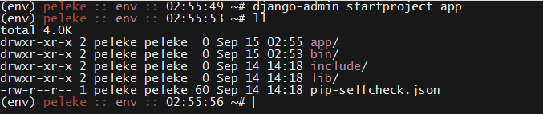
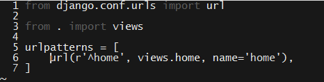
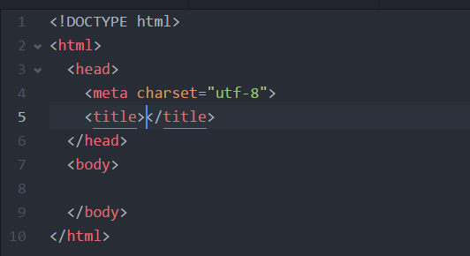

## Day 1 - Intro to Python and Django

### Overview

The purpose of this lesson is familiarize students with the basics of Python.

`Summary: Complete Activities 1-6 in Unit 21`

##### Instructor Priorities

* Python-specific learning objectives are listed below.

* Given an installation of Python 3.5.x, students should be able to:

  * Declare and manipulate variables that take advantage of Python's "duck typing";

  * Instantiate and populate lists and dictionaries;

  * Use Python's basic conditional control structures to implement branching behavior; and

  * Use Python's OO features to define classes and instantiate objects.

#### Instructor Notes

* This lesson provides cursory coverage of the language, and entails numerous omissions of essential concepts. These omissions are known and intentional. The point is that students should get enough to continue to experiment with the language. This will _not_ be "most of the language". This is fine.

* It may be easier to keep the example files open in one window, and demonstrate their examples in **Everyone Do** style in an interpreter on the projector.

* Make sure students install Python 3.4.x+ _before_ coming to class. Windows and Mac users can find installers on the [Python downloasd page](https://www.python.org/downloads/release/python-352/).

* Django uses regular expressions to define routes. Have students complete the free levels of Code School's [Breaking the Ice with Regex](https://www.codeschool.com/courses/breaking-the-ice-with-regular-expressions) before coming to class.

  * It's not particularly important for students to come to class prepared to sling around regular expressions. The purpose of slacking out these exercises ahead of time is to ensure students are familiar with the concept of regex before dealing with Django's routing protocols.

* Slack out the `InstallationInstructions` ahead of time, so students come prepared with Python 3.4.x and virtualenv installations.

* Have your TAs refer to the [Time Tracker](01-Day-TimeTracker.xlsx) to stay on track.

- - -

### Class Objectives

* After class, students should be able to:

  * Install Python on either a Windows or Mac computer; and

  * Create a command-line application using the basic features of the language.

- - -

### 1. Everyone Do: Verify Python Installation (0:05)

* Welcome students to class, and explain that today's lesson will be an intro to Python & Django.

* Have everyone fire up a terminal and execute the following command.

  * Run: `python --version`

_Python version output._

* For class, students should be running Python 3.4.x.

  * As a first line for troubleshooting have students try `python3` instead of `python`. On some systems, both are installed, but referred to differently.

  * This should pose no problems, as students were instructed to install the correct version of Python as part of last week's lesson.

  * Regardless, expect to troubleshoot some or other issue. Have your TAs available and reserve a few minutes for this purpose.

### 2. Instructor Do: Declarations & Basic Data Types (0:10)

* Open up `01-Console-IO/Examples/examples.py`

* Explain that, like JavaScript, Python does _not_ require you to declare variable "types". Unlike JavaScript, Python doesn't even require that you annotate variable declarations with `var`, `let`, or `const`—simply choose your variable's name, and assign its value.

_Very Pythonic variable declaration._

* Emphasize that we can store both strings and numbers without any special syntax—Python figures out the type of the data and handles it accordingly.

* Point out that Python has all of the same mathematical operators that JavaScript has, but that there are two notable differences.

  * You'll probably want to drop into a shell as a class to demonstrate/tinker with these.

  * These are Python's [floor division](http://anh.cs.luc.edu/python/hands-on/3.1/handsonHtml/integer.html#division-and-remainders)  and exponentiation using `**`.

_Floor division and exponentiation._

* Explain the `print` function.

  * Explain that we'll talk about functions in greater detail later, but for now, students can simply take this one "at face value". For now, just point out that we call them just as we do in JavaScript: With the function name, parentheses, and a comma-delimited list of arguments.

  * Draw attention to the various ways of calling the `print` function. Students don't have to recognize all of them, strictly speaking, but each of them will come in handy throughout today's exercises.

_Different ways to call print._

* Point out that we can declare more complex data types—including arrays and maps—but that we'll get some practice with these basics first.

* Finally, demonstrate the use of the `input` function.

### 3. Students Do: Echo Student Profiles to Console (0:10)

* Slack out the `01-Console-IO/Examples/examples.py` so students can refer to it as they work through the exercise.

* Slack out the `01-Console-IO/Unsolved/unsolved.py` file to students. It contains instructions, so you don't need to slack these out separately.

### 4. Instructor Do: Review Activity  (0:10)

* Open up `01-Console-IO/Solved/solved.py`. This activity is fairly straightforward, and is mainly intended to help students get some practice with Python's syntax.

* Ask a student how they were able to save student profile information.

  * They should respond that they used `input`.

* Ask a student how they printed the information to the console.

  * This is a straightforward use of `print`. Demonstrate alternate possible syntaxes for `print`, and commend any students who used them.

* Take any student questions. If none remain, move on to the next section.

_Console-based student profile prompts._

### 5. Instructor Do: Lists, Dictionaries, & Conditionals (0:12)

* This section will introduce students to the basic uses of lists, dictionaries, and conditional statements in Python.

  * The primary objective is to get students familiar with the syntax. Demonstrate it, then move on. They'll get practice with it after they get started on the activity and you've slacked out the examples for reference.

* Open up `02-Lists-Dicts-Conditions/Examples/list_examples.py`.

* First, explain that Python allows us to create and index into arrays much the same way that JavaScript does.

  * Point out that Python often refers to arrays as "lists".

  * Point out that we can use negative indices in Python, to index starting at the "back".

_Declaring and populating a simple array in Python._

* Next, demonstrate that you can add single elements to a list with the `append` method.

  * Point out that you can use either `+=` or the `extend` method to augment a list with another list.

_Appending single elements to an array, and extending it with an iterable._

* Then, demonstrate how to iterate over a list.

  * Point out that this is syntactically simpler than it is in JavaScript.

_Appending single elements to an array, and extending it with an iterable._

* Finally, demonstrate that we can "unpack" variables from an array into variables.

  * Point out that this is possible in ES6 via [destructuring assignment](http://developer.mozilla.org/en-US/docs/Web/JavaScript/Reference/Operators/Destructuring_assignment), if your class feels receptive.

_Python allows us to "unpack" an array into corresponding variables._

* Slack out the `02-Lists-Dicts-Conditions/Examples/list_examples.py` file for student reference.

* Open up the `02-Lists-Dicts-Conditions/Examples/dict_examples.py`.

* Begin by pointing out that Python's dicts are conceptually identical to JavaScript's objects, in the sense that they allow us to associate a _key_ with a _value_.

* Point out the similarity between the literal definition of a Python dict and a JavaScript object.

_Python dicts look very similar to JavaScript's objects._

* Demonstrate how to retrieve the value of a key. Point out that this is identical to retrieving a key's value from a JavaScript object using bracket notation.

* Briefly point out Python's syntax for retrieving the keys or values of a dictionary.

_Python's syntax for retriving the value of a dictionary key._

* Next, point out that we can get both the key _and_ the value by using the `items` method.

  * Then, demonstrate how to use this to iterate over a dictionary.

_Iterating over a dictionary's items._

* Finally, point out that you _can_ iterate over a dictionary directly, but you'll only get its keys if you do this.

_Iterating over only a dictionary's keys._

* Slack out the `02-Lists-Dicts-Conditions/Examples/dict_examples.py` for student reference.

* Finally, open up the `02-Lists-Dicts-Conditions/Examples/conditionals_example.py`.

* Point out that Python's boolean values are `True` and `False`. Be sure to **emphasize the initial capital letter**.

* Explain that Python's `if`, `elif`, and `else` are conceptually identical to JavaScript's `if`, `else if`, and `else`. The only difference is that it's syntactically more compact in Python.

_Using if, elif, and else in Python._

* Next, explain that Python renders `&&` and `||` in English as `and` and `or`, respectively.

_Using and, or, and chained comparisons in Python._

* Finally, point out the `while True` trick, as well as the function of `break` and `continue`.

  * Give some context. Explain that an infinite loop makes sense if you'd like to wait for an indefinite period of time _until_ something happens—e.g., until a user inputs a certain value, etc.

  * Let students know they'll need this for their activity!

_Using while True; continue; and break._

* Slack out the `02-Lists-Dicts-Conditions/Examples/conditionals_example.py` for student reference.

* Students are likely to be a bit overwhelmed by all the new syntax. Reassure them that this is natural, and that muscle memory comes with practice...Which the next activity will give them ample amounts of.

### 6. Partners Do: Indefinite Student Profiles  (0:18)

* Slack out the `02-Lists-Dicts-Conditions/Unsolved/unsolved.py`. The file contains instructions, so there is no need to slack them out separately.

### 7. Instructor Do: Review Activity  (0:10)

* Open up the `02-Lists-Dicts-Conditions/Solved/solved.py`.

* Ask a student to explain how they wrapped their code in an infinite loop.

  * They should respond that they wrapped everything in a `while True` loop.

* Ask a student to explain how they stored students in an array.

* Ask a student to explain how they stored values directly in a "student dictionary".

_Declaring a list to store students; creating a new dictionary for each student; and wrapping the entire script in an infinite loop._

* Ask another student to explain how they implemented the confirmation prompts.

  * This isn't as straightforward an answer as the previous one, so let students share their solutions, and then comment on them with reference to the solution implementation.

* Ask a student to explain how they allowed users to enter either `Y` or `y` to confirm the information they entered.

  * Demonstrate the `lower` method in the interpreter, and point out how it was used in the solution.

_Implementing confirmation prompts and adding students to the list._

* Take a moment to answer any outstanding student questions.

### 8. Instructor Do: Functions  (0:10)

* Open up `03-Functions/Examples/examples.py`.

* Explain that we define functions in Python with the `def` keyword.

  * The basic form is: `def function_name(parameter, list, here)`.

* Then, demonstrate how to call a function.

* Next, point out that Python allows us to use default arguments.

  * Feel free to point out that ES6 allows this, as well.

_Defining and calling functions, and using default arguments._

* Next, demonstrate Python's keyword arguments.

  * Emphasize that these allow us to define functions whose arguments are passed by _name_, rather than by position.

  * Point out that we can use positional arguments alongside keyword arguments, but that keyword arguments _must follow_ positional args.

_Keyword arguments allow us to use name function parameters._

* Finally, demonstrate how to get access to all of the positional or keyword arguments passed to a function.

_Retrieving all arguments passed to a function._

* Slack out the `03-Functions/Examples/examples.py` for student reference.

### 9.  Students Do: Refactor Student Information Tool  (0:15)

* Slack out the `03-Functions/Unsolved/unsolved.py`. Instructions are included in the file, so there is no need to slack them out separately.

### 10.  Instructor Do: Review Activity  (0:10)

* First, ask if anyone managed to figure out how to use modules.

  * Reassure students that it's okay if they didn't.

  * But, if someone did, ask them to explain how they used them.

* Point out that keeping all of your helper functions defined inside of the script gets very cluttered, very quickly.

  * Explain that it would be better to extract this into a separate file.

  * Explain that this is exactly what modules allow us to do.

* Briefly open up the `03-Functions/Solved/helpers.py`.

  * Point out that this file has a lot of function definitions.

  8 Explain that we'll look at them in detail momentarily.

  * For now, close the file, and open up `03-Functions/Solved/solved.py`

  * Explain the `from helpers import *` syntax.

    * Explain that this directs Python to **import** **all** (\*) functions from the file called **helpers.py**.

    * Explain that we can choose to import just a single function, as well.

    * Feel free to touch on Python's other import syntax(es), if you'd like.

* Return to the `03-Functions/Solved/helpers.py`.

* Ask students to explain their implementations for each of the functions required by the solution. Namely:

  * `get_student_information`;

  * `create_student`;

  * `print_student`;

  * `confirm`; and

  * `print_summary`.

  * Briefly point out the significance of docstrings.

* Walk through the reference solution as students explain their solutions.

* Slack out the `03-Functions/Solved/solved.py` for student reference.

### 11.  Instructor Do: Classes & Objects  (0:12)

* Explain that, like JavaScript, Python is an object-oriented language.

* Explain that, unlike JavaScript, Python supports classical object-oriented programming.

* Open up the `04-Classes-and-Objects/Examples/examples.py`.

* Explain the significant syntax for defining classes in Python. In particular:

  * The `class` keyword;

  * The significance of the `__init__` method;

    * And the fact that we must pass `self` as a first argument to `__init__`;

  * The use of `self` inside of instance methods;

  * The syntax for instantiating an object, which does _not_ include `new`.

_The basics of class-based OOP in Python._

* Slack out the `04-Classes-and-Objects/Examples/examples.py` for student reference.

### 12.  Students Do: Create a Student Class (0:20)

* Slack out the `04-Classes-and-Objects/Unsolved/unsolved.py`. The file contains instructions, so there is no need to slack them out separately.

### 13.  Instructor Do: Review Activity  (0:10)

* Ask a student to explain how they implemented their `Student` class.

  * Check their response against `04-Classes-and-Objects/Solved/Student.py`.

_The reference solution for Student.py._

* Ask if anyone got as far as implementing a `Roster` class.

  * If so, ask them to explain how they implemented it.

  * Check their response against `04-Classes-and-Objects/Solved/Roster.py`.

_The reference solution for Student.py._

* Finally, ask someone to walk through how they restructured the logic of their main program.

  * Step through the `04-Classes-and-Objects/Solved/solved.py`.

  * Point out how much more succinct and readable this has become, in comparison to the first script we wrote in the beginning of class.

_Our student profile script, well on the way to being satisfactorily well architected._

* Slack out the solution files for student reference.

* If time remains, foster discussion about the code students have written.

  * Ask a row if they can think of any ways to improve the structure of this program further.

  * When they respond, ask another row to critique the ideas, with questions like:

    * Can you think of something better?

    * What's good about these suggestions?

    * What Python structures would you use to implement these suggestions?

  * If there's time, have students try to improve their code. Otherwise, spend time discussing these questions and answering student questions.

- - -

### 14. Lunch (30 min)

- - -

### 15. Everyone Do: Verify Python & virtualenv Installation  (0:05)

* Next, we will introduce Django, one of the most popular Python web frameworks.

  * Explain that, before getting started, we'll have to set up a virtual environment to work in.

  * Explain the following scenario:

    * Today, you build and deploy a project in the latest version of Django—1.10.1.

    * Next year, the project is running strong, and you continue to maintain it. But, you decide to start a _new_ project in the _next_ version of Django—say, 1.11.0.

    * If we started our first project by installing Django globally, upgrading that global installation to 1.11.0 will almost certainly prevent us from running our 1.10.1 project locally.

    * It would be better if we could install the _particular_ version of Django each _particular_ project requires.

    * Explain that this is precisely what virtual environments let us do.

  * Have students verify their virtualenv installations.

    * Run: `virtualenv --version`. The particular version isn't crucial—what matters is that the package is installed. _NOTE: Windows users will need to have the $pythonhome/bin/Scripts directory in their path or else pip and virtualenv may no work from the terminal._

_virtualenv --version output._

* Next, create a folder for the Django project we'll use for the next two lessons, and change into it. You can create this anywhere, and name it anything.

* Create a virtualenv inside that folder, configured to use Python 3.

  * Have students check their default Python version with: `python --version`.

    * If the system default version is 3.4.x+, students can simply initialize their virtual environments with: `virtualenv $ENV_NAME`.

      * E.g., `virtualenv env`.

    * If the system default version is 2.7.x, they'll need to explicitly initialize with Python 3. See below.
    * If the user has spaces in the path of the env name errors may occur. For example: `/usr/jdoe/path to/working/folder` may experience errors creating the virtualenv.

  * Run: `virtualenv -p $PATH_TO_PYTHON3 $ENV_NAME`

    * E.g.: `virtualenv -p /usr/bin/python3 env`.

    * Alternatively: `virtualenv --python=/usr/bin/python3 env`.

  * If students don't know the path to their Python 3 installation, explain they can find it by running: `which python3`.

    * Students using Bash or Zsh—which should be everyone—can substitute this directly with: `virtualenv -p`which python3`env`.

      * Backticks around `which python3` instruct Bash to evaluate the command and substitute its result in-place.

* Finally, activate the virtualenv.

  * Run: `source $ENV_NAME/bin/activate`.

    * E.g.: `source env/bin/activate`.
    * Windows (via Git Bash): `source env/Scripts/activate`

_Sourcing a virtualenv._

* Have your TAs available to troubleshoot.

### 16. Instructor Do: Introduce Django & MVC (0:10)

- - -

**Objectives Met**

* Implement an MVC-like architecture, even when one is not provided (e.g., raw PHP or in ground-up Node CRUD applications)

- - -

* Before installing Django, explain that it's what's called an "MVC Framework."

  * Point out that, when you build a Node app with Express, you're free to choose _exactly_ how and where you save your data.

  * Point out that this freedom is powerful, but can be inconvenient, as it requires you to "glue" everything together manually.

    * Point out the advantages of convention over configuration.

  * Explain that Django has an opinion as to how you should architect your application, and that the architecture it imposes is called MVC.

    * Refresh students' memory of MVC by explaining the below diagram.

      * Data is stored in **models**; **views** display the data to the user; and **controllers** handle user updates to the data.

      * Explain that, within Django, a more appropriate term is MTC—or, Model; Template; Controller.

        * This is because Django's "views" have responsibilities of controllers.

_An illustration of the MVC concept._

* Explain that Django's making this choice allows us to focus on _what_ our application does, rather than how the pieces fit together.

### 17. Everyone Do: Install Django & Create Project  (0:10)

- - -

**Objectives Met**

* Create a new project on the command line with `django-admin makeproject`

* Create "apps" within a project using `./manage.py startapp $APP`

- - -

* Now that students have some background on what Django _is_, it's time to install it.

  * Tell them to source their virtualenvs if they haven't already, and run: `pip install Django==1.10.1`.

    * Note that students don't have to use `pip3` within a virtualenv initialized against Python 3.

* Explain that Django provides a command-line tool for creating new projects, called `django-admin`.

  * Have everyone create a new project with: `django-admin startproject app`.

    * You are, of course, free to name your application whatever you'd like. We've used `app` throughout the lesson plan for the sake of concreteness.

_installing django._

_Starting a new project with django-admin._

* Change into the `app` directory and `ls -sl` its contents.

_The starting point for new Django applications._

_The tree view of a new Django project._

* Explain that the `app` directory contains project-wide configuration files—this is where we set up database configuration, tell Django where static files are located, etc.

* Explain that `manage.py` is where Django's utility toolchain lives.

  * This is the tool you'll use to migrate databases, run the development server, create administrators, etc.

* Explain that this directory contains all of the files for a Django _project_, but that we develop specific functionality in what Django calls _apps_.

  * Ideally, each app is responsible for a specific set of related features.

  * A web app is a collection of different "feature sets." A Django project is the web app; each "feature set" is a Django app.

* Explain that, to initialize a new app, we use the `manage.py` tool.

  * Create a new app with `python manage.py startapp users`.

    * The general formula is: `python manage.py startapp $APP_NAME`.

    * A shorter alternative is: `./manage.py startapp users`, but this might not work on some students' machines.

* Display the contents of your project directory with `ls -sl`, and point out that this creates a new folder called `users`.

_Creating a new Django app._

* Explain that this directory is where we'll spend most of our development time.

* Finally, explain that, when you create a new app like this, you need to "register" it in Django's internal settings file.

  * Explain that this allows it to find important, app-specific files.

  * Open up `app/settings.py`, and scroll down to `INSTALLED_APPS`.

    * Inside the array, add: `users.apps.UsersConfig`, and make sure students do the same.

    * Explain that this is a one-time setup for every new app.

### 18. Instructor Do: Views and URLs (0:10)

- - -

**Objectives Met**

* Define views in `$APP/views.py`

  * Use the `HttpResponse` method to create stub view methods

* Wire views to URLs in `$APP/urls.py`

  * `include` those urls in `$PROJECT/urls.py`

- - -

* Remind students of Django's MVC paradigm.

* Explain that the first thing we'll explore is the Controller layer, since this is what allows us to bind UIs to data.

* Remind students that the "controller" in MVC is called a "view" in Django, and open up `users/views.py`.

  * Emphasize that the terminology isn't crucial, but that students do need to remember that `views.py` is where they define controllers, not UI details.

_The default views.py._

* Explain that each view is nothing more than a Python function.

  * Explain that, when a user hits a URL/route on your website, Django calls a function defined in `views.py`.

  * Explain that Django passes the user request as a parameter to each view function, so you can, for example, determine if it was a `GET` or `POST` request.

  * Explain that you need to tell Django which function to call when a user hits a given route elsewhere. We'll get to that after defining a few view functions.

* Explain that this is easier to understand with an example, so create a `home` route, and explain its components.

  * First, import `HttpResponse` from `django.http`.

    * To your imports, add: `from django.http import HttpResponse`.

      * Remind students that this instructs Python to import the `HttpResponse` function from the `django.http` package.

      * Explain that `HttpResponse` allows us to send a proper HTTP response to the browser, instead of just an HTML string.

  * Explain that each view function takes `request` as its first parameter.

  * Explain that you can perform whatever logic you need inside the function body.

  * Explain that the `return` value is what Django uses to render what users see.

    * Point out that returning HTML this way is a bit clunky...But, it will do for now.

      * We _want_ students to do things the clunky way, so that they'll begin to think about better solutions. We'll revisit this point as a review question after the next activity.

_A simple home view._

* Point out that this tells Django what to do when users hit the home page...But, we still need to tell it what route corresponds to that home page.

* Explain that you configure this in a different file, named `urls.py`.

  * Explain that each app can define its own URL patterns.

  * Save `views.py`, and create a file called `urls.py` in the app directory.

    * Explain that Django doesn't create this file in new apps, so students will need to create it themselves.

    * Explain that, to configure URLs, you need to import Django's URL configuration tools.

      * Add: `from django.conf.urls import url`.

    * Explain that, to map URLs to views, you need to import the views you just wrote.

      * Add: `from . import views`.

        * Remind students that this tells Django to import `views.py` from this directory (`.`).

    * Explain that Django expects you to store routes in an array called `urlpatterns`. Create this array.

    * Next, define a url for the home view thus:

      * `url(r'^home', view.home, name='home')`

        * Explain that this uses the Django-provided `url` function to map the route "<http://$SITE_URL/home>" to the function `home` that we just defined in `views.py` (represented here as `view.home`).

          * Explain that the `^` metacharacter indicates start-of-line. So, any URL that starts with `home` will map to `views.index`.

          * Explain that the `r''` syntax allows us to use special characters without escape sequences.

            * Explain that, in a normal string, we have to write `"\\"` to represent a single backslash. This is because the backslash on its own is used to indicate that a special character follows.

            * Explain that, if we prefix a string with `r`, we don't need to double-up backslashes.

            * Explain that this exists more or less only to make regular expressions more readable. There's nothing essential about using raw string literals—you could use normal strings with double backslashes instead—but some people simply find that a bit harder to stomach.

          * This is an incorrect regular expression—it's missing the end-of-line metacharacter, `$`. This is intentional. You'll fix this shortly.

        * Explain that you can give a string name to all of our routes, which you should always do for clarity.

          * Explain that we'll see how this is useful shortly. For now, students should remember it as a best practice.

    

    _Your user/urls.py configuration._

* Explain that this configures URLs for the `users` app, but that we still need to let the Django project as a whole know about these routes.

  * Reassure students that this is the last step for mapping URLs, and that it only needs to be done once per app.

* Navigate to `app/urls.py`, and explain that this is where you tell Django about the routes that each of its individual apps responds to.

  * Explain that we need to include another function from the `django.conf.urls` package, called `include`.

    * Explain that `include` allows us to easily...Well, _include_ urls from one of your apps.

    * Include the urls from `users/urls.py` by adding the following call to `url` to the `urlpatterns` list:

      * `url(r'', include('users.urls')),`

    * Explain that this tells Django that, whenever a user hits the site (e.g., `localhost:8000`), it should use the URLs defined in `users/urls.py` to figure out which view to load.

* Save the file and kick up a development server with `python manage.py runserver`.

  * Navigate to `localhost:8000/home/` and demonstrate that the route works as intended.

* Now, explain that the regular expression you used in `users/urls.py` isn't completely correct.

  * Ask a student to explain what matching for `r'^home'` means.

    * When they explain that it means to "match any string beginning with 'home'", commend the correct answer, but point out that the computer takes this literally.

    * Explain that this pattern matches _any_ string that begins with 'home'.

      * Navigate to a few different routes to demonstrate this: `localhost:8000/home_route_we_didnt_map`, `localhost:8000/homeasdlfkja;sldfkjasdf/`, etc.

    * Stop the dev server; open up `users/urls.py`; and fix the regex by adding the `$` metacharacter.

      * Explain that this means "end-of-line". So, the updated regex means: "Match any string beginning with `home/`, _and which has nothing after._"

      * Explain that Django is helpful on this point, and "adds" the final slash for us if users forget it.

        * You can get the same behavior by marking the slash as optional with `r'^home/?$'`, but this deviates from the Django convention that all routes should end in a slash, and would confuse most students. As an instructor, it's good to remember you can do this, but it's best to avoid introducing optional items at this stage.

    * Start the server again, and demonstrate that this update fixes the problem.

  * Point out that regular expressions can be tricky because of the precision they demand, but point out that this is one of only a few gotchas that comes up in Django development.

    

    _The corrected home route._

### 19. Students Do: Stub Views & URL Mappings  (0:18)

* Slack out the following instructions to students.

  * **Instructions** | Setting up views and mapping them to routes in Django can seem labor-intensive at first, but you'll find that they become quite mechanical with practice. For this activity, you'll ned to do two things: Write three views, and map them to routes.

  * First, create three views: `index`, `detail`, and `add`.

  * In your `index` view, return an HTML string containing a header and a `<ul>` with two or three list items. They can say anything at all.

  * In your `detail` and `add` views, just return an HTML string containing headers. Something like "This is the detail/add view!" is fine.

  * Next, map these views to urls in `users/urls.py`. The routes should correspond to your method names.

  * Finally, make sure the Django project as a whole knows about the urls for your `users` app.

  * Kick up a development server and make sure everything's working properly in the browser.

  * _HINTS_ | Keep in mind that we're not returning pure strings — you need to import a function to turn them into proper Http responses. Also, don't forget that you can use """triple quotes to write multi-line strings in Python.""" This should make it easier to write your `index` view's HTML response.

  * Take a moment to think about your solution when you finish. Can you think of a way to make it more robust or elegant?

### 20. Instructor Do: Review Activity  (0:10)

* Before opening your own solution file, ask a student to explain how they implemented their `index`, `detail`, and `add` views.

  * Check their answers against your solution in `05-Views/Solved/users/views.py`.

    

    _The solution views.py._

* Ask a student to explain how they mapped their views to routes.

  * Check their answers against your solution in `05-Views/Solved/users/urls.py`.

    

    _The solution urls.py._

* Ask a student if they think this is the best solution available.

  * Ask them to explain why, or why not.

  * Ask another student to support or refute the first student's response—try to foster discussion on this point.

* Point out that writing HTML in a string like this is suboptimal not only because it's ugly, cumbersome, and inelegant, but because it **couples** our controller logic to our templates.

  * Explain: This means that, if we want to change the way our site looks, we have to open up our `views.py` file, and make changes there.

  * Explain how this is a nightmare for maintenance.

  * Ideally, we want to make changes to the way the site looks without having to change the way the controllers function—this is a major benefit of an MVC architecture.

* Explain that Django's templates allow us to do just that.

### 21. Instructor Do: Templates  (0:10)

- - -

**Objectives Met**

* Define and use app-specific templates in `$APP/templates/$APP`

  * Extend "base" layout files

  * Use blocks to modularize templates

* Use the `render` method to compile templates with context information

- - -

* Explain that, just as each app can map its own urls, so too can it maintain its own templates.

* Explain that app-specific templates should be placed within the app directory, inside a folder called `templates/$APP_NAME`.

  * Move into `users`, and then create these folders with: `mkdir -p templates/users`.

  * Explain the reason for the redundancy in folder names:

    * Explain that, when you refer to a template by name in one of your apps, Django looks for it in _every_ app's `template` folder, and uses the first one that it finds.

    * If you meant to use, say, the `index.html` template defined in the `users` app, but Django first looks in the `templates` directory of an app called `cards`, you'll get the wrong one in your UI.

    * This is why we create a folder with the app's name inside of the `templates` directory. It creates a **namespace**, so we can refer to templates precisely: `'users/index.html'` rather than simply `'index.html'`.

* Explain that we create our templates inside of this directory, and simply refer to them by name in our views.

* Explain that Django has its own templating syntax. It's similar to Handlebars in flavor, and so shouldn't take students too long to pick up.

  * Explain that we'll learn the template system details by example. create `templates/users/layout.html` to demonstrate.

* Explain that Django allows us to create **parent templates**, in which we condense markup common across templates.

  * Explain that this allows us to keep markup that appears everywhere—such as footers, navbars, etc.—in a single document, in turn allowing us to make site-wide changes by modifying a single document.

  * Explain that Django allows you to mark areas where child templates can "inject" their own content.

* Begin your demonstration by pasting a simple HTML document into `layout.html`.

  

  _Our starter HTML template._

* Explain that we don't have to do anything special to turn this into a "parent template"—all we need to do is tell child templates to use it.

  * Explain that we mark areas where child templates can inject their own content in "blocks."

  * Place a block inside of the title tag and body tags, as per the image below.

  * Explain that child templates refer to these blocks by name to override them., we simply mark blocks off so child templates can inject their own content.

    

    _Our starter template, updated with blocks for title and body content._

* Create a template for your `home` view: `templates/users/home.html`.

* Add an `extends` clause at the top of the document, and override the parent template `block`s.

  

  _A child template extending users/layout.html_

* Explain that Django replaces `block` statements in parents with the content in correspondingly named child templates.

  * E.g., The contents of an extending template's `...` tags will be inserted in place of the parent's ``.

* Explain that Django allows you to use a number of Python control structures by simply wrapping them in `...` tags.

  * Demonstrate that Django offers `if/else` and `for` loops with this syntax.

  * Reassure students that they'll have this file for reference during their activity, so they don't need to commit this syntax to memory right away.

    

    _If/else in Django templates._

    

    _for loops in Django templates._

* Either finish filling out the `users/home.html` file, or simply copy and paste the completed example to save time.

* Briefly touch on the rationale behind each use of `for` and `if` tags, then slack out the file so students can refer to the syntax and logic during their activity.

* Remind students that the templates won't work unless we refer to them from the view.

* Open up `views.py`, and replace your call to `HttpResponse` with a call to `render`:

  * `render(request, 'users/home.html', {})`

  * Explain that `render` "compiles" templates by binding variables in the HTML and executing the logic of template control structures.

    * Explain that the first argument to `render` will always be the user request object.

    * Explain that the second argument is always the name of the template you want to render.

    * Explain that the last argument is a dictionary, called the **context dictionary**, which contains the variables you used in the template.

      * Explain that the _keys_ of the context dictionary need to correspond to the names of the variables you referred to in the template.

        * Remind them that you used the variables `name` and `tasks` in the template.

      * Explain that you're purposefully passing an empty dictionary to demonstrate how the `if`/`else` control structures works.

* Prepare to kick up a dev server to demonstrate how everything works together.

  * You'll need to `makemigrations` and `migrate` before you do this. This is due to the way Django calls `render` internally.

    * Run: `python manage.py makemigrations && python manage.py migrate`.

    * You should do this off-screen, so as not to interrupt the continuity of the template lecture.

    * You'll instruct students to run this command right before the next activity, so you'll get an opportunity to touch on it then.

* Run: `python manage.py runserver`, and navigate to `localhost:8000/home` to demonstrate.

_Our simple template, rendered._

* Point out that there was one step you didn't show, which was the `migrate` bit.

  * Instruct students to run the migration commands you used earlier: `python manage.py makemigrations`, followed by `python manage.py migrate`.

  * Explain that this sets up the database so that Django can properly render and serve templates.

  * Explain that we'll talk more about migrations in the next section.

### 22. Partners Do: Base & View Templates  (0:18)

* Slack out the following instructions to students.

* **Instructions**:

  * The activity you wrote last time returned raw HTML strings to be rendered in the browser. Your task for this activity is to convert them to templates.

  * Start by creating the correct folder structure in your `users` directory.

  * Next, create a base template with the basic HTML structure. Pull in the Bootstrap CSS from MaxCDN, and put it in the document head: <https://www.bootstrapcdn.com/>

  * Create three templates, one for each of your views, that extend this template.

  * Two of your views simply returned headers. Pass the string to the template as a variable named `header`, and render it in the appropriate tags.

  * In the template that includes a `ul`, send both the header string and an array of items to the template. Refer to the example template your instructor slacked out to you for the control structure syntax.

  * Once your list renders properly, see if you can add an `if` check to display a special message when the collection is empty.

  * If you get stuck, don't hesitate to reach out to a TA!

### 23. Instructor Do: Review Activity  (0:05)

* Open up your solutions in `06-Templates/Solved/users/templates/users`.

* First, ask a pair to explain how they rendered headers in the `detail` and `add` templates.

  * Follow-up by asking them to explain how they sent the data to the templates from their views.

  * Display your solution, and explain any differences between the two.

* Then, ask a pair, or a row, to explain how they rendered the headers and the list for the `index` template.

  * Display your solution, and explain any differences between the two.

* Congratulate students on coming this far.

  * Point out that there remains one major piece left: Models. And they'll learn that next class!

### Lesson Plan Feedback

How did today's class go?

[Went Well](http://www.surveygizmo.com/s3/4325914/FS-Curriculum-Feedback?format=ft&sentiment=positive&lesson=11.01)

[Went Poorly](http://www.surveygizmo.com/s3/4325914/FS-Curriculum-Feedback?format=ft&sentiment=negative&lesson=11.01)
