## Day 2 - Laravel Continued

### Overview

Today's lesson will continue teaching Laravel, including

1. [Models](https://laravel.com/docs/5.1/eloquent#introduction) and [migrations](https://laravel.com/docs/5.1/migrations); and

2. PHP Artisan.

3. [Eloquent models](https://laravel.com/docs/5.2/eloquent) and the [query builder](https://laravel.com/docs/5.2/queries);

4. [Relationships](https://laravel.com/docs/5.1/eloquent-relationships); and

5. More details of forms.

`Summary: Complete Activities 10-16 in Unit 21`

##### Instructor Priorities

* The primary objective of today's class is to ensure that students are comfortable with every layer of Laravel's MVC architecture. In particular, they should be able to fluently:

  1. Link forms to controllers; and

  2. Create models with the submitted information.

* The app they build through the class is very similar to the homework assignment, so it's important to ensure every student understands the solutions every step of the way.

##### Instructor Notes

* Solutions to today's activities are distributed as ZIP files. These include everything in the Laravel project directory except for `vendor`.

* Have your TAs reference the [02-Day-TimeTracker.xlsx](02-Day-TimeTracker.xlsx) to keep track of time.

### Class Objectives

* To develop familiarity with basic relationships in Eloquent;

* To develop fluency with the query builder syntax;

* To understand the advantages of, and apply, eager loading; and

* To develop comfort linking Laravel's MVC layers to one another.

- - -

### 1. Instructor Do: Models, Migrations, & Resource Controllers (15 min.)

The files for this section are in `10-Models/Examples`.

* Point out that models save us from the clumsiness of manipulating data in our controllers.

* Explain that models are simply objects, which allows us to associate logically related data and behavior for convenience and modularity.

  * Point out that this is conceptually identical to what students have used JavaScript objects for.

* Explain that using models in Laravel requires two steps:

  * The creation of the model; and

  * The creation of a migration.

* Explain that a **migration** is simply a way to tell the database that we're updating it with a new **model**.

  * Emphasize that the two go hand in hand: When we create or update a model, we must create a migration.

* Let students know that Laravel creates both a User model and a User migration for every new project, since most applications require it.

* Open up `10-Models/Examples` and open `database/migrations`. Open the migration for creating the users table.

* Explain that a migration is just a class with two methods: `up` and `down`.

* Explain that the `up` method is called when we upgrade our database, and `down` is used when we revert to an older version of it.

* Point out that PHP objects are different from SQL data. Migrations are how we translate our object's structure to something intelligible to the database.

* Explain each `$table` statement. Simply running through the comments is okay.

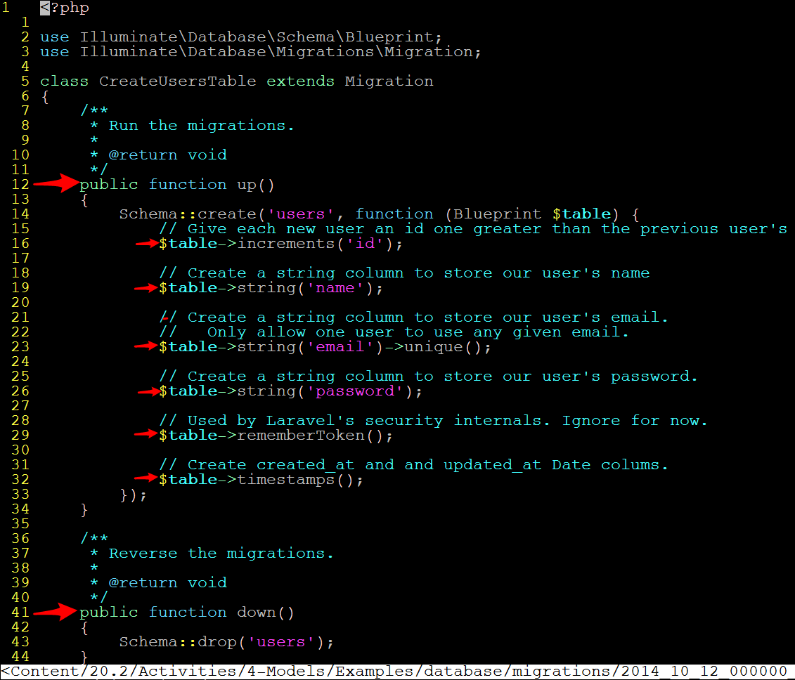

_Migration for create_users_table._

* Explain that Laravel knows what attributes we want on our User object based on the columns in the database table, so we don't need to create a detailed class ourselves.

* Shifting gears, ask a student what sorts of things they'd probably be doing with a User model.

* Point out that we'll be using all the REST verbs with almost all of our models. No matter what data we store, we'll probably need to be able to create; update; view; and delete it.

* Instead of manually creating all of these routes, we can use Artisan to scaffold a Controller with stubs for all of these actions.

* Run: `php artisan make:controller UsersController --resource`, and open `UsersController.php`.

* Quickly showcase the boilerplate that Laravel generates.

* In the top of the file, add: `use App\User;`, and mention that this needs to appear in any Controller that uses the User model.

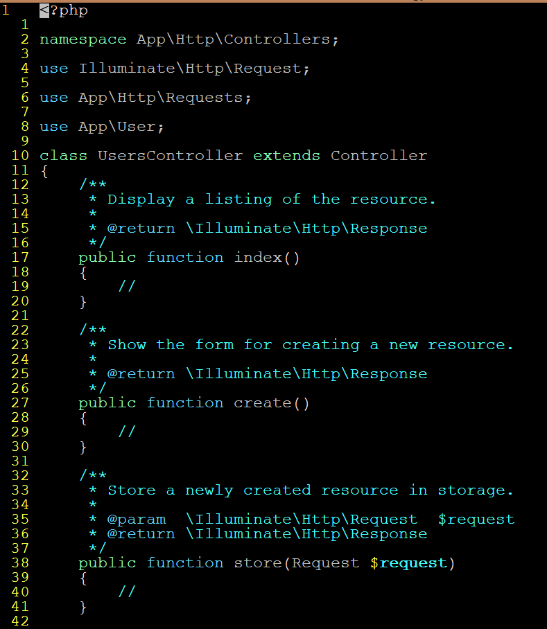

_User resource controller._

* Demonstrate how to set this up in `routes.php`:

  * `Route::resource('user', 'UsersController');`

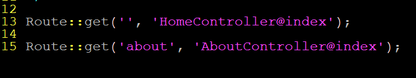

_UsersController in routes.php._

* Mention that Laravel determines which method to call based on which HTTP method your application sends, and which URL the application requests. Explain that:

  * `POST` requests call `store`;

  * `DELETE` requests call `destroy`;

  * `PUT` and `PATCH` requests call `update`; and

  * `GET` requests trigger `index`, `create`, `edit`, or `show`, depending on the request URL.

  * Tell students not to worry about remembering these details now. It'll stick with practice.

### 2. Partners Do: Managing Users (30 min.)

* For the remainder of class, students will tinker with forms and HTTP controllers.

* Treat this as an assisted mini-project. Students should not expect to finish the entire exercise, and instructors should not expect them to. The purpose of the activity is to get students tinkering with Laravel—not build a full application. The crucial checkpoints are the following:

  * Students are able to use Blade to create templates that extend from a "base" `layout.blade.php`;

  * Students are able to "wire" controllers to templates using `routes.php`;

  * Students are able to pass data to Blade templates from controllers;

  * Students are able to pass data from templates to controllers via form inputs;

  * Students are able to create models with data submitted through forms.

  * Ensuring most students achieve the **first three** of these objectives is priority. It's okay to leave the last two for your review, and simply explain the solutions/slack them out to students so they can review them for homework. Lesson 20.3 will provide more extensive coverage of models and forms

  * You are encouraged to provide guidance on each of these outcomes throughout the activity, at intervals. You way wish to check-in with the class at large every 10 minutes to cover "pain points", and have your TAs actively engaging with students as they work.


* First, tell students to run: `touch database/database.sqlite`.

* Make sure you're in `11-Models`, and slack out both `.env` and `config/database.php`. Tell students to overwrite their local copies with what you've sent out.

  * This saves the time of setting up and troubleshooting database connections. We'll walk students through this detail during Lesson 20.3.

* Slack out `check_db.php`. Tell students to run: `php artisan tinker check_db.php`.

  * Have your TAs available to troubleshoot, if necessary.

  * Let students know that `php artisan tinker` allows them to run PHP with all the tools Laravel provides. So, they can "tinker" with the framework directly.


* Once students are good to go, slack out the instructions below.

  * Explain the solutions to

  * After ca. 7 minutes have elapsed, demonstrate how to retrieve `POST` data from a `$request` object.


* **Instructions**:

  * This will be a big activity, but don't be intimidated by the length of the instructions! They're detailed to make it easier on you. Finish as much as you can, but don't worry it if you don't get through everything. Focus on wrapping your head around controllers, routes, and views. If that feels good, move on to tackling models. Do _not_ hesitate to ask for help throughout—your instructor and TAs fully expect to be doing rounds for the next half hour!

  * To start, create a resource controller for your Users model, and add it to your routes.

  * Open your `UsersController`. Find the method that creates a new user, and have it return a view called `users.create`. The '.' tells Laravel to look for `resources/views/users/create.blade.php`. _HINT_: It helps to keep the documentation open, just in case: <https://laravel.com/docs/5.1/controllers#restful-resource-controllers>

  * Create this template. Start by inserting a simple header, serving your site, and hitting the correct route to make sure it works.

  * Add a form to the template. It should include the following:

    * A label and an input for a name;

    * A label and an input for an email;

    * A label and an input for a password; and

    * A submit button.

    * Laravel also requires you to add a csrf field. You can put this anywhere within your `<form></form>` tags, but just stick it in the bottom for now. _HINT_: The docs are here: <https://laravel.com/docs/master/helpers#method-csrf-field>

  * What should your form's `action` attribute be if you're creating a user? What should your form's `method` be if you're creating a user? Refer to the HTTP Controllers documentation if you've forgotten. Alternatively, run `php artisan route:list` for a hint. If it's not immediately obvious, ask a TA for a refresher!

  * Return to your controller. Find the method that receives the data from the form, and `var_dump` the data it received. This is similar to JavaScript's `console.log`, but puts the information right into the browser. _HINT_: If your input field had a `name` attribute of `name`, you'd write: `var_dump($request->name)`. Do this for all of your for inputs to make sure your form is wired up properly.

  * Once you've gotten here—congratulations! This is the **major milestone** for this activity. The rest is important, but it's okay if you don't get through it all, as your next lesson will cover it in greater detail.

  * Once you're sure your route is receiving the form data, make sure you can use the `User` model in your controller. _HINT_: You have to add a line to the top of the file. You saw this earlier.

  * Next, create a new User before your `var_dump` statements.

  * Set your new user's `name`, `email`, and `password` properties. _HINT_: This is actually straightforward. Instead of  `var_dump` statements, set your User's properties. It'll look very similar to getting the data from the `$request`!

  * All models have a `save` method that saves them to the database. Simply call it on your user to save it.

    * _HINT_: This entire method will look exactly like the example in _Basic Inserts_: <https://laravel.com/docs/5.1/eloquent#basic-inserts>

  * Your final task is to send your user back to the "Create User" form.

    * First, do this with `return view(...)`. Use `compact` to accomplish this.

    * Then, do it with `return redirect(...)`. Instead of passing the template name, you pass the URL you want to redirect to. In this case, they differ by only one character.

    * Finally, do it by calling Laravel's built-in `back` method: `return redirect()->back();`

      * This is the best practice when dealing with forms.

  * If you've gotten through all of this, take a breather. Kudos for getting through it all!

### 3. Instructor Do: Review Activity (10 min.)

* Walk students through the solution, focusing on how to link the form to the controller.

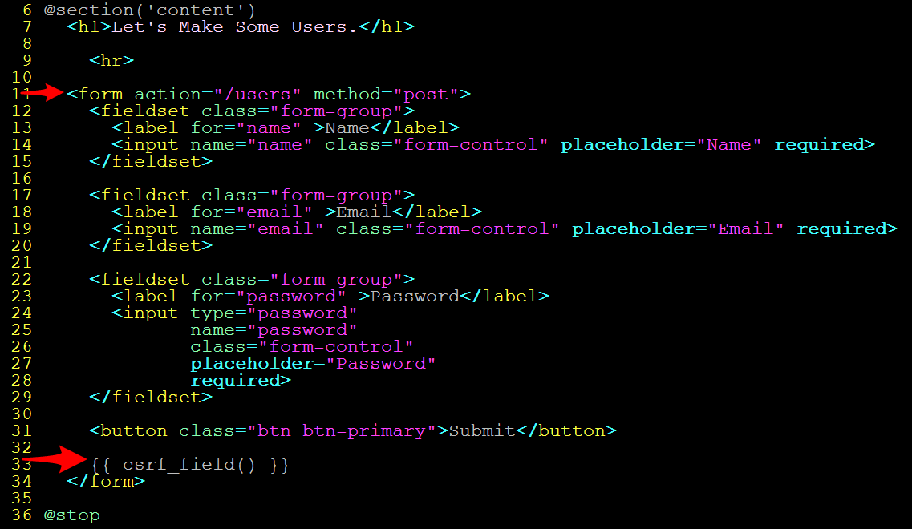

_The final form._

* Take some time to answer student questions.

### 4. Instructor Do: List Users (10 min.)

* Point out that it would be nice to be able to see the users we add.

* In Artisan Tinker, demonstrate how to retrieve all users:

  * `User::all();`

* Explain that the `::` syntax represents a _static_ method. This is a method that is defined on the `User` class _itself_, _not_ on the individual users.

  * Consider giving the example of a static method that increments a counter whenever a user creates a new `User`. This isn't a method that would make sense to put on an individual user object, but which would rather belong on the `User` class.

    * No, this probably wouldn't be great design, but it might help illustrate the concept.

* Tell students that they'll explore database queries in great detail during the next session. For now, we'll just use this one to demonstrate the common task of listing all of a certain type of model.

  * Your next task will be to walk students through building such a list in the `index` method. The solution is in `11-Index/Solutions`, if you'd simply like to show it off. If you'd prefer to code it out as you go, start with the solution to the previous exercise.

* Explain that the `index` method of a resource controller is often used for retrieving and displaying such a list.

* Ask a student how you'd retrieve and store all users in a variable.

  * If they get stuck, ask them how to finish the following line with the method you just showed them: `$users = ...`

  * `var_dump` the `$users` variable for demonstration.

* Next, create a template called `users/index.blade.php`. Iterate over your users, and print each user's name in an `<li></li>`.

  * Highlight  Blade's `@foreach` syntax.

  * As a final note, show them how to use PHP's `isEmpty` method, along with Blade's `@if...@else` statements, to only display users if the `$users` array is populated.

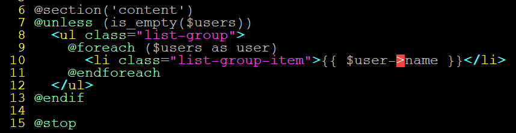

_Blade's foreach syntax._

* Then, ask a student what remains to be done for this template to be functional.

* If they get stuck, ask them if our controller is finished.

* Go back and pass your `$users` to the template.

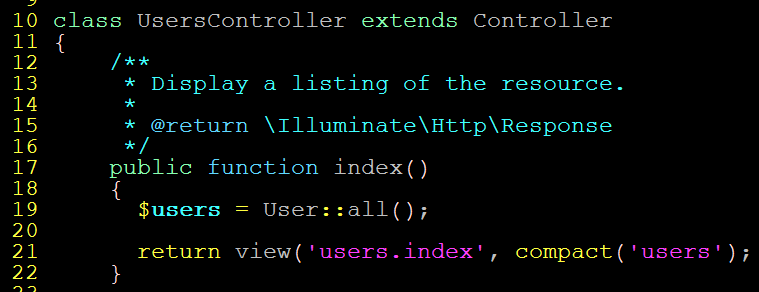

_UsersController's index method._

* Kick up a server to demonstrate what this looks like in action.

### 5. Everyone Do: Database Seeding (15 min.)

* Point out that creating users is only half the battle. We need to be able to retrieve them for the database to be useful.

* Before we do that, though, we'll need some data to work with.

* Explain that, rather than waste time manually creating a bunch of users, we'll use something called database seeding to do it programmatically.

* Explain that this is just the process of filling up our database with mock data—it's the database equivalent of Lorem Ipsum.

* Explain that we'll also walk through setting up the database settings.

* Have students follow along as you do the following:

  * Create a new Laravel project and Git repo.

  * Open `.env` and comment out the DB variables.

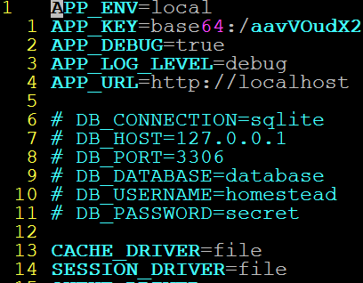

_.env file._

* We should be using DotEnv properly, but it's complicated configuration in the past. Here, we exploit default settings in `config/database.php` for the sake of expediency.

  * Open `config/database.php`.

  * In the section for Default Database Connection Name (ca. line 29), change the second argument in `env` to from `'mysql'` to `'sqlite'`.

    * Explain that this line sets the _default_ database connection to `sqlite`.

    * Explain that `env()` is a function that takes the name of one of the variables in `.env` as its first argument; and a default to return if a variable of that name doesn't exist.

    * We commented out the definition of `DB_CONNECTION`. So, Laravel wil use the default value we provided—sqlite.

    * Finally, from the project root, run: `touch database/database.sqlite`.

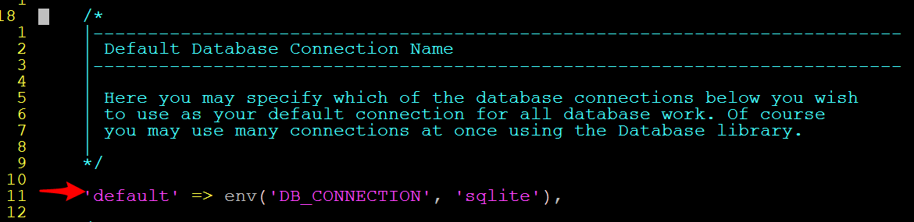

_Database configuration._

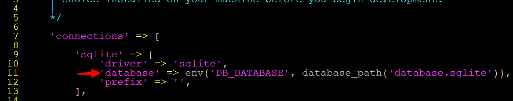

_Database configuration._

* That's it for database setup.

  * Run your User migrations.

  * Run: `php artisan make:seeder UsersTableSeeder`.

  * Open the seeder: `database/seeds/UsersTableSeeder`.

  * Add `use App\User;` right before your class declaration.

  * In `run`, add: `factory(User::class, 50)->create()`.

    * Explain that `factory(class, number)` saves `number` instances of `class` to the database.

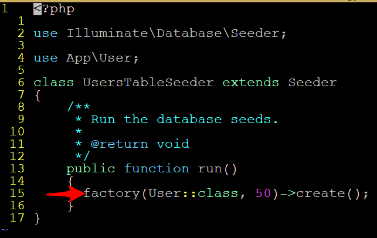

_UsersTableSeeder._

* Open `database/seeds/DatabaseSeeder.php` and uncomment the line in its `run` method.

* Explain you'll have to add a similar line for your custom seeders.

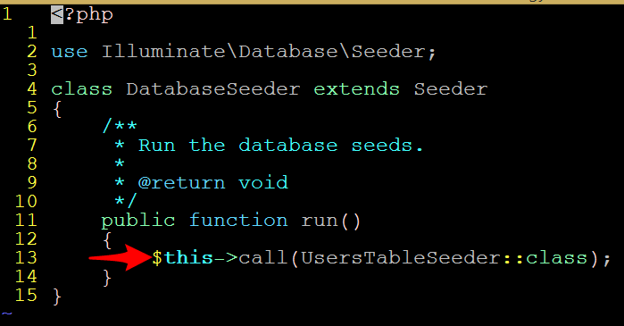

_DatabaseSeeder._

* Run: `php artisan db:seed`.

* Run: `php artisan tinker`, and then: `App\User::find(1)`.

* We'll see this syntax momentarily. For now, just recognize that we retrieved a value from a brand new database, which Laravel seeded with mock data for us!

* Encourage students to do this for all of their custom models to aid in testing.

### 6. Everyone Do: Tinkering with Models (15 min.)

* Have students work along as you continue with the following steps.

* Scaffold a Users resource controller: `php artisan make:controller UsersController --resource`

* Add this to your `routes.php`.

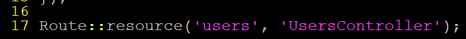

_routes.php with resource controller._

* Create a new folder for user views: `mkdir resources/views/users`

* Create a new template for listing all users, as `index.blade.php`.

  * Don't bother styling the template. Keep it simple.

* Ask a student how you would create a loop displaying a list of username, given a list of users. Write this loop.

* Ask a student which controller method is responsible for this template.

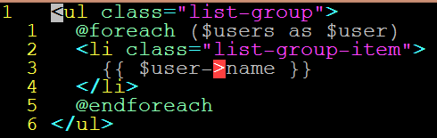

_users/index.blade.php._

* Open `UsersController`. Be sure to `use App\User` at the top.

  * Explain that this makes the User class available in our controller.

  * Explain that this `use` statement tells Laravel that, whenever you write `User`, you're referring to the file `User.php` in the `app` directory.

  * Explain that PHP organizes files using _namespaces_, which are analogous to referring to files within folder hierarchies.


* Ask a student how we return the index view we created.

* Demonstrate how to store all users in a variable: `$users = User::all()`.

  * Explain that this retrieves all User objects from the database.

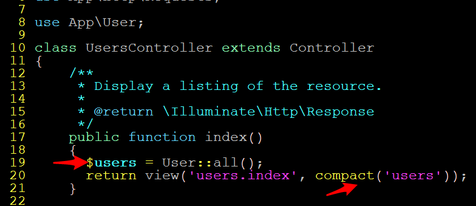

_Bringing App\\User into scope, and retrieving all users from the database._

* Ask a student how to pass this list to the template.

* Serve the site; hit the index view; and demonstrate that everything works as expected.

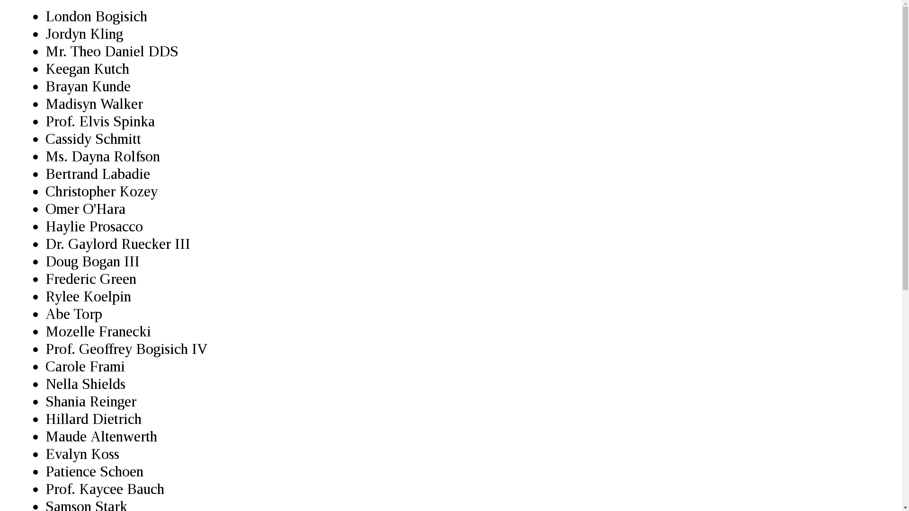

_A bare-bones users list._

- - -

### 7. Partners Do: Display User Details (20 min.)

* Open `php artisan tinker`.

* Run: `use App\User;`.

* Run: `User::find(1)`. Explain that this finds the user with an ID of one, and that you can the same method in the controller to display a specific user's information.

* Slack out the following instructions to students:

  * **Instructions**

    * Quickly create a `show.blade.php` that incorporates Bootstrap via CDN and yields a content block.

      * Bootstrap CDN: <https://www.bootstrapcdn.com/>

    * Create a template to display the user's name and email, given a user.

    * In your controller, find the method that your app will run when your visitors want details on a particuar user.

      * Hint: check the filename of the php file you just made.

    * In the method you found, save a user variable with an associated array of a specific user's information. Not as hard as it sounds! Just declare a `$user` variable and set it to the value returned from the `User::find()` method. To grab a specific user, just pass `$id` into this method. Whatever number $id equals will tell `User::find()` to grab the User with the same id and return an associative array with their information.

    * Once you save the user variable, render the view of your template like you had with `users.index`. Note that you will use the `with` method instead of `compact` to send data this type. Here's some quick info on the method: <https://laravel.com/docs/5.2/views#passing-data-to-views>

      * Use the second example listed in the "Passing Data To Views" section. Remember, your $user variable is an associated array, so you can pass the data to your view just as shown. Okay, so what can we do about that.

    * Serve your site. What URL do you need to hit to see a user's details? If you're not sure, run: `php artisan route:list`. What URL is associated with showing a user? What do you think the brackets represent, given the route method's parameter?

    * By this point, you should be able to It would obviously be best to be able to navigate to user details from the site itself.

    * Open `users/index.blade.php`.

    * Recall the URL to display a specific user's data. Wrap each name in a link that loads the detail page for its user.

    * Load your index page, and verify that everything works as expected.

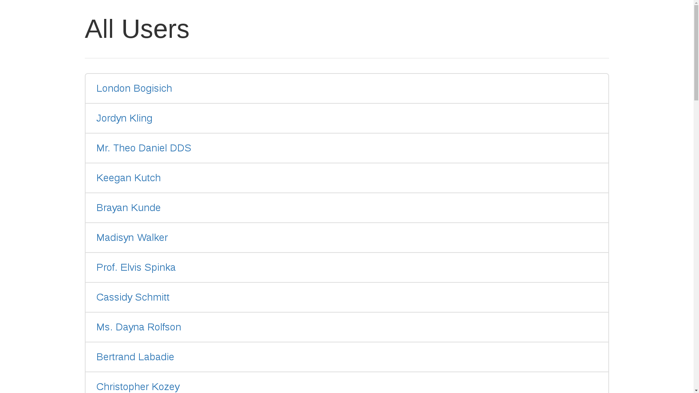

_A classic index page._

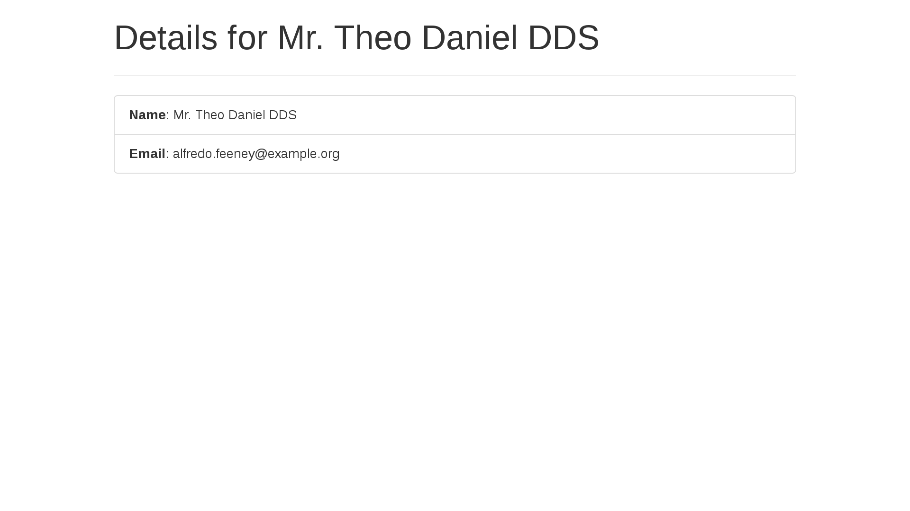

_A classic detail page._

### 5. Instructor Do: Review Activity (5 min.)

The finished files for this activity are in `14-User-Views/Solutions`.

* In `UsersController.php`, review how you retrieve a model: `User::find($id)`.

* Explain that the `$id` in the method is the number passed to the URL.

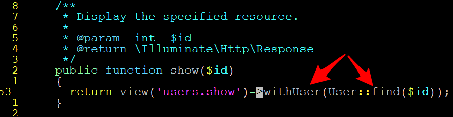

_Annotated controller._

* Next, open `resources/users/index.blade.php`, and demonstrate how to retrieve the user's id to link to their profile page.

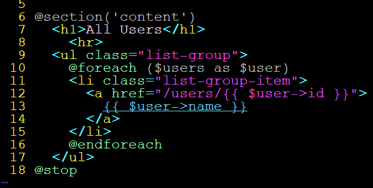

_Annotated index._

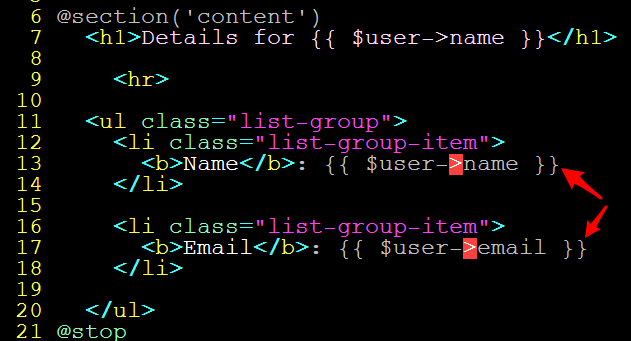

_Annotated profile._

### 9. Students Do: Update Users (20 min.)

* Explain that you update models by retrieving them, resetting their value, and saving them to the database again.

* Remind students that you save a model by calling its `save` method.

* Slack out the following instructions to students:

  * **Instructions**:

    * In your user detail template, add a button for visitors to edit the user's information.

    * Link this button to your `edit` method, which should direct visitors to a form where they can change your user's data.

      * To find the proper format for your button's URL, enter `php artisan route:list` in your terminal window and look for route named `users.edit`.

    * Create another blade template file. It should contain a form for your visitors to edit a user's information.

      * You will need to use the `PUT` RESTful method with your form. One issue: `PUT` lacks support from HTML support. Laravel has a work around, though—include the `method_field` helper inside your form, as shown in this site: <https://laravel.com/docs/master/routing#form-method-spoofing>.
        * Don't forget to include your `csrf_field()` helper, too.

    * In your UserController file, link your edit form to the `update` method. This method should bring in the request's name and email properties and save them to as properties for a `$user` object. Use the `save()` method on this object to update the user's info.

    * At the end of your `update` method, redirect your visitor to the user's detail page.
      * _Hint_: <https://laravel.com/docs/5.1/responses#redirecting-controller-actions>

### 10. Instructor Do: Review Activity (10 min.)

Solutions for this activity are in `15-Update-Users/Solutions`.

* Reassure students that it's okay if they didn't finish the entire activity.

* Explain that the `edit` method directs users to the form they use to update the model's information.

* The `update` method is where you implement the server-side logic to actually change the model's data.

* Explain the redirect call.

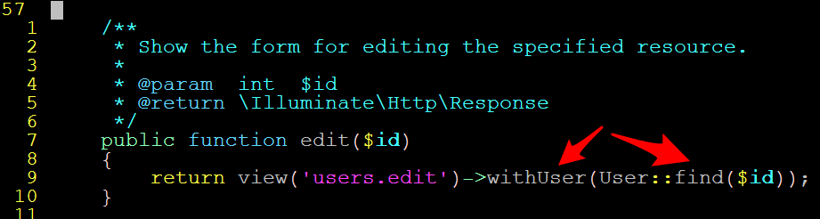

_The edit method._

* Explain the `withUser` syntax.

  * You can call a method called `withCLASS` on `view('template')`, and pass it an instance of CLASS. This is the same as passing `compact` with a single value.

  * You can use any class. Laravel will always figure it out.

  * Point out that you can chain `with` statements, as well.

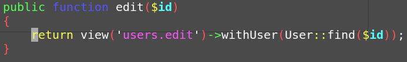

_The common withMODEL pattern_

* Open `resources/views/edit.blade.php`.

  * Ask students what they used for their form actions and methods.

  * Point out that your form action must be `/users/{{ $user->id }}`.

  * Explain that your form method must be `POST`, because browsers can only send `GET` and `POST` requests.

  * Explain that the `{{ method_field('PATCH') }}` function allows us to tell Laravel that we _want_ to sent a `PATCH` request, even though we're only allowed to send a `POST` request.

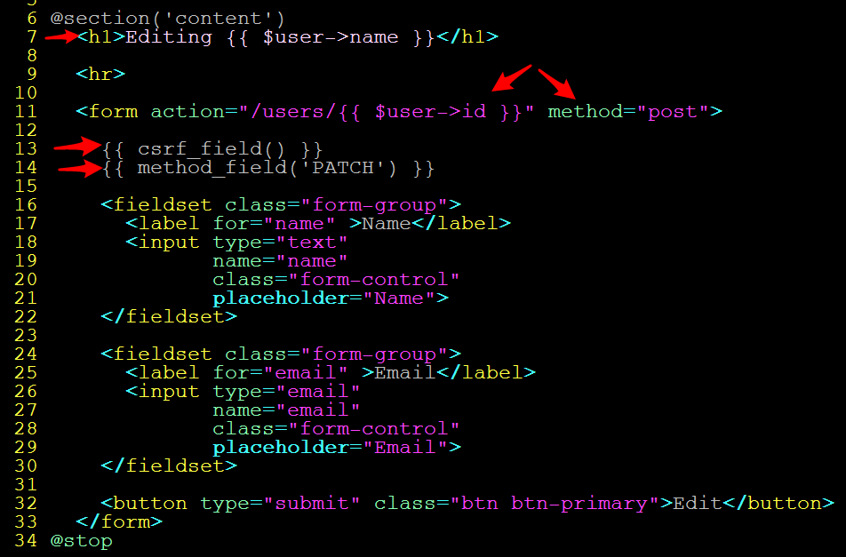

_edit.blade.php._

* This allows it to respond appropriately by calling your controller's `update` method.

  * Avoid confusing students with the difference between `PUT` and `PATCH` requests. The distinction is irrelevant. [Under the hood, Laravel treats the equivalently](https://github.com/laravel/framework/blob/be353964453ee0f750e6562419a32d387e8909f0/src/Illuminate/Routing/ResourceRegistrar.php).

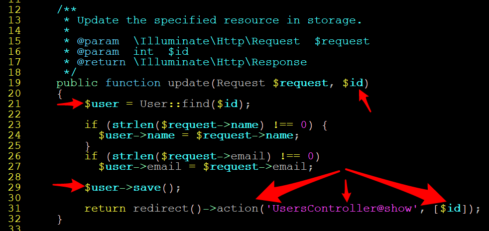

_Update method._

Slack out the solution ZIP so students have a working app on which to build the next activity.

- - -

### 11. Lunch (30 min)

- - -

### 12. Everyone Do: First Relationships (20 min.)

* The examples for this section are at `16-Snippets/Examples`.

* Point out that most sites require us to establish relationships between our data models.

  * Examples:
    * For the user's friends: Users -> Friends.
    * For a customer's shopping history: Customers -> Purchases.
    * For a course's students: Class -> Students.
    * So on and so forth.

* Laravel allows us to painlessly define these sorts of relationships.

* To demonstrate this, guide students through the process of saving Snippets: review cards that include useful code excerpts.

* Walk through these steps with the class:

  * Scaffold a Snippets model: `php artisan make:model Snippets --migration`

  * Update the Snippets migration to include a `text` field.

  * Update the Snippets migration to include a `user_id` field. Explain that this allows us to associate a Snippet with a User.

  * While you're at it, add a `snippet_id` column to the create_users migration.

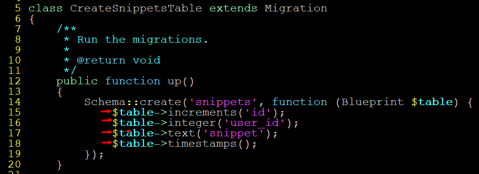

_Snippets migration._

* Refresh your migrations and seed your users again.

  * `php artisan migrate:refresh --seed`

  * We purposefully avoid updating migrations for the sake of expediency.

* Ask a student to describe the relationship between a User and a Snippet is.

* Open `app/Snippet.php`.

* Suggest that  snippet _belongs to_ a User.

* Explain that Laravel models these relationships as _methods_ on model classes.

* Explain that the name of the method is the name of the model you want to retrieve.

* Ask a student what method we'll want to define on Snippet if we want to get its User.

* Implement a `user` method.

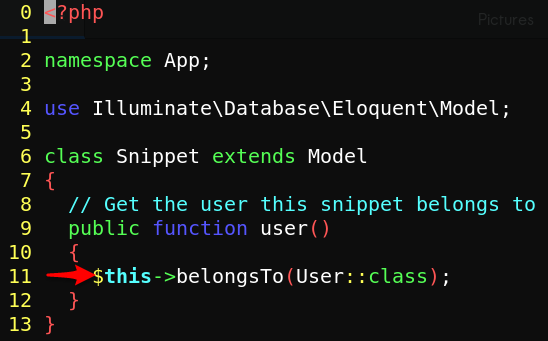

_Defining a belongsTo relationship on a Snippet._

* Explain that you define a relationship by saying:

  * `$this->relationship('Model's Class Name')`

* Explain out that `User::class` is just a way to get the string name of the User class.

* Point out that we don't need `use App\User` here.

  * This is because we have `namespace App` on line 3.

  * This lets us refer to anything in the folder `app` directly.

* Explain that defining the relationship on the Snippet allows us to get its user, but doesn't let us get  user's snippets.

* Open up `User.php`.

  * Ask a student what we should name the method that will allow us to get a user's snippets.

  * Ask a student what the relationship between a User and a Snippet is.

  * Define a snippets method.

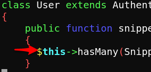

_A user hasMany snippets._

* Explain that, if a model X `hasMany` of some other model Y, then Y alwys `belongsTo` X.

### 13. Partners Do: The Snippets Feature (60 min.)

* The purpose of this activity is to give students more practice linking up MVC. It's important that students have ample time to work on this exercise, as it's very similar to their homework assignment.

* Make sure students are aware that they don't have to complete all of this exercise. You may consider slacking out each "task" one at a time, so that students don't get overwhelmed by the long instruction.

  * Keep in mind that the most important outcome is that **all students can complete the first task**. The second task is important, but to a lesser degree. The bonus is just that—extra.

* Slack out the following instructions to students:

  * **Instructions**:

    * **First Task**: Save snippets, and associate them with users.

    * Keep in mind you'll be creating snippets _only_ in association with Users.

    * Read Laravel's documentation on nested resource routes: <https://laravel.com/docs/5.1/controllers#restful-nested-resources>

    * Create and register a controller for your Snippets resource.

    * Open your user detail template.

    * Add a form that allows a user to save a code snippet.

    * In the relevant controller method, create and save a new snippet.

      * Be sure you can access the Snippet and User classes in your controller.

      * Note that your form action contains the user's ID. This allows Laravel to automatically provide you with the user in your `store` method. Changing its signature to the following allows you to access the user directly:

      * `store(Request $request, User $users`

      * It's crucial that you use the name `$users` for this kind of automatic resolution. Docs: <https://laravel.com/docs/5.2/routing#route-model-binding>

    * Create a new snippet.

    * Save the snippet to your user's list of snippets.

      * You have access to these snippets through the relation you defined on the model. How do you think you save a new snippet to it?

    * Redirect to the user detail page.


```
* **Second Task**: Retrieve user's snippets, and display them.

* If the redirection works, your snippet probably saved . . . But it would be better to display it to make sure.

* Display a message if the user has no snippets.

* Otherwise, update your user detail template to display all a user's snippets.

  * Wrap this in `<pre>` tags if you want it to look good.

  * Before you update your controller&mdash;do you have to?


* **Bonus Tasks**

* That list of snippets looks pretty slick. But it would be better with a title.

* Create a migration that adds a title column to the Snippet table. Make sure it's nullable.

* Add a button that allows users to delete snippets.

* Actually delete the snippets.

  * *Hint*: This isn't as easy s it sounds. Experiment, and discuss with your partner.
```

### 14. Instructor Do: Review Activity (10 min.)

The solutions to this activity are in `16-Snippets/Solutions`.

* This is a substantial activity, so focus on the "big picture".

* Review using a nested resource controller.

  * Explain that, by convention, this would be named `UserSnippetsController`.

  * Explain that we use dot notation in `routes.php` to indicate nested routes.

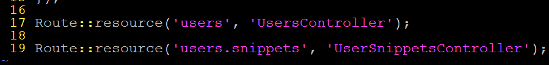

_Dot notation to implement nested routes._

* Open `UserSnippetsController.php`, and explain `store`.

  * Point out that Laravel thinks of our URLS as taking the form:

    * `/users/{users}/snippets/{snippets}` ... Where the brackets indicate an ID.

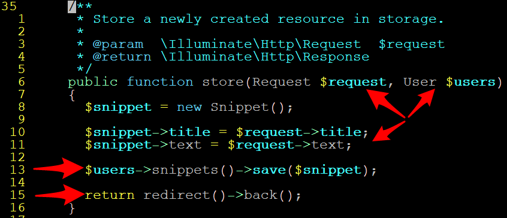

_route/model binding in UserSnippetsController._

* When we `POST` to the `store` method of `UserSnippetsController`, we have the user id from the URL (`{users}`).

* By passing `User $users` to `store`, we tell Laravel that we want it to find the User whose ID is the value of {users}. For this to work, we have to name the varible `$users`, to match Laravel's default URL forms.

* Spend the remainder of the block answering student questions.

* Slack out the solution ZIP and encourage students to review it.

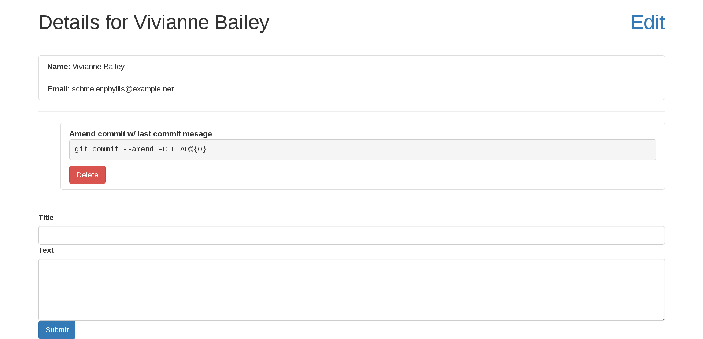

_The completed snippets page, with mocked-up delete buttons._

- - -

### Lesson Plan Feedback

How did today's class go?

[Went Well](http://www.surveygizmo.com/s3/4325914/FS-Curriculum-Feedback?format=ft&sentiment=positive&lesson=11.02)

[Went Poorly](http://www.surveygizmo.com/s3/4325914/FS-Curriculum-Feedback?format=ft&sentiment=negative&lesson=11.02)
