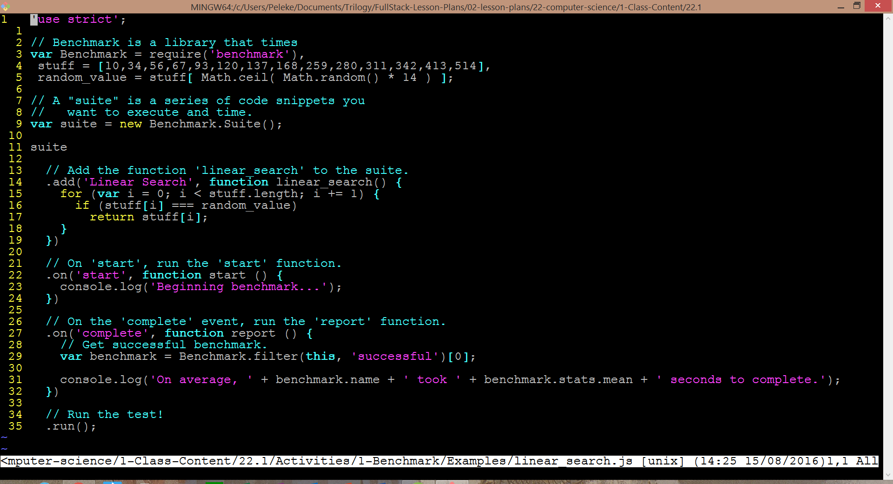
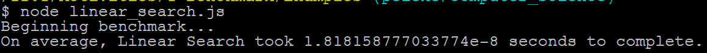
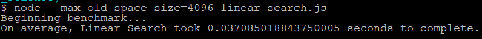
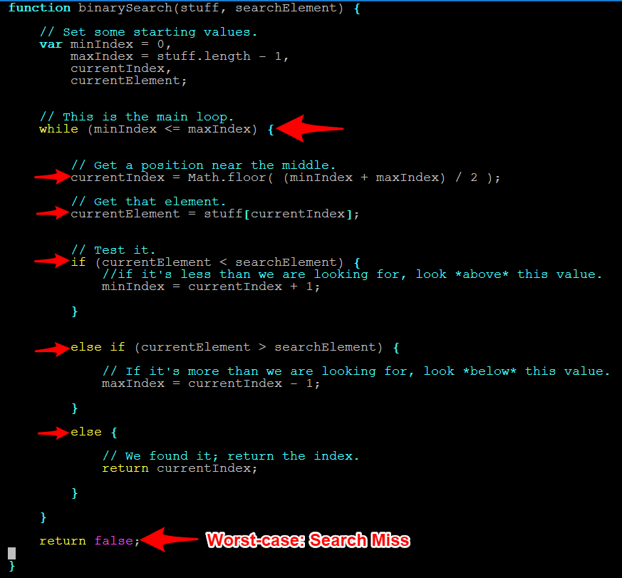

## 11.3 Lesson Plan - Final Projects (10:00 AM) <!--links--> &nbsp;  &nbsp; [➡️](../04-Day/04-Day-LessonPlan.md)

### Instructors and TAs: Please take the End-Course Instructional Staff Survey

Trilogy as a company values transparency and data-driven change quite highly. As we grow, we know there will be areas that need improvement. It’s hard for us to know what these areas are unless we’re asking questions. Your candid input truly matters to us, as you are vital members of the Trilogy team. In addition to the individual feedback at the end of lesson plans
we would appreciate your feedback at the following link:
[https://docs.google.com/forms/d/e/1FAIpQLSdWXdBydy047_Ys1wm6D5iJY_J-0Mo0BqCjfGc4Er2Bz9jo5g/viewform](https://docs.google.com/forms/d/e/1FAIpQLSdWXdBydy047_Ys1wm6D5iJY_J-0Mo0BqCjfGc4Er2Bz9jo5g/viewform)

### Overview

Today, you'll prime your students to conceptualize their final projects. You'll run down the list of expectations and requirements for each of their weekly deliverables. Aside from that, you and the TAs will stick around to make sure each team has a solid idea for their project--they should have one by the end of the class.

`Summary: Complete activity 7 in Unit 21`

##### Instructor Priorities

* Students should know all of their responsibilities for the final project.

* Students should come out of class with a high-level grasp of how their app will function--what does it do and what problem does it solve?

##### Instructor Notes

* You should grill students about their ideas. Make sure they don't settle on anything too simplistic or too unrealistic. Their app should fall just slightly above their collective skill level--this will help them grow as developers.

* Keep a list of every group's planned app. Make sure that you wrote down each team's concept before you dismiss the class.

* Students should complete the React Checkpoint.

- - -

### Class Objectives

* To make sure students know exactly what they have to accomplish each week for their final projects.
* To spur students to figure out what their apps will do.
* To complete the React Checkpoint.

- - -

### 1. Final Project Time (75 mins)

* Say your usual hellos and answer any questions your class might have about past material.

### 2. BREAK (30 mins)

### 3. Students Do: Students Research "Algorithm" (10 min)

* At the start of class, welcome students then have them research definitions to the word "algorithm". Specifically, have them answer the following questions:

```
* What is an algorithm?

* What are some examples of common computer science algorithms?

* How do you determine if one algorithm is better than another?
```

### 4. Everyone Do: Students Share Responses (5 min)

* Students share their responses. Instructor listens with bemusement.

### 5. Instructor Do: Algorithm Definition (10 min)

* Choose your own definition or use the one below:

> An algorithm is a set of steps to solve a problem or perform a calculation.

* Then mention that we've been using algorithms all along.

* Algorithms can be as simple as breaking down the steps to create a PB&J Sandwich to more complex tasks like creating random number generators, looping through arrays, or optimizing a search engine's results.

* The study of algorithms thus has to do with finding new ways to solve the same problems, more efficiently—and with better handling of "scale".

### 6. Students Do: Simple For Loop Search (10 min)

* Have students complete the following task:

* **Instructions:**

  ```javascript
  var stuff = [10,34,56,67,93,120,137,168,259,280,311,342,413,514];

  var random_value = stuff[ Math.floor( Math.random() * 14 ) ];
  ```

  * Write a `for` loop that looks at each index of the array to see if it matches the random value

  * If it does match the random value display an alert box with the index of the array and the value

### 7. Instructor Do: Review the solution to the previous problem (10 min)

* Open up `0-Benchmark/Solutions/linearSearch.js`.

* Explain that this is an example of a "linear search".

* Explain that, if we double the length of the array we're searching, we double the amount of time it takes to search. If we triple the length of the input, we triple the amount of time it takes...Etc.

* Explain that this is why it's called linear: Any increase in the size of the input array implies a _linear_ increase in the amount of time we have to wait for the algorithm to finish.

* [Show this visualization](https://www.cs.usfca.edu/~galles/visualization/Search.html) to help students see what's going on, and to prompt questions.

* Ask students to calculate the minimum and maximum number of iterations it would take to find the random number.

  * Answer: Minimum: 1; Maximum: 14.

* This isn't a big deal for data sets this small. Today's computers are able to perform such a search almost instantaneously.

* In fact, let's time it.

### 8. Students Do: Time The Search (3 min)

* Explain that there are ways to determine precisely how long it takes to execute a piece of code.

* Explain that [Benchmark.js](https://benchmarkjs.com/) is one such timing library.

  * Explain that _benchmarking_ is the practice of testing how long an algorithm takes to run.

* Briefly describe Benchmark's functionality. Explain that it:

  * Executes a piece of code several times, so it get an accurate picture of how long it takes to run on average;

  * Automatically determines how many times to run the code to calculate statistics;

  * Provides details such as standard deviation/variance, etc.

* Open up `01-Benchmark/Examples/linearSearch.js`, and briefly explain the points below.



_Major methods of Benchmark.js._

* Zip and Slack out `01-Benchmark`, and instruct students to unzip the archive.

  * This includes Benchmark and its dependencies, so we don't have to waste time creating an NPM project, installing dependencies, etc.

* Explain that we won't use most of Benchmark's methods, and that it's fine if students don't remember all the details (e.g., the logic inside the `on('completed'...)` method; event names; etc.).

  * What matters is that they understand that **Benchmark times code**.

* Explain that, as developers, we will always be eminently interested in the **amount of time an algorithm takes to run**. Benchmarking allows us to determine, objectively, **which algorithms take the least time** in certain cases.

* Have students run `linearSearch.js`. Call on a few students to share their benchmarks. Sample results from my machine are below.



_Results of running benchmarks on a Dell Envy w/ Intel i7 2.7GHz and 16Gb RAM._

### 9. Instructor Do: Time a MUCH LARGER Search (3 min)

* Reopen `linearSearch.js`, and change the value of `length` to `1000000000`.

* Have students explain the difference between this code and the old code. Ask a couple of students if this code should be faster; slower; or just as fast as the previous code. Why?

  * Essentially, the only difference is we've _increased_ the number of elements in our array, which _decreases_ the probability we'll find our `random_value` in any given iteration.

  * This code should take longer to run, because there's a lower chance our loop will find the right number on each iteration.

### 10. Students Do: Time The Search (10 min)

* Now have students re-time their search. Their old code will work for this example as well.

  * Sufficiently large values of `length` will cause `heap size exceeded` errors. If/when students run into this, have them run the benchmark with the following command:

    * `node --max-old-space-size=4096 linearSearch.js`

```
* Explain that this increases the amount of space available for the Node process.

* Alternatively, they can simply reduce `length` until the error disappears. They'll still get a big enough value to illustrate that this code takes longer.
```

* Point out that now the code starts to take longer, and now we're beginning to see the limitations of our "linear approach".



_Results of running benchmarks on a Dell Envy w/ Intel i7 2.7GHz and 16Gb RAM._

* Ask students the max number of steps (or instructions) it would take to solve this.

  * Answer: 1000000000, or `length`.

### 11. Everyone Do: How Could We Improve? (12 min)

* Explain that, as developers, our primary concerns are choosing the algorithm that runs most quickly.

  * Feel free to mention space efficiency, as well. Be aware that we have no exercises for space efficiency, so don't get too sidetracked if you decide to mention it.

* Point out that we've discussed two ways to sort a list.

* Emphasize that this demonstrates that there are often multiple approaches to solving the same problems.

  * Explain that some of those approaches are better than others, depending on the problem we're trying to solve.

* Have students try to pseudocode or research a better approach.

  * Students shouldn't be coding at this point—simply thinking of ways to come up with a better solution.

### 12. Students Do: Binary Search (12 min)

* Have students research the concept of "binary search".

* See if they can create their own method for creating a binary search based on their reading. They may find binary searches in other programming languages—or simply abstractly, allow them to try and create a binary search on their own.

### 13. Instructor Do: Binary Search Revealed (15 min)

* Explain binary search by analogy to finding words in a dictionary.

  * When looking for the word, say, _diaphanous_, one might open the dictionary to a random page, and see which section of the dictionary they end up in.

  * If they opened to the section for the letter H on page 100, they know to only look in the portion of the dictionary to the _left_ of page 100, and ignore the entire chunk of pages to the right.

  * Proceeding in this way allows them to quickly find the word they're looking for by discarding large, irrelevant portions of the search space.

* Open up `02-Binary-Search/Examples/binarySearch.js`, and walk students through its essential steps.



_The essential steps of the binary search algorithm._

* [Show this visualization](https://www.cs.usfca.edu/~galles/visualization/Search.html) to help students see what's going on, and to prompt questions.

  * [Visual Go](http://visualgo.net/bst) has another beautiful animation, which you may prefer to use.

* Point out that what makes this code effective is that we pre-sort a list of numbers in a range. Then, in each round, we check if the number we're trying is less than or more than the random number. Based on that we can effectively "halve" the number of options we still need to try.

* Ask when this code might be less efficient.

* Answer: Large, unsorted lists, which we would first have to sort and then search (O(n log n)). In this case, direct linear search is faster (O(n)).

```
* Of course, in practice, the one-time cost incurred by sorting might be worth it to enable algorithms that assume sorted input.
```

* Point out that binary search is _fast_. If we double the size of the input array, it will take longer, but it will _not_ increase by a factor of two.

* Point out that this is an example of a non-linear time complexity.

* For the curious, feel free to point out that binary search is O(log n).

```
* Reassure less confident students that this isn't a crucial detail at the moment.
```

### 14. Students Do: Sorting By Hand (5 min)

* Start a stopwatch...

* Then slack out the following numbers to students.

* 201, 39, 54, 461, 93, 377, 413, 176, 164, 317, 109, 113, 36, 235, 17, 60, 53, 474, 257, 48

* Have students spend the next five minutes sorting the numbers in ascending order (without using any code).

* When students are done have them raise their hand and slack you when they are done.

* Call time on your stopwatch when the first one finishes.

### 25. Everyone Do: Sorting Strategy (10 min)

* Have the student who finished first share their approach to the sorting process.

* Specifically, how did they approach the following:

* Where did they start in the list?

* What did they do with the first number?

* How did they handle the comparison of numbers?

* Did they just go in a straight line down the list?

* Would they approach the problem any differently if they were given 200 numbers instead?

### 16. Instructor Do: From Mind to Machine (15 min)

* Explain that an algorithm is simply a systematic set of steps that accomplish some goal.

* Convey that this process of breaking down the steps associated with a complex process is really the heart of algorithm development.

* Then convey that as an algorithm developer, you will have to look at the same steps and try to think of the most efficient ways for a computer to iteratively tackle the problem.

### 17. Instructor Do: Introduce Checkpoint - React (5 min) (Critical) 

* Let your class know that they will now be taking a short multiple choice assessment to check their understanding of React

* DO NOT SKIP THIS INTRODUCTION. DO NOT JUST SEND OUT THE LINK WITHOUT CONTEXT

* Reassure the students that they need not be nervous about the Checkpoint:

  * "This will not affect your grade or graduation requirements."

  * "This is not like the tests and quizzes you might be used to from school or college. The purpose of these tests is not to motivate you to study or punish you for struggling."

  * "This is as much a test of me as an instructor and of the course content as it is of you. We are here to ensure your success, and this is one of the tools we use to make sure we are doing that effectively. This class moves _fast_, so if some or all of you misunderstand something important we as an instructional team need to find out as fast as possible so we can help."

  * "Long story short, this quiz can not hurt you. Only help you."

* Let students know that they should read carefully and focus on thinking about the right answer rather than using any test-taking skills they may have learned:

  * "There are no silly answers or obvious throwaway responses on this quiz, because those kinds of answers reduce the likelihood that we'll be able to figure out whether we've taught something effectively."

  * "Test taking strategies you may have learned for standardized tests _will not work_, so instead of focusing on eliminating wrong answers or looking for sneaky context cues, read the question and each of the possible choices carefully."

* Reassure students once again that the purpose of this is to help them, and remind them that the outcome does not impact their grade or graduation requirements. You should do this _every single time_ you give an Checkpoint.

* You or your TAs should now get the link specific to your class:

  * Navigate in your browser to: `https://www.switchboard.tech`

  * Select your class code (if it doesn't show up on its own)

    * For parallel cohorts (two classes combined on a Saturday) and doing a Checkpoint: You will **need** to select the classes in your cohort. You can multi select the cards by clicking the class that you need.

    * The class roster will be in the **one** link.

  * Select the Checkpoint and copy the resulting link.

### 18. Students Do: Take Checkpoint - React (10 mins) (Critical)

* Slack out the link to the Checkpoint

* Let your students know that once they select their name, it will take them to the Checkpoint

* Checkpoints must be completed in class, **not at home**, to ensure you will be able to effectively find and help struggling students 

* TAs should walk around the class to ensure students aren't looking up answers

* Keep in mind we do not use grades from assessments toward graduation requirements. However, students will be tempted to avoid feeling like they don't understand something.

* It's important for instructional teams to create an environment where it is safe to fail, but also where such failure is visible. You should not be worried about "cheating" on checkpoints, only making sure that students who need help aren't remaining invisible.

* Your SSM will have the results of the Checkpoint within an hour of its completion

### 19. End (0 mins)

### 20. TAs Do: Structured Office Hours - Review React (30 mins)

* Navigate in your browser to: `https://github.com/coding-boot-camp/checkpoint-bank/blob/master/checkpoints/multiple-choice/10-React-MC/10-ES6-React-MC.md`

* There you will find the questions and answers to the Checkpoint given.

* Please take the entire office hours time to review the questions with the students.

* Suggestion Format:

  * TAs ask a question at a time to the class.

  * Let the students try to answer it.

    * If you see that a majority of the class has a misunderstanding with a question:

      * Take your time on this question!

    * If you see that a small number of students has a misunderstanding with a question:

      * Do your best to reinforce the misunderstanding but be cautious of your time.

      * Make note of the students that are still struggling with the question and schedule a 1:1 with the students.

  * If applicable, demo the answer.

* Take your time on these questions!

* This is a great time to reinforce concepts and misunderstandings!

### Lesson Plan Feedback

How did today's class go?

[Went Well](http://www.surveygizmo.com/s3/4325914/FS-Curriculum-Feedback?format=ft&sentiment=positive&lesson=11.03)

[Went Poorly](http://www.surveygizmo.com/s3/4325914/FS-Curriculum-Feedback?format=ft&sentiment=negative&lesson=11.03)
