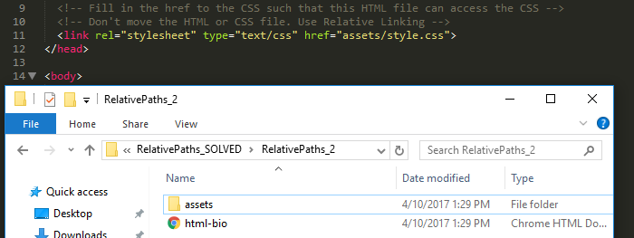
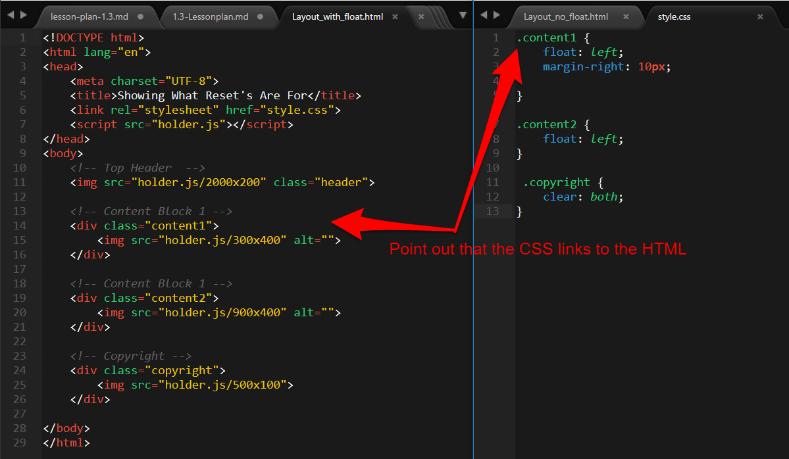
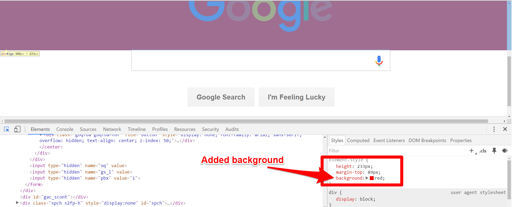

## 1.3 - Heroes of CS (10:00 AM) <!--links--> &nbsp; [⬅️](../02-Day/02-Day-LessonPlan.md) &nbsp; [➡️](../../02-Week/01-Day/01-Day-LessonPlan.md)

### Overview

In today's class, we'll be covering the bulk of CSS layout and positioning techniques. We'll also be touching on relative file paths.

`Summary: Complete Activities 7-11 in Unit 01`

##### If you’re teaching a part time section and this isn’t a Saturday, please use the “Weekday” tab inside of the "03-Day-TimeTracker.xlsx" for activity lengths instead of those printed on this lesson plan

##### Instructor Priorities

* Students should become fairly comfortable linking CSS files to HTML files using relative file paths in various directories.
* Students should have a working knowledge of the terms "float", "box model", and "CSS positioning."
* Students should gain initial exposure to working with CSS to build wireframe layouts.
* Students should be motivated to stick through the class.
* Students should complete the Bash Checkpoint.

##### Instructor Notes

* Welcome to your first Saturday class! Not to unnerve you, but today is one of the most challenging class sessions you'll have in the entire program. There's a lot to cover, it's easy to get side-tracked, and students' nerves are running high.

* In this class session we'll be providing students with a deep dive into CSS positioning and layouts. Many of the concepts and exercises will be frustrating to students, and it will be your responsibility to continually remind them that these concepts will start sticking over time.

* In order to keep motivation high, we're suggesting you use the following approach for the more challenging exercises. As students complete the exercises, they should message the TA. The TA will then call on the class and ask, "Who needs help?" The TA will then send the student who is done to the student in need. As an instructor, let all students know that being able to help fix others' bugs is a big part of being a good developer. 

* If there is time and you see a need, you may even want your TAs to share their own experiences learning HTML/CSS for the first time. Have them offer context on how long it's taken to feel competent.

* **Important to note**: At this point in the program, students can still drop at no cost to themselves, making this period an ultra-critical one. Make sure students feel motivated. If you or a TA see any student getting visibly frustrated, direct message them and try to offer extra support.

* **Also Important**: Remember to update the admin slides with the correct due dates for your class.

* Have your TAs reference [03-Day-TimeTracker](03-Day-TimeTracker.xlsx) to help keep track of time during class.

### Sample Class Video (Highly Recommended)
* To view an example class lecture visit (Note video may not reflect latest lesson plan): [Class Video](https://codingbootcamp.hosted.panopto.com/Panopto/Pages/Viewer.aspx?id=e35f9175-fdf3-4efe-9921-87a1c808c360)

- - -

### Class Objectives

* To become comfortable working with HTML relative paths 
* To engage in a deep dive of HTML/CSS for layout design and element positioning
* To complete the Bash Checkpoint.

- - -

### 1. Instructor Do: Welcome + Admin Tasks (Slides) (3 mins)

* Open the [Powerpoint Heroes of CSS](Slide-Shows/). 

* Welcome students back to class and flip through the Admin slides. 

* Remember to update these slides with the correct repo links and due dates for your class.

* Be sure to encourage students to submit something for the homework assignment, even if it's not great. The point is to get in the habit of submitting. Also... it's mandatory to receive career services that they miss no more than two.

### 2. Instructor Do: Warning Monologue + Student Questions (Slides) (5 mins)

* Start today's class by first warning them in advance that today's class is going to be **hard**. Let them know that what makes today's class hard isn't anything deeply confusing conceptually but that it will be hard because it's so unfamiliar.

* Offer something like the below monologue (or your own variant):

  > Remember, learning is "FRUSTRATING." You're not behind if you don't get all of this today. The point is to take in as much as you can now. Get immersed, and then push yourself on the homework assignment. It won't click for many weeks. But trust us. Looking back, it WILL CLICK far more quickly than you'll believe. 

### 3. Instructor Do: CSS Recap (Slides) (5 mins)

* Quickly recap the concepts behind CSS. 

* Have students answer any questions on screen to those closest to them. (Get them comfortable with helping one another.)

* The point here is to just give students a refresher. Let them know we will be building our CSS skills for the next few weeks so there is plenty of time to get good at it. 

### 4. Instructor Do: Relative File Paths Slides + Demo (10 mins) (Critical)

* Flip to the slide on Relative File Paths and point out to students how we've been referencing external CSS stylesheets. 

* Have students remind you what an external CSS stylesheet is before proceeding. 

* First open the HTML file `html-bio-with-css.html` that is inside of the folder `07-RelativePaths-Activity/RelativePaths_DEMO` in your browser. Show students what the styled site looks like.

* Then open the same file in your editor.

* Point out to students again that the href needs to be able to "see" the CSS file and that href is like our "map" to where the file is. 

    

* Then move the CSS file into a folder called `assets`. Refresh the page in the browser and point out that the HTML page no longer knows where the CSS file is.

* Fix the href link in the HTML to include the new assets directory. Refresh the page again and show students that this time it worked.

* Also explain that there are other instances in which we'll need to use relative paths to direct ourselves to resources—it may be images, PDFs, javascript files, etc. So it's important to get a handle on how relative paths work. 

* Then flip to the next slide that talks about absolute file paths and explain that they are BAD because no other viewer of your HTML/CSS will be able to access those files. (The paths won't make any sense on the web.)

### 5. Groups Do: Relative File Paths Activity (12 mins) (Critical)

* Answer any questions students have. 

* Zip and Slack out the following folder to students:

  * **Folder:**

    * `07-RelativePaths-Activity/RelativePaths_UNSOLVED`

  * **Instructions:**

    * Unzip the folder provided to you (or copy and paste the contents outside).

    * Then modify each of the four `html-bio.html` pages such that they can access the CSS inside their folder. Don't move the CSS file, and don't move the HTML file. 

    * Use relative linking to make it work!

    * Hint: If you need some reading material on relative linking you can use <https://css-tricks.com/quick-reminder-about-file-paths/>.

    * If you finish early, help out those around you, or begin reading through the Learn CSS Layout Guide found here: <http://learnlayout.com/no-layout.html> 

### 6. Instructor Do: Review Relative File Paths Activity (10 mins)

* Review each of the Relative File Path examples. You can use the `RelativePaths_SOLVED` folder to quickly show solutions if you prefer.

### 7. Instructor Do: Box Model (Slides) (10 mins)

* Using the slides shown as a guide, introduce students to the concept of the box model. In explaining the box model you can just read the text on the slide. 

  > In CSS, every element can be considered to fit within a series of boxes. Each box can be individually adjusted to provide spacing between elements or to fill in elements with colors.

* Point out that the box model applies to all elements whether they are text, images, div sections, etc. 

* Let them know that this concept is important.

### 8. Students Do: Box Model Activity (10 mins) (High)

* Then show them the Activity slide and have them tally up the total height and width of the boxes as described on the screen.

* Let them know to calculate it both ways, including margins and not including margins.

* After a few minutes show the slide with the answers. 

### 9. Instructor Do: We Be Floatin Slides + Demo (15 mins)

* Next, return to the slides and proceed to walk through the slides on floats. Warn them that floats are the stuff of demons.

* Begin by describing to students the concept of "flow." If you need help articulating the concept you can use the below:

  > Flow is the idea that every single element—text, images, links, sections, etc.—all take up a set amount of space on the screen. These elements, by default, won't stack on top of one another so instead they have to find ways to "flow" around one another. A big part of CSS is in managing how elements will fit into this flow.
  >
  > Unfortunately there is no "drag-and-drop" in web development just yet, and the tools that exist to do so often produce terrible code. So, as developers, we do NEED to learn this stuff at least at a basic level.

* You can analogize flow to Microsoft Word's word-wrap.

* Flip through the slides on Block Elements vs. Inline Elements, Floating, and the ClearFix Hack. In your explanations, do the following:

  * Mention that **block level** elements take up entire lines, whereas inline can fit adjacently.

  * **Float** "forces" elements to the side you specify.

  * **Clearfix hack** creates alignment between two sections (a bit more advanced).

* Then when you see the slide that says Quick Demo, talk about how all web layouts effectively begin as wireframes like this one.

    

* Point out how, in the next slide, we have a very simple version of the layout using image blocks.

* Then proceed to open up the HTML file `layout-no-float.html` in your editor. Point out how the site is just simply a series of images inside of `divs`. 

* Then open the file in your browser to showcase that, by default, each of the `divs` stacks on top of the other. 

    

* Talk about how we need to use `floats` to force our images next to one another.

* Next, open the file `style.css`. Make sure to have this file side by side with the HTML file you just showed. Point out how the elements are applying specific css styling to the `divs` (i.e. the sections) of the page. See if there are any questions about `divs`. Let students know that we will talk more about them next class but that they are very important when dividing up a page into "sections."

    

* Then either edit `layout-no-float.html` so it uses the new `style.css` file or just open `layout-with-float.html` in your browser. Point out how the site now displays the layout correctly.

    

* Slack out all of these files when done.

* Then point students to the reference for learning more about floats in layouts.

### 10. Groups Do: Float Activity (30 mins) (High)

* Next, present the layout students will be building in the next activity (on slide). 

  

* Then Slack out the below files and instructions:

  * **Files:**

    * `floats.html` (inside `09-FloatLayout-Activity/Unsolved`) 
    * `floats.css`  (inside `09-FloatLayout-Activity/Unsolved`) 
    * Screenshot of the desired layout (from slide)

  * **Instructions:**

    * Introduce yourself to your Breakout room groupmates.

    * Then using `floats.html` and `floats.css` as a starting point, work together to create the missing CSS necessary to form the layout shown to you on screen. 

    * This will not be easy so work at it as best you can. This is a challenging activity. At the very least, try to increase your understanding of CSS properties.

    * Hint: Concentrate on first figuring out how to create the boxes. Think about using background colors (CSS property: `background`). 

    * Hint: We've provided the styling you need for the header element. Use this as a starting point to style the others. 

    * Hint: You will need to apply each of the following CSS properties at least once:

      * padding

      * margin

      * background

      * float

      * width (read up on width by percents)

      * color

      * clear

      * overflow

      * height

      * font-size

      * line-height

    * If you finish early Slack the TAs or raise your hand to call their attention. TAs will reassign you to help others in the class.

* **Instructors/TAs:**

  * This activity is purposefully challenging. Make sure students are working in groups. 

  * Pay attention to groups that are further behind and have groups that finish early attempt to help them. Folks should feel comfortable getting out of their seats to help one another.

### 11. Instructor Do: Review Float Activity (10 mins)

* Review the activity. In reviewing the activity, you can use the image below as a guide.

  

* Key things to point out:

  * The use of `background` color with `padding` creates "filled boxes."

  * The use of `margin-top` creates spaces between elements.

  * The use of `float` specifies which side the element should move towards.

  * The use of `width` specifies how much of the screen an element should take up.

### Instructor Do: Slack out the Video

* Today we are going to really be pounding in the existence of the video walkthroughs as there are three key assignments and thus three videos for those assignments.

* Once again emphasize to your class just how important/helpful these videos can be for reviewing old material and catching up with new material. They will be a HUGE tool in their arsenal for understanding the course's content.

* Slack out [Lesson 1.3 - Floats in CSS](https://www.youtube.com/watch?v=0lpxKw6E90Y).

- - -

### 12. BREAK (40 mins)

* During Break Instructor and TAs should re-sync regarding the schedule, and adjust as necessary. 

- - -

### 13. Instructor Do: CSS Positioning Slides + Demo (15 mins)

* Go through the slides on CSS Positioning one by one. 

* Point out the differences between the various position types:

  * `relative`: Positions elements relative to their static location in the document. These elements behave with and interact with other elements the same way they would as if they were positioned statically, except that you can use the `top`/`right`/`bottom`/`left` properties to move the elements _after_ they have been placed into the document flow.

  * `absolute`: Positions elements relative to the nearest positioned ancestor (non-`static`). They are taken out of the flow of the document, taking up no space when placing other elements. These elements will move in the viewport as you scroll (unlike fixed).

  * `fixed`: Positions elements relative to the top left of the browser window. Similar to `absolute`, except the containing block is the whole viewport. These elements will remain in the same place in the viewport as you scroll.

  * `z-index`: Allows us to position elements on top of one another.

  * `display: none`: Allows us to hide specific elements from the view. Useful because it can activate and deactivate elements. (Compare with `visibility: hidden;`, which also hides elements but not the space they take up.)

* When prompted for the `Demo Time`, open the file `main.html` (`10-CSS_PositionedLayout`) in both the browser and in your editor.

* Point out that this currently uses static (default) positioning. 

    

* Then go through the process of changing the active stylesheet so that each of the other forms of positioning are used. 

* If asked about the `reset.css`, feel free to say something along the lines of 

  > We'll talk about the reset more in the next class, but for now just know it makes it so that the default browser `padding`s and `margin`s don't exist (that way we can more easily see the effects of positioning).

* Show students both the CSS used and the impact on the HTML.

  

  * Demo that `top`, `left`, `bottom`, and `right` only work on positioned elements, not static ones. You can demonstrate this by using chrome dev tools to set `position: static;` on one of the boxes.
  * Point out also that the elements following the relatively positioned elements (boxes 2-4) behave as if box 1 were in its static position. Explain that this is because `top`/`right`/`bottom`/`left` properties are applied only _after_ the element has been placed in the document flow.

  

  * When discussing absolute positioning, demo removing the `position: relative;` in-browser with the developer tools. Show them that it will absolutely position based on the nearest positioned ancestor, using the viewport as the basis if none of the ancestors are positioned (demo this by removing the positioning on `.box-set`).
  * Depending on time, You may also want to show how the elements pile on top of each other if you remove the `top`/`left`/`bottom`/`right` properties - this demonstrates that the elements are removed from the flow of the document.
  * `absolute` is worth spending a little bit more time on, as it arguably the most complex (and sets the tone for `fixed` positioning)

  

* Slack students the entire folder (zipped) when done with this activity. 

### 14. Groups Do: CSS Positioning Activity (30 mins) (High)

* Introduce the next activity. Either by using the slide or by opening the file `positioning.html` (`11-CSS_Positioned_Activity`) in the browser, show students what they will be building in the next activity.

  

* Then Slack out the following instructions.

  * **Instructions:**

    * Make sure each member of the group is typing out their own code but one person sharing their screen!

    * Create a file called `positioning.html` and a file called `positioning.css`. 

    * Using HTML/CSS, create the layout shown on the screen.

    * For reference, the colors used on the screen are `#eee` and `#999`.

    * For further reference, you can generate paragraphs of lorem ipsum text using <http://www.lipsum.com/feed/html>. You need to make this page scroll to see how the fixed position element behaves.

    * HINT: Use the code from the last few activities to help get you started.

### 15. Instructor Do: Review CSS Positioning (10 mins)

* Discuss the solution from the previous activity. When appropriate, have students help explain code back to you. (Example: You may ask students to help you comment various pieces of the code.)

* Key points in describing the HTML:

  * How we created a `div` to hold our content. 

  * How we created `divs` to hold the `fixed`, `relative`, and `absolute` content. 

  * How we used specific `id` tags to attach the CSS to.

     

* Key points to explain in describing the CSS Solution:

  * How we once again used **border-box** (this just means that the width and height won't include the margin. Not a big deal).

  * `#fixed` element has a position of `fixed`.

  * Wrapper has a set `width`.

  * `#relative` and `#absolute` have the relative position values. 

     

* See if there are any lingering questions. Then Slack out this solution. Let students know to try and re-practice this activity at home. It's a good one.

### Instructor Do: Video Guide Emphasis

* Re-emphasize all of the reasons why the video guides could be of use for the students, and also let them know that you will be Slacking out a complete "Video Guide" after today's lessons. That way they have an easy way to access the videos.

* Slack out [Lesson 1.3 - Positioning in CSS](https://www.youtube.com/watch?v=sHfJn0jqBro) and [Lesson 1.3 - CSS Positioning Layout](https://www.youtube.com/watch?v=yWXgnQaWSW0).

### 16. Instructor Do: Intro to Chrome Inspector (10 mins)

* Finally go through the process of explaining to students how to use the Chrome Inspector. Encourage them to follow along.

* Visit www.google.com. Then right click on the screen and hit "Inspect." 

* Then click the Element Selector and begin clicking on elements on the page. Show students how this then highlights the relevant HTML/CSS.

* Then show them that you can change any element on the page. As an example, try to change the HTML text inside of the `Google Search` button to something else.

    

* Then show them that you can also change the CSS as well using the style pane.

    

* Let them know that this is a powerful tool for developing your own websites and for understanding how other websites work.

* Let them know that we will be using Chrome Inspector much more in the classes to come. 

* Ask if there any questions.

### 17. Instructor Do: Recap + Questions (5 mins)

* At the end of the class, instructors should offer an overarching perspective on what was covered. As a bullet list you could use the following:

  * Today we covered the basic gist of how to use CSS to create position + layouts.

  * If you're feeling lost, don't worry. It's normal. At the very least, you should feel more comfortable attaching CSS to specific elements. Don't worry if you can't create CSS layouts off the top of your head just yet. It comes with time. 

  * But if you know how to attach CSS to a class, id, or header, you should feel pretty proud of yourself. 

  * Trust us in saying that, by the end of the class, you will surprise yourself by how much you know.

### 18. Instructor Do: Introduce Checkpoint - Bash (5 mins) (Critical)

* Let your class know that they will now be taking a short multiple choice assessment to check their understanding of Bash

* DO NOT SKIP THIS INTRODUCTION. DO NOT JUST SEND OUT THE LINK WITHOUT CONTEXT

* Reassure the students that they need not be nervous about the Checkpoint:

  * "This will not affect your grade or graduation requirements."

  * "This is not like the tests and quizzes you might be used to from school or college. The purpose of these tests is not to motivate you to study or punish you for struggling."

  * "This is as much a test of me as an instructor and of the course content as it is of you. We are here to ensure your success, and this is one of the tools we use to make sure we are doing that effectively. This class moves _fast_, so if some or all of you misunderstand something important we as an instructional team need to find out as fast as possible so we can help."

  * "Long story short, this quiz can not hurt you. Only help you."

* Let students know that they should read carefully and focus on thinking about the right answer rather than using any test-taking skills they may have learned:

  * "There are no silly answers or obvious throwaway responses on this quiz, because those kinds of answers reduce the likelihood that we'll be able to figure out whether we've taught something effectively."

  * "Test taking strategies you may have learned for standardized tests _will not work_, so instead of focusing on eliminating wrong answers or looking for sneaky context cues, read the question and each of the possible choices carefully."

* Reassure students once again that the purpose of this is to help them, and remind them that the outcome does not impact their grade or graduation requirements. You should do this _every single time_ you give an Checkpoint.

* You or your TAs should now get the link specific to your class:

  * Navigate in your browser to: `https://www.switchboard.tech`

  * Select your class code (if it doesn't show up on its own)

    * If the class is a parallel class, a class that has two classes combined on a Saturday, and doing a checkpoint with two classes at once you will **need** to slack out two links.

    * One for your class and one for the other. 

  * Select the Checkpoint and copy the resulting link

### 19. Students Do: Take Checkpoint - Bash (10 mins) (Critical)

* Slack out the link to the Checkpoint

* Let your students know that once they select their name, it will take them to the Checkpoint

* Checkpoints must be completed in class, **not at home**, to ensure you will be able to effectively find and help struggling students 

* TAs should flip through shared screens to ensure students aren't looking up answers

* Keep in mind we do not use grades from assessments toward graduation requirements. However, students will be tempted to avoid feeling like they don't understand something.

* It's important for instructional teams to create an environment where it is safe to fail, but also where such failure is visible. You should not be worried about "cheating" on checkpoints, only making sure that students who need help aren't remaining invisible.

* Your SSM will have the results of the Checkpoint within an hour of its completion

### 20. End (0 mins)

### 21. TAs Do: Structured Office Hours - Review Bash (30 mins)

* Navigate in your browser to: `https://github.com/coding-boot-camp/checkpoint-bank/blob/master/checkpoints/multiple-choice/01-Intro-to-Console-Bash-MC/01-Intro-to-Console-Bash-MC.md`

* There you will find the questions and answers to the Checkpoint given.

* Please take the entire office hours time to review the questions with the students.

* Suggestion Format:

  * TAs ask a question at a time to the class.

  * Let the students try to answer it.

    * If you see that a majority of the class has a misunderstanding with a question:

      * Take your time on this question!

    * If you see that a small number of students has a misunderstanding with a question:

      * Do your best to reinforce the misunderstanding but be cautious of your time.

      * Make note of the students that are still struggling with the question and schedule a 1:1 with the students.

  * If applicable, demo the answer.

* Take your time on these questions!

* This is a great time to reinforce concepts and misunderstandings!

### 22. Instructor Do: Slack out Video Guide (0 mins)

* Slack out the [complete video guide](../VideoGuide.md) for that week's key activities.

### Lesson Plan Feedback

How did today's class go?

[Went Well](http://www.surveygizmo.com/s3/4325914/FS-Curriculum-Feedback?format=lo&sentiment=positive&lesson=01.03)

[Went Poorly](http://www.surveygizmo.com/s3/4325914/FS-Curriculum-Feedback?format=lo&sentiment=negative&lesson=01.03)
