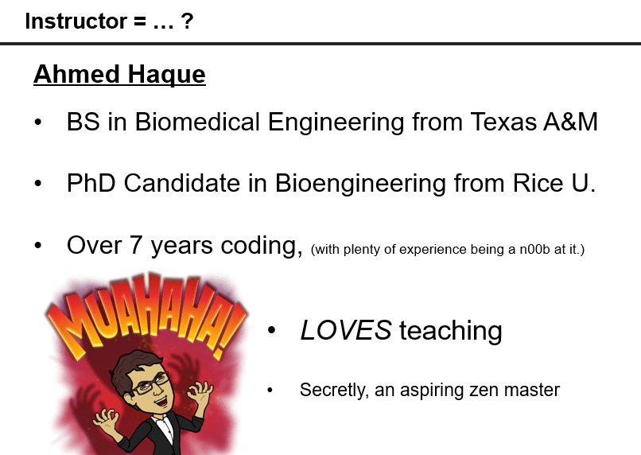
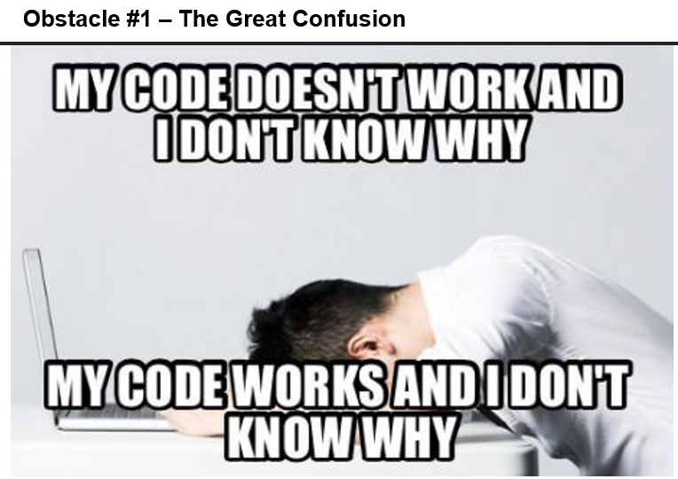
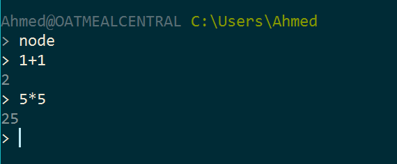
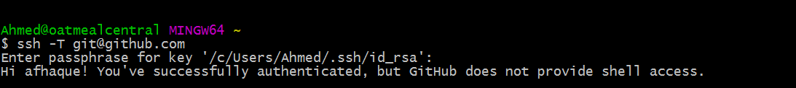
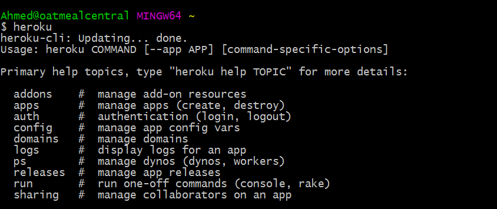
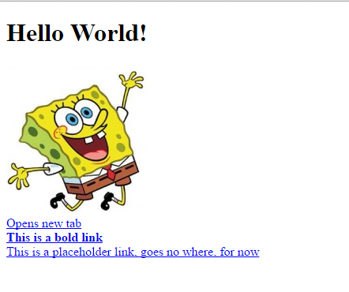

## 1.1 Lesson Plan - The Zen of Coding <!--links--> &nbsp; &nbsp; [➡️](../02-Day/02-Day-LessonPlan.md)

### Overview

Welcome to your first day of class! Today we will be introducing ourselves and the overall structure of the course. Towards the end of class, we will be working with the very basics of Terminal/Console and HTML.

`Summary: Complete Activities 1-3 in Unit 01`

##### Instructor Priorities

* Students should feel completely welcome and start to open up.
* Students should have each of the following installed and ready to use: Git, Heroku, Node, Visual Studio Code, and Slack.
* Students should be exposed to the basic bash/terminal commands: `cd`, `ls`, and `mkdir`.
* Students should complete the "My First HTML Page" activity.

##### Instructor Notes

* First off, welcome and thank you so much for being a part of our program! Thanks to instructors/TAs like yourself, we're helping hundreds of students across the world achieve their career goals and their creative dreams. You have plenty of time to work with these students, and their progress will astound you. Buckle in! You're in for a fun ride!

* Today's class is all about making students feel comfortable. Today is just the first of many days where some of your students will seem "lost". Make sure they know that you are there for them from Day 1 and that they can succeed if they persist through the challenges.

* Use the [ZenOfCoding PowerPoint](Slide-Shows/) provided as an initial guide for today's class. During the first few weeks of class, we'll be using PowerPoint more extensively to give students a sense of structure. As we move further into the course, PowerPoint will become less frequently used as we dive into a more code-centric approach. Feel free to modify the slides to your own style, but be sure to cover the same activities.

* Don't forget to modify the PowerPoint prior to class to add in your own slides for the "Instructor Bio" and "Stuff You Made" sections.

* Introductions often take a long time. Feel free to adjust today's lesson plan by pushing the HTML/CSS demonstration to Lesson 1.2 if necessary. This allows students to ease into our activity-based approach via the Terminal exercises and allows them to then focus on HTML/CSS on Day 2.

* If you choose not to cover HTML/CSS on Day 1, use [my-first-html.html](../../../../01-Class-Content/01-html-git-css/01-Activities/03-MyFirstHTML/Solved/my-first-html.html) to demonstrate the basics of HTML in an **Everyone Do** exercise, and then assign the Student Bio HTML activity as normal.

  

* In addition to introductions, today's main focus is in making sure all students have all their pre-work (software / tools prerequisites) installed and ready to go. Many of your students will be coming to class with "partially" installed tools but will have gotten lost along the installation process. By the end of class, make sure EVERY one of your students has Git (with SSH Authentication), Heroku, Node, Visual Studio Code, and Slack installed. NOTE: You may need to run through this lesson plan to confirm you have all the necessary tools installed yourself!

* Have your TAs reference [01-Day-TimeTracker](01-Day-TimeTracker.xlsx) to help keep track of time during class.

### Sample Class Video (Highly Recommended)

* To view an example class lecture visit (Note video may not reflect latest lesson plan): [Class Video](https://codingbootcamp.hosted.panopto.com/Panopto/Pages/Viewer.aspx?id=d6394b94-a0ce-4f63-8f9c-3b84f8715088)

- - -

### Class Objectives

* To allow students time to introduce themselves to one another and the instructional team
* To confirm that students have completed all required pre-work (software + tools installation)
* To introduce basic terminal/bash commands
* To create a basic HTML page

- - -

### 1. University Do: Introductions (30 mins)

* The first 35 minutes of class will consist of introductions by the university, program director, student services director, and/or career director.

* Instructor/TAs just hang tight and calm your nerves!

### 2. Instructor Do: Begin Powerpoint + Introductions (15 mins)

* Open the Slide-Show `Zen_of_Coding` for your campus. Use it as a guide for the remaining sections, but keeping a close eye on your TAs to make sure you are keeping track of time. Be concise when you can!

* Have every student in the class introduce themselves (name, background, reason they joined). Try to keep things lighthearted as they share their ideas, but remember to try and keep things brief. We have a lot to go over in class today, and we'll need all the time we can get.

* Have TAs introduce themselves and provide their own backgrounds.

* Then introduce yourself and showcase one thing you've built (added into the slide).

### 3. Instructor Do: The Path of Learning (15 mins)

* The next series of slides is really meant to give students the "right" perspective coming in. This means letting them know that this program will not be a traditional college class. We're here to support them 100% of the way to really help them achieve their goals.

* To begin, take a few moments to assuage student fears of being a "beginner." Instead, let them know that having a humble attitude is the first requirement of being successful in this program. In a way, students should channel their inner toddler and recognize that "knowing nothing" and admitting such will allow them to dig their heels in and invest the time necessary to succeed. In a way, coding is like nothing else these students have attempted to do. Their mastery of other subjects, their educational backgrounds, and their professional successes do not guarantee that they will do well here. The only thing that will guarantee success is hard work, humility, and a relentless desire to be better. Recognizing how little you know is a first step towards creating that urgency.

* From here, give students perspective on the "Path of Learning" — specifically warning them about three major obstacles:

  * First, learning to code is tough, intimidating, and frustrating at times. They should immediately forget about their uncle/brother-in-law/friend/step-sister who told them about so-and-so learning to build apps in 1 week. Coding is hard. It will take time. There is no way around that.

    

  * Second, because of how hard this can be, there will be many moments where students will doubt themselves. Take this chance to help them overcome this obstacle ahead of time by building up their confidence. Tell them that you started just like they did, that it takes time but that they have what it takes, that they were selected for this program because we know they have what it takes.

    

  * Lastly, because of the length of the program, personal issues WILL come up during the course of the program. The idealism and "can-do" attitude students enter with on day 1 will be challenged by the length of the course. Let students know that they should see each other as a family embarking on a long journey. They will become far closer to their peers than they realize. Intensity is no substitute for endurance.

* Then proceed to tell them that learning is supposed to be frustrating. It's a process, but they should stick with it.

* Then walk them through the advice on succeeding in the program.

### 4. Instructor Do: Course Structure (5 mins)

* Spend a few moments to walk students through the course structure.

* Point out that learning to code requires coding (not just sitting through lectures) so this program will very quickly become "code-centric." Let them know that there will be a mix of individual and group activities / projects.

* Then walk students through today's objectives.

### 5. Instructor Do: Pre-Work (5 mins)

* Then walk through the slides on "Pre-work." Let students know that they should have all of the tools, the software applications, and the accounts shown on their machines but that if they ran into any snags, we will work with them to confirm everything is set up over the next 35 minutes.

### 6. Instructor Do: Confirm Pre-Work Installed (30 mins)

* TAs get ready to make your rounds!

* Instructor: Walk through each of the following "test" processes to confirm whether students have successfully installed the right software. Have them follow along with you in class, and have them raise their hands for a TA if they are missing something.

  * **Slack:**

    * Easy to show. Just open Slack. But make sure students have it installed locally and are not using the web client.

  * **Visual Studio Code:**

    * Easy to show. Just open Visual Studio Code. Make sure they can do so as well.

  * **Terminal / Bash:**

    * For Mac users. Have them open their Launcher and search for `Terminal`.

    * For Windows users. Have them open the program called `Git Bash`.

  * **Node:**

    * While in terminal or bash, simply write the word `node`, and then hit enter. Your cursor should change

    * Then type `1+1`, and hit enter. If node is installed it should translate the answer to 2.

    * Then type `ctrl+c` to exit node.

      

  * **GitHub:**

    * Confirm that students all have an account on GitHub through a show of hands.

    * Those that do not have an account should immediately create one.

  * **Git:**

    * Now we're getting to the harder stuff.

    * While still in terminal or bash, type `git`, and hit enter. If Git is installed it should trigger a series of lines about Git.

      

    * Now, to confirm that students have their GitHub accounts tied to their local Git using SSH authentication, have them type the following: `ssh -T git@github.com`. It should then ask for a passphrase (tied to your local account). Provide it (letters will not appear), and hit enter. If you are authenticated, it should provide a welcome message.

      

    * Ask, via a show of hands, how many students did / did not get the welcome message (be expecting a lot of students who did not). If it seems that many students are missing this step, point them to the following link: [Generating an SSH Key - GitHub](https://help.github.com/articles/generating-an-ssh-key/).

      

    * Walk around and help students as necessary, but keep track of time!

  * **Heroku:**

    * Once Git is covered ask how many students were able to create an account on Heroku. Show them your own Heroku account online as an example.

    * Then have them once again go into Bash / Terminal and type the word `heroku`. If they are properly setup, it should provide a set of information about Heroku.

      

  * **All others:**

    * There are a few other items on the pre-work like MySQL, Stack Overflow, and Twitter that are less critical at this juncture. You may want to show that you have Heidi SQL or Sequel Pro installed, but it's not critical just yet.

- - -

### 7. BREAK (15 mins)

* There may be some students who decide to stay behind during break to troubleshoot problems that they had with the above material or to ask questions about the course. Try to assist those who are in need of help first so as to help them catch up with those students who did not face any issues.

- - -

### 8. Instructor Do: On the Modern Web (8 mins)

* Stay concise in this section! Don't overwhelm students. We're just giving them a taste.

* Ask students what they think "Full-Stack Development" is. Point out that they are all enrolled in a Full-Stack Development program... so it probably matters.

* Proceed to walk them through a basic YouTube search. Point out how the process of retrieving a video from YouTube requires two things, the Graphical User Interface (GUI) responding to what I type and also code on the server side that is able to search through its databases and find the right video.

* Point out how websites today are all about creating code for both this "front end" and "back end".

* In this course, we'll be teaching them everything they need to be able to do this, meaning they will be able to build complex web applications as a single developer.

### 9. Instructor Do: Let's Get Crackin'—Intro to Console / Bash (10 mins)

* Open terminal / console. Then walk and explain to students what each of the following commands does.

  * `cd` (changes directory)

  * `cd ~` (changes to home directory)

  * `cd ..` (moves up one directory)

  * `ls` (lists files in folder)

  * `pwd` (shows current directory)

  * `mkdir <FOLDERNAME>` (creates new directory)

  * `touch <FILENAME>` (creates a file)

  * `rm <FILENAME>` (deletes file)

  * `rm -r <FOLDERNAME>` (deletes a folder, note the -r)

  * `open .` (opens the current folder. MAC SPECIFIC)

  * `open <FILENAME>` (opens a specific file. MAC SPECIFIC)

  * `explorer <FILENAME>` (opens the specific file. BASH SPECIFIC)

  * `explorer .` (opens the current folder. BASH SPECIFIC)

* Tabbing

  * Pressing the `tab` key after typing "cd fol" will autocomplete to "cd foldername", assuming foldername is unique. (Folder/Filename Autocomplete - Show students what happens when there are unique and multiple options based on what they typed.)

### 10. Students Do: Intro to Console / Bash (12 mins)

* Then slack out the following instructions to students (or show them the instructions via the slide):

* **Instructions:**

  * From the Terminal/Console and using only the command line, create the following:
    * A new folder with the name of `first_day_stuff`
    * A new HTML file with the name of `first-day.html`
  * Open the current folder containing the new HTML file.

  * BONUS:
    * Create multiple directories/folders with the names `one_folder` and `second_folder` in one command.
    * Create multiple files with the names `one.html` and `two.html` in one command in the first_day_stuff directory.

### 11. Students Do: Discuss with Neighbors (5 mins)

* Have students discuss with their neighbors the process of creating files, removing files, etc.

* Also have students explain to one another a high-level definition of "full-stack development."

* Briefly have students explain the answers back to you.

### 12. Instructor Do: Hello, HTML (5 mins)

* Create a new HTML file in Visual Studio Code. Have students follow along if they can, but tell them not to get too bogged down if they are having trouble keeping up. They will have a chance to work on an example of their own a little later.

* Use the code in `03-my-first-html` as a guide. Be careful not to open the bonus file yet — that's for the next activity.

  * **Don't just display this file or copy and paste the code onto your screen.** Type it out, and let your students follow along.

* As you code, be sure to point out the prominent elements like `<!DOCTYPE html>`, `<html>`, `<head>`, `<body>`, `<h1>`, the links, etc.

* Then run the page and point out to students how the elements in the program compare to those on the web page.

  

* Ask if there are any questions before proceeding to the student exercise.

### 13. Students Do: Intro to HTML (5 mins)

* Keep your HTML code from the previous exercise available for them to see while they work, but don't send them the code just yet.

* Then slack out the instructions to the second student exercise.

* **Instructions:**

  * In a new HTML file, create the basic structure of an HTML document and include the following in it:

    * DOCTYPE declaration
    * Head tag with a title tag
    * H1 tag with a title of your choice
    * Embed an image
    * Create the following three links on your page:
      * One link that is `target="_blank"` so that it opens a new tab when clicked on.
      * Make the second link bold.
      * Make the third link a placeholder so it goes nowhere.

  * HINT: You should be looking up at the screen pretty often :P

  * Bonus:
    * Create an ordered list of steps to make a sandwich.
    * Create an unordered list of 5 bands/musicians you like.
    * Create a table with 2 columns (animal class and animal name) and 4 rows of animals.
    * Use an alternate way of separating links without line breaks.
    * Embed a YouTube video of your favorite band/musician.

### 14. Instructor Do: Review HTML Solution (10 mins)

* Open the file `my-first-html-with-bonus.html`, and walk students through the solution. As you discuss the solution, be sure to point out the following:

  * Key elements like `<!DOCTYPE html>`, `<html>`, `<head>`, `<h1>`, the links.

  * Good indentation practices. In fact, if you have time, un-indent everything by highlighting everything and hitting `ctrl-j` and then re-running the code. Explain that the code will still work but that it's awful to read and maintain. Build good practices now!

* Give students a few moments to ask questions.

### 15. Instructor Do: Introduce Supplemental Videos (5 mins)

* Introduce your class to the `videoguide.md` which we have crafted for them to use in order to review important coding activities (like the one they have just completed) and future homework assignments.

* Let them know that these videos will be slacked out to everyone after the class has reviewed the activity but that they should save watching the videos for when they get back home and have some free time.

* Homework videos will be slacked out after the deadline for the assignment has passed.

* Each video also has a form within the description for feedback which we would appreciate that they fill out if they think anything in the video needs improvement.

* Slack out [Lesson 1.1 - My First HTML](https://www.YouTube.com/watch?v=ieb6Svbc10E).

### 16. Instructor Do: Demo Homework 1 (5 mins)

* Open recommended/easy homework `index.html` files in Chrome.

* Let students know that this will be the first homework assignment of theirs. It will be due on Wednesday/Thursday of the following week. More details will come at the next class.

### Lesson Plan Feedback

How did today's class go?

[Went Well](http://www.surveygizmo.com/s3/4325914/FS-Curriculum-Feedback?format=pt&sentiment=positive&lesson=01.01)

[Went Poorly](http://www.surveygizmo.com/s3/4325914/FS-Curriculum-Feedback?format=pt&sentiment=negative&lesson=01.01)
