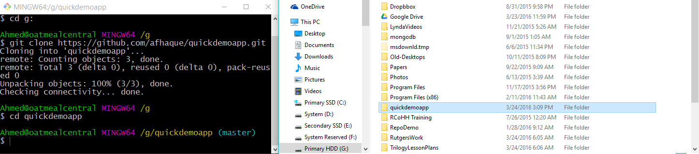

## 1.2 Lesson Plan - Git'n Pro with HTML/CSS <!--links--> &nbsp; [⬅️](../01-Day/01-Day-LessonPlan.md) &nbsp; [➡️](../03-Day/03-Day-LessonPlan.md)

### Overview

In this class we will be introducing students to Git Version Control and the basics of HTML/CSS.

`Summary: Complete activities 4-6 in Unit 02`

##### Instructor Priorities

* Students should understand the utility of version control (handling conflicts + reverting bad code).
* Students should complete the Git exercise.
* Students should complete both the HTML and CSS examples.
* Instructor should attempt to complete all slides within time allotment.

##### Instructor Notes

* Hope you're ready for Round 2! As with the last class, you should use the Powerpoint [GitnPro Powerpoint](Slide-Shows/) provided as the primary guide for today's class. The powerpoint includes an extended "Group Project" analogy to explain the utility of Git. Familiarize yourself with the example in advance of the class.

    

* Be sure to change the lines of the powerpoint where relevant to your class (Example: Date on Slide 1, links to in-class repo (Slide 2), links to homework repo (Slide 3)).

* Much of your class's struggle today will be in getting Git to work. When cued via the slideshow, send out the supplemental GitHub Help Guide (`Steps to Upload to GitHub`). Encourage students to go home and practice using this guide at home. (This guide alone will dramatically reduce the number of Git issues students experience. Make sure they use it!)

* There's a ton of material to cover here, but adjust it as necessary. Just make sure you leave enough time for the critical activities as this is essential for keeping classes in sync across sections.

* Have your TAs reference [02-Day-TimeTracker](02-Day-TimeTracker.xlsx) to help keep track of time during class.

### Sample Class Video (Highly Recommended)
* To view an example class lecture visit (Note video may not reflect latest lesson plan): [Class Video](https://codingbootcamp.hosted.panopto.com/Panopto/Pages/Viewer.aspx?id=a58da010-fbac-48c5-8d22-907532418158)

- - -

### Class Objectives

* To understand the value of Git version control
* To gain initial exposure to the concept of "adding, committing, and pushing" code to GitHub
* To gain initial exposure to HTML/CSS and how the two are linked using element selectors

- - -

### 1. Instructor Do: Open Powerpoint + Welcome Students (1 min)

* Take the first minute of class to welcome students back and to open up your Powerpoint, `Gitn_Pro_HTML_CSS.pptx`.

### 2. Instructor Do: Admin Items (Slides) (1 min)

* Reassure students that it's okay if things start to feel like they're moving quickly. Throughout their experience as developers they will constantly need to refer back to old materials. The rush and looking back is part of the programming trade.

* Flip through the slides on "Where to get Help." Specifically when it comes to In-Class Material, point students (in browser) to where they can access help resources. Emphasize the importance of practicing code vs. simply reading or watching videos.

### 3. Instructor Do: Today's Class - Objectives + Focus Items (Slides) (2 mins)

* Have students read the objectives of the day.

* Then offer end-of-day targets for students depending on where they fall. If a student is completely new they should feel like the main target is to simply understand at a conceptual level + understand Git. For students who have a bit of HTML/CSS they should aim to know how to apply the HTML/CSS a bit more comfortably after today.

### 4. Instructor Do: What/Why Git - "The Group Project" (Slides) (15 mins)

* Walk students through the use-cases of Git.

* The basic premise of these slides is that in group collaboration, situations arise where code conflicts occur or where damaging code is pushed up. With version control you have a way of preventing both from becoming issues.

### 5. Students Do: Quick Activity - Explain Git (3 mins)

* Give students a few minutes to explain to one another what Git version control is for.

### 6. Instructor Do: Recap Answers (3 mins)

* Have students explain their answers back to you. Correct any mistaken answers you hear. Encourage students when they get the right answer.

### 7. Instructor Do: Explain GitHub (Slides) (5 mins)

* Spend just a few brief minutes explaining the relationship between Git and GitHub. Keep it concise. You may just want to say the following:

  > GitHub offers a centralized location where all developers can push and pull (upload and download) their code. This means that GitHub always holds the most up-to-date code, handling everyone's updates appropriately.

### 8. Instructor Do: Get Started with Git - Demo Git add, commit, push (15 mins)

* As an Instructor, create your own GitHub repo. Then walk students through the process of adding a file to GitHub.

* Have students try to follow along on their own accounts if they can.

* Important Note: We teach the process of cloning existing repos for consistency with students. So use the below steps as a guide.

  * Navigate to GitHub in your browser, and click to create a new repository.

      

  * Call your repository whatever you like, but make sure to set it as public. Initialize it with a README.

      

  * Then copy the `ssh` or `https` link associated with this GitHub repo. (The difference has to do with whether you need to authenticate each time. SSH is preferred, but if it's not working for you, switch to `https`.)

      

  * Then open up Terminal or Bash and navigate to a folder where you would like to clone the repo. Then type the command `git clone <PASTE THE REPO>`.

    * Git Bash uses SHIFT+INSERT as the shortcut to paste.

    * Terminal uses COMMAND+OPTION+SHIFT+V as the shortcut to paste.

        

  * Point out to the students using Explorer or Finder that this action created a new folder on your machine with the same name as the repository on GitHub. Also point out that this file is directly attached to GitHub and that it includes the README found in GitHub.

      

  * Next, if you haven't already, navigate into this folder in Terminal or Bash.

  * Now add a new file into the folder in Finder or Explorer. This can be any file you want, but in my case, I will add an HTML file.

      

      

  * Now go back to Terminal / Bash, and type each of the following commands:

    * `git add -A` (This will tell Git to track any changes in the folder.)

    * `git commit -m "Added a new file"` (This will tell Git to commit the changes and to include the comment "Added a new file.")

    * `git push origin master` (This will tell Git to upload the code to GitHub.)

      

  * Navigate back to GitHub in the browser, and show students that the file you uploaded now exists in GitHub.

      

* At this point, students will be completely confused. Take a moment to calm their nerves and to let them know that this will become second nature to them with a little time.

### 9. Instructor Do: Slack GitHub Guide (2 mins)

* At this point, slack the GitHub guide (found in `Supplemental > GitHub Help > "Steps to Upload GitHub"`). Let them know that this guide will be their best resource on completing their own GitHub pushes.

### 10. Students Do: Git Add, Commit, Push (20 mins)

* Then slack out the following activity (or show them the instructions on the slide):

  * **Instructions:**

    * Using GitHub and the Command Line, do the following:

      * Create a new public GitHub repository, and name it whatever you like. Be sure to check the box for “initialize this repository with a README.”

      * Next, clone the repo to your local directory.

      * Then create an HTML file inside the local directory.

      * Add, Commit, and Push the code to GitHub.

    * Bonus:

      * Find a partner in class and fork their repository to your own GitHub account. Clone this forked repository to your local directory.

      * Add, Commit, and Push the code back to your forked copy.

      * Finally, submit a pull request to send your changes to your partner’s repo.

* **Instructor:**

  * Once the time is complete, recap the activity with everyone. Have them explain it back to you. Some students will be confused or will struggle with this activity (especially the bonus) so once again reassure the class that this process will become second nature over time.

### 11. Instructor Do: HTML Round 2 (Slides) (15 mins)

* Walk students through the HTML Round 2 slides.

* Be concise, when you can, to save time. You don't need to explain every single thing that is on the slides—they will be made available to students after class to go back to. Just hit the high points!

### 12. Students Do: Basic Student Bio Activity (20 mins)

* Open the file `basic-html-bio.html` inside `04-HTML_Git` in your browser.

* Then slack out the following instructions to students (or show them the slide):

  * **Instructions:**

    * Create a basic HTML page with your own information that looks similar to the design shown on screen.

### 13. Instructor Do: Recap Basic Student Bio Activity (5 mins)

* Either live-code or open the solution (`basic-html-bio.html`) to the previous activity in your editor. Then, walk students through the solution line-by-line.

* Explain the `div` and `section` tags that appear in the solution.

  * Explain that `div` tags are used to group elements into _visually_ related segments and that they are primarily used as "hooks" for CSS styling.

  * Explain that `section` tags are used to group elements into _thematically_ related segments.

  * Explain that `div` and `section` tags behave identically, in that both are block-level tags used to demarcate _sections_ of a site.

  * Explain that the difference between `div` and `section` tags is dependent on what we want our source code to communicate to other developers.

  * Encourage students to use a `div` when they're not sure which tag to choose. You can also direct them to the [HTML5 Doctor Flowchart](http://html5doctor.com/downloads/h5d-sectioning-flowchart.pdf).

* Once you are done reviewing, slack out the code to them to see for themselves. (When slacking out the code, use the solution provided in the Lesson-Plan repo as it is extensively commented.)

- - -

### 14. BREAK (15 mins)

* During Break Instructor and TA should re-sync regarding the schedule and should adjust as necessary.

- - -

### 15. Instructor Do: CSS Stylin' - Basics of CSS (Slides) (15 mins)

* Using the CSS Stylin' slides as a guide, provide students with perspective on what CSS is and how it works.

* Explain to them how CSS can be used by tying itself to HTML elements, classes, or IDs. Don't get too bogged down trying to explain things. You will be demonstrating this through examples shortly.

### 16. Instructor Do: CSS Show! Demo (15 mins)

* Take about 15 minutes to quickly demonstrate a few examples of CSS styling. As a starting point you can use the files inside `02-BasicCSS` to showcase the pieces necessary to link an HTML page to CSS.

* Point out the following:

  * That CSS can be linked to tags like `h1`, `h2`, `p`, `img`, and also specific classes (specified by .syntax) and id's (specified by #syntax).

  * Just show enough to give them an idea of what's possible.

* Slack out the `quick-example-internal-css.html` file to them.

### 17. Students Do: CSS Styled Bio Page (20 mins)

* Open the file `html-bio-with-css.html` (`06-HTML_CSS_Layout`) in your browser. Warn students that this might be a tough activity for some of them.

    

* Slack out `06-HTML_CSS_Layout/html-bio-with-css.html` as a starter file.

  * This is important as the **Instructions** given below assume a particular markup structure.

* Then, slack out the following instructions to students:

  * **Instructions**:

    * Put all of this code inside a folder named `week1-day2-html-css`, and put the folder in a place where you normally code. 
    * Use the command line to make a folder called `css`.
    * Use the command line to make a file called `style.css` inside of thee `css` folder.
    * Reference the `style.css` in your `student-bio.html` file. You do this by placing `<link rel="stylesheet" type="text/css" href="css/style.css">` inside the `<head>` tag.
    * Style the example on the projector.
      * Add a `class` called "container" on the `div` tag.
      * Add an `id` called "main-bio" for the first `section` tag.
      * Add an `id` called "contact-info" for the second `section` tag.
      * Add an `id` called "bio-image" for the bio image.
    * Style specs:

      * `body`
        * The background color is `#efeee7`.
        * The font used `"Georgia",Times New Roman,Times,serif;`.
        * The font color is `#333333`.
        * Be sure to zero out the body margins and padding so the page is flush to the top of the page:
          ```css
          body {
            margin: 0;
            padding: 0;
          }
          ```
      * `header`
        * The background color is `#333333`.
      * `h1`
        * The font color is `#eee`.
        * The font size is `28px`.
        * Look at the example on the screen, and eyeball the padding and/or margins and positioning of the text.
      * `h2`
        * The font size is `24px`
      * Make the container have a width of 1024 pixels, and center it. You do this using `margin: 0 auto;`.
      * Make `#main-bio`, `#contact-info`, `#bio-image` all `float: left`.
      * Make the `#bio-image` have a width of 200 pixels.
      * Be sure to include `alt` text in all images
      * `#main-bio` should have a width of `70%`.
        * Add margins to the image so there is distance between it and the bio text.
      * `#content-info` should have a width of `30%`.
      * Adjust the line height so it is 1.5 times the size of the font.
      * Make the link color `#d21034`.

    * If you forgot how to write the CSS properties, you can reference all CSS properties here <https://developer.mozilla.org/en-US/docs/Web/CSS/Reference>

    * Bonus:

      * Stage, commit, and push this new file to Github.

### 18. Everyone Do: Recap Activity (5 mins)

* Have students recap the solution back to you.

    

* Fill in concepts where students are unable to provide a clear answer.

* Emphasize the use of `div` and `section` in the solution.

### 19. Instructor Do: Recap + Questions (Slides) (5 mins)

* Complete the last slide of the slide show.

* Make sure all students feel encouraged and that they're motivated to keep going.

### 20. Instructor Do: Slack out the Video

* After you have slacked out the code, once again remind your students that we also have online videos for them with which to review key activities.

* These videos are a great way to catch up on material if you ever need to review them or if you feel like you are falling behind.

* Slack out [Lesson 1.2 - Student Bio Layout](https://www.youtube.com/watch?v=kMBinXTCrXI).

- - -

### Tips and Tricks

* On Windows devices, you can navigate to a specific folder in Git Bash using the File System Viewer, right clicking, and then selecting the option "Git Bash Here" from the dropdown menu.

### Lesson Plan Feedback

How did today's class go?

[Went Well](http://www.surveygizmo.com/s3/4325914/FS-Curriculum-Feedback?format=pt&sentiment=positive&lesson=01.02)

[Went Poorly](http://www.surveygizmo.com/s3/4325914/FS-Curriculum-Feedback?format=pt&sentiment=negative&lesson=01.02)
