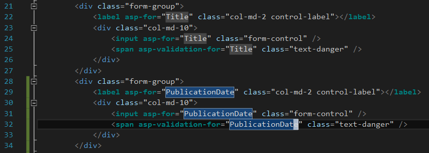
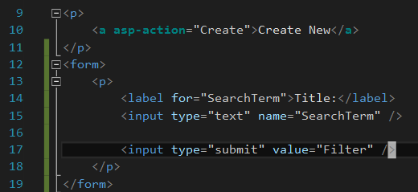
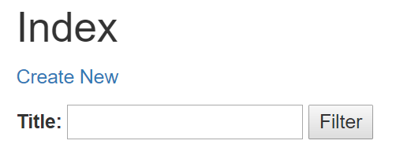
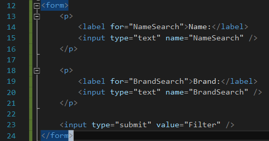
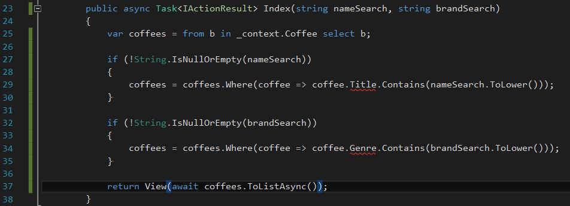

# 21.3 Lesson Plan - More on Models

### Overview

Today's lesson will introduce students to more intermediate techniques of ASP.NET MVC, such as model validation; formatting annotations; and LINQ queries.

`Summary: Complete activities 8-11 in Unit 21`

##### Attention: If you’re teaching a part time section and this isn’t a Saturday, please use the “Weekday” tab inside of the "03-Day-TimeTracker.xlsx" for activity lengths instead of those printed on this lesson plan

#### Instructor Priorities

After today's class, students should be able to use ASP.NET MVC to:

* Modify how ASP.NET MVC displays models in views by using format annotations on model classes;

* Add validation constraints to models using annotations on model classes;

* Update models and apply migrations;

* Use LINQ queries to retrieve objects from the database;

* Add input fields to views.

- - -

#### Instructor Notes

* Have your TAs refer to the [Time Tracker](03-Day-TimeTracker.xlsx) to stay on track.

- - -

### Class Objectives

At the end of class, students should be able to use ASP.NET MVC to:

* Modify how ASP.NET MVC displays models in views;

* Validate user input before creating models; and

* Retrieve data from the database.

- - -

### 1. Instructor Do: Updating Models  (0:15)

- - -

**Objectives Met**

* Update models and apply migrations;

- - -

* Point out that we might want our `Book` model to include information on its publication date, in addition to its `Title` and `Genre`.

* Open up `Book.cs`, and add a property: `public DateTime PublicationDate { get; set; }`

  * Explain that `DateTime` is a built-in data type that allows us to store dates and hours.

* Point out that, when we scaffold views from a new model, ASP.NET MVC reads its properties, and creates corresponding markup in the create and details views.

  * For example, the scaffolded detail view for our `Book` model automatically displayed its `Title` and `Genre` properties.

* Explain that, when we add a field to a model, we have to update our views manually.

  * Explain that we need to update _every_.

* Open up `Views/Books/Index.cshtml`.

  * Point out the markup that refers to the `Book` model's properties.

    

    _The Index view refers to the Book's properties in two places._

* Point out that, since we added a `PublicationDate` property, we'll have to update the view to reflect it.

* Copy/paste the existing markup, and update the property reference to `PublicationDate`.

  

  _Adding a reference to PublicationDate to our view._

* Explain that this allows us to see the value of the `PublicationDate` field in the Index view.

* Open up `Create.cshtml` and make the analogous change.

  * Point out that ASP.NET MVC determines the details of which form element to use, as long as we provide a model reference as the value of the `asp-for` attribute.

    

    _Updating the Create.cshtml form to allow users to enter a PublicationDate._

* Open up `Details.cshtml`. Copy/paste one of the `<dd>` tags, and update the model reference to `PublicationDate`.

  

  _Updating the Details.cshtml view to display the Book's publication date._

* Finally, open up `Edit.cshtml` and `Delete.cshtml`. Make the same change you made in `Create.cshtml`.

* Next, start your server, and navigate to the `/books/` endpoint.

  * You should get an error. Ask a student to explain what this error means, and why you got it.

* Explain that this error indicates that you've made a change to your database, but haven't created and run the **migrations** necessary to make it live.

  * Ask a student to explain what a migration is.

  * Remind students that migrations are records of changes that we've made to our models, and tell ASP.NET MVC how to update the database to accommodate those changes.

* Open up a terminal—PowerShell on Windows, or Terminal on a Mac—and navigate to your project directory. Run:

  ```
  dotnet ef migrations add Book
  dotnet ef database update
  ```

* Run the application, and demonstrate that the Index page now has a table heading for `PublicationDate`.

  

  _Our updated Index page features a heading for the PublicationDate property._

### 2. Students Do: Updating Models  (0:20)

* Slack out the following instructions to students.

* **Instructions**:

  * Start a server, and visit your `/coffee/` endpoint to ensure everything works as expected.

  * Open up your Coffee model from last class, and add a field—`Brand` is fine, if you're at a loss for properties to add.

  * Make the appropriate change to your views. Which views do you have to change? What do you have to do to change them?

  * Next, create and run your migrations. This requires you to run two lines of code from the command-line. If you don't remember what to do, start your server, and visit your `/coffee/` endpoint. ASP.NET MVC will remind you!

  * Finally, create and view a couple of models to verify everything works as expected.

### 3. Instructor Do: Review Activity  (0:10)

* Ask a student to explain how they added their new property to the `Coffee` model.

  * This is a single line of code declaring the property.

* Ask a student to explain which views they had to change.

  * Students have to change every view.

  * Ask the same student toe explain the specific changes they made to each view.

* Ask a student which two lines of code they had to run from the command line to create and apply migrations.

  * These are:

    * `dotnet ef migrations add Coffee`; and

    * `dotnet ef database update`.

* Ask a student to explain what migrations are, and what role they play in managing databases.

  * Migrations are C# files which track changes that we've made to our models over time.

  * Migrations are crucial in database management because ASP.NET MVC uses them to determine how to update the database in accordance with the changes we've made to our models.

* Zip and slack out the `08-Adding-Fields/Solved` before moving on.

### 4. Instructor Do: Improving Model Formatting  (0:10)

**Objectives Met**

* Modify how ASP.NET MVC displays models in views by using format annotations on model classes

- - -

* Point out that the table header on the Index page reads **PublicationDate**, with no space. 

  * While this is unambiguous, it's not ideal.


_By default, the display name for the Publication Date property isn't very readable._

* Explain that, by default, ASP.NET MVC displays the model's literal name in views.

* Explain that, when this is suboptimal, we can configure the model's display name in the model class.

* Open up `Book.cs`, and find the `PublicationDate` property.

* Above it, add the code: `[Display(Name = "Publication Date")]`.

  * Explain that this feature is called **annotation**. Annotations allow us to mark our code with "extra information".

  * In this case, that "extra information" is how ASP.NET MVC should print the name of this model in views.

* Explain that, once we've defined this display name on our model, we have to refer to it in our views.

* Open up `Views/Books/index.cshtml`, and search for `DisplayName`.

  * Explain that, to refer to a model's display name in a view, we use the syntax: `@Html.DisplayNameFor(model => model.PROPERTY)`.

    

    _This Razor syntax allows us to refer to a model's display name in our templates._

### 5. Students Do: Formatting Annotations (0:25)

* Slack out the following instructions to students.

  * **Instructions**:

    * Add a property for an expiration date to your Coffee model. Make the appropriate changes to your views and database.

    * Start your server, and verify that the expiration date property exists on your model.

    * Add a more human-readable display name to your Coffee class. Start your server, and verify that the change has been detected.

    * Suppose your project requirements change so as to require that your Coffee's Brand data type be displayed as "Roaster". There are two ways to do this. What are the advantages and disadvantages of each?
    * Change the display name of your Coffee's Brand to Roaster, and verify the change.

### 6. Instructor Do: Review Activity  (0:10)

* Ask a student to explain how they added a more human-readable display name for their Coffee's expiration date property.

  * The correct response is to use the annotation: `[Display(Name = "Expiration Date")]`.

* Ask a student to explain the two different ways to change the Brand data type's display name to Roaster.

  * One could change the name of the property itself, which requires creating and running migrations for what is properly a view-level change. This is both more work than necessary, and poor separation of concerns.

  * Alternatively, one could use annotations, as this exercise encourages.

* Slack out the `09-Formatting-Annotations/Solved` before moving on.

### 7. Instructor Do: Validation (0:15)

- - -

**Objectives Met**

* Add validation constraints to models using annotations on model classes;

- - -

* Explain that annotations are useful for more than simply changing what's displayed in our views.

* Explain that we can also use annotations to tell ASP.NET MVC to **validate** our models.

* Explain that validation is the process of checking that users don't enter invalid data.

  * Point out that we most likely don't want users to enter an empty string for the `Title` of a Book, nor a number for the `Author`.

* Explain that, while we _can_ write validation logic ourselves in our Controllers, ASP.NET MVC allows us to use annotations to implement validation logic across both the view and model layers.

  * Explain that we generally want to validate both on the front-end—i.e., ensure our users are only able to enter valid values into our forms—and also on the back-end—to ensure they weren't able to bypass form-level validations by tampering with the request, etc.

  * Explain that using annotations to implement model validations lets ASP.NET MVC do both of these things for us.

* Open up `Book.cs`.

  * Explain that, before we can use annotations, we have to add a `using` statement to "import" them: `using System.ComponentModel.DataAnnotations;`

  * Explain that we often want to _require_ users to enter a value for every property.

  * Explain that we can add the `[Required]` annotation to accomplish this.

    * Explain that there is no need to add this annotation to the ID, because ASP.NET MVC adds it automatically.

      ![Adding the \[Required\] annotation to our properties makes them non-nullable in the database.](Images/7-required.png)

      _Adding the \[Required] annotation to our properties makes them non-nullable in the database._

* Explain that we often want to restrict the length of character properties, such as `Title`.

  * Add a `StringLength(64)` to your annotation on `Genre`.

  * Copy the entire annotation onto `Title`.

* Explain that we often want to require a certain _minimum_ length, as well.

  * Update the string length annotation to read: `[StringLength(64, MinimumLength=4)]`.

* Explain that explicitly annotating our `DateTime` property as a Date allows ASP.NET MVC to update the front-end accordingly.

  * Add `DataType(DataType.Date` to the annotation on `PublicationDate`.

* Explain that ASP.NET MVC enforces these annotations at the database level.

  * In other words, it ensures the database _cannot_ accept data that doesn't adhere to your validations.

  * Explain that this requires a change to the database itself, not just our web application logic.

* Ask a student to explain what you have to do before making any updates to the database.

  * The correct response is "create and run migrations".

* To update the database to reflect your annotations, run:

  * `dotnet ef migrations add DataAnnotations`; and

  * `dotnet ef migrations update database`.

* Start your server, and try to create a new Book with the Genre "f". Validation kicks in and prevents users from submitting the form.

### 8. Students Do: Validating Models  (0:25)

* Slack out the following instructions.

  * **Instructions**:

    * Open up your Coffee model. Add a validation to every property.

    * Make the appropriate changes to your database. Ask your neighbor for help if you've forgotten the necessary commands.

    * Start your server and test your validation.

    * If you have time, add a `Price` property to your `Coffee`. It should be of type `decimal`. Make the appropriate changes to your Create view—you don't have to worry about the others for this exercise.

    * Refer to the documentation on Model Validations for a useful validation rule for Prices. Open the following link, and scroll to the section on **Validation Attributes**: <https://docs.asp.net/en/latest/mvc/models/validation.html#introduction-to-model-validation>

### 9. Instructor Do: Review Activity  (0:10)

* Ask a student to explain what validations they added to their Coffee model.

* Ask a student to explain what CLI commands they used to update their database after adding data annotations.

* Ask if anyone added a Price attribute to their model.

  * If so, ask which validation rule they added.

  * Otherwise, open your own `10-Validation/Solved/Coffee.cs`, and demonstrate the `[Range]` validation rule.

    

    _The Range validation rule puts a limit on the numbers a user can enter for the given property._

* Zip and slack out the `10-Validation/Solved` before dismissing class for break.

- - -

### 10  BREAK (0:45)

- - -

### 11  Everyone Do: Adding Input Form to Index & Querying with LINQ (0:20)

**Objectives Met**

* Use LINQ queries to retrieve objects from the database;

* Add input fields to views.

- - -

* Point out that we have yet to _manually_ add fields to our views.

  * Explain that we'll implement search functionality on our Index page to experiment with this.

* Start your server and visit your `/books/` endpoint. Point out that, while ASP.NET MVC scaffolds a CRUD controller and its corresponding views for us, it doesn't provide built-in search functionality.

  * Point out that this is because it can't—there are numerous ways we might want to implement search for a given model, and it's not obvious which we'd want.

* Explain that a logical field to use to search for a Book would be its title.

* Open up `Views/Books/index.cshtml`. 

* Search for the markup reading `<a asp-action="Create">...`—this should be just below the header reading `<h2>Index</h2>`.

* Below the enclosing paragraph, add the markup below:

  ```csharp
  <form asp-controller="Movies" asp-action="Index">
    <p>
      <label for="SearchTerm">Title:</label>
      <input type="text" name="SearchTerm">

      <input type="submit" value="Filter">
    </p>
  </form>
  ```



_This markup adds an input field to our Index page._

* Explain that this adds a form to the application which allows users to send a title to search for.

  * Start your server and demonstrate that the new input appears on the Index page.

    

    _Our markup results in the addition of a text input on our Index page._

* Point out that the application still doesn't actually filter the data—it just submits a search term to our web application.

  * Explain that the application _reloads_ the Index route every time a user presses filter, and sends the search term as part of the request.

* Ask a student to identify the part of the application we need to change to implement the actual search logic.

  * The correct response is the Books Controller

* Open up the `BooksController`.

  * Find the `Index` method.

  * Ask a student to explain how we might use the search term in our method.

    * The correct response is to pass it as a parameter.

  * Add a `string searchTerm` parameter to the Index method's parameter list.

    * Explain that this allows us to access the search term in our controller, but point out that it doesn't let us actually _filter_ the results.

* Explain that, to implement filtering, we must query the database.

  * Explain that C# lets us execute SQL-like queries against the database using tool called LINQ.

    * Explain that this effectively lets us use SQL, but from within C#.

* In the `Index` method, add the line: `var books = from book in _context.Book select book;`

  * Remind students that `var` allows us to declare a variable without having to annotate its type.

  * Explain that `_context` is a variable that contains information about the running web application as a whole, called the **application context**. In this case, we're using it to get a handle on the database, and retrieve all books.

  * Next, filter the query against the search term: `books = books.Where(book => book.Title.Contains(searchTerm));`

    * Explain that `books.Where` translates to, "I want all books _where_ the following condition holds."

    * Explain that the arrow syntax is just a way to define a small function.

      * Explain that `book => book.Title.Contains(searchTerm)` is a function that takes `book` as a parameter, and returns a bool indicating whether its title includes the search term.

      * Explain that this is called a **lambda expression**, and is effectively just syntactic sugar for the following:

        ```csharp
        public bool TitleContains(Book book, string searchTerm) {
          if (book.Title.contains(searchTerm)
          {
            return true;
          }

          return false;
        }
        ```

* Finally, explain that, to send the result of this query back to the browser, we have to update the return value.

  * Explain that `_context.Book.ToListAsync` sends a list of _all_ books back to the browser.

  * Remind students that `books` is a _filtered_ list of books.

    * Explain that `books.ToListAsync` returns the _filtered_ list of books.

      

      _Our completed Index method returns a list of books whose title contains the search term, rather than a list of all books in the database._

* Reassure students that it's okay if this is a bit confusing right now—it's only because queries involve many moving parts and new technologies.

### 12  Students Do: Querying with LINQ (0:25)

* Slack out the following instructions to students.

  * **Instructions**:

    * Update your Coffee model's index view to include an input which allows users to search for a Coffee by name.

    * Update your Index method to accept the search term.

    * Write a query in your Index method. This only requires two lines of code, but feel free to ask a neighbor if you don't remember how to write it.

    * We probably don't want to filter with an empty string. It won't break anything, but it's a waste of resources. Use the `String.IsNullOrEmpty(value)` method to filter your books only for strings that are non-null or non-empty.

    * Can you think of a way to allow users to query for name _and_ brand? If so, sketch out how you'd implement it. If you have time, add the feature.

### 13  Instructor Do: Review Activity  (0:15)

* Ask a student to explain how they updated their Index view with an input field.

* Ask a student to explain how they accessed the search term in their controller's Index method.

* Ask a student to explain how they filtered their list of books.

* Finally, ask if anyone was able to filter for both name and brand.

  * Explain that there are multiple solutions to this problem, but the most straightforward is simply to duplicate the code we used to filter on names.

  * Open up the Coffee model's index view, and explain how to add a second form to enter a string for genre.

    * Point out that we've updated the name from `SearchTerm` to the more specific `NameSearch` and `BrandSearch`, respectively.



_Adding a form to our Coffee model's index view is the first step to filtering on two parameters._

* Demonstrate that we've simply run two filters on the `books` variable in our Index method to solve this problem.



_The easiest solution to this problem is to simply allow users to enter a search term pertaining to both name and brand._

* Slack out the `11-Search/Solved` before dismissing class.

### Lesson Plan Feedback

How did today's class go?

[Went Well](http://www.surveygizmo.com/s3/4325914/FS-Curriculum-Feedback?format=pt&sentiment=positive&lesson=21.03)

[Went Poorly](http://www.surveygizmo.com/s3/4325914/FS-Curriculum-Feedback?format=pt&sentiment=negative&lesson=21.03)
